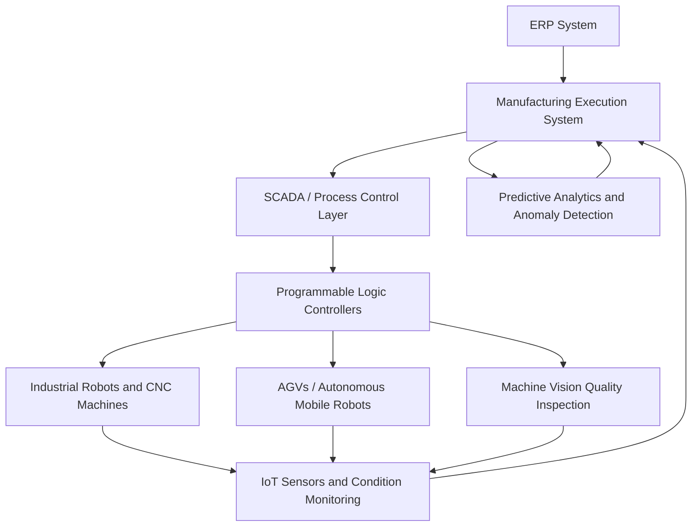

## Autonomous and Lights-Out Operations

### Definition and Core Concept

Autonomous and lights-out operations refer to manufacturing and warehousing environments designed to run with minimal or zero direct human intervention on the production or fulfillment floor, relying instead on integrated automation, robotics, machine control systems, and software orchestration to execute production, material handling, and quality processes. The term "lights-out" derives from the literal implication that such facilities can operate in the dark, since no human presence is required for lighting, safety, or comfort during unattended production runs.

Autonomous operations exist on a spectrum from highly automated (extensive machine automation with human oversight and intervention) to fully lights-out (complete unattended operation for extended periods, typically unmanned shifts such as nights or weekends).

### Historical Context and Evolution

- **Fixed automation era (1950s–1970s)**: Hard-tooled automation designed for high-volume, low-variety production (e.g., transfer lines in automotive manufacturing), lacking flexibility for product changes.
- **Flexible manufacturing systems (1980s–1990s)**: Introduction of programmable robotics and CNC (Computer Numerical Control) machines allowing automated production of multiple product variants without extensive retooling.
- **Integrated automation with MES/ERP (1990s–2000s)**: Manufacturing Execution Systems (MES) began coordinating automated equipment with production planning and quality systems, enabling more autonomous scheduling and control.
- **Industry 4.0 and smart manufacturing (2010s–present)**: Integration of IoT sensors, machine learning, real-time analytics, and interconnected cyber-physical systems has enabled more sophisticated autonomous decision-making beyond pre-programmed automation, including self-adjusting process parameters and predictive quality control.

### Core Technology Components

**Key Points**

- **Industrial robotics**: Articulated robotic arms, collaborative robots (cobots), and mobile robots performing material handling, assembly, welding, and machining tasks without human intervention.
- **Automated guided vehicles (AGVs) and autonomous mobile robots (AMRs)**: Self-navigating vehicles that transport materials and finished goods between workstations, warehouses, and shipping docks without human drivers.
- **Computer numerical control (CNC) and computer-integrated manufacturing (CIM)**: Machine tools programmed to execute precise machining operations without operator intervention during the cutting/forming cycle.
- **Machine vision and automated quality inspection**: Camera-based and sensor-based systems performing real-time defect detection and dimensional verification, replacing manual visual inspection.
- **Manufacturing Execution Systems (MES) and Supervisory Control and Data Acquisition (SCADA)**: Software layers coordinating machine scheduling, work order dispatch, and real-time process monitoring across the automated equipment fleet.
- **Programmable Logic Controllers (PLCs)**: Industrial control hardware executing the low-level logic governing machine sequencing, safety interlocks, and process control.
- **Automated storage and retrieval systems (AS/RS)**: Robotic warehouse systems that store and retrieve inventory without manual picking, commonly paired with warehouse management systems (WMS) for order fulfillment.

### System Architecture

Autonomous operations depend on a closed-loop architecture: production planning flows down from ERP/MES to machine-level control, while real-time condition and quality data flows back up to enable adaptive scheduling, predictive maintenance, and exception handling without requiring constant human supervision.

### Levels of Automation Autonomy

| Level | Description | Human Role |
| --- | --- | --- |
| Manual operation | Human performs all tasks; machines assist only with basic power tools | Full control and execution |
| Programmable automation | Machines execute pre-programmed sequences (e.g., CNC, fixed robotic cells) | Programs, monitors, and intervenes on exceptions |
| Flexible/adaptive automation | Systems adjust parameters based on sensor feedback within programmed bounds | Sets parameters, monitors dashboards, handles exceptions |
| Supervisory autonomous operation | System self-corrects and self-schedules within defined limits; humans monitor remotely | Remote oversight, exception escalation only |
| Full lights-out operation | System operates unattended for extended periods (e.g., overnight/weekend shifts) with no on-site personnel | Off-site monitoring, scheduled intervention for setup/maintenance only |

[Inference: this five-level framework synthesizes commonly described automation maturity stages in manufacturing literature; exact stage definitions and terminology vary across sources and industry contexts.]

### Requirements for Lights-Out Operation

For a production line or facility to run reliably unattended, several conditions are typically necessary:

1. **High process stability and low variability**: Processes must be capable (statistically in control) enough that they do not require real-time human adjustment during the unattended period.
2. **Robust automated material handling**: Raw material and component supply, part transfer between operations, and finished goods removal must be fully automated (via AGVs, conveyors, or robotic loading/unloading) so the line does not stall awaiting manual replenishment.
3. **Automated quality inspection and self-correction**: In-line vision systems and sensor-based inspection must be capable of detecting defects and, where possible, triggering automatic corrective action or safe shutdown without human judgment.
4. **Predictive maintenance capability**: Equipment health monitoring must reliably predict and prevent failures during unattended periods, since no operator is present to notice early warning signs (unusual sounds, vibration, minor leaks).
5. **Remote monitoring and alerting infrastructure**: Systems must be able to notify off-site personnel of anomalies requiring intervention, along with fail-safe shutdown protocols if a critical fault occurs.
6. **Tooling and consumable capacity for the full unattended duration**: Sufficient raw material, cutting tool life, and consumable capacity must be staged to last through the entire unmanned run without replenishment.

### Example: Lights-Out Machining Cell

**Example**

A precision machining supplier implements a lights-out overnight production strategy as follows:

1. During the day shift, operators load raw material into automated bar feeders and pallet systems sized to run through the full unattended overnight period.
2. CNC machines execute pre-programmed machining cycles; a robotic arm transfers completed parts between machining stations without operator intervention.
3. In-line machine vision inspects critical dimensions after each operation; parts failing tolerance are automatically diverted to a reject bin rather than continuing downstream.
4. Tool wear sensors monitor cutting tool condition and automatically trigger tool changes from an onboard tool magazine when wear thresholds are reached.
5. If a fault occurs that cannot be resolved automatically (e.g., material jam, tool breakage beyond automatic compensation), the system triggers a safe shutdown and sends an alert to an on-call technician's mobile device.
6. In the morning, operators review the automated production log, address any flagged exceptions, and reload the system for the next cycle.

This illustrates the general operational pattern for lights-out manufacturing: extending productive machine hours beyond standard staffed shifts while relying on automated exception handling and remote alerting rather than continuous human presence.

### Benefits

- **Increased asset utilization**: Extending production hours beyond standard staffed shifts (e.g., running unattended overnight or on weekends) increases the effective utilization of capital equipment without proportional labor cost increases.
- **Labor cost reduction and mitigation of labor shortages**: Reduces dependency on staffing multiple shifts, which can be particularly valuable in labor-constrained markets or high-cost labor regions.
- **Consistency and reduced variability**: Automated processes tend to exhibit lower process variability than manual operations, since machine-controlled parameters are more repeatable than human-executed tasks.
- **Improved workplace safety**: Removing human operators from physically demanding, repetitive, or hazardous tasks reduces exposure to workplace injury risk.
- **Faster throughput for suitable processes**: Automated cycle times are often faster and more consistent than manual equivalents for well-suited repetitive tasks.

### Risks, Limitations, and Challenges

- **High capital investment**: Autonomous systems, robotics, and supporting software infrastructure require substantial upfront capital investment, with payback periods dependent on production volume and labor cost offsets.
- **Reduced flexibility for high product variety**: Highly automated lights-out systems are often optimized for stable, high-volume, low-variety production; high product mix or frequent design changes can reduce the practicality of full automation. [Inference: this trade-off is a widely recognized limitation in automation literature, though modern flexible/reconfigurable automation reduces its severity relative to earlier fixed automation.]
- **Single point of failure risk**: Without human operators present to catch and correct minor issues in real time, an undetected fault can propagate longer before being caught, potentially producing a larger batch of defective output before automated inspection or remote alerting intervenes.
- **Maintenance and technical support burden**: Autonomous systems shift labor requirements from direct operation toward specialized maintenance, robotics programming, and controls engineering skill sets, which may require significant workforce retraining or new hiring.
- **Cybersecurity exposure**: Increased connectivity between control systems, MES, and cloud-based monitoring platforms expands the potential attack surface for industrial cybersecurity threats.
- **Workforce displacement and change management**: Transition to autonomous operations can create workforce displacement concerns, requiring organizational change management, retraining programs, and consideration of workforce transition strategies.

### Relationship to Other Operations Management Concepts

- **Flexible manufacturing systems (FMS)**: Autonomous operations often build upon FMS principles, adding higher levels of unattended scheduling and self-correction capability.
- **Predictive maintenance and operations analytics**: Reliable lights-out operation depends heavily on predictive maintenance capability to avoid unplanned downtime during unattended periods.
- **Statistical process control (SPC)**: Process capability and stability, as measured through SPC techniques, is a prerequisite for confidently running processes without real-time human oversight.
- **Just-in-Time (JIT) and lean manufacturing**: Automated material handling and AGVs are commonly used to support JIT material flow between workstations without manual transport.
- **Servitization**: Autonomous equipment increasingly generates the usage and condition data that underpins outcome-based service contracts (see Servitization), since machine performance can be monitored and guaranteed without on-site personnel.
- **Industry 4.0 / smart manufacturing**: Autonomous and lights-out operations represent a practical operational manifestation of broader Industry 4.0 concepts, including cyber-physical systems and interconnected production data.

### Related Topics

- Flexible manufacturing systems (FMS) and reconfigurable manufacturing
- Industrial robotics and collaborative robots (cobots)
- Manufacturing Execution Systems (MES) and SCADA architecture
- Predictive maintenance and condition-based monitoring
- Machine vision and automated quality inspection systems
- Automated storage and retrieval systems (AS/RS) and warehouse automation
- Industrial cybersecurity for connected manufacturing systems
- Workforce transition and reskilling strategies in automated manufacturing
- Industry 4.0 and cyber-physical production systems