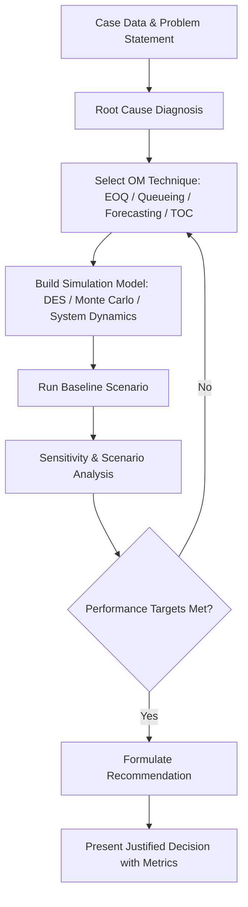

## Capstone Case Analysis and Simulation

### Definition and Scope

Capstone case analysis and simulation is a culminating instructional and applied methodology in Operations Management (OM) education and organizational practice, combining a real or realistic business case study with a dynamic simulation model to test decisions under uncertainty. It integrates prior OM domain knowledge — process design, inventory management, quality control, supply chain coordination, forecasting, and capacity planning — into a single, cross-functional exercise. Unlike isolated problem sets, a capstone exercise requires diagnosing an ill-structured problem, formulating an operational strategy, and validating that strategy against simulated performance outcomes, often iteratively.

Two components are distinguished:

- **Case analysis**: A structured qualitative and quantitative examination of a documented business situation (e.g., a manufacturer facing capacity constraints, a retailer with inventory volatility, a hospital with patient flow bottlenecks).
- **Simulation**: A computational or physical model (discrete-event, Monte Carlo, system dynamics, or spreadsheet-based) that operationalizes the case's parameters so that decisions can be tested, scored, and iterated without real-world risk.

### Role Within Operations Management

**Key Points**

- Serves as the synthesis point where forecasting, capacity, inventory, quality, and process analytics are applied jointly rather than in isolation.
- Bridges theoretical frameworks (e.g., EOQ, queueing theory, Lean/Six Sigma) with messy, multi-constraint real-world data.
- Builds decision-making competency under uncertainty, resource scarcity, and competing stakeholder objectives.
- Commonly used as the final deliverable in OM courses, executive education, and corporate training programs (e.g., supply chain war-gaming, production scheduling simulations).
- Frequently mirrors industry tools: ERP-driven scenario planning, digital twins, and what-if analysis dashboards.

### Structure of a Capstone Case

A well-formed OM capstone case typically contains the following elements:

1. **Organizational context** — industry, size, competitive position, strategic priorities.
2. **Operational problem statement** — e.g., declining service levels, rising defect rates, stockouts, bottleneck stations.
3. **Quantitative dataset** — demand history, lead times, cost structures, capacity limits, defect rates, queue data.
4. **Constraints** — budget ceilings, labor availability, supplier lead times, regulatory requirements.
5. **Decision variables** — order quantities, staffing levels, batch sizes, layout changes, supplier selection.
6. **Performance metrics** — throughput, cycle time, inventory turns, service level, cost per unit, OEE (Overall Equipment Effectiveness).

### Analytical Workflow

**Step 1 — Problem Diagnosis**

Identify root causes using tools such as:

- Fishbone (Ishikawa) diagrams for causal factors
- Pareto analysis to isolate the "vital few" contributors to defects or delays
- Value stream mapping (VSM) to visualize flow and non-value-added time

**Step 2 — Quantitative Modeling**

Apply relevant OM techniques depending on the case's operational lever:

| Operational Lever | Typical Technique |
| --- | --- |
| Inventory policy | EOQ, safety stock, $(s, S)$ or $(R, Q)$ models |
| Capacity planning | Little's Law, bottleneck analysis, theory of constraints |
| Forecasting | Moving average, exponential smoothing, regression |
| Scheduling | Sequencing rules (SPT, EDD), Gantt charting |
| Quality | Control charts ($\bar{X}$-R charts), process capability ($C_{pk}$) |
| Queueing/service | M/M/1, M/M/c models |

Little's Law, foundational to most capacity and flow analysis in these cases, is expressed as:

$$L = \lambda W$$

where $L$ is the average number of items in the system, $\lambda$ is the average arrival rate, and $W$ is the average time an item spends in the system.

**Step 3 — Simulation Construction**

Build or use a provided simulation environment to test decisions before recommending them. Common simulation paradigms:

- **Discrete-event simulation (DES)**: Models entities (orders, patients, parts) flowing through a network of queues and servers with stochastic interarrival and service times. Tools: Arena, Simio, AnyLogic, SimPy (Python).
- **Monte Carlo simulation**: Repeated random sampling of uncertain inputs (demand, lead time) to generate a distribution of outcomes, typically implemented in spreadsheet software (Excel with @RISK or native `RAND()`/`NORM.INV()` functions) or Python (NumPy).
- **System dynamics**: Stock-and-flow modeling for aggregate, longer-horizon behavior (e.g., bullwhip effect propagation across a supply chain). Tools: Vensim, Stella.
- **Agent-based simulation**: Models autonomous decision-making entities (suppliers, customers) whose interactions produce emergent system behavior.

**Step 4 — Scenario Testing and Sensitivity Analysis**

Run multiple scenarios (base case, optimistic, pessimistic) and vary key parameters (demand variability, lead time, staffing) to observe changes in output metrics. Tornado diagrams and two-way data tables are standard tools for visualizing sensitivity.

**Step 5 — Recommendation and Justification**

Translate simulation output into an actionable operational recommendation, explicitly tying back to the original case constraints and strategic objectives, with supporting quantitative evidence (e.g., "Increasing safety stock by 15% reduces stockout probability from 12% to 3%, at an annual holding cost increase of $18,400").

### Example: Simplified Capstone Walkthrough

**Example**

A mid-sized furniture manufacturer faces a bottleneck at its finishing (paint) station, causing late deliveries. Case data: cutting station capacity = 120 units/day; assembly = 100 units/day; finishing = 80 units/day; demand = 110 units/day.

- **Diagnosis**: Using the Theory of Constraints, the finishing station (80 units/day) is the system bottleneck, since it processes below both demand and upstream capacity.
- **Little's Law check**: If work-in-process (WIP) ahead of finishing averages $L = 40$ units and the finishing rate is $\lambda = 80$/day, average time in that queue is:

$$W = \frac{L}{\lambda} = \frac{40}{80} = 0.5 \text{ days}$$

- **Simulation**: A DES model is built in SimPy with the three stations as sequential servers, using exponential service time distributions calibrated to historical cycle time data. Running 1,000 replications under current staffing shows an average order fulfillment lag of 2.3 days.
- **Scenario test**: Adding a second finishing line (raising finishing capacity to 130 units/day) is simulated; fulfillment lag drops to 0.4 days, but adds $65,000 in annual labor cost.
- **Recommendation**: Add a part-time second shift at finishing (raising capacity to 100 units/day, matching demand) rather than a full second line, balancing cost against service level improvement — simulated to reduce lag to 0.9 days at $22,000 annual cost.

### Illustration: Capstone Analysis-Simulation Feedback Loop (svg_diagram)

<svg xmlns="http://www.w3.org/2000/svg" viewBox="0 0 900 380" font-family="Arial, sans-serif">
<text x="450" y="25" text-anchor="middle" font-size="16" font-weight="bold">Capstone Analysis-Simulation Feedback Loop (svg_diagram)</text>
<rect x="30" y="60" width="160" height="70" rx="8" fill="#dbeafe" stroke="#2563eb" />
<text x="110" y="90" text-anchor="middle" font-size="13" font-weight="bold">Case Diagnosis</text>
<text x="110" y="110" text-anchor="middle" font-size="11">Root cause, data review</text>
<rect x="250" y="60" width="160" height="70" rx="8" fill="#dcfce7" stroke="#16a34a" />
<text x="330" y="90" text-anchor="middle" font-size="13" font-weight="bold">Model Building</text>
<text x="330" y="110" text-anchor="middle" font-size="11">EOQ, queueing, DES setup</text>
<rect x="470" y="60" width="160" height="70" rx="8" fill="#fef9c3" stroke="#ca8a04" />
<text x="550" y="90" text-anchor="middle" font-size="13" font-weight="bold">Simulation Run</text>
<text x="550" y="110" text-anchor="middle" font-size="11">Monte Carlo / DES trials</text>
<rect x="690" y="60" width="160" height="70" rx="8" fill="#fee2e2" stroke="#dc2626" />
<text x="770" y="90" text-anchor="middle" font-size="13" font-weight="bold">Output Metrics</text>
<text x="770" y="110" text-anchor="middle" font-size="11">Throughput, cost, service</text>
<line x1="190" y1="95" x2="245" y2="95" stroke="#333" stroke-width="2" marker-end="url(#arrow)" />
<line x1="410" y1="95" x2="465" y2="95" stroke="#333" stroke-width="2" marker-end="url(#arrow)" />
<line x1="630" y1="95" x2="685" y2="95" stroke="#333" stroke-width="2" marker-end="url(#arrow)" />
<rect x="250" y="230" width="400" height="70" rx="8" fill="#ede9fe" stroke="#7c3aed" />
<text x="450" y="260" text-anchor="middle" font-size="13" font-weight="bold">Sensitivity Analysis &amp; Scenario Comparison</text>
<text x="450" y="280" text-anchor="middle" font-size="11">Vary demand, lead time, staffing; compare scenarios</text>
<line x1="770" y1="130" x2="770" y2="200" stroke="#333" stroke-width="2" />
<line x1="770" y1="200" x2="650" y2="200" stroke="#333" stroke-width="2" />
<line x1="650" y1="200" x2="650" y2="225" stroke="#333" stroke-width="2" marker-end="url(#arrow)" />
<rect x="330" y="330" width="240" height="40" rx="8" fill="#f1f5f9" stroke="#334155" />
<text x="450" y="355" text-anchor="middle" font-size="12" font-weight="bold">Recommendation &amp; Justification</text>
<line x1="450" y1="300" x2="450" y2="325" stroke="#333" stroke-width="2" marker-end="url(#arrow)" />
<line x1="330" y1="330" x2="150" y2="150" stroke="#94a3b8" stroke-width="2" stroke-dasharray="5,4" marker-end="url(#arrow)" />
<text x="180" y="220" font-size="10" fill="#64748b">Iterate if targets unmet</text>
</svg>

### Process Flow as Mermaid Diagram

### Common Simulation Tools by Category

**Key Points**

- **Spreadsheet-based**: Excel with Data Tables, Solver, and `RAND()`/`NORM.INV()` for lightweight Monte Carlo work; accessible but limited in scale.
- **Dedicated DES platforms**: Arena, Simio, FlexSim — used heavily in manufacturing and logistics capstones; offer built-in statistical distribution fitting and animation.
- **Programming-based**: SimPy (Python) and simmer (R) for discrete-event modeling with full programmatic control; common in academic and analytics-focused capstones.
- **System dynamics software**: Vensim, Stella — used for supply chain-wide, long-horizon behavioral modeling (e.g., bullwhip effect).
- [Inference] Adoption of AI-augmented simulation platforms (generative scenario design, automated parameter calibration) is increasing in corporate training contexts, though rigorous published benchmarks on efficacy versus traditional DES remain limited.

### Evaluation Criteria for Capstone Deliverables

A capstone case analysis and simulation is typically assessed against:

1. **Analytical rigor** — correct application of OM quantitative methods, no arithmetic or model misspecification.
2. **Data-driven justification** — recommendations tied directly to simulation output rather than intuition alone.
3. **Sensitivity awareness** — acknowledgment of how results change under different assumptions.
4. **Feasibility** — recommendations respect stated budget, labor, and capacity constraints.
5. **Communication clarity** — findings presented via clear metrics, visuals, and executive-level summary.
6. **Integration breadth** — the degree to which multiple OM subfields (inventory, quality, capacity, forecasting) are connected coherently rather than treated as siloed calculations.

### Common Pitfalls

- Treating the simulation as a black box and reporting outputs without validating the model against historical baseline data first.
- Over-fitting recommendations to a single simulation run rather than examining variance across many replications.
- Ignoring queueing variability and using only average values (a common error, since average-based analysis systematically understates congestion under variable demand — a known limitation of deterministic EOQ-style models when applied to stochastic environments).
- Failing to connect the operational recommendation back to financial or strategic impact (cost, revenue, customer satisfaction).
- Scope creep: attempting to model every operational subsystem instead of focusing on the identified bottleneck or constraint.

### Behavioral Note on Simulation Output

[Unverified] Exact numerical outputs from any given simulation run will vary based on random seed values, number of replications, and distributional assumptions chosen by the analyst; reported figures in a capstone write-up should therefore be treated as representative of a modeled scenario rather than as guaranteed real-world outcomes. Standard practice mitigates this via running sufficient replications (often 100–1,000+) and reporting confidence intervals alongside point estimates.

**Related Topics**

- Discrete-event simulation fundamentals (entities, servers, queues, replications)
- Monte Carlo simulation for demand and lead-time uncertainty
- Theory of Constraints and bottleneck management
- Little's Law and flow-time analysis
- Value stream mapping and Lean process design
- Statistical process control and process capability analysis
- Supply chain digital twins and real-time scenario planning
- Sensitivity analysis and tornado diagrams in decision modeling
- Business case writing and executive recommendation structuring