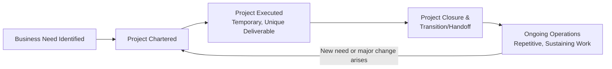

## What Is a Project versus Ongoing Operations

### Definitions

A **project** is a temporary endeavor undertaken to create a unique product, service, or result. Two attributes are definitional, not incidental:

- **Temporary** — has a defined start and end. The end is reached when objectives are achieved, when it becomes clear objectives cannot or will not be met, when funding is exhausted, or when the need for the project no longer exists. "Temporary" describes the endeavor itself, not the deliverable — a project can produce a bridge, a piece of legislation, or an organization that lasts for decades.
- **Unique** — the product, service, or result differs in some distinguishing way from other similar outputs. Repetitive elements may exist in the deliverable (e.g., standardized components in a building), but the overall combination of stakeholders, location, design, and circumstances is not repeated identically.

**Ongoing operations** (sometimes called "operational work" or "business as usual") are the ongoing, repetitive, functional work that sustains an organization. Operations produce the same product or service repeatedly, following established procedures, to keep the organization running.

### Key Points

| Dimension | Project | Ongoing Operations |
| --- | --- | --- |
| Duration | Temporary — defined start/end | Ongoing — no planned end date |
| Output | Unique product, service, or result | Repetitive product or service |
| Purpose | Achieve a specific objective, then close | Sustain the business over time |
| Team | Often assembled temporarily, may be cross-functional | Typically stable, functional |
| Change tolerance | Expected to be disruptive/transformative | Optimized for stability and efficiency |
| Success measure | Scope/schedule/cost/quality objectives met | Efficiency, throughput, consistency |
| Governance | Project charter, sponsor, defined closure | Standard operating procedures (SOPs), KPIs |
| Example | Building a new manufacturing plant | Running the plant's daily production line |

### Why the Distinction Matters

The project-versus-operations distinction is foundational because it determines which management discipline and governance model applies:

- **Resourcing and budgeting** — projects are typically funded through capital budgets or discrete allocations tied to a business case; operations are funded through recurring operational budgets (OPEX).
- **Organizational structure** — projects may pull people from their functional "home" teams temporarily (matrix organizations), whereas operations staff sit permanently in functional departments.
- **Risk profile** — projects carry higher uncertainty because they are doing something new; operations carry lower uncertainty because processes are repeatable and tested.
- **Success criteria** — a project is judged against a triple constraint (scope, schedule, cost) plus quality and stakeholder satisfaction at a point of closure. Operations are judged against continuous performance metrics (uptime, defect rate, cost per unit) with no closure point.
- **Change management approach** — projects are the vehicle organizations use to implement change (new systems, new products, new processes); once the project closes, the resulting capability is handed off to operations to run.

### The Project-Operations Interface

Projects and operations are not isolated from each other — they intersect at defined points in an organization's value chain:

1. **Project initiates change** → a project is chartered to create or improve a capability (e.g., develop a new CRM system).
2. **Transition/handoff** → upon project closure, deliverables, documentation, and knowledge transfer occur to the operational team that will own the result going forward.
3. **Operations sustains the result** → the operational team now runs the CRM system as business-as-usual, handling day-to-day maintenance, support tickets, and incremental fixes.
4. **New project may re-enter** → when a significant upgrade or replacement is needed, a new project is initiated, and the cycle repeats.

Organizations that manage this interface poorly commonly encounter two failure modes: projects that "go operational" without formal handoff (ownership and accountability gaps), and operational work being informally labeled a "project" without proper temporary governance (scope creep with no closure criteria).

### Distinguishing Examples

**Project:**

- Designing and launching a new mobile banking app
- Constructing a new hospital wing
- Migrating an organization's email system from one vendor to another
- Conducting a merger integration between two companies
- Developing a vaccine through clinical trial phases

**Ongoing Operations:**

- Processing daily customer transactions at a bank
- Providing patient care in an existing hospital ward
- Administering and maintaining an already-migrated email system
- Running monthly payroll
- Manufacturing units on an established production line

### Edge Cases and Common Misconceptions

- **[Inference]** A recurring annual event (e.g., an annual conference) is often treated as a project because each instance has a defined start/end and enough unique variables (venue, speakers, theme) to be considered a distinct temporary endeavor, even though the *program* of running the event yearly resembles an operational cadence. Practitioners commonly debate this classification, and organizational context determines the final treatment.
- **Maintenance work** is generally operational (fixing a recurring defect using a standard procedure) unless the scope changes significantly (e.g., a major system overhaul), which shifts it to project status.
- **"Temporary" does not mean "short."** Projects can span years (e.g., large infrastructure projects); the defining trait is that they have an end, not that the end comes quickly.
- **A program** is a group of related projects, subsidiary programs, and program activities managed in a coordinated way to obtain benefits not available from managing them individually — programs are also temporary but exist at a higher coordination level than a single project.
- **Portfolio** refers to projects, programs, subsidiary portfolios, and operations managed as a group to achieve strategic objectives — this is the level at which organizations balance investment between project work and operational work.

### PMBOK-Aligned Framing

Per PMI's foundational definitions (PMBOK Guide), a project's temporary nature applies to the project itself and to project team assembly, but the resulting product, service, or result generally endures beyond the project's end. This distinguishes a project from a **process**, which is a repeated, ongoing set of actions with no inherent end — the operational analog.

### Related Topics

- Project, Program, and Portfolio Management (distinctions and hierarchy)
- Project Life Cycle vs. Product Life Cycle
- Organizational Process Assets and Enterprise Environmental Factors
- Project Charter and Business Case Development
- Organizational Structures (Functional, Matrix, Projectized) and their effect on project authority
- Project Closure and Transition-to-Operations Handoff Procedures
- The Triple Constraint (Scope, Schedule, Cost) and Quality
- Value Delivery through Portfolios, Programs, and Projects (PMI Standard)