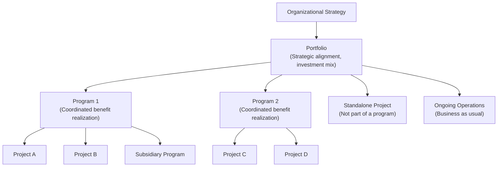

## Project, Program, and Portfolio Distinctions

### Definitions

- **Project** — a temporary endeavor undertaken to create a unique product, service, or result. Bounded by a defined start and end; closes once objectives are met (or terminated early).
- **Program** — a group of related projects, subsidiary programs, and program activities managed in a coordinated way to obtain benefits not available from managing them individually. Programs may include work outside the scope of the discrete projects in the program (e.g., ongoing operational elements).
- **Portfolio** — a collection of projects, programs, subsidiary portfolios, and operations managed as a group to achieve strategic business objectives. Portfolio components are not necessarily interdependent or directly related; they are grouped for strategic alignment and resource optimization, not for shared benefit realization.

### Key Points — Comparative Table

| Dimension | Project | Program | Portfolio |
| --- | --- | --- | --- |
| Scope | Defined, specific deliverables | Broader scope spanning multiple projects | Organizational/business scope, tied to strategy |
| Duration | Temporary, defined end | Ongoing or long-term; ends when strategic benefit is realized | Ongoing, evolves with organizational strategy |
| Success measure | Scope/schedule/cost/quality objectives ("was it delivered on time and budget?") | Benefits realization ("did we achieve the intended organizational value?") | Aggregate performance and strategic alignment of components |
| Change orientation | Managers respond to change to minimize impact | Managers embrace change as expected, since it's needed to deliver benefits | Managers continuously monitor changes in the broader internal/external environment |
| Planning approach | Progressive elaboration through project life cycle phases | High-level plan guiding detailed planning at component level | High-level plans/communications tracking aggregate performance |
| Interdependency | Managed as one temporary endeavor | Components are related and interdependent for shared benefit | Components may be unrelated; grouped for strategic prioritization |
| Leadership role | Project Manager | Program Manager | Portfolio Manager |
| Governance focus | Delivering the defined deliverable | Coordinating components to maximize combined benefit | Selecting, prioritizing, and balancing investments |

### Hierarchical Relationship

Portfolios, programs, and projects exist in a nested (but not strictly hierarchical in every case) relationship. Not every project belongs to a program, and not every program belongs to a portfolio — but strategic alignment flows top-down while performance and status information flows bottom-up.

### Detailed Distinctions

#### Project Management

- Focuses on producing deliverables consistent with the project's specific scope.
- Managed by a Project Manager, whose authority and role vary by organizational structure (functional, matrix, projectized).
- Uses processes grouped into process groups: Initiating, Planning, Executing, Monitoring & Controlling, and Closing.
- Success is largely deterministic and measurable at a discrete point (project closure).

#### Program Management

- Focuses on managing interdependencies between projects and other program components to determine the optimal approach for managing them (e.g., resolving resource constraints or scope conflicts between related projects).
- Program Managers oversee Project Managers, providing leadership and direction for individual project managers within the program.
- Concerned with **benefits management** — identifying, defining, tracking, and sustaining benefits that would not be achievable if the components were managed independently.
- **[Inference]** A program is generally considered complete when the intended benefit has been fully realized and transitioned to operations or the sponsoring organization, rather than when a fixed deliverable is produced — this distinguishes program "closure" from project closure, though organizations vary in how strictly they apply this criterion.

#### Portfolio Management

- Focuses on ensuring that projects and programs are prioritized so that resource allocation is consistent with organizational strategy.
- Portfolio Managers may have less day-to-day involvement in individual component execution and more involvement in high-level monitoring, prioritization, and strategic decision-making (e.g., go/no-go, funding continuation, termination).
- Portfolio components compete for finite organizational resources (budget, skilled personnel, equipment), and portfolio management provides the mechanism to balance that competition against strategic value.
- Portfolio management encompasses managing the aggregate flow of investments — including ongoing operations — not just discrete temporary endeavors.

### Practical Example: Illustrating All Three Levels

**Organizational strategy:** Expand into a new geographic market within three years.

- **Portfolio:** "Market Expansion Portfolio" — includes the Southeast Asia Program, the Latin America Program, an unrelated internal ERP Upgrade Project, and existing regional operations that continue to run in parallel.
- **Program:** "Southeast Asia Expansion Program" — coordinates multiple interdependent projects that together deliver market entry.
  - **Project 1:** Establish regulatory/legal entity in target country.
  - **Project 2:** Build/localize product for target market.
  - **Project 3:** Set up local distribution and supply chain.
  - **Project 4:** Launch marketing campaign.
- Individually, each project delivers a specific output. Only when coordinated as a program do they jointly realize the benefit of "successful market entry" — a benefit not achievable by running any single project alone.
- Once market entry succeeds, ongoing local sales, support, and distribution become **operations**, no longer program or project work.

### Common Misconceptions

- **A "large project" is not automatically a program.** Size alone does not determine classification; the defining feature of a program is coordinated management of *interdependent* components to realize benefits unavailable individually.
- **Portfolio management is not the same as program management scaled up.** Portfolio components need not be related; program components must be related and interdependent for coordinated benefit.
- **Programs don't always have a fixed end date the way projects do**; some programs are structured as ongoing, cyclical efforts (e.g., a continuous product-improvement program) as long as strategic benefit continues to justify their existence — **[Unverified]** whether a specific organization treats a given program as open-ended or time-bound depends on that organization's governance policies, which vary.

### Governance Implications

| Level | Typical Governance Body | Primary Decision Focus |
| --- | --- | --- |
| Project | Project Sponsor / Steering Committee | Approve scope, schedule, budget baseline; authorize changes |
| Program | Program Sponsor / Program Governance Board | Approve benefit realization plan; resolve cross-project conflicts |
| Portfolio | Portfolio Review Board / Executive Committee | Approve strategic alignment; authorize funding and prioritization |

### Related Topics

- Organizational Project Management (OPM) and Strategy Alignment
- Program Benefits Management Plans
- Portfolio Prioritization Models and Weighted Scoring
- Project Governance vs. Program Governance vs. Portfolio Governance
- Organizational Structures and Their Effect on PM/Program Manager Authority
- The Project Management Office (PMO) — Supportive, Controlling, and Directive Types
- Value Delivery Systems (per PMI's Standard for Portfolio, Program, and Project Management)
- Stakeholder Management Across Project, Program, and Portfolio Levels