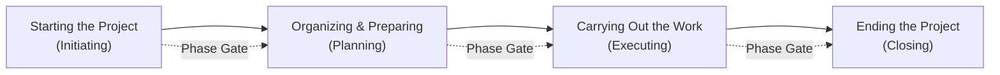
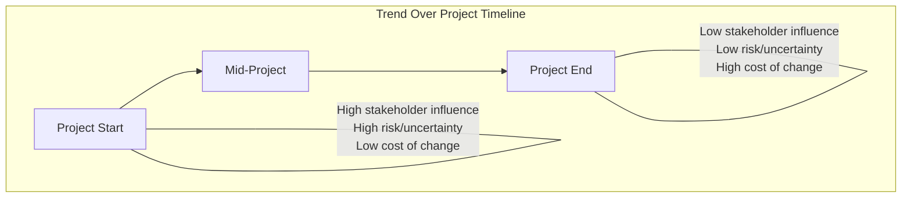

## Project Life Cycle Phases


### Definition

A **project life cycle** is the series of phases a project passes through from its initiation to its closure. Phases are generally sequential, though they can overlap, and are defined by the organization or by the nature of the project itself. The life cycle provides the basic framework for managing the project regardless of the specific work involved.

A **phase** is a collection of logically related project activities that culminates in the completion of one or more deliverables. Phases are typically time-bound and often end with a **phase gate** (also called a stage gate, kill point, or phase review) — a review point where a decision is made to continue, modify, or terminate the project.

### Generic Life Cycle Structure

Most life cycles, regardless of industry, share a generic structure with four phases:

1. **Starting the Project** (Initiating)
2. **Organizing and Preparing** (Planning)
3. **Carrying Out the Work** (Executing)
4. **Ending the Project** (Closing)

This four-phase structure maps onto — but is distinct from — the five **process groups** (Initiating, Planning, Executing, Monitoring & Controlling, Closing), which are process-based categories that occur within and across every phase, not phases themselves.



### Cost and Staffing Pattern Across the Life Cycle

A well-established generic characteristic: cost and staffing levels are low at the start, peak during intermediate phases, and drop rapidly as the project draws to a close.



```
Cost/Staff
Level
|                    ___________
|                  /             \
|                /                 \
|              /                     \
|           /                          \
|________/                                \______
   +------------------------------------------------> Time
     Start        Organizing/Executing         Closing
```

- **[Inference]** This pattern is a general tendency documented across many project types, not a fixed rule; some projects (e.g., short-duration, resource-front-loaded projects) may deviate significantly.

### Stakeholder Influence, Risk, and Cost of Changes Over Time

Two other well-documented characteristics of the generic life cycle:

- **Stakeholder influence, risk, and uncertainty** are highest at the start of the project and decrease as the project progresses, because fewer unknowns remain as decisions are made and work is completed.
- **The cost of making changes** and correcting errors increases substantially as the project approaches completion, since later-stage changes affect more completed work and are harder to unwind.



### Life Cycle Types

Project life cycles vary along a spectrum based on how early and how precisely scope, schedule, and cost can be defined, and how much iteration is built in.

#### 1. Predictive (Waterfall / Plan-Driven) Life Cycle

- Scope, schedule, and cost are determined in detail early in the life cycle; any changes to scope are carefully managed.
- Phases occur sequentially, each typically focused on a subset of activities (e.g., Requirements → Design → Build → Test → Deploy).
- Best suited when the product/deliverable is well understood, requirements are stable, and technology is proven.
- Example: Traditional construction or infrastructure projects.

#### 2. Iterative Life Cycle

- Project scope is generally determined early, but time and cost estimates are routinely modified as the team's understanding of the product increases.
- Product is developed through repeated cycles (iterations), refining and adding detail incrementally.

#### 3. Incremental Life Cycle

- The deliverable is produced through a series of iterations that successively add functionality within a predetermined time frame.
- The deliverable contains the necessary and sufficient capability to be considered complete only after the final iteration.

#### 4. Adaptive (Agile) Life Cycle

- Detailed scope is defined and approved before the start of an iteration, but scope is developed and elaborated iteratively; high-level planning is done up front, detailed planning happens iteration by iteration.
- Emphasizes rapid response to change, frequent stakeholder engagement, and delivering value incrementally through short cycles (sprints/iterations).
- Best suited for environments with high uncertainty, evolving requirements, or rapidly changing technology.

#### 5. Hybrid Life Cycle

- Combines elements of predictive and adaptive life cycles — for example, using a predictive approach for well-understood or high-certainty elements (e.g., procurement, regulatory compliance) and an adaptive approach for elements with high uncertainty (e.g., software feature development).

| Life Cycle Type | Requirements Definition | Delivery Cadence | Change Tolerance | Best Fit |
| --- | --- | --- | --- | --- |
| Predictive | Fixed early, detailed | Single delivery at end | Low — formal change control | Stable, well-understood scope |
| Iterative | Early but refined over time | Repeated iterations, refining understanding | Moderate | Evolving understanding, stable scope |
| Incremental | Defined early | Successive functional increments | Moderate | Deliverables usable in parts before full completion |
| Adaptive/Agile | Elaborated continuously | Frequent, short iterations | High | High uncertainty, evolving requirements |
| Hybrid | Mixed | Mixed | Mixed | Mixed-certainty environments |

### Phase-to-Phase Relationships

Within a life cycle, phases can relate to one another in different ways:

- **Sequential relationship** — one phase must finish before the next starts, reducing uncertainty but often eliminating options to shorten the schedule.
- **Overlapping relationship** — a phase starts before the prior one ends. This can be applied as a schedule compression technique (fast tracking), though it may increase risk and can require rework if the overlapping phase proceeds before the preceding phase's information is fully available.
- **Iterative relationship** — only one phase is planned at a time, and the next phase's planning is adjusted as work in the current phase progresses; common in environments of high uncertainty, long duration, or evolving technology.

### Example: Generic Construction Project Phases

1. **Feasibility** — determine whether the project is viable (site assessment, cost-benefit analysis).
2. **Planning and Design** — architectural design, engineering drawings, permitting.
3. **Construction (Execution)** — actual building work, procurement of materials, subcontractor coordination.
4. **Commissioning/Turnover** — testing systems, final inspections.
5. **Closeout** — final documentation, contract closure, lessons learned, handoff to operations.

Each phase concludes with a phase gate: e.g., a feasibility go/no-go decision before committing capital to design.

### Example: Generic Software Development Project (Predictive Variant)

1. **Requirements Gathering** — elicit and document functional/non-functional requirements.
2. **Design** — architecture, database schema, UI/UX design.
3. **Development (Build)** — coding, unit testing.
4. **Testing (QA)** — integration testing, system testing, user acceptance testing (UAT).
5. **Deployment** — release to production environment.
6. **Closure** — documentation handoff, post-implementation review.

### Life Cycle vs. Product Life Cycle vs. Development Life Cycle — Distinguishing Terms

- **Project life cycle** — the phases the *project* passes through (initiation to closure); the subject of this section.
- **Product life cycle** — the series of phases that represent the evolution of a *product*, from concept through delivery, growth, maturity, and retirement. A product life cycle may span multiple projects.
- **Development life cycle** (e.g., SDLC) — refers specifically to how the *deliverable* is developed (predictive, iterative, incremental, adaptive, or hybrid), and is typically nested within a project's execution phase(s).

**[Inference]** These terms are frequently used loosely or interchangeably in casual practice, but the PMBOK Guide and related PMI standards treat them as distinct concepts operating at different scopes (project vs. product vs. deliverable-development-approach).

### Related Topics

- Process Groups vs. Project Phases (Initiating, Planning, Executing, Monitoring & Controlling, Closing)
- Phase Gates, Kill Points, and Stage-Gate Governance
- Predictive vs. Agile vs. Hybrid Delivery Approaches (Tailoring the Life Cycle)
- Product Life Cycle Management
- Schedule Compression Techniques: Fast Tracking and Crashing
- Rolling Wave Planning (Progressive Elaboration)
- Project Charter Development and Initiation Documents
- Lessons Learned and Project Closeout Documentation