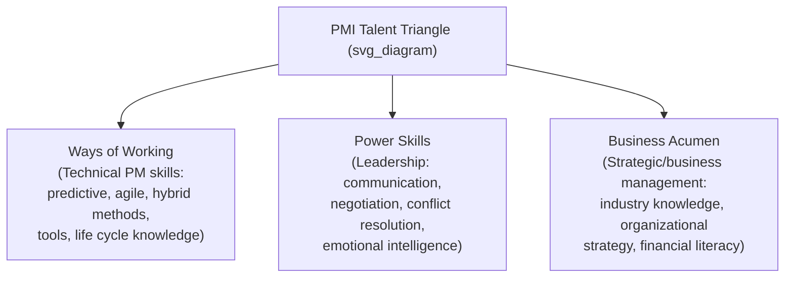

## Role and Responsibilities of the Project Manager

### Definition

The **Project Manager (PM)** is the person assigned by the performing organization to lead the team responsible for achieving the project objectives. The PM is accountable for the successful initiation, planning, execution, monitoring/controlling, and closure of a project, operating at the intersection of the project team, the sponsor/stakeholders, and the broader organization.

### Core Responsibility Areas

#### 1. Integration Management

- Coordinates all moving parts of the project into a coherent whole — the PM is the only role with visibility across every knowledge area and constraint simultaneously.
- Develops and maintains the project charter and project management plan.
- Directs and manages project execution, ensuring work is performed consistent with the plan.
- Manages change requests through an integrated change control process, evaluating impact across scope, schedule, cost, quality, and risk before approval.

#### 2. Scope Management

- Ensures the project includes all the work required — and only the work required — to complete the project successfully.
- Facilitates requirements collection, scope definition, and creation of the Work Breakdown Structure (WBS).
- Controls scope by validating deliverables against acceptance criteria and managing scope creep.

#### 3. Schedule Management

- Sequences activities, estimates durations, and develops the project schedule (e.g., via Critical Path Method, Gantt charts).
- Monitors schedule performance and applies corrective actions (fast tracking, crashing) when variances occur.

#### 4. Cost Management

- Develops budget estimates, establishes the cost baseline, and monitors expenditures against it (e.g., using Earned Value Management).
- Manages funding requirements and reports cost performance to sponsors/stakeholders.

#### 5. Quality Management

- Establishes quality standards and acceptance criteria aligned with stakeholder requirements.
- Oversees quality assurance (process-focused) and quality control (deliverable-focused) activities.

#### 6. Resource Management

- Acquires, develops, and manages the project team, including negotiating for resources with functional managers in matrix organizations.
- Resolves resource conflicts and manages team performance, motivation, and conflict resolution.

#### 7. Communications Management

- Determines stakeholder information needs and defines the communications plan (what, how, how often, to whom).
- Serves as the primary hub for information flow between the team, sponsor, and other stakeholders — **[Inference]** studies and PMI's own research commonly cite communication as consuming a large majority of a PM's time, though the exact percentage cited varies by source and survey methodology.

#### 8. Risk Management

- Identifies, analyzes (qualitatively/quantitatively), and plans responses to risks throughout the project life cycle.
- Maintains the risk register and monitors risk triggers, escalating as needed.

#### 9. Procurement Management

- Manages make-or-buy decisions, vendor selection, and contract administration when the project requires external goods or services.

#### 10. Stakeholder Management

- Identifies stakeholders, analyzes their interests/influence/power, and manages engagement to secure support and mitigate opposition.

### The PMI Talent Triangle

PMI frames the PM's skill set using the **Talent Triangle**, which spans three interdependent skill domains:

- **Ways of Working** (formerly "Technical Project Management") — knowledge and application of project management methodologies, tools, and techniques appropriate to the delivery approach (predictive, agile, hybrid).
- **Power Skills** (formerly "Leadership") — interpersonal skills such as communication, motivation, negotiation, and conflict management that enable the PM to guide a team and influence stakeholders.
- **Business Acumen** (formerly "Strategic and Business Management") — understanding of the organization's strategy, industry, and business functions well enough to make decisions that support broader organizational goals.

### Authority Level by Organizational Structure

The PM's actual authority varies significantly depending on the organizational structure the project operates within:

| Organizational Structure | PM Authority | PM Role | Resource Availability |
| --- | --- | --- | --- |
| Functional | Low to none | Part-time, often called a coordinator/expediter | Low |
| Weak Matrix | Low | Part-time | Low |
| Balanced Matrix | Low to moderate | Full-time | Low to moderate |
| Strong Matrix | Moderate to high | Full-time | Moderate to high |
| Projectized | High to almost total | Full-time | High to almost total |

**[Inference]** In functional and weak matrix structures, the PM's limited formal authority often means success depends heavily on influence and negotiation skills rather than positional power — a commonly cited but context-dependent generalization.

### Project Manager vs. Related Roles

| Role | Primary Focus | Relationship to PM |
| --- | --- | --- |
| **Project Sponsor** | Provides resources/support, champions the project, has ultimate accountability for business outcomes | PM reports project status and escalates decisions beyond PM authority |
| **Functional Manager** | Manages a specific department/discipline on an ongoing basis | Often negotiates with PM over shared resources (especially in matrix organizations) |
| **Program Manager** | Coordinates multiple related projects for shared benefit | May supervise/coordinate multiple PMs within a program |
| **Product Owner** (Agile) | Owns and prioritizes the product backlog, represents customer/business value | In agile contexts, may share responsibilities with or replace some traditional PM scope-definition duties |
| **Scrum Master** (Agile) | Facilitates the agile process, removes impediments for the team | Complements or, in some agile structures, absorbs certain PM facilitation duties |
| **Operations Manager** | Manages ongoing, repetitive business functions | Receives project deliverables at closure/handoff |

### Interpersonal and Team Skills the PM Applies

- **Leadership** — setting vision, motivating the team, aligning individual contributions to project goals.
- **Team building** — fostering collaboration and trust among team members, especially in newly formed or cross-functional teams.
- **Motivation** — understanding what drives individual and team performance (e.g., autonomy, mastery, purpose).
- **Communication** — tailoring message, medium, and frequency to the audience (sponsor, team, external stakeholders).
- **Decision-making** — evaluating trade-offs under constraints and incomplete information.
- **Political and cultural awareness** — recognizing organizational dynamics, power structures, and cultural context that affect project execution.
- **Negotiation** — resolving resource conflicts, scope disagreements, and vendor terms.
- **Trust-building and conflict management** — addressing disagreements constructively before they escalate.

### Example: A Day in the Life of a Project Manager

A PM managing a mid-sized IT infrastructure upgrade might, in a single day:

1. Review the risk register and update the probability/impact of a vendor delivery delay.
2. Hold a stand-up or status meeting with the technical team to unblock impediments.
3. Escalate a scope change request to the sponsor for approval, having assessed its cost and schedule impact.
4. Update the stakeholder communication log after a call with an affected business unit.
5. Negotiate with a functional manager to extend a specialist's allocation to the project for two additional weeks.
6. Update the project dashboard/status report for distribution to the steering committee.

### Common Misconceptions

- **The PM is not necessarily a technical expert in the deliverable's domain.** The PM's core expertise is managing the *process* of delivery — integration, scope, schedule, risk, stakeholders — not necessarily deep subject-matter expertise in engineering, software, or construction, though domain familiarity is often valuable.
- **The PM does not have unlimited authority**, even as the person accountable for outcomes — authority is bounded by organizational structure, sponsor delegation, and governance policies (see authority table above).
- **The PM's job does not end at delivery** — closure activities (documentation, lessons learned, formal sign-off, resource release) are a defined and necessary part of the role.

### Related Topics

- PMI Talent Triangle: Ways of Working, Power Skills, Business Acumen
- Organizational Structures and Their Effect on Project Authority
- Project Sponsor Roles and Responsibilities
- Stakeholder Identification and Engagement Planning
- Servant Leadership in Agile Project Management
- Conflict Resolution Techniques for Project Managers
- Project Manager Competency Development and PMP Certification
- Emotional Intelligence in Project Leadership