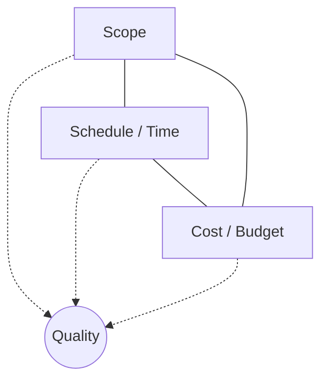

## Project Success Criteria and Constraints

### Definitions

**Success criteria** are the standards or measures used to judge whether a project has achieved its intended objectives. They can be objective (quantifiable metrics) or subjective (stakeholder satisfaction), and are ideally defined and agreed upon during initiation/planning rather than retroactively.

**Constraints** are limiting factors that affect the execution of a project — restrictions on scope, resources, schedule, or other project attributes that the project team must operate within. Constraints define the boundary conditions within which the project team seeks to maximize success.

### The Triple Constraint (and Its Evolution)

The classic model of project constraints is the **Triple Constraint** (also called the "Iron Triangle"): **Scope, Schedule (Time), and Cost**, with **Quality** typically sitting at the center, as changing any one vertex affects the others and impacts quality.

- Increasing **scope** without adjusting schedule or cost typically extends the timeline or increases spend (or degrades quality if neither is adjusted).
- Compressing **schedule** typically requires additional cost (e.g., overtime, more resources) or a reduction in scope/quality.
- Reducing **cost** typically requires reducing scope, extending schedule, or accepting lower quality.

**Modern (PMBOK 7th Edition–aligned) expansion** broadens this to six interrelated constraints, reflecting that quality, risk, and resources are equally binding factors rather than secondary effects:

| Constraint | Description |
| --- | --- |
| Scope | The work required to deliver the product/service/result |
| Schedule | The time allotted to complete the project |
| Budget/Cost | The financial resources allocated |
| Quality | The degree to which deliverables meet requirements and fitness for use |
| Resources | People, equipment, materials, and facilities available |
| Risk | The uncertainty that can positively or negatively affect objectives |

**[Inference]** Different methodologies and organizations continue to use either the three-constraint or six-constraint framing interchangeably in practice; the six-constraint model is the more current PMI framing but the three-constraint "Iron Triangle" remains the more commonly taught mental model for introducing the concept.

### Traditional Success Criteria

Historically, project success was measured almost exclusively against the Iron Triangle:

1. **On time** — completed by or before the planned end date.
2. **On budget** — completed within the approved cost baseline.
3. **Within scope** — delivered the agreed-upon scope without unauthorized reduction or expansion.
4. **To quality standards** — met the defined acceptance criteria and fitness-for-use requirements.

### Expanded/Modern Success Criteria

Contemporary practice recognizes that meeting the Iron Triangle does not guarantee a project is genuinely successful, and vice versa — a project can be late or over budget yet still deliver significant business value. Modern success criteria typically include:

- **Business value/benefits realization** — did the project deliver the intended organizational or customer value (e.g., revenue growth, cost savings, market share)?
- **Stakeholder satisfaction** — are sponsors, customers, and end users satisfied with the outcome, regardless of strict adherence to original baselines?
- **Strategic alignment** — did the project support broader organizational strategy and goals?
- **Sustainability of the outcome** — does the deliverable continue to function/perform after project closure and handoff to operations?
- **Team satisfaction and organizational learning** — did the project build capability, morale, and lessons learned for future work?

| Success Dimension | Traditional Focus | Modern Addition |
| --- | --- | --- |
| Delivery | On time, on budget, in scope | — |
| Output quality | Meets specifications | Meets fitness-for-use and stakeholder expectations |
| Value | — | Realizes intended business benefit |
| Perception | — | Stakeholder and customer satisfaction |
| Organizational impact | — | Strategic alignment, capability building |

### Defining Success Criteria in Practice

Success criteria should be established early, ideally captured in the **project charter** or **business case**, and should be:

- **Specific and measurable** (e.g., "reduce average order processing time by 20%" rather than "improve efficiency").
- **Agreed upon by key stakeholders** — particularly the sponsor, since disagreement about what "success" means is a common root cause of stakeholder conflict at project closure.
- **Distinguished between deliverable acceptance criteria** (does the output meet specifications?) **and project success criteria** (did the overall endeavor achieve its purpose?) — these are related but not identical; a deliverable can pass acceptance criteria while the broader project still fails to achieve intended benefits (e.g., low user adoption).

### Constraint Interactions and Trade-off Analysis

Because constraints are interdependent, project managers must continuously make trade-off decisions. A common technique is asking stakeholders to **rank or prioritize constraints** so the PM knows which to protect and which can flex when conflicts arise.

**Example prioritization exercise:**

| Constraint | Priority (1 = least flexible, 6 = most flexible) |
| --- | --- |
| Quality | 1 (fixed — cannot be compromised, e.g., safety-critical system) |
| Scope | 2 |
| Risk | 3 |
| Schedule | 4 |
| Resources | 5 |
| Cost | 6 (most flexible — additional budget can be requested) |

When a new risk materializes or a change request arrives, the PM references this prioritization to determine which constraint absorbs the impact.

### Constraints Beyond the Core Six

Additional constraints commonly encountered in practice, though not part of the core PMBOK constraint set:

- **Regulatory/compliance constraints** — legal or industry regulations the project must satisfy (e.g., data privacy laws, building codes).
- **Technological constraints** — limitations imposed by existing systems, infrastructure, or available technology.
- **Organizational constraints** — internal policies, approval hierarchies, or cultural norms that limit options.
- **Market/external constraints** — competitive pressures, supplier availability, or macroeconomic conditions.
- **[Unverified]** The extent to which any of these external constraints applies depends entirely on project context and industry; they cannot be generalized as universal to all projects.

### Example: Applying Constraints and Success Criteria to a Real Scenario

**Scenario:** A company launches a project to migrate its customer database to a new cloud platform.

- **Scope constraint:** Must migrate all existing customer records without data loss; scope excludes building new customer-facing features.
- **Schedule constraint:** Must complete before the current on-premises contract expires in 6 months.
- **Cost constraint:** Capped at the approved capital budget of $150,000.
- **Quality constraint:** Zero data-loss tolerance; 99.9% uptime SLA post-migration.
- **Resource constraint:** Limited to 2 dedicated database engineers plus part-time support from the infrastructure team.
- **Risk constraint:** Migration must not disrupt production customer access during business hours.

**Success criteria agreed upon at initiation:**

1. All records migrated with zero data loss (deliverable acceptance criterion).
2. Migration completed within the 6-month window and within $150,000 budget (Iron Triangle criteria).
3. No unplanned downtime during business hours (quality/risk criterion).
4. Customer support ticket volume related to account access does not increase post-migration (business value/benefit criterion).
5. Sponsor and IT operations team formally sign off on handoff (stakeholder satisfaction criterion).

### Common Pitfalls

- **Defining success only in terms of the Iron Triangle** while ignoring benefit realization — a project can hit every schedule/cost/scope target and still be considered a failure if the business value never materializes.
- **Failing to gain explicit stakeholder agreement** on success criteria early, leading to disputes over whether the project "succeeded" at closure.
- **Treating all constraints as equally rigid**, which prevents the PM from making informed trade-offs when conflicts arise.
- **Ignoring the interdependency between constraints** — attempting to change one (e.g., adding scope) without acknowledging the ripple effect on others (schedule, cost, quality).

### Related Topics

- Iron Triangle vs. PMBOK 7th Edition's Expanded Constraint Model
- Business Case Development and Benefits Realization Planning
- Requirements Traceability and Acceptance Criteria
- Schedule Compression Techniques: Fast Tracking and Crashing
- Earned Value Management (EVM) for Tracking Scope/Schedule/Cost Performance
- Stakeholder Analysis and Expectation Management
- Project Charter Development
- Risk Management Planning and Risk Appetite/Tolerance