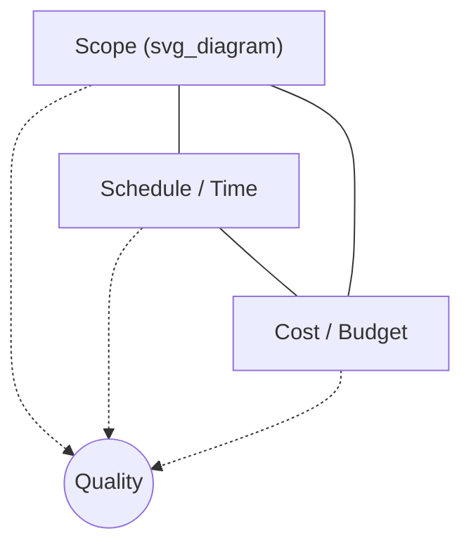

## The Triple Constraint and Iron Triangle

### Definition

The **Triple Constraint**, widely known as the **Iron Triangle**, is a foundational project management model asserting that three core project parameters — **Scope, Schedule (Time), and Cost** — are interdependent, such that a change to any one parameter necessarily affects at least one of the other two. **Quality** is commonly depicted at the center of the triangle, representing the outcome that results from how the three constraints are balanced.

The term "iron" conveys the idea that the triangle is rigid: the three sides cannot be adjusted independently without consequence elsewhere.

### The Three Vertices

#### 1. Scope

- Defines the work required to deliver the project's product, service, or result — including features, functions, and deliverables.
- Scope changes (additions, removals, or clarifications) are the most common trigger for triple-constraint trade-offs; this is often referred to as **scope creep** when uncontrolled.
- Managed through scope definition, the Work Breakdown Structure (WBS), and formal change control.

#### 2. Schedule (Time)

- The timeline required to complete the defined scope, including start/end dates, milestones, and sequencing of activities.
- Constrained by dependencies between activities, resource availability, and external deadlines (e.g., regulatory dates, market windows).
- Managed through activity sequencing, duration estimating, and critical path analysis.

#### 3. Cost (Budget)

- The financial resources allocated to complete the project, including labor, materials, equipment, and contingency reserves.
- Constrained by the approved budget baseline and funding availability/limits.
- Managed through cost estimating, budgeting, and cost control (often via Earned Value Management).

### How the Constraints Interact

| If this changes... | ...schedule impact | ...cost impact | ...quality impact (if schedule/cost held fixed) |
| --- | --- | --- | --- |
| Scope increases | Likely extends | Likely increases | May degrade if unaddressed |
| Scope decreases | May shorten | May decrease | Improves or unaffected |
| Schedule compressed | — | Likely increases (overtime, more resources) | May degrade under pressure |
| Schedule extended | — | May decrease (less overtime) or increase (extended overhead) | May improve |
| Cost/budget reduced | May extend | — | May degrade (fewer resources, cheaper materials) |
| Cost/budget increased | May shorten (crashing) | — | May improve |

**Core principle:** Only two of the three vertices can typically be optimized simultaneously; the third absorbs the consequence. A common informal expression of this is: "Fast, cheap, good — pick two."

### Quality at the Center

Quality is positioned at the center of the triangle rather than as a fourth vertex because it is treated as an **outcome** of how scope, schedule, and cost are managed together, rather than as an independent variable that can be traded off in isolation:

- Adequate scope definition + realistic schedule + sufficient budget → supports achieving quality standards.
- Compressing schedule or cost without adjusting scope tends to place downward pressure on quality (e.g., skipped testing cycles, rushed reviews, cut corners in materials).

### Worked Example

**Scenario:** A website redesign project is baselined at 12 weeks, $40,000, and a defined scope of 15 pages plus a new content management system (CMS) integration.

**Trade-off Case 1 — Scope increases:**

The client requests 5 additional pages mid-project.

- **Without schedule/cost adjustment:** Team must compress design/testing time per page, risking quality (e.g., inconsistent styling, unresolved bugs).
- **With schedule adjustment:** Timeline extends to 14 weeks to accommodate additional pages properly.
- **With cost adjustment:** Additional contractor hours are approved to maintain the original 12-week schedule, increasing budget to $48,000.

**Trade-off Case 2 — Schedule compressed:**

The client needs launch in 8 weeks instead of 12.

- **Cost response:** Adding a second developer to work in parallel (crashing) increases cost to $52,000.
- **Scope response:** Reducing initial scope to 10 pages, deferring the remaining 5 to a Phase 2 project.
- **Quality risk (unmitigated):** If neither cost nor scope changes, the team may cut QA testing time, risking post-launch defects.

### Extended Model: PMBOK 7th Edition's Broader Constraint Set

Contemporary PMI guidance (PMBOK 7th Edition) expands the classic three-sided model into six interrelated project performance domains/constraints, recognizing that **Risk** and **Resources** function as equally binding limiting factors, not secondary effects of the original three:

| Constraint | Relationship to Classic Triangle |
| --- | --- |
| Scope | Original vertex |
| Schedule | Original vertex |
| Cost | Original vertex |
| Quality | Originally center point; now treated as its own constraint |
| Resources | New — people, equipment, materials, facilities |
| Risk | New — uncertainty affecting any of the above |

**[Inference]** This expansion reflects an industry-wide shift toward recognizing that resource availability and risk exposure are just as likely to bind a project's outcome as scope, schedule, or cost alone — though many practitioners and training programs continue to teach and reference the original three-sided "Iron Triangle" as the introductory mental model because of its simplicity and intuitive visual form.

### Using the Triple Constraint for Stakeholder Communication

The model is commonly used as a communication tool with sponsors and stakeholders when negotiating changes:

- When a stakeholder requests a change to one vertex (e.g., "Can we launch two weeks earlier?"), the PM uses the triangle to make explicit which other vertex must flex in response (e.g., "Yes, but that requires either reducing scope by X or adding $Y in resources").
- This reframes trade-off conversations from implicit assumptions ("just make it happen") to explicit, documented decisions.

### Common Misconceptions

- **The Iron Triangle does not mean quality is unimportant** — it means quality is treated as a *consequence* of how the other three are balanced, not an independent lever to pull.
- **"Iron" does not mean the constraints can never be renegotiated** — baselines can be formally changed through integrated change control; "iron" refers to the *interdependency* between the vertices, not to the impossibility of change.
- **The triple constraint is not a complete model of project success** — a project can hit scope, schedule, and cost targets exactly and still fail to deliver business value or stakeholder satisfaction (see broader success-criteria discussions); the Iron Triangle addresses delivery constraints, not overall project success.

### Related Topics

- Project Success Criteria and Constraints (Expanded Six-Constraint Model)
- Scope Creep and Change Control Processes
- Schedule Compression Techniques: Fast Tracking and Crashing
- Earned Value Management (EVM)
- Work Breakdown Structure (WBS) Development
- Quality Assurance vs. Quality Control
- Risk Management Planning
- Resource Management and Resource Leveling