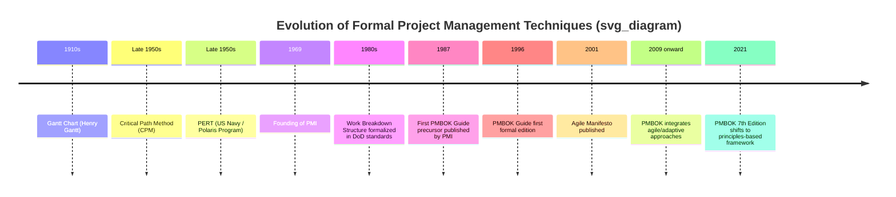

## History and Evolution of Project Management

### Overview

Project management as an *informal practice* is as old as large-scale human coordination — construction of ancient monuments, infrastructure, and military campaigns all required planning, resource allocation, and sequencing of work. Project management as a *formal discipline*, with codified methodologies, tools, and professional bodies, is a 20th-century development, emerging primarily from engineering, construction, and defense industries.

### Pre-Modern Era: Informal Project Management (Antiquity–19th Century)

Large-scale endeavors throughout history exhibited project-management characteristics — defined objectives, resource coordination, and sequenced activities — without any formal methodology or terminology.

- **[Unverified]** Historians and management theorists frequently cite ancient large-scale construction projects (pyramids, aqueducts, cathedrals) as early evidence of coordinated labor management, logistics planning, and phased construction, though the specific management techniques used are inferred from archaeological and historical evidence rather than documented in a project-management framework, since no such formal framework existed at the time.
- Military campaigns throughout history required logistical planning, supply chain coordination, and timeline sequencing — functionally similar to modern project scheduling and resource management, though not formalized as such.
- **[Unverified]** Some historical accounts credit large 19th-century infrastructure projects (railroads, canals) with early uses of organizational charts and formalized reporting structures, but these predate any recognized "project management" terminology or discipline.

### Early 20th Century: Scientific Management and Foundational Tools (1900s–1940s)

This period established many of the analytical tools still central to project management today, driven largely by industrial engineering and manufacturing efficiency movements.

- **Frederick Taylor** (early 1900s) developed the principles of **Scientific Management**, applying systematic analysis to workflows and labor efficiency — a conceptual precursor to breaking work into measurable, manageable units (a foundation later reflected in WBS thinking).
- **Henry Gantt** (1910s) developed the **Gantt chart**, a bar-chart visualization of a schedule showing start/end dates of activities against a timeline — still one of the most widely used scheduling tools in project management today.
- **[Unverified]** Various large government and military projects during and between the World Wars are commonly cited in project management literature as early large-scale applications of coordinated scheduling and resource planning, though comprehensive primary documentation specifically framing them as "project management" case studies is limited.

### Mid-20th Century: Formalization of Techniques (1950s–1960s)

This era saw the emergence of the mathematical and network-based scheduling techniques that became core to formal project management methodology, largely driven by U.S. defense, aerospace, and chemical industry projects.

- **Critical Path Method (CPM)** was developed in the late 1950s (commonly associated with DuPont and Remington Rand) as a technique for determining the longest sequence of dependent activities (the critical path) that determines the minimum project duration.
- **Program Evaluation and Review Technique (PERT)** was developed in the late 1950s by the U.S. Navy in connection with the Polaris missile submarine program, introducing probabilistic duration estimation (optimistic, pessimistic, most likely estimates) for activities with uncertain durations.
- Large aerospace and defense programs of this era drove demand for structured coordination across multiple contractors, subsystems, and long timelines — conditions that pushed organizations toward more formalized planning and control techniques.
- **[Inference]** The specific competitive and organizational pressures of the Cold War-era space race and defense buildup are broadly credited by project management historians as major accelerants of formal PM technique development during this period, though attributing precise causal weight to any single program is inherently an interpretive historical judgment rather than a directly measurable fact.

### Professionalization: Founding of PMI and Standardization (1960s–1990s)

- The **Project Management Institute (PMI)** was founded in 1969 in the United States, established to promote the profession of project management and develop standardized practices, certifications, and a body of knowledge.
- Through the 1970s–1980s, PMI and related bodies developed standardized terminology, processes, and ethical standards for the emerging profession.
- The **PMBOK Guide (A Guide to the Project Management Body of Knowledge)** was first published by PMI, consolidating generally recognized good practices into a structured reference; it has since gone through multiple editions, each reflecting evolving industry practice.
- **PRINCE2** (PRojects IN Controlled Environments), a process-based project management methodology, originated in the UK government sector (evolving from an earlier method called PROMPT) and became widely adopted, particularly in UK and European public-sector and IT projects.
- Certifications such as PMI's **Project Management Professional (PMP)** emerged to formalize professional competency standards for practitioners.

### Late 20th Century: Expansion Beyond Engineering/Construction (1980s–1990s)

- Project management methodologies, originally concentrated in construction, engineering, and defense, expanded into information technology, as software development projects grew in scale and complexity.
- The rise of enterprise software and large-scale IT implementations (ERP systems, large custom software builds) drove adoption of formal project management practices within the IT sector, often applying construction-era predictive/waterfall approaches to software.
- **[Inference]** The application of predominantly predictive, sequential methodologies (originally suited to construction, where design changes are extremely costly once building begins) to software development is widely cited by agile proponents as a contributing factor to high rates of IT project difficulty in this era, though the causal relationship is a matter of ongoing debate and interpretation rather than an uncontested fact.

### The Agile Turn (Late 1990s–2000s)

Frustration with rigid, sequential (waterfall) approaches — particularly in software development, where requirements often evolve — led to the emergence of iterative and adaptive methodologies.

- Iterative software development approaches (including early forms of what became known as Scrum, and other lightweight methods) emerged through the 1990s as alternatives to heavyweight, documentation-intensive predictive processes.
- The **Agile Manifesto** was published in 2001 by a group of software practitioners, articulating four core values and twelve principles emphasizing individuals and interactions, working software, customer collaboration, and responding to change over rigid plans and processes.
- Agile frameworks such as **Scrum**, **Extreme Programming (XP)**, and later **Kanban** (adapted from Toyota's lean manufacturing system) gained widespread adoption, particularly in software but eventually spreading to other industries.
- **[Inference]** The Agile Manifesto is broadly regarded by the software industry as one of the most influential documents in modern project/product delivery practice, though the degree to which any single organization has "fully adopted" agile principles versus applying a hybrid or nominal version of agile terminology varies considerably and is difficult to quantify definitively across the industry.

### 21st Century: Integration, Hybrid Approaches, and PMBOK Evolution

- PMI progressively incorporated agile and adaptive concepts into its standards, recognizing that predictive methodologies alone did not fit all project contexts.
- **PMBOK Guide 6th Edition** (2017) included an agile practice guide as a companion, reflecting formal recognition of agile approaches alongside traditional predictive methods within PMI's standards.
- **PMBOK Guide 7th Edition** (2021) marked a significant structural shift — moving away from the process-group/knowledge-area structure of prior editions toward a **principles-based framework** organized around performance domains, explicitly designed to be agnostic to delivery approach (predictive, agile, or hybrid).
- **Hybrid methodologies**, blending predictive and adaptive elements based on the certainty/uncertainty profile of different parts of a project, became increasingly normalized as organizations recognized that pure predictive or pure agile approaches often didn't fit the entirety of complex, mixed-certainty initiatives.
- Growth of specialized certifications and frameworks continued, including agile-specific certifications (e.g., PMI-ACP, Certified ScrumMaster) alongside traditional PMP certification, and framework proliferation for scaling agile across large organizations (e.g., SAFe, LeSS).

### Key Organizations and Standards Timeline Summary

| Era | Key Development | Primary Driver |
| --- | --- | --- |
| Antiquity–19th c. | Informal coordination of large endeavors | Construction, military logistics |
| Early 1900s | Scientific Management, Gantt Chart | Industrial/manufacturing efficiency |
| Late 1950s | CPM, PERT | Defense/aerospace, chemical engineering |
| 1969 | PMI founded | Professionalization |
| 1980s–1996 | PMBOK Guide developed and formalized | Standardization across industries |
| 1980s–1990s | PM adoption expands into IT | Software/enterprise system complexity |
| 2001 | Agile Manifesto | Software development iteration needs |
| 2009–2017 | PMBOK integrates agile guidance | Industry-wide hybrid adoption |
| 2021 | PMBOK 7th Edition — principles-based | Delivery-approach-agnostic standardization |

### Common Misconceptions

- **Project management is not a purely modern invention** — the *discipline and terminology* are 20th-century developments, but the underlying *practice* of coordinating complex work is ancient; conflating the two leads to overstated or understated historical claims depending on which is meant.
- **Agile did not replace predictive/waterfall project management** — both remain widely used, often within the same organization for different types of work (hybrid approaches), and the choice between them is a tailoring decision based on project characteristics, not a strict generational replacement.
- **PMBOK is not the only project management standard** — PRINCE2, ISO 21500/21502, and numerous agile frameworks (Scrum Guide, SAFe) represent parallel or complementary bodies of standardized practice with different origins and governance bodies.

### Related Topics

- Predictive vs. Agile vs. Hybrid Life Cycles
- PMBOK Guide Editions and Structural Evolution
- Critical Path Method (CPM) and PERT Analysis
- The Agile Manifesto: Values and Principles
- PRINCE2 Methodology Overview
- PMI Certifications: PMP, PMI-ACP, and Others
- Scaling Agile Frameworks (SAFe, LeSS, Scrum@Scale)
- ISO 21500/21502 Project Management Standards