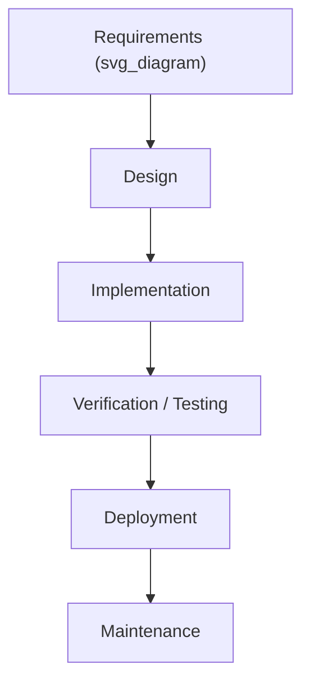
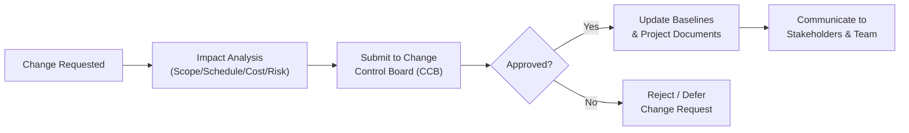

## Predictive and Waterfall Approaches

### Definition

A **predictive approach** (also called a plan-driven approach) is a project delivery method in which the project scope, schedule, and cost are determined in as much detail as possible early in the project life cycle. Any changes to scope are carefully managed through formal change control. **Waterfall** is the most widely recognized predictive model, characterized by sequential, non-overlapping phases where each phase must be substantially complete before the next begins.

### Core Characteristics

- **Upfront, detailed planning** — requirements, design specifications, budgets, and schedules are defined comprehensively before execution begins.
- **Sequential phase progression** — phases (e.g., Requirements → Design → Implementation → Verification → Maintenance) flow in a single direction, resembling a waterfall.
- **Formal change control** — changes to baselined scope, schedule, or cost require documented change requests and approval through a governance process (e.g., a Change Control Board).
- **Deliverable-based phase gates** — each phase concludes with a review/approval milestone before the next phase is authorized to begin.
- **Single, end-of-project delivery** — the complete product or result is typically delivered once, at or near the end of the life cycle, rather than incrementally.

### The Classic Waterfall Model (Software Context)

The waterfall model, as originally articulated for software engineering, is often depicted as five to seven sequential phases:

1. **Requirements Analysis** — gather and document all functional and non-functional requirements; output is typically a requirements specification document, formally reviewed and signed off.
2. **System/Software Design** — translate requirements into architecture, data models, and detailed design specifications.
3. **Implementation (Construction)** — build the product according to the approved design (coding, manufacturing, construction, etc., depending on domain).
4. **Verification/Testing** — validate the built product against the original requirements (unit testing, integration testing, user acceptance testing).
5. **Deployment** — release the completed product into production or hand it over to the customer/operations.
6. **Maintenance** — ongoing support, bug fixes, and minor enhancements after delivery (this phase often transitions into operational work rather than remaining part of the project).

### Origin and Context

- The waterfall model is commonly attributed to a 1970 paper by Winston Royce describing sequential software development phases — **[Unverified]** notably, Royce's original paper is frequently cited as actually advocating for iterative feedback loops between phases and cautioning against a purely rigid, one-pass sequential model; the strict, non-iterative interpretation of "waterfall" as widely practiced is generally understood to be a later industry simplification rather than Royce's original recommendation, though this historical nuance is a matter of some debate among software engineering historians.
- Waterfall's sequential structure closely mirrors traditional engineering and construction practice, where physical build phases (foundation, framing, electrical, finishing) inherently must occur in a fixed order and design changes become prohibitively expensive once construction has progressed.

### When Predictive/Waterfall Is Well Suited

- **Requirements are stable, well-understood, and unlikely to change** — e.g., regulatory compliance projects with fixed legal requirements.
- **The technology and solution approach are proven** — low technical uncertainty reduces the risk of costly late-stage design changes.
- **Physical/construction-based deliverables** where sequential dependencies are inherent (e.g., a building's foundation must be completed before framing).
- **Regulatory, contractual, or compliance environments** requiring extensive upfront documentation and formal sign-off at each stage (e.g., government contracts, pharmaceutical manufacturing, aerospace).
- **Fixed-price contracts** where the customer requires a firm scope, schedule, and cost commitment before work begins.

### When Predictive/Waterfall Is Poorly Suited

- **High requirement uncertainty or rapidly evolving customer needs** — waterfall's formal change control makes it costly and slow to accommodate frequent changes.
- **Novel or experimental technology** — where the solution approach itself may need to be discovered iteratively.
- **Projects where early stakeholder feedback on partial deliverables is valuable** — waterfall typically delivers the complete product only near the end, delaying feedback until change is most expensive.
- **Long-duration projects in fast-changing markets** — by the time a multi-year waterfall project completes, market conditions or requirements may have shifted substantially.

### Advantages

| Advantage | Explanation |
| --- | --- |
| Predictability | Clear upfront scope/schedule/cost baseline supports budgeting and contractual commitments |
| Clear documentation | Extensive documentation at each phase supports audit trails, compliance, and knowledge transfer |
| Simplicity of management | Sequential structure is straightforward to plan, track, and report against (e.g., simple Gantt charts) |
| Defined milestones | Phase gates provide clear checkpoints for governance and go/no-go decisions |
| Well suited to fixed-price contracting | Detailed upfront scope supports firm contractual pricing |

### Disadvantages

| Disadvantage | Explanation |
| --- | --- |
| Inflexibility to change | Formal change control makes adapting to new information slow and costly |
| Late feedback | Customers/users often don't see a working product until late in the life cycle, risking late discovery of misalignment |
| High cost of late-stage errors | Defects or misunderstood requirements found during testing/deployment are far more expensive to fix than if caught early |
| Assumes requirements are fully knowable upfront | Often unrealistic for complex, novel, or user-facing products |
| Risk concentration | Integration and testing risk is concentrated near the end of the project, when schedule/budget slack is lowest |

### Predictive Approach Beyond Software: Construction Example

Predictive/waterfall thinking originated largely from and remains dominant in construction and engineering:

1. **Feasibility & Site Assessment** — determine viability, conduct surveys.
2. **Design & Engineering** — architectural drawings, structural engineering, permitting.
3. **Procurement** — secure materials, contractors, and subcontractors based on finalized design.
4. **Construction** — sequential physical build (foundation → structure → systems → finishes).
5. **Inspection & Commissioning** — verify compliance with codes and specifications.
6. **Handover** — transfer completed structure to the owner/operations.

In this context, sequential phasing isn't merely a methodological choice — it reflects physical necessity (you cannot install a roof before erecting walls).

### Formal Change Control in Predictive Projects

Because scope, schedule, and cost are baselined early, any modification flows through a structured process:

### Predictive vs. Agile/Adaptive — Quick Comparison

| Dimension | Predictive/Waterfall | Agile/Adaptive |
| --- | --- | --- |
| Requirements | Fixed early, detailed | Elaborated continuously |
| Change tolerance | Low — formal control | High — expected and embraced |
| Delivery | Single delivery near end | Frequent incremental delivery |
| Customer involvement | Concentrated at start (requirements) and end (acceptance) | Continuous throughout |
| Risk exposure timing | Concentrated late (integration/testing) | Distributed early and often |
| Best fit | Stable, well-understood scope | High uncertainty, evolving needs |

### Common Misconceptions

- **Waterfall does not mean "no planning for change" was ever intended by its originators** — as noted, the historical origin of the model reportedly included feedback loops; the rigid, one-directional interpretation practiced in much of the industry is a later simplification.
- **Waterfall is not obsolete** — it remains the appropriate and dominant approach in industries with inherent sequential/physical dependencies (construction, manufacturing) or strict regulatory documentation requirements, even as software increasingly favors agile/hybrid approaches.
- **"Predictive" and "waterfall" are related but not perfectly synonymous** — waterfall is the most common and historically foundational example of a predictive life cycle, but other predictive variations exist (e.g., predictive life cycles with defined, non-waterfall phase structures).

### Related Topics

- Project Life Cycle Phases (Predictive, Iterative, Incremental, Adaptive, Hybrid)
- Work Breakdown Structure (WBS) Development
- Integrated Change Control Process
- Critical Path Method (CPM) Scheduling
- Requirements Elicitation and Traceability Matrices
- Hybrid Project Management Approaches
- Agile and Scrum Fundamentals
- Fixed-Price vs. Time-and-Materials Contracting