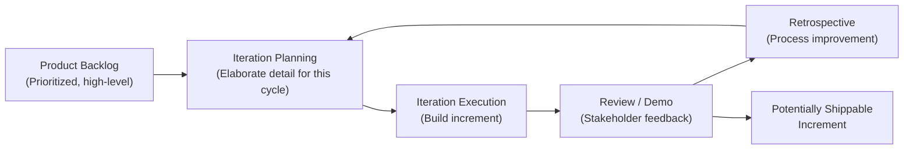

## Agile and Adaptive Approaches

### Definition

An **adaptive approach** (commonly called Agile) is a project delivery method in which scope is developed and elaborated iteratively rather than being fully defined upfront. Detailed planning occurs incrementally, iteration by iteration, allowing the project team to respond rapidly to changing requirements, emerging risks, and stakeholder feedback throughout the life cycle. **Agile** is an umbrella term for a family of adaptive frameworks and practices sharing common values and principles, most influentially codified in the 2001 **Agile Manifesto**.

### The Agile Manifesto — Values and Principles

The Agile Manifesto articulates four core values, expressed as relative preferences (the items on the right retain value, but those on the left are prioritized):

1. **Individuals and interactions** over processes and tools
2. **Working software** (or working deliverables) over comprehensive documentation
3. **Customer collaboration** over contract negotiation
4. **Responding to change** over following a plan

These values are supported by twelve underlying principles, including early and continuous delivery of valuable output, welcoming changing requirements even late in development, frequent delivery of working increments, close daily collaboration between business and delivery teams, sustainable pace, technical excellence, simplicity, self-organizing teams, and regular reflection/adjustment (retrospectives).

### Core Characteristics of Adaptive Approaches

- **Iterative and incremental delivery** — the product is built and delivered in short cycles (iterations/sprints), with each cycle producing a potentially usable increment.
- **Progressive elaboration of requirements** — a high-level vision/backlog is defined upfront, but detailed requirements for each iteration are elaborated just before that iteration begins.
- **Continuous stakeholder engagement** — customers/product owners are involved throughout, not just at the start and end.
- **Embracing change** — change is treated as expected and valuable (a source of learning and improved fit-for-purpose), rather than something to be minimized through formal change control.
- **Self-organizing, cross-functional teams** — teams typically have the authority and skill mix to plan and execute their own work with minimal external direction on *how* to do it.
- **Frequent inspection and adaptation** — regular reviews and retrospectives drive continuous improvement of both the product and the team's process.

### Major Agile Frameworks

#### Scrum

- The most widely adopted agile framework, organizing work into fixed-length iterations called **Sprints** (commonly 1–4 weeks).
- Defines three core roles: **Product Owner** (owns and prioritizes the backlog, represents stakeholder/business value), **Scrum Master** (facilitates the process, removes impediments, coaches the team), and the **Development Team** (self-organizing group that delivers the increment).
- Core events: **Sprint Planning**, **Daily Scrum** (daily stand-up), **Sprint Review** (demo to stakeholders), and **Sprint Retrospective** (team process improvement).
- Core artifacts: **Product Backlog** (prioritized list of all desired work), **Sprint Backlog** (subset selected for the current sprint), and the **Increment** (the sum of completed backlog items, meeting the team's Definition of Done).

#### Kanban

- Adapted from Toyota's lean manufacturing system; visualizes work using a **Kanban board** with columns representing workflow stages (e.g., To Do, In Progress, Review, Done).
- Emphasizes **limiting work in progress (WIP limits)** to reduce multitasking and expose bottlenecks.
- Does not mandate fixed-length iterations; work flows continuously and is pulled as capacity allows, making it well suited to support/maintenance work with unpredictable, continuous inflow.
- Focuses on measuring and optimizing **flow metrics** (cycle time, lead time, throughput).

#### Extreme Programming (XP)

- An agile framework focused specifically on software engineering practices that support high-quality, rapidly adaptable code, including **pair programming**, **test-driven development (TDD)**, **continuous integration**, and **collective code ownership**.
- Complements process frameworks like Scrum by prescribing specific technical practices rather than solely team/process structure.

#### Lean

- Derived from lean manufacturing principles (originally Toyota Production System); focuses on maximizing customer value while minimizing waste (non-value-adding activities).
- Core concepts include identifying and eliminating the seven forms of waste, optimizing the whole value stream rather than local steps, and empowering teams to make decisions close to the work.

| Framework | Iteration Structure | Key Focus | Common Domain |
| --- | --- | --- | --- |
| Scrum | Fixed-length sprints | Roles, events, and artifacts for iterative delivery | Software, product development |
| Kanban | Continuous flow (no fixed iterations) | Visualizing work, limiting WIP, flow efficiency | Support/maintenance, ops, mixed workflows |
| XP | Fixed-length iterations | Engineering/technical practices for code quality | Software engineering specifically |
| Lean | Value-stream based | Waste elimination, value-stream optimization | Manufacturing origin; broadly applicable |

### When Adaptive Approaches Are Well Suited

- **High requirements uncertainty** — when the customer/business cannot fully specify what they need upfront, or expects requirements to evolve as the product is used.
- **Rapidly changing markets or technology** — where responsiveness to change provides competitive advantage over rigid, long-cycle planning.
- **Projects benefiting from early and frequent stakeholder feedback** — particularly user-facing digital products, where usability and fit are hard to assess without a working product to react to.
- **Complex, novel problem domains** — where the solution approach itself must be discovered iteratively (high technical uncertainty).
- **Teams that can be co-located or tightly collaborative**, and organizations willing to grant teams autonomy over how work is executed.

### When Adaptive Approaches Are Poorly Suited

- **Fixed-price, fixed-scope contracts requiring firm upfront commitments** — agile's evolving-scope nature conflicts with contractual structures demanding fully defined deliverables before work begins.
- **Highly regulated environments requiring extensive upfront documentation and formal sign-off at each stage** — though many regulated industries now use hybrid approaches to reconcile agile delivery with compliance documentation needs.
- **Physical/construction-based projects with inherent sequential dependencies** — pouring a foundation cannot be "iterated" in the same sense as software features.
- **Distributed or low-collaboration environments** where frequent, close interaction between business and delivery teams is difficult to sustain.
- **[Inference]** Organizations with rigid governance structures, fixed annual budgeting cycles, or highly hierarchical decision-making commonly encounter friction adopting agile approaches, as agile assumes rolling/adaptive planning and delegated team authority that may conflict with traditional organizational control mechanisms — the degree of friction is context-dependent and not universal.

### Advantages

| Advantage | Explanation |
| --- | --- |
| Rapid feedback loops | Frequent delivery surfaces misalignment early, when it's cheapest to correct |
| Flexibility | Formal change control is replaced by built-in mechanisms to reprioritize the backlog each iteration |
| Continuous value delivery | Incremental delivery means usable value can reach customers before the full scope is complete |
| Improved team engagement | Self-organization and regular retrospectives often increase team ownership and morale |
| Reduced risk concentration | Risk is distributed across iterations rather than concentrated at a single late-stage integration/testing phase |

### Disadvantages

| Disadvantage | Explanation |
| --- | --- |
| Harder to predict total cost/schedule upfront | Evolving scope makes firm long-range commitments difficult |
| Requires high stakeholder availability | Continuous engagement (e.g., a dedicated Product Owner) demands significant time commitment from business stakeholders |
| Can struggle with fixed external deadlines/regulatory gates | Formal, documentation-heavy compliance processes may not map cleanly onto iterative delivery |
| Documentation may be lighter | Can create challenges for audit, knowledge transfer, or regulatory environments requiring detailed records |
| Requires cultural/organizational alignment | Agile team-level practices can be undermined by surrounding organizational structures that remain rigidly hierarchical or predictive |

### Example: Scrum Applied to a Product Feature

**Scenario:** A team is building a new customer-facing mobile app feature (in-app messaging).

1. **Product Backlog:** Product Owner creates and prioritizes backlog items — "As a user, I want to send a text message," "As a user, I want to see read receipts," "As a user, I want to send images."
2. **Sprint Planning (2-week sprint):** Team selects the highest-priority items it can realistically complete: basic text messaging and message history.
3. **Daily Scrum:** Team meets daily (15 minutes) to sync on progress and surface blockers.
4. **Sprint Execution:** Developers build, test, and integrate the selected features throughout the sprint.
5. **Sprint Review:** Team demonstrates the working messaging feature to stakeholders; feedback is gathered (e.g., "Can we add typing indicators?").
6. **Sprint Retrospective:** Team reflects on what went well/poorly in the sprint process itself (e.g., "Code reviews took too long — let's set a 24-hour SLA").
7. **Next Sprint:** Backlog is re-prioritized based on feedback (typing indicators may be added), and the cycle repeats.

### Adaptive Approaches Beyond Software

While agile originated in and remains most associated with software development, adaptive principles have been applied to marketing campaigns (iterative A/B testing and messaging refinement), product design (rapid prototyping cycles), and even some hardware/manufacturing contexts (though physical constraints limit how iteratively hardware can be built compared to software).

### Common Misconceptions

- **"Agile" is not a single defined methodology** — it is a set of values and principles (per the Agile Manifesto) implemented through varied frameworks (Scrum, Kanban, XP, and others), each with different specific practices.
- **Agile does not mean "no planning"** — planning still occurs, but it happens continuously and incrementally (rolling wave/progressive elaboration) rather than comprehensively upfront.
- **Agile does not mean no documentation** — the Manifesto values working software *over* comprehensive documentation, not the complete absence of documentation; necessary documentation is still produced, but is not treated as the primary measure of progress.
- **Being agile is not the same as merely relabeling existing practices with agile terminology** ("watermelon agile" or "agile-in-name-only") — genuine adoption requires the underlying cultural and structural shifts (team autonomy, stakeholder engagement, iterative delivery), not just adopting sprint terminology on top of an unchanged predictive process.

### Related Topics

- Scrum Framework: Roles, Events, and Artifacts in Detail
- Kanban and Flow-Based Work Management
- Hybrid Project Management Approaches
- Scaling Agile Frameworks (SAFe, LeSS, Scrum@Scale)
- Product Backlog Management and Prioritization Techniques
- Definition of Done and Acceptance Criteria in Agile
- Servant Leadership and the Scrum Master Role
- Predictive and Waterfall Approaches (Comparative Reference)