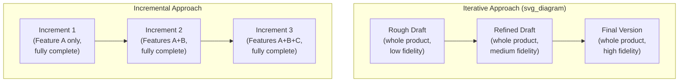
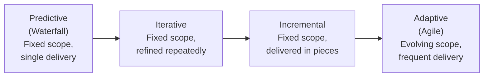

## Iterative and Incremental Approaches

### Definitions

**Iterative** and **incremental** are two distinct — though frequently paired — development life cycle approaches that sit between purely predictive (waterfall) and purely adaptive (agile) approaches on the delivery-approach spectrum. They are often combined in practice ("iterative and incremental development," or IID), but each addresses a different problem:

- **Iterative approach:** The project scope is generally determined early in the life cycle, but time and cost estimates are routinely modified as the team's understanding of the product deepens. The product is developed through repeated cycles (iterations), with each cycle *refining and adding detail* to the same overall deliverable rather than producing separate usable pieces.
- **Incremental approach:** The deliverable is produced through a series of iterations that successively add functionality within a predetermined time frame. Each increment adds a discrete, usable piece of functionality, and the deliverable is considered complete only after the final increment — but *earlier increments can be usable/deployable on their own* before the full scope is finished.

### Core Distinction: Refining vs. Adding

The clearest way to distinguish the two is to ask: *does each cycle refine the whole, or does it add a new piece to the whole?*

- **Iterative example — a portrait painting:** The artist sketches the whole face roughly first, then repeatedly passes over the entire canvas adding shading, detail, and refinement. At every stage, the *entire* portrait exists, just at increasing levels of fidelity. It would not make sense to "deliver" the rough sketch as a finished product.
- **Incremental example — a house built room by room:** The kitchen is fully built and usable first, then the living room is fully built and added, then the bedroom. Each increment is complete and independently usable, and the final "product" is simply the accumulation of all increments.

### Core Characteristics

**Iterative:**

- Scope is largely fixed early; the *quality/fidelity* of the understanding and the deliverable improves iteration by iteration.
- Well suited when the overall shape of the final product is understood, but details, requirements clarity, or design fidelity need repeated passes to get right.
- Feedback loops are used primarily to refine and correct the existing (whole) deliverable, not to decide what to build next.

**Incremental:**

- Scope is decomposed into a sequence of self-contained, deliverable functional pieces upfront (or in early planning).
- Each increment is fully developed, tested, and (often) deployable/usable before the next increment begins.
- Value can be realized progressively — stakeholders may start using increment 1 while increment 2 is still being built.

| Dimension | Iterative | Incremental |
| --- | --- | --- |
| What changes each cycle | Fidelity/refinement of the whole | Addition of new functional pieces |
| Is each cycle's output usable alone? | Often not (may be a rough/partial version of the whole) | Typically yes (a complete functional slice) |
| Scope definition timing | Early, revisited for detail as understanding grows | Early, decomposed into a planned sequence of pieces |
| Primary purpose of repetition | Improve accuracy/quality/understanding | Deliver value progressively while building toward full scope |
| Common domain examples | Prototyping, design refinement, research & development | Modular software releases, phased product rollouts |

### Where They Sit on the Life Cycle Spectrum

Relative to the broader family of project life cycles, iterative and incremental approaches represent a middle ground between rigid predictive (waterfall) approaches and fully adaptive (agile) approaches:

**[Inference]** This spectrum is a commonly used teaching device (as reflected in PMI's Agile Practice Guide and related PM literature) to illustrate that delivery approaches exist on a continuum rather than as four rigidly separate categories; many real-world methodologies (including Scrum) blend iterative and incremental characteristics simultaneously rather than falling cleanly into just one bucket.

### Iterative and Incremental Combined (IID)

In practice, most modern agile frameworks (notably Scrum) are **both** iterative and incremental simultaneously:

- **Incremental** because each sprint typically produces a working, potentially shippable increment of functionality.
- **Iterative** because the product backlog, requirements understanding, and even prior increments are revisited and refined based on feedback from each sprint review.

This combination is often referred to as **Iterative and Incremental Development (IID)**, and is considered a foundational underpinning of most modern agile practice rather than a separate, competing methodology.

### Worked Example: Building an E-Commerce Platform

**Pure Incremental Approach:**

1. **Increment 1:** Product catalog browsing (fully functional, deployed).
2. **Increment 2:** Shopping cart functionality added (fully functional, deployed alongside Increment 1).
3. **Increment 3:** Checkout and payment processing added (fully functional, completing the core purchase flow).
4. **Increment 4:** User reviews and ratings added.

Each increment is a complete, usable capability; customers could technically browse and use the catalog (Increment 1) months before checkout exists.

**Pure Iterative Approach (applied to the same platform's homepage design):**

1. **Iteration 1:** Rough wireframe of the entire homepage layout — low fidelity, all sections present but undetailed.
2. **Iteration 2:** Visual design pass — colors, typography, and imagery applied across the entire (still-rough) layout.
3. **Iteration 3:** Interaction design pass — hover states, animations, and responsive behavior refined across the entire page.
4. **Iteration 4:** Final polish — accessibility review, performance optimization, and content finalization across the entire page.

At every stage, the *entire* homepage exists in some form; there's no meaningful way to "ship" only the wireframe as a usable deliverable.

### When Iterative Approaches Are Well Suited

- **Design and creative work** where quality emerges through successive refinement (prototyping, UX/UI design, architectural design).
- **Research and development** where understanding of the problem deepens progressively and the "final form" of the solution isn't knowable in a single pass.
- **Situations requiring repeated stakeholder review of the whole** before any part is considered final (e.g., a legal document going through successive redlines).

### When Incremental Approaches Are Well Suited

- **Modular products with clearly separable functional pieces** that can independently provide value (common in software, phased infrastructure rollouts).
- **Situations where early partial value delivery is important** to stakeholders or the business (e.g., launching an MVP feature set before the full product is complete).
- **Risk reduction through early validation** — releasing an early increment allows the organization to validate market/user response before committing to build out the full scope.

### Advantages and Disadvantages Summary

| Aspect | Iterative | Incremental |
| --- | --- | --- |
| **Advantage** | Allows quality/understanding to improve without needing full scope decomposition upfront | Delivers real value progressively; reduces risk by validating pieces early |
| **Advantage** | Well suited to work where "good enough" checkpoints matter more than usable output at each stage | Stakeholders can start using/benefiting from early increments |
| **Disadvantage** | Intermediate outputs are often not usable/deployable, limiting early value realization | Requires the ability to cleanly decompose scope into independently valuable, self-contained pieces — not all products decompose this way |
| **Disadvantage** | Can be harder to predict how many iterations will be needed to reach acceptable quality | Later increments may require rework if earlier architectural decisions don't scale to accommodate them |

### Common Misconceptions

- **Iterative and incremental are not synonyms**, despite frequently being used together or even interchangeably in casual conversation — the distinguishing question is always whether a given cycle *refines the whole* (iterative) or *adds a usable piece* (incremental).
- **Agile is not simply "incremental" or simply "iterative"** — most agile frameworks intentionally combine both characteristics (IID), and treating agile as purely one or the other misses how the two mechanisms work together to enable both quality refinement and progressive value delivery.
- **Neither approach requires evolving/unclear scope** the way adaptive (agile) approaches do — both iterative and incremental approaches typically start with a scope that is reasonably well understood upfront; what varies is *how* that scope is built and delivered, not whether it changes.

### Related Topics

- Project Life Cycle Phases (Predictive, Iterative, Incremental, Adaptive, Hybrid)
- Agile and Adaptive Approaches
- Minimum Viable Product (MVP) and Progressive Value Delivery
- Scrum Framework: Roles, Events, and Artifacts
- Prototyping Techniques in Product Design
- Rolling Wave Planning (Progressive Elaboration)
- Hybrid Project Management Approaches
- Release Planning and Phased Rollout Strategies