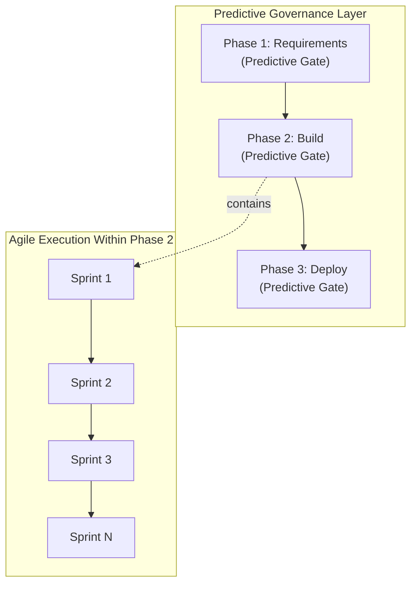
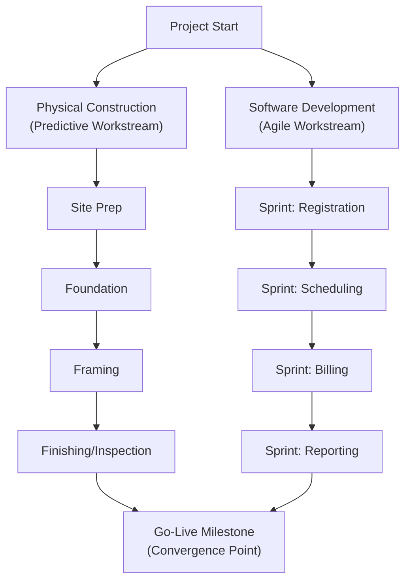

## Hybrid Methodology Models

### Definition

A **hybrid methodology** combines elements of predictive (plan-driven/waterfall) and adaptive (agile) life cycles within a single project, applying each approach to the portions of the work for which it is best suited. Rather than treating predictive and agile as mutually exclusive, hybrid models recognize that different components of a project can carry different levels of certainty, risk, and change tolerance — and tailor the delivery approach component by component.

### Why Hybrid Approaches Emerged

- Many real-world projects contain a mix of well-understood, low-uncertainty elements (e.g., regulatory filings, infrastructure procurement, hardware manufacturing) alongside high-uncertainty, evolving elements (e.g., software feature development, UX design).
- Pure predictive approaches struggle to accommodate the evolving elements without costly formal change control; pure agile approaches struggle to satisfy the firm milestone, budget, and compliance commitments the predictive elements require.
- **[Inference]** Hybrid approaches are widely understood in the project management community as a pragmatic response to this mismatch — allowing organizations to gain agile's responsiveness where uncertainty is high while preserving predictive rigor where uncertainty is low — though the specific blend used varies enormously by organization and is typically the result of tailoring judgment rather than a single prescribed formula.
- PMI's PMBOK Guide (6th Edition onward) and its companion Agile Practice Guide formally acknowledged hybrid approaches as a legitimate, common category alongside pure predictive and pure agile, reflecting industry practice rather than introducing a new concept.

### Common Hybrid Patterns

#### 1. Predictive Overall Structure with Agile Execution Within Phases

- The overall project is governed by a predictive framework (phase gates, milestone-based funding, formal governance reporting), but the execution work within a given phase (e.g., "Build") is managed using Scrum sprints internally.
- Example: A large government IT modernization project has predictive-style contractual milestones and budget approval gates, but the development team executes each phase's work in two-week sprints internally.

#### 2. Agile Overall Structure with Predictive Elements for Specific Deliverables

- The project is primarily managed with agile ceremonies and iterative delivery, but certain fixed, high-certainty components (e.g., a hardware procurement contract, a regulatory filing with a fixed submission format) are managed predictively and treated as inputs/dependencies to the agile backlog.
- Example: A product development team runs sprints for software features, while a parallel predictive workstream manages the fixed-scope certification testing required before launch.

#### 3. Phase-Based Hybrid (Sequential Blend)

- Different life cycle phases of the same project use different approaches based on the certainty profile of that phase.
- Example: Requirements discovery is run iteratively/adaptively (since needs are unclear), design and construction proceed predictively (once requirements stabilize and physical dependencies dominate), and final integration testing uses iterative refinement cycles.

#### 4. Component-Based Hybrid (Parallel Blend)

- Different components or workstreams of the same project run concurrently under different approaches based on each component's own risk/uncertainty profile.
- Example: In a new product launch, the manufacturing/supply-chain workstream runs predictively (fixed lead times, contracts, and specifications), while the marketing and digital-experience workstream runs using Scrum (rapid iteration on campaign messaging and website features).

| Hybrid Pattern | Structure | Best Fit |
| --- | --- | --- |
| Predictive-wrapped agile | Predictive milestones/gates at the macro level; agile sprints within phases | Regulated/contractual environments needing firm milestones plus flexible execution |
| Agile-wrapped predictive | Agile backlog/ceremonies overall; fixed predictive elements as backlog dependencies | Product development with a few fixed external constraints (certification, hardware) |
| Sequential (phase-based) | Different approach per life cycle phase | Projects where uncertainty profile changes distinctly across phases |
| Parallel (component-based) | Different approach per concurrent workstream | Multi-disciplinary projects (e.g., physical + digital components) |

### Key Design Considerations When Building a Hybrid Model

1. **Assess uncertainty and risk by component**, not for the project as a whole — apply predictive rigor where requirements are stable and physical/contractual dependencies dominate; apply adaptive flexibility where requirements are unclear or subject to frequent stakeholder feedback.
2. **Define clear integration points** between the predictive and agile workstreams — where does agile-delivered work feed into a predictive milestone, and vice versa?
3. **Reconcile governance and reporting cadences** — predictive governance often expects milestone/gate reporting, while agile governance expects sprint-based burndown/velocity reporting; hybrid projects need a reporting model that satisfies both audiences without duplicating effort.
4. **Align budgeting and contracting models** — fixed-price contracting fits predictive components more naturally; time-and-materials or capacity-based contracting often fits agile components better. Hybrid projects may need blended contracting terms.
5. **Manage cultural/organizational expectations** — teams and stakeholders accustomed to one approach may resist or misunderstand the other; explicit communication about which approach governs which part of the work reduces confusion.

### Example: Hybrid Approach for a Hospital Construction + Digital Systems Project

**Scenario:** A hospital expansion project includes both a physical building addition and a new patient-management software system.

- **Physical construction workstream (Predictive):**
  - Site preparation → foundation → structural framing → electrical/plumbing → finishing → inspection/commissioning.
  - Governed by fixed architectural plans, permits, and sequential construction dependencies; formal change control applies to any design modifications.
- **Patient-management software workstream (Agile/Incremental):**
  - Delivered via 2-week sprints: patient registration module first, then scheduling, then billing integration, then reporting dashboards.
  - Product Owner (hospital administration representative) reprioritizes backlog based on staff feedback from early modules.
- **Integration point:** Both workstreams converge at the "Go-Live" milestone — the software must be fully deployed and staff-trained by the same date the physical wing opens, requiring coordinated (predictive-style) milestone tracking across both workstreams despite their different internal execution approaches.

### Advantages

| Advantage | Explanation |
| --- | --- |
| Tailored fit | Each component of the project is managed with the approach best suited to its actual uncertainty/risk profile |
| Preserves needed rigor | High-stakes, low-uncertainty elements (compliance, contracts, physical builds) retain predictive discipline |
| Gains needed flexibility | High-uncertainty elements (software features, UX, evolving requirements) gain agile responsiveness |
| Supports mixed contractual needs | Can accommodate fixed-price components alongside flexible/iterative components within one overall project |

### Disadvantages

| Disadvantage | Explanation |
| --- | --- |
| Increased governance complexity | Requires managing two (or more) reporting and planning cadences simultaneously |
| Integration risk | Coordinating handoffs between differently-managed workstreams introduces its own scheduling/communication risk |
| Requires strong tailoring judgment | No single formula for the "right" hybrid blend; a poorly designed hybrid can inherit the weaknesses of both approaches rather than the strengths |
| Cultural friction | Teams/stakeholders accustomed to one approach may be confused or resistant when working within the other |

### Common Misconceptions

- **Hybrid is not simply "agile with some paperwork added"** or "waterfall with sprint terminology borrowed" — a well-designed hybrid deliberately assigns each approach to the components of the project where it is genuinely best suited, rather than superficially blending terminology.
- **There is no single standardized "hybrid methodology"** the way Scrum or PRINCE2 are standardized frameworks — "hybrid" describes a *tailoring philosophy* applied differently on each project, not a fixed, named methodology with prescribed roles and ceremonies.
- **Using a hybrid approach does not mean avoiding difficult tailoring decisions** — determining which parts of a project should be predictive versus agile requires deliberate risk/uncertainty analysis; defaulting to hybrid without this analysis can result in an unclear, poorly integrated approach.

### Related Topics

- Predictive and Waterfall Approaches
- Agile and Adaptive Approaches
- Tailoring Project Management Approaches to Project Context
- Project Life Cycle Phases
- Contract Types: Fixed-Price vs. Time-and-Materials vs. Blended Models
- Program Management for Multi-Workstream Coordination
- Governance and Reporting in Mixed-Methodology Projects
- Scaling Agile Frameworks (SAFe) and Their Hybrid Governance Layers