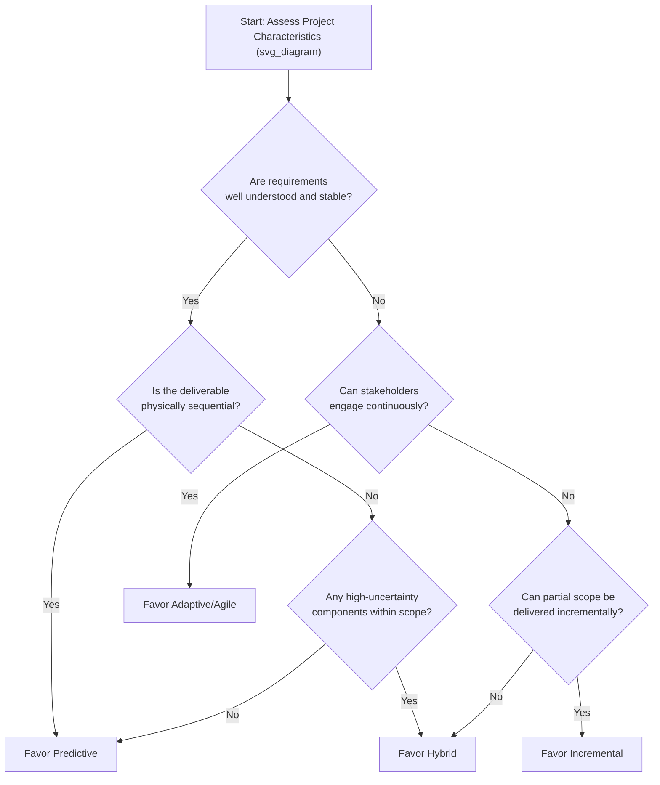

## Selecting a Methodology for Project Context

### Definition

**Methodology selection** (also referred to as **tailoring**) is the deliberate process of determining which project delivery approach — predictive, iterative, incremental, adaptive/agile, or hybrid — and which specific practices, tools, and level of formality best fit a given project's characteristics. Tailoring recognizes that no single methodology is universally optimal; the "right" approach is a function of the project's context, not a fixed organizational default.

### Why Tailoring Matters

- Applying a mismatched methodology increases risk: forcing a highly uncertain, evolving project into a rigid predictive structure invites costly late-stage change requests, while forcing a highly regulated, physically sequential project into a pure agile structure creates governance and compliance gaps.
- PMI's PMBOK Guide (7th Edition) formally elevated tailoring to a central principle, framing project management as a set of principles and performance domains to be *adapted* to context rather than a fixed, one-size-fits-all process set.
- **[Inference]** Organizations that treat methodology as a fixed policy (e.g., "we always do Scrum" or "we always do waterfall") regardless of project characteristics are commonly cited in project management literature as more prone to methodology-fit problems, though the degree of impact depends heavily on how much genuine mismatch exists in a given case, and is not something that can be measured with precision across all organizations.

### Key Factors to Assess

#### 1. Requirements Certainty

- **Low uncertainty** (well-understood, stable requirements) → favors predictive approaches.
- **High uncertainty** (requirements likely to evolve, unclear at the outset) → favors adaptive/agile approaches.

#### 2. Technical/Solution Uncertainty

- **Proven technology, known solution path** → favors predictive approaches.
- **Novel technology, solution approach must be discovered** → favors iterative or adaptive approaches.

#### 3. Physical vs. Digital Nature of Deliverable

- **Physical, sequentially dependent deliverables** (construction, hardware manufacturing) → strongly favor predictive approaches due to inherent build-order constraints.
- **Digital, modular deliverables** (software) → more naturally support incremental/adaptive delivery since components can often be built and released independently.

#### 4. Regulatory and Compliance Requirements

- **Heavy documentation, formal sign-off, and audit trail requirements** (pharmaceuticals, aerospace, government contracts) → favor predictive or hybrid approaches with predictive-style documentation gates.
- **Lighter regulatory burden** → more freedom to adopt lightweight adaptive practices.

#### 5. Stakeholder Availability and Engagement Model

- **Continuous stakeholder availability** (e.g., an embedded Product Owner) → supports adaptive approaches, which depend on frequent engagement.
- **Stakeholders available only at defined milestones** → better suited to predictive approaches with concentrated requirements/acceptance phases.

#### 6. Contractual and Funding Model

- **Fixed-price, fixed-scope contracts** → favor predictive approaches, since firm commitments require upfront scope certainty.
- **Time-and-materials or capacity-based funding** → more compatible with adaptive/incremental approaches, where scope may evolve.

#### 7. Organizational Culture and Governance Structure

- **Hierarchical, milestone-driven governance** → may favor predictive or hybrid approaches to align with existing reporting expectations.
- **Empowered, self-organizing team culture** → better supports adaptive approaches, which depend on delegated team authority.

#### 8. Project Size, Complexity, and Duration

- **Small, well-defined, short-duration projects** → may not need heavy methodology overhead in either direction; lightweight predictive or lightweight agile can both work.
- **Large, complex, long-duration, multi-team projects** → often require hybrid approaches or scaled agile frameworks to coordinate across the added complexity.

### Decision Framework: A Structured Assessment Approach

**[Inference]** This decision tree represents a synthesized, generalized framework based on commonly cited tailoring criteria (requirements certainty, physical dependency, stakeholder engagement) found across PM literature and PMI's tailoring guidance; it is a simplification for teaching purposes, and real-world methodology decisions typically require weighing several of these factors together rather than following a single linear path, since project characteristics rarely fall neatly into binary categories.

### Comparative Summary Table

| Factor | Favors Predictive | Favors Adaptive/Agile | Favors Hybrid |
| --- | --- | --- | --- |
| Requirements certainty | High | Low | Mixed across components |
| Technical uncertainty | Low | High | Mixed across components |
| Deliverable nature | Physical/sequential | Digital/modular | Mixed (physical + digital) |
| Regulatory burden | Heavy, formal | Light | Heavy for some components only |
| Stakeholder availability | Milestone-based | Continuous | Varies by workstream |
| Contract type | Fixed-price | Time-and-materials | Blended |
| Organizational culture | Hierarchical, gated | Empowered, self-organizing | Mixed maturity |

### Worked Example: Choosing a Methodology for Three Different Projects

**Project A — Municipal Bridge Construction**

- Requirements: Fixed by engineering codes and safety regulations (low uncertainty).
- Deliverable: Physical, strictly sequential construction dependencies.
- Regulatory burden: Heavy (permits, inspections, safety compliance).
- **Selected approach: Predictive.** All factors point toward a plan-driven, sequential, heavily documented methodology.

**Project B — New Mobile App Feature for an Existing Product**

- Requirements: Expected to evolve based on user testing and market feedback (high uncertainty).
- Deliverable: Digital, modular (features can be built and released independently).
- Stakeholder availability: Product team available for continuous engagement.
- **Selected approach: Adaptive/Agile (Scrum).** All factors point toward iterative, incremental delivery with frequent feedback loops.

**Project C — Hospital Wing Expansion with New Digital Records System**

- Requirements: Physical construction requirements are fixed (codes, architectural plans); software requirements for the records system are expected to evolve based on staff workflow feedback.
- Deliverable: Mixed — physical building plus digital system.
- Regulatory burden: Heavy for construction (building codes); moderate for the software (healthcare data compliance, but implementation details flexible).
- **Selected approach: Hybrid.** Construction workstream managed predictively; software workstream managed via Scrum, converging at a shared go-live milestone.

### Tailoring Beyond Life-Cycle Selection

Methodology selection is not limited to choosing predictive vs. agile vs. hybrid at the life-cycle level — tailoring also applies to:

- **Level of documentation formality** — even within a chosen approach, the depth of required documentation should scale with regulatory need, project risk, and organizational maturity, not default to maximal formality.
- **Governance and reporting cadence** — how often and in what format status is reported to sponsors/stakeholders should match project size, risk, and stakeholder needs rather than a fixed organizational template.
- **Team structure and roles** — whether to use a dedicated Product Owner, a steering committee, or a lightweight sponsor relationship depends on project scale and criticality.
- **Tools and artifacts** — a simple task list may be entirely adequate for a small project, whereas a large, multi-team effort may require a formal Work Breakdown Structure, an integrated schedule network, and a full risk register.

### Common Pitfalls in Methodology Selection

- **"One-size-fits-all" organizational mandates** — requiring every project to use the same methodology regardless of context, often driven by tooling standardization or leadership preference rather than genuine fit assessment.
- **Selecting methodology based on trend or terminology prestige** rather than actual project characteristics (e.g., adopting agile terminology for a project with fundamentally predictive characteristics, without changing underlying practices — sometimes called "agile-in-name-only").
- **Failing to reassess methodology fit as the project evolves** — a project's uncertainty profile can shift over its life cycle (e.g., requirements stabilize after an initial discovery phase), and the chosen approach should be revisited rather than treated as a permanent, unchangeable decision made once at initiation.
- **Ignoring organizational readiness** — selecting an approach (e.g., pure agile) that is theoretically well suited to the project's technical characteristics but incompatible with the organization's governance, culture, or stakeholder availability, resulting in a mismatch between methodology and execution environment.

### Related Topics

- Predictive and Waterfall Approaches
- Agile and Adaptive Approaches
- Iterative and Incremental Approaches
- Hybrid Methodology Models
- PMBOK 7th Edition Principles-Based Framework and Tailoring
- Project Complexity Assessment Models
- Organizational Process Assets and Enterprise Environmental Factors
- Scaling Agile Frameworks for Large/Complex Projects