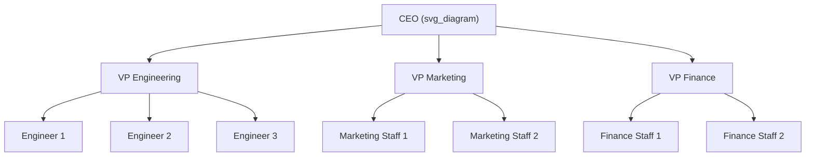
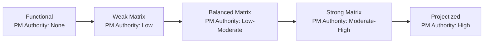

## Functional Organizational Structure

### Definition

A **functional organizational structure** groups employees by specialized function or discipline (e.g., Engineering, Marketing, Finance, Human Resources), each led by a functional manager. Staff report through a clear chain of command within their own department, and project work — when it exists — is carried out within department boundaries rather than through a dedicated, cross-departmental project team.

### Core Characteristics

- **Hierarchical, department-based reporting** — each employee has one clear manager, typically the head of their functional discipline.
- **Specialization by expertise** — staff are grouped with others who share the same skill set, supporting deep technical expertise and clear career progression paths within a discipline.
- **No dedicated project manager role (typically)** — project-type work is usually coordinated by the functional manager or an informally designated **project coordinator/expediter**, who has little to no formal authority over resources.
- **Resources stay within department boundaries** — a project confined to a single department (e.g., a marketing campaign) is executed entirely by marketing staff, without needing to pull people from other departments.

### Project Manager's Role and Authority

| Attribute | Description |
| --- | --- |
| PM authority | Little to none |
| PM role | Often called a project coordinator or project expediter rather than "Project Manager" |
| Resource control | Functional manager retains control over staff assignments and priorities |
| Reporting | Any project coordinator role typically reports to a functional manager, not to a project sponsor or steering committee |
| Time allocation | Project coordination is typically a part-time responsibility layered on top of an individual's normal functional duties |

**Project Expediter vs. Project Coordinator (informal roles within functional structures):**

- **Project Expediter** — acts primarily as a staff assistant and communications coordinator; cannot personally make or enforce decisions.
- **Project Coordinator** — has slightly more authority than an expediter and reports to a higher-level manager, but still cannot make most management-level decisions independently.

### Advantages

| Advantage | Explanation |
| --- | --- |
| Deep functional expertise | Staff grouped by discipline develop specialized skill and knowledge over time |
| Clear career paths | Promotion and skill development paths are well defined within a single discipline |
| Efficient resource use for departmental work | No overhead of cross-departmental coordination for work that stays within one function |
| Simple, stable reporting lines | Single-manager reporting reduces role/authority ambiguity for staff |
| Consistent standards | A single functional manager can enforce consistent methods, tools, and quality standards within the discipline |

### Disadvantages

| Disadvantage | Explanation |
| --- | --- |
| Weak or absent project authority | Cross-functional coordination is difficult since no one role has authority spanning departments |
| Siloed communication | Information often flows up and down within a department more easily than across departments |
| Slower response to cross-functional needs | Projects requiring multiple disciplines face delays as work is handed off between department heads rather than coordinated directly |
| Competing priorities | Functional managers prioritize their department's routine operational work over ad hoc project work, often deprioritizing projects |
| Limited project visibility | No centralized view of project status exists outside the department(s) directly involved |

### When Functional Structures Are Well Suited

- **Organizations whose core work is repetitive, operational, and discipline-specific** (e.g., accounting firms, specialized manufacturing) with limited cross-departmental project activity.
- **Projects fully contained within a single department**, requiring no resources or approval outside that function.
- **Smaller organizations** where the overhead of a dedicated project management structure would exceed its benefit.
- **Environments where deep technical/functional specialization is more critical to success than cross-disciplinary coordination speed.**

### When Functional Structures Are Poorly Suited

- **Complex, cross-functional projects** requiring coordinated input from multiple departments simultaneously (e.g., new product launches spanning engineering, marketing, and finance).
- **Time-sensitive projects** where the lack of centralized project authority slows decision-making and escalation.
- **Organizations undergoing significant strategic change or transformation**, where dedicated, empowered project leadership is needed to drive initiatives across departmental boundaries.

### Example: Functional Structure in Practice

**Scenario:** A mid-sized manufacturing company needs to update its internal expense-reporting process.

- The initiative is assigned to the **Finance department**, since it falls entirely within Finance's functional scope.
- The **Finance Director** (functional manager) assigns a senior accountant to informally coordinate the update — this person acts as a project coordinator, tracking timeline and communicating with the software vendor, but has no independent authority to approve budget changes or pull in IT staff without going through the IT department head directly.
- If the update later requires IT department involvement (e.g., new software integration), the accountant must escalate through the Finance Director to negotiate with the IT Director for resources — since neither the accountant nor the Finance Director has direct authority over IT staff.
- This escalation dependency illustrates the core limitation of the functional structure: cross-departmental coordination requires manager-to-manager negotiation rather than direct project authority.

### Functional Structure Within the Broader Structure Spectrum

Functional organizations sit at one end of a spectrum of organizational structures, with projectized organizations at the opposite end and various matrix structures in between:

| Organizational Structure | PM Authority | Resource Availability | Who Controls the Project Budget |
| --- | --- | --- | --- |
| Functional | Little to none | Little to none | Functional manager |
| Weak Matrix | Low | Low | Functional manager |
| Balanced Matrix | Low to moderate | Low to moderate | Mixed |
| Strong Matrix | Moderate to high | Moderate to high | Project manager |
| Projectized | High to almost total | High to almost total | Project manager |

### Common Misconceptions

- **A functional structure does not mean projects never happen** — it means projects are managed *within* department boundaries using existing functional reporting lines, rather than through a dedicated, cross-functional project management role with independent authority.
- **A "project coordinator" in a functional structure is not equivalent to a Project Manager** in a matrix or projectized structure — the coordinator role typically lacks authority to make resource, budget, or scope decisions independently.
- **Functional structures are not inherently inferior** — for organizations whose work is genuinely discipline-specific and rarely cross-functional, the functional model's simplicity and depth of expertise can outperform the coordination overhead of a matrix structure.

### Related Topics

- Matrix Organizational Structures (Weak, Balanced, Strong)
- Projectized Organizational Structure
- Organizational Structures and Their Effect on Project Authority
- Project Coordinator and Project Expediter Roles
- Role and Responsibilities of the Project Manager
- Resource Management and Negotiating for Resources
- Project Management Office (PMO) Types
- Escalation Paths in Cross-Functional Project Work