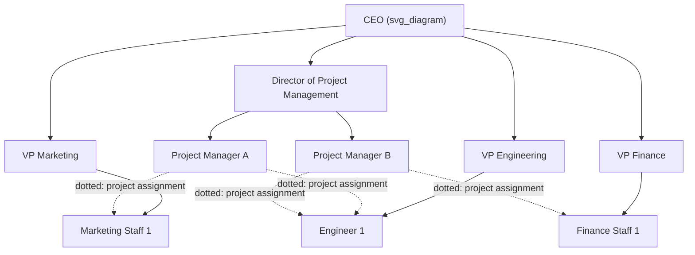
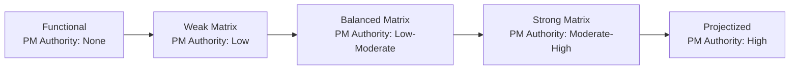

## Matrix Organizational Structure

### Definition

A **matrix organizational structure** blends functional and projectized structures, creating a dual-reporting environment in which employees report both to a **functional manager** (based on discipline/department) and to a **project manager** (based on project assignment). This structure aims to combine the specialization benefits of functional organizations with the coordinated, cross-departmental focus of projectized organizations.

### Core Characteristics

- **Dual reporting relationships** — staff report to a functional manager for discipline-related matters (career development, performance reviews, technical standards) and to a project manager for project-related work (task assignment, project priorities, deliverable deadlines).
- **Shared authority between functional and project managers** — the degree of authority each holds over shared staff varies along a spectrum (weak, balanced, strong), rather than being fixed.
- **Cross-functional project teams** — project teams are assembled by pulling specialists from multiple functional departments for the duration of the project, then returning them to their functional home once the project concludes.
- **Negotiated resource allocation** — since staff are shared between functional departments and projects, resource assignment typically requires negotiation between the project manager and functional managers.

### The Matrix Spectrum: Weak, Balanced, and Strong

Matrix structures are not a single fixed model — they exist along a spectrum defined by the relative balance of authority between functional managers and project managers.

#### Weak Matrix

- Functional managers retain most authority; the project manager role resembles a **coordinator or expediter** (similar to a functional structure), with limited independent decision-making power.
- Project manager typically works part-time on project coordination alongside other functional duties.

#### Balanced Matrix

- Authority is more evenly split between functional and project managers.
- Project manager works full-time on the project but must still negotiate resource priorities and decisions with functional managers, since neither side holds clearly dominant authority.
- **[Inference]** The balanced matrix is often cited in project management literature as the most operationally delicate of the three variants, since it lacks the clear default authority split of either the weak or strong matrix, requiring more deliberate governance and communication practices to function well; this characterization is a commonly held professional judgment rather than an empirically fixed measurement.

#### Strong Matrix

- The project manager holds significant, often near-equal or greater authority compared to functional managers over shared staff for project-related work.
- Project manager typically works full-time and may have a title such as "Project Manager" with formal organizational recognition, sometimes supported by a Project Management Office (PMO).

| Matrix Type | PM Authority | PM Role | Resource Availability | Who Sets Project Priorities |
| --- | --- | --- | --- | --- |
| Weak Matrix | Low | Part-time coordinator/expediter | Low | Functional manager (dominant) |
| Balanced Matrix | Low to moderate | Full-time | Low to moderate | Negotiated between PM and functional manager |
| Strong Matrix | Moderate to high | Full-time | Moderate to high | Project manager (dominant) |

### Advantages

| Advantage | Explanation |
| --- | --- |
| Efficient resource sharing | Specialists can be shared across multiple concurrent projects rather than dedicated full-time to just one |
| Retained functional expertise | Staff remain connected to their discipline's career path, standards, and knowledge base even while working on projects |
| Improved cross-functional coordination | Project managers gain visibility and some authority to coordinate work across departmental boundaries, unlike in a purely functional structure |
| Flexibility | Staff can move between projects as priorities shift, without requiring permanent reorganization |
| Dual skill development | Employees gain both deep functional expertise and cross-project collaboration experience |

### Disadvantages

| Disadvantage | Explanation |
| --- | --- |
| Dual reporting conflict | Staff can receive competing priorities or conflicting instructions from their functional manager and project manager simultaneously |
| Power struggles | Ambiguous authority boundaries (especially in balanced matrix) can create friction between functional and project managers |
| Complex communication | Information must flow along both functional and project reporting lines, increasing communication overhead |
| Resource contention | Multiple projects competing for the same shared specialists can create scheduling conflicts and prioritization disputes |
| Slower decision-making | Negotiated authority can slow decisions that would be unilateral in a purely functional or projectized structure |

### When Matrix Structures Are Well Suited

- **Organizations running multiple concurrent projects** that require specialized skills too scarce or costly to dedicate exclusively to any single project.
- **Environments needing both strong functional expertise and cross-functional project coordination** — e.g., engineering firms delivering client projects that require input from multiple technical disciplines.
- **Organizations transitioning from a purely functional structure** toward more formalized project management practice, without fully restructuring into a projectized model.

### When Matrix Structures Are Poorly Suited

- **Organizations with low tolerance for ambiguity or conflict** in reporting relationships, where dual-authority structures may create excessive friction.
- **Time-critical projects requiring fast, unilateral decision-making** — the negotiation overhead inherent to matrix structures (especially weak/balanced variants) can slow response time.
- **Small organizations** where the administrative overhead of maintaining dual reporting structures exceeds the coordination benefit.

### Example: Matrix Structure in Practice

**Scenario:** A software company is developing a new product feature requiring input from Engineering, UX Design, and QA — each a separate functional department.

- A **Project Manager** is assigned to lead the initiative and negotiates with the **Engineering Manager**, **UX Design Manager**, and **QA Manager** to secure part-time allocation of specific staff for the project's duration.
- An engineer assigned to this project continues to report to the Engineering Manager for performance reviews, technical mentorship, and career development, while also receiving day-to-day task assignments and deadlines from the Project Manager.
- If the Engineering Manager needs the same engineer for an urgent unrelated production issue, the Project Manager and Engineering Manager must negotiate priority — in a **weak matrix**, the Engineering Manager's priority likely prevails by default; in a **strong matrix**, the Project Manager has more standing to insist the project task remains prioritized.
- Upon project completion, the engineer returns fully to functional department duties, with no organizational restructuring required.

### Matrix Structure Within the Broader Structure Spectrum

### Key Skills for Success in a Matrix Environment

- **Negotiation** — securing and retaining resources requires ongoing negotiation with functional managers rather than unilateral command authority.
- **Conflict resolution** — dual-reporting inherently creates potential for competing priorities; PMs and staff alike benefit from structured conflict-resolution approaches.
- **Clear communication protocols** — explicit agreements on decision rights (who decides what) help reduce ambiguity, particularly in balanced matrix environments.
- **Stakeholder management** — maintaining good working relationships with functional managers is essential, since project success depends on their continued willingness to allocate resources.

### Common Misconceptions

- **A matrix structure is not simply "having project managers"** — the defining feature is the *dual reporting relationship* for shared staff, not merely the existence of a project manager role (which can also exist, with limited authority, in functional structures).
- **"Balanced matrix" does not mean conflict-free** — despite the name suggesting equilibrium, the balanced matrix is often the variant most prone to authority ambiguity and interpersonal friction, precisely because neither functional nor project authority clearly dominates.
- **Matrix structures do not eliminate the need for functional departments** — functional departments continue to exist and retain responsibility for staff development and technical standards; the matrix adds a second, project-based reporting dimension rather than replacing the functional one.

### Related Topics

- Functional Organizational Structure
- Projectized Organizational Structure
- Organizational Structures and Their Effect on Project Authority
- Negotiating for Resources in Matrix Environments
- Conflict Resolution Techniques for Project Managers
- Role and Responsibilities of the Project Manager
- Project Management Office (PMO) Types
- Resource Leveling and Resource Allocation Across Concurrent Projects