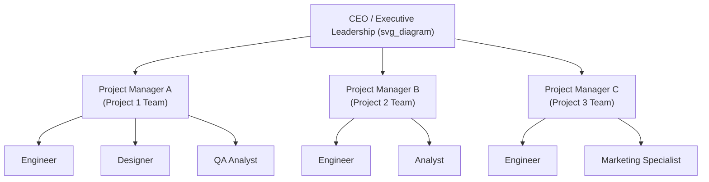
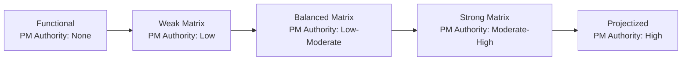

## Projectized Organizational Structure

### Definition

A **projectized organizational structure** organizes the entire company (or a major division of it) around projects rather than functional departments. Staff are assigned to dedicated project teams, report directly to a **Project Manager** who holds significant to near-total authority, and typically remain with that project team for its full duration rather than being shared across multiple functional or project assignments.

### Core Characteristics

- **Project Manager holds high to near-total authority** — over budget, resource assignment, task prioritization, and most day-to-day decisions affecting the project team.
- **Team members report directly to the Project Manager**, not to a separate functional manager — there is typically no dual-reporting relationship as in a matrix structure.
- **Resources are dedicated full-time to a single project** for its duration, rather than shared across multiple concurrent efforts.
- **Organizational units are structured around projects/programs**, not around functional disciplines — functional departments (if they exist at all) may play only a support role (e.g., a small central administrative or HR function), rather than owning staff assignment.
- **Teams often co-located** (physically or virtually) to support close collaboration for the duration of the project.

### Project Manager's Role and Authority

| Attribute | Description |
| --- | --- |
| PM authority | High to near-total |
| PM role | Full-time, formally recognized senior role |
| Resource control | PM directly controls project staff assignment and budget |
| Reporting | Team members report to the PM; PM typically reports to executive leadership or a program/portfolio structure |
| Time allocation | PM is dedicated full-time to the project, as are most/all team members |

### Advantages

| Advantage | Explanation |
| --- | --- |
| Clear authority and accountability | Single, unambiguous reporting line eliminates the dual-authority conflicts seen in matrix structures |
| Fast decision-making | PM's high authority allows rapid decisions without negotiating across departmental boundaries |
| Strong team cohesion | Full-time, dedicated team members (often co-located) tend to build stronger collaboration and shared project identity |
| Clear project focus | Team members are not split across competing project priorities, reducing multitasking-related inefficiency |
| Efficient for large, complex, long-duration projects | Dedicated structure supports the sustained coordination that large or long-running initiatives require |

### Disadvantages

| Disadvantage | Explanation |
| --- | --- |
| Resource inefficiency between projects | Specialists dedicated full-time to one project may be underutilized during periods of lighter workload on that project |
| Weakened functional/technical development | Without a functional "home," staff may experience reduced discipline-specific mentorship, standards enforcement, and long-term skill development pathways |
| Job insecurity concerns at project closure | Team members may face uncertainty about their next assignment once a project ends, since there is no permanent functional department to return to |
| Duplication of resources across projects | Multiple concurrent projects may each need their own dedicated specialists (e.g., separate QA staff per project) rather than sharing a pool efficiently |
| Organizational knowledge silos | Since staff aren't grouped by discipline, cross-project knowledge sharing and consistent technical standards can be harder to maintain |

### When Projectized Structures Are Well Suited

- **Large, complex, long-duration projects** requiring sustained, full-time dedicated leadership and team focus (e.g., major construction programs, large defense/aerospace contracts, large-scale system implementations).
- **Organizations whose primary business model is delivering discrete projects for external clients** (e.g., construction firms, engineering consultancies, systems integrators), where nearly all work is inherently project-based.
- **High-risk or highly time-sensitive initiatives** where fast, unambiguous decision-making authority is critical to success.
- **Situations requiring strong team cohesion and identity**, such as cross-disciplinary innovation efforts benefiting from close, sustained collaboration.

### When Projectized Structures Are Poorly Suited

- **Organizations with substantial ongoing operational work** alongside project work, where maintaining permanent functional departments for operations is still necessary.
- **Smaller organizations** where dedicating full-time staff to individual projects would be inefficient given limited overall headcount.
- **Environments requiring deep, sustained functional/technical specialization development**, where the lack of a permanent functional "home" may erode long-term discipline expertise.
- **Frequent, smaller-scale projects** where the overhead of standing up and dissolving dedicated project teams repeatedly outweighs the benefits of dedicated focus.

### Example: Projectized Structure in Practice

**Scenario:** A construction engineering firm is delivering a large infrastructure project (a new highway interchange) for a government client.

- A **Project Manager** is appointed with full authority over the project budget, schedule, and staffing decisions for the duration of the multi-year project.
- Civil engineers, surveyors, safety officers, and administrative staff are assigned **full-time** to this single project team and relocate to a site office near the construction location for the project's duration.
- The Project Manager reports directly to the firm's executive leadership (or a program director overseeing multiple concurrent infrastructure projects), with no functional department manager involved in day-to-day staffing or task decisions.
- Upon project completion, most team members are reassigned to the firm's next major project (a new team, likely a new PM), rather than returning to a functional "home department," since the firm's operating model is inherently projectized.

### Projectized Structure Within the Broader Structure Spectrum

| Organizational Structure | PM Authority | Resource Availability | Team Reporting |
| --- | --- | --- | --- |
| Functional | Little to none | Little to none | Report to functional manager |
| Weak Matrix | Low | Low | Report to functional manager (primary) |
| Balanced Matrix | Low to moderate | Low to moderate | Dual-report, negotiated |
| Strong Matrix | Moderate to high | Moderate to high | Dual-report, PM leaning dominant |
| **Projectized** | **High to almost total** | **High to almost total** | **Report to Project Manager (direct)** |

### Mitigating Common Weaknesses in Practice

Organizations using projectized structures commonly address the "resource idle time" and "career development" weaknesses through:

- **Resource pooling functions or a light functional layer** — maintaining a small, central "home base" or Project Management Office (PMO) for staff between project assignments, providing some continuity even within an overall projectized model.
- **Deliberate rotation planning** — proactively managing the transition of staff from a closing project to a new project assignment, minimizing idle time.
- **Cross-project communities of practice** — informal or formal knowledge-sharing groups organized by discipline (e.g., an internal "engineers' guild") that operate alongside the projectized reporting structure, partially compensating for the lack of a permanent functional department.

### Common Misconceptions

- **A projectized structure does not mean an organization has no permanent staff or infrastructure** — administrative, financial, and executive functions typically still exist; what differs is that the *majority of delivery staff* are organized around projects rather than functional disciplines.
- **High PM authority does not mean unlimited authority** — even in a projectized structure, PMs typically still answer to executive leadership, a program structure, or a governance board for major decisions (e.g., budget increases, scope changes affecting overall organizational strategy).
- **Projectized is not simply "the opposite of bad" compared to functional** — each structure has genuine, context-dependent trade-offs; a projectized structure introduces real risks around resource utilization efficiency and staff career development that functional and matrix structures don't face in the same way.

### Related Topics

- Functional Organizational Structure
- Matrix Organizational Structure
- Organizational Structures and Their Effect on Project Authority
- Role and Responsibilities of the Project Manager
- Project Management Office (PMO) Types
- Resource Management Across Concurrent Projects
- Program Management for Multi-Project Coordination
- Team Development and Co-location Strategies