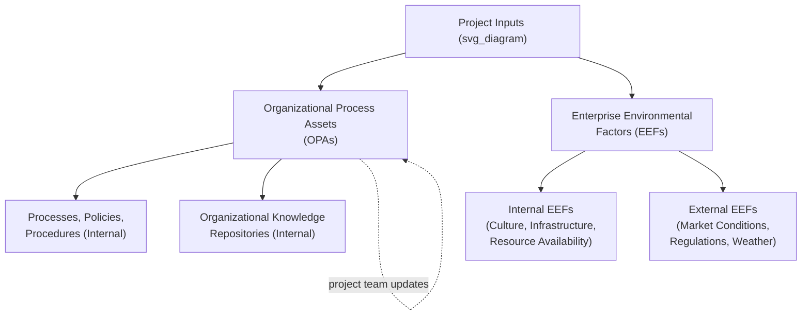

## Organizational Process Assets and Environmental Factors

### Definitions

**Organizational Process Assets (OPAs)** are the plans, processes, policies, procedures, templates, and knowledge repositories specific to and used by the performing organization, developed or accumulated over time from prior projects and organizational experience. OPAs are inputs that project teams draw upon and outputs that project teams contribute back to (e.g., lessons learned).

**Enterprise Environmental Factors (EEFs)** are conditions, not under the immediate control of the project team, that influence, constrain, or direct the project. EEFs may originate from within the performing organization (internal) or from outside it (external), and the project team must work within or around them rather than change them.

### Core Distinction

The key distinguishing question: **can the project team update or influence this asset directly?**

- **OPAs** — the organization's own accumulated processes and knowledge; project teams can typically follow, adapt, and *contribute updates back to* these assets (e.g., adding a new template, updating a lessons-learned repository).
- **EEFs** — external or internal conditions the project team must operate within but generally **cannot change**; they are constraints or influences to plan around, not organizational assets to be updated.

### Organizational Process Assets (OPAs) — Two Categories

#### 1. Processes, Policies, and Procedures

Generally established by the organization and not modified freely by an individual project, though the project team follows and applies them:

- Organizational standard policies (e.g., safety policies, quality policies, ethical codes of conduct).
- Standardized guidelines, work instructions, proposal evaluation criteria, and performance measurement criteria.
- Templates (e.g., risk register templates, WBS templates, status report templates).
- Guidelines and criteria for tailoring the organization's standard processes to a specific project.
- Organizational communication requirements (e.g., specific technologies available, allowed communication media, record retention policies, security requirements).
- Change control procedures, including the steps by which organizational standards, policies, plans, and procedures will be modified.
- Financial control procedures (e.g., time reporting, required expenditure and disbursement reviews, accounting codes, standard contract provisions).
- Issue and defect management procedures defining controls, identification, and resolution of issues and defects.
- Risk control procedures, including risk categories, probability/impact definitions, and risk breakdown structures.
- Standardized guidelines for work authorization.

#### 2. Organizational Knowledge Repositories

Accumulated information from past projects that project teams draw upon and add to:

- Process measurement databases used to collect and make available measurement data on processes and products.
- Project files from previous projects (e.g., scope, cost, schedule, performance measurement baselines, project calendars, risk registers, planned response actions, and defined risk impact).
- Historical information and lessons-learned knowledge bases (including project records, correspondence, closure documents, and results of prior project selection decisions and prior project performance information).
- Issue and defect management databases containing historical issue/defect status, resolution information, and action item results.
- Configuration management knowledge bases containing versions and baselines of organizational standards, policies, procedures, and any project documents.
- Financial databases containing information such as labor hours, incurred costs, budgets, and any project cost overruns.

### Enterprise Environmental Factors (EEFs) — Internal vs. External

#### Internal EEFs

Conditions within the performing organization itself:

- Organizational culture, structure, and governance (e.g., functional, matrix, or projectized organizational structure — see related organizational-structure topics).
- Geographic distribution of facilities and resources.
- Infrastructure (existing facilities, equipment, organizational telecommunications channels, IT hardware, availability, and capacity).
- Existing human resource availability, skills, competencies, and expertise.
- Resource availability (contracting and purchasing constraints, approved providers/subcontractors).
- Company work authorization systems.
- Marketplace conditions specific to the organization's competitive position.
- Stakeholder risk appetites and thresholds.

#### External EEFs

Conditions outside the performing organization's control:

- Marketplace conditions (broader industry and economic trends, not just organization-specific competitive position).
- Social and cultural influences and issues.
- Legal restrictions (e.g., country or local regulations regarding security, data protection, business conduct, employment, procurement, and ethics).
- Commercial databases (benchmarking results, standardized cost estimating data, industry risk study information).
- Academic research (industry studies, publications, benchmarking results).
- Government or industry standards (regulatory agency regulations and standards related to products, production, environment, quality, and workmanship).
- Financial considerations (currency exchange rates, interest rates, inflation, tariffs, geographic location).
- Physical environmental elements (working conditions, weather).

| Category | Internal Examples | External Examples |
| --- | --- | --- |
| EEFs | Organizational culture, IT infrastructure, staff skill availability | Regulations, market conditions, weather, currency exchange rates |
| OPAs (both types are internal by nature) | Templates, historical databases, standard processes, lessons-learned repositories | N/A — OPAs are inherently internal to the performing organization |

### How OPAs and EEFs Interact With Project Management Processes

Both OPAs and EEFs function as **inputs** across most planning processes throughout the project life cycle:

- **During Initiating:** EEFs (e.g., market conditions, regulatory requirements) and OPAs (e.g., organizational standard templates for a project charter, historical data from similar past projects) shape how the project is framed and chartered.
- **During Planning:** EEFs (e.g., resource availability, existing infrastructure) constrain what is feasible; OPAs (e.g., a standardized risk breakdown structure, a scheduling methodology template) provide starting points rather than requiring the team to build every planning artifact from scratch.
- **During Executing:** OPAs (e.g., issue management procedures, communication requirements) guide how the team operates day to day; EEFs (e.g., organizational culture, infrastructure capacity) shape what execution approaches are realistic.
- **During Monitoring & Controlling:** OPAs (e.g., financial control procedures, change control procedures) define how variances and changes are formally processed.
- **During Closing:** The project contributes new entries back into OPAs — updated lessons-learned repositories, updated historical databases, and finalized project files for future reference — completing the feedback loop distinguishing OPAs from EEFs.

### Worked Example

**Scenario:** A company is initiating a new customer onboarding software project.

**OPAs the project team draws on:**

- A standardized project charter template used across all company projects.
- A lessons-learned database showing that a similar onboarding project two years prior experienced significant delays due to underestimated integration testing time — this history informs the new project's schedule estimates.
- The organization's standard change control procedure, which the project must follow for any scope modifications.

**EEFs the project team must work within:**

- **Internal:** The company operates in a strong matrix structure, meaning the project manager must negotiate for developer time with functional engineering managers (an internal EEF related to organizational structure).
- **External:** A new data privacy regulation coming into effect in six months constrains what data-handling features must be included in the design (external EEF, legal/regulatory).
- **External:** Currency exchange rate fluctuations affect the cost of a key overseas contracted development team (external EEF, financial).

**Feedback loop (OPA update at closure):** At project closure, the team documents the actual integration testing duration and key lessons learned about the new privacy regulation's implementation impact, updating the organization's lessons-learned repository (an OPA) for future projects to draw upon.

### Common Misconceptions

- **OPAs and EEFs are not interchangeable terms for "context the project must consider"** — the defining distinction is whether the project team can influence/update the item (OPA) or must simply work within it as a given constraint (EEF).
- **Not all internal factors are OPAs** — organizational culture and structure are internal, but since a project team cannot typically create or modify the organization's overall culture or structural type, these are classified as **internal EEFs**, not OPAs.
- **EEFs are not always negative constraints** — favorable market conditions, strong existing infrastructure, or skilled available staff are also EEFs; the category simply denotes "outside the project team's control," not "obstacle."
- **OPAs are not limited to formal, written documents** — organizational knowledge repositories (informal lessons learned, historical performance data) are equally valid OPAs, alongside the more visible formal policies and templates.

### Related Topics

- Project Charter Development and Initiation Documents
- Lessons Learned and Project Closeout Documentation
- Risk Management Planning and Risk Breakdown Structures
- Functional, Matrix, and Projectized Organizational Structures
- Change Control Procedures and Integrated Change Control
- Stakeholder Risk Appetite and Risk Thresholds
- Regulatory Compliance Considerations in Project Planning
- Historical Data Use in Estimating (Analogous and Parametric Estimating)