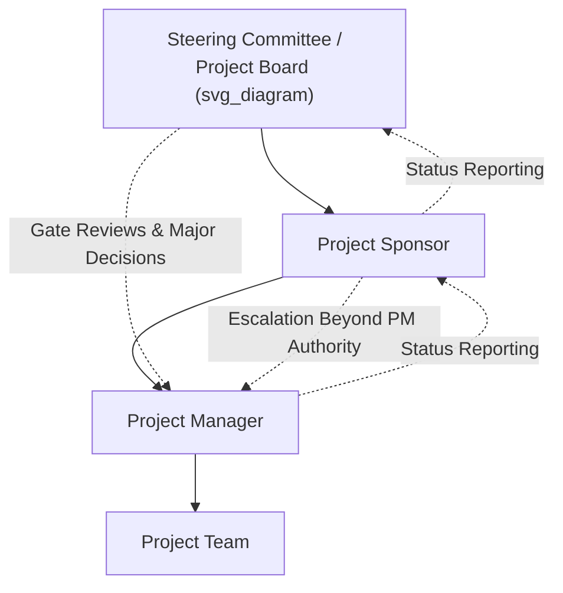

## Project Governance Frameworks

### Definition

**Project governance** is the framework of authority, decision-making structures, policies, and oversight mechanisms that guide how a project is directed, controlled, and held accountable throughout its life cycle. Governance defines *who* has authority to make which decisions, *how* those decisions are made and escalated, and *how* the project's alignment with organizational objectives is verified — distinct from project management, which focuses on the day-to-day execution of the work itself.

### Governance vs. Management — Core Distinction

| Dimension | Project Governance | Project Management |
| --- | --- | --- |
| Focus | Oversight, direction-setting, accountability | Execution, day-to-day delivery |
| Primary actors | Sponsor, steering committee, governance board | Project manager, project team |
| Key questions | "Should this project continue? Is it aligned with strategy? Who approves this decision?" | "How do we get this task done? What's the schedule/budget status?" |
| Time horizon | Strategic, periodic (milestone/gate-based) | Operational, continuous |
| Typical outputs | Approved charters, gate decisions, escalation resolutions | Schedules, status reports, deliverables |

**[Inference]** Governance and management are frequently described in PM literature as complementary but distinct functions — governance sets the boundaries and decision rights within which management operates — though in smaller organizations or projects, the same individual (e.g., a sponsor who is also closely involved day-to-day) may perform aspects of both roles informally, blurring this distinction in practice.

### Core Components of a Project Governance Framework

#### 1. Governance Roles and Structures

- **Project Sponsor** — senior individual accountable for the project's business case and benefits realization; provides resources, resolves escalations beyond the PM's authority, and champions the project at the executive level.
- **Steering Committee / Project Board** — a group of senior stakeholders providing oversight, resolving cross-functional conflicts, and making major go/no-go decisions.
- **Project Management Office (PMO)** — an organizational body that may standardize governance processes, provide governance support, or in more directive PMO models, exercise direct governance authority itself.
- **Project Manager** — operates within the governance framework, escalating decisions beyond their authority per the defined structure, and reporting status per governance-defined cadence.

#### 2. Decision Rights and Authority Levels

- Defines which decisions the Project Manager can make independently, which require sponsor approval, and which require steering committee/board approval (e.g., budget thresholds, scope changes above a certain impact level).
- **[Inference]** A commonly recommended governance practice is documenting a formal authority matrix or delegation of authority table early in the project, specifying dollar thresholds, scope-change thresholds, or risk-level thresholds that trigger escalation — though the specific thresholds used vary enormously across organizations and industries and are not standardized.

#### 3. Phase Gates and Review Points

- Defined checkpoints where governance bodies formally review project status and approve continuation, modification, or termination.
- Common gate types: **feasibility/business case approval**, **design/planning approval**, **execution readiness review**, **go-live/deployment approval**, and **closure/benefits-realization review**.

#### 4. Reporting and Communication Structure

- Defines what information flows to which governance body, at what frequency, and in what format (e.g., a monthly steering committee dashboard versus a weekly team status update).

#### 5. Change Control and Escalation Processes

- Formal procedures for how changes to scope, schedule, cost, or risk are submitted, evaluated, and approved — often through a **Change Control Board (CCB)**.
- Escalation paths defining how issues beyond the PM's authority are raised to the sponsor or steering committee.

#### 6. Risk and Compliance Oversight

- Governance frameworks typically define how risk thresholds and escalation triggers are set, and how compliance with organizational policy, regulatory requirements, and quality standards is verified at each gate.

### Governance Models by Organizational Context

| Governance Model | Description | Typical Fit |
| --- | --- | --- |
| **Lightweight/Informal** | A single sponsor provides oversight; minimal formal documentation or committee structure | Small projects, low risk, low organizational complexity |
| **Steering Committee Model** | A defined group of senior stakeholders meets periodically to review status and approve major decisions | Medium to large projects, cross-functional impact |
| **Stage-Gate Governance** | Formal phase-gate reviews with defined criteria required to proceed to the next phase | Predictive/waterfall projects, regulated industries, capital-intensive projects |
| **Agile Governance** | Lighter-weight, more frequent touchpoints (e.g., sprint reviews, quarterly business reviews) replacing rigid phase gates; governance focuses on backlog priority and incremental value delivery rather than fixed milestones | Agile/adaptive projects |
| **Program/Portfolio Governance** | Governance extends beyond a single project to coordinate priority and resource allocation decisions across multiple related projects or the broader portfolio | Programs, portfolios, multi-project organizations |

### Governance in Predictive vs. Agile Contexts

- **Predictive governance** tends to rely on formal phase gates, detailed documentation requirements, and less frequent but more comprehensive review points — well matched to predictive projects' upfront planning and lower change tolerance.
- **Agile governance** tends to rely on more frequent, lighter-weight touchpoints (e.g., sprint reviews, regular product/business reviews) and emphasizes continuous alignment on priority and value rather than rigid milestone approval — matched to agile's iterative, evolving-scope nature.
- **Hybrid governance** blends both: predictive-style milestone/gate governance may apply to overall project funding and major go-live decisions, while agile-style governance (backlog reviews, sprint demos) governs day-to-day execution within phases.

### Example: A Governance Framework in Practice

**Scenario:** A large enterprise software implementation project.

- **Steering Committee** — composed of the CFO (sponsor), the CIO, and department heads from affected business units; meets monthly to review overall status, approve budget changes above $50,000, and resolve cross-departmental conflicts.
- **Project Sponsor (CFO)** — approves changes below the steering committee's threshold, resolves resource conflicts between the project and ongoing operations, and champions the project's business case at the executive level.
- **Change Control Board** — composed of the Project Manager, a technical lead, and a business analyst; reviews and approves/rejects change requests below the steering committee's budget threshold on a biweekly basis.
- **Phase Gates:** Business Case Approval → Design Sign-off → Build Readiness Review → Go-Live Readiness Review → Post-Implementation Benefits Review (conducted 6 months after go-live).
- **Reporting cadence:** Weekly status reports to the sponsor; monthly dashboard reports to the steering committee; ad hoc escalation reports for any issue exceeding a defined risk threshold.

### Why Governance Frameworks Matter

- **Clarifies decision authority**, reducing delays and confusion about who can approve what, and preventing decisions from being made by whoever happens to be available rather than whoever has appropriate authority.
- **Ensures strategic alignment**, providing regular checkpoints to confirm the project still serves its intended business purpose, rather than continuing on inertia after conditions change.
- **Supports accountability**, since a defined governance structure creates a clear record of who approved which decisions and why.
- **Manages risk exposure**, by ensuring risks and issues beyond the project team's authority are surfaced to those with the authority and resources to address them.
- **Enables early termination when warranted** — a functioning phase-gate or steering committee structure gives the organization a formal, low-friction mechanism to stop a project that is no longer viable, rather than letting it continue purely due to sunk-cost momentum.

### Common Governance Pitfalls

- **Governance theater** — holding governance meetings and phase-gate reviews as a formality without genuine decision-making authority or willingness to say "no," undermining the framework's actual purpose.
- **Governance overload** — applying heavyweight, stage-gate-style governance uniformly to all projects regardless of size or risk, creating unnecessary bureaucratic overhead for small, low-risk initiatives.
- **Unclear escalation paths** — failing to define what specifically triggers escalation (e.g., a dollar threshold, a risk severity level), leading to inconsistent or delayed escalation in practice.
- **Governance-management role confusion** — sponsors or steering committee members becoming involved in day-to-day execution decisions that should sit with the project manager, blurring accountability and slowing delivery.
- **Static governance in dynamic projects** — applying a fixed governance structure designed for predictive projects to a highly adaptive/agile project without adjusting the cadence or decision model to fit the iterative nature of the work.

### Common Misconceptions

- **Governance is not the same as micromanagement** — an effective governance framework defines boundaries and decision rights, allowing the project manager and team full authority to operate within those boundaries, rather than requiring approval for every operational decision.
- **Agile projects are not "ungoverned"** — agile governance simply uses lighter-weight, more frequent mechanisms (sprint reviews, backlog governance) rather than absence of oversight altogether.
- **A steering committee is not automatically effective governance** — the existence of a governance body does not guarantee genuine oversight; effectiveness depends on the committee's actual engagement, willingness to make difficult decisions, and adherence to defined decision rights.

### Related Topics

- Role and Responsibilities of the Project Manager
- Project Sponsor Roles and Responsibilities
- Integrated Change Control and Change Control Boards
- Project Management Office (PMO) Types
- Project Life Cycle Phases and Phase Gates
- Stakeholder Analysis and Engagement Planning
- Program and Portfolio Governance
- Agile Governance Models and Scaled Agile Frameworks