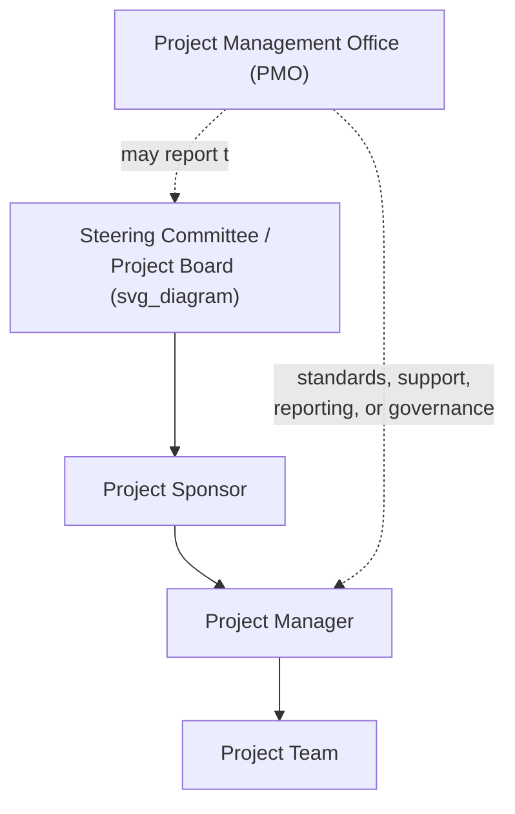
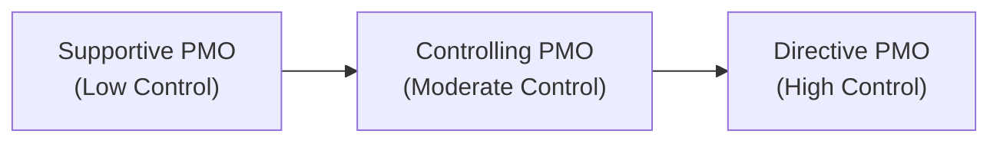

## Sponsor, Steering Committee, and PMO Roles

### Overview

Beyond the Project Manager and delivery team, three governance-oriented roles typically shape how a project is authorized, overseen, and supported organizationally: the **Project Sponsor**, the **Steering Committee (Project Board)**, and the **Project Management Office (PMO)**. Each operates at a different level of engagement and authority, and understanding their distinct responsibilities prevents overlap, gaps, and confusion in project governance.

### Project Sponsor

#### Definition

The **Project Sponsor** is the senior individual (or occasionally a group) formally accountable for enabling the project's success, championing it at the executive level, and ensuring it delivers its intended business value. The sponsor typically initiates the project by authorizing the project charter and remains engaged as the primary point of executive accountability throughout the life cycle.

#### Core Responsibilities

- **Business case ownership** — accountable for the project's business case and ultimate benefits realization, not just delivery of outputs.
- **Charter authorization** — formally approves and signs the project charter, granting the project manager authority to apply organizational resources to the project.
- **Resource and funding advocacy** — secures funding and resources, and advocates for the project's priority within the organization.
- **Escalation resolution** — resolves issues and decisions that exceed the project manager's authority (e.g., major scope changes, cross-departmental resource conflicts, budget increases beyond a defined threshold).
- **Strategic alignment** — ensures the project remains aligned with organizational strategy throughout its life, and is willing to terminate the project if that alignment breaks down.
- **Stakeholder influence** — leverages organizational seniority to influence stakeholders and remove organizational obstacles the project manager cannot address alone.

#### What the Sponsor Is Not

- **Not the day-to-day manager** of the project — that responsibility belongs to the Project Manager.
- **Not necessarily involved in operational details** — the sponsor typically engages at a strategic/escalation level, not in task-level execution.

### Steering Committee (Project Board)

#### Definition

A **Steering Committee** (also called a **Project Board**, particularly in PRINCE2 terminology) is a governance body composed of senior stakeholders who collectively provide oversight, resolve major decisions, and approve or reject continuation at key milestones. Unlike the sponsor (typically one individual), the steering committee represents a broader set of interests and often includes representatives from multiple affected business units.

#### Core Responsibilities

- **Periodic status review** — reviews project status, risks, and issues at a defined cadence (e.g., monthly), typically at a higher level of detail than day-to-day team reporting.
- **Go/no-go and phase-gate decisions** — approves or rejects continuation at major milestones or phase gates.
- **Cross-functional conflict resolution** — resolves disputes or competing priorities between departments represented on the committee, particularly relevant when multiple functional areas are affected by the project.
- **Major change approval** — approves changes to scope, schedule, or budget above thresholds defined in the governance framework (often higher thresholds than the sponsor can approve alone).
- **Risk oversight** — monitors significant risks and ensures adequate response plans exist, particularly for risks with organization-wide implications.

#### Typical Composition

- The Project Sponsor (often chairs the committee).
- Senior representatives from major stakeholder groups or affected business units.
- Sometimes includes a PMO representative for governance/process support.
- In PRINCE2's formal terminology, the equivalent **Project Board** is structured around three defined roles: the **Executive** (equivalent to sponsor, ultimately accountable), the **Senior User** (represents those who will use the project's outputs), and the **Senior Supplier** (represents those providing the resources/expertise to build the deliverable).

| Attribute | Project Sponsor | Steering Committee |
| --- | --- | --- |
| Composition | Typically one individual | Group of senior stakeholders |
| Engagement frequency | Ongoing, as-needed for escalations | Periodic, scheduled reviews |
| Decision scope | Escalations up to a defined threshold | Major/strategic decisions, phase-gate approvals |
| Primary accountability | Business case and benefits realization | Collective oversight and strategic alignment |

### Project Management Office (PMO)

#### Definition

A **Project Management Office (PMO)** is an organizational structure that standardizes project-related governance processes and facilitates the sharing of resources, methodologies, tools, and techniques across projects. Unlike the sponsor or steering committee (which govern a specific project), a PMO typically operates at a broader organizational level, supporting or governing multiple projects, programs, or the portfolio as a whole.

#### PMO Types by Level of Control

| PMO Type | Degree of Control | Description |
| --- | --- | --- |
| **Supportive** | Low | Provides templates, best practices, training, and access to information/lessons learned from other projects; acts as a project repository, with a consultative role |
| **Controlling** | Moderate | Provides support *and* requires compliance through specific frameworks, methodologies, templates, or governance tools; compliance may involve periodic PMO review/audit |
| **Directive** | High | Directly manages projects by providing the project managers themselves and taking direct control of the projects |

#### Core PMO Functions

- **Standardization** — establishes and maintains consistent methodologies, templates, and governance processes across projects.
- **Resource coordination** — may manage shared project management resources (project managers themselves, in a directive PMO) or facilitate resource-sharing across concurrent projects.
- **Portfolio-level visibility and reporting** — aggregates status across multiple projects to support portfolio-level decision-making by executive leadership.
- **Training and mentorship** — develops project management competency across the organization.
- **Organizational process asset stewardship** — maintains templates, lessons-learned repositories, and historical project data (see Organizational Process Assets).
- **Governance support** — may support or directly administer phase-gate processes, change control boards, and reporting cadences on behalf of individual project sponsors/steering committees.

#### What the PMO Is Not

- **Not automatically the same as a steering committee** — a PMO typically provides process/methodology support and organizational oversight infrastructure, while a steering committee makes specific go/no-go and strategic decisions for a given project; some organizations have PMO representatives participate in steering committees, but the two roles are distinct.
- **Not necessarily involved in day-to-day task execution** — even a directive PMO, which supplies the PM, generally still delegates operational execution to the project manager and team.

### How the Three Roles Interrelate

| Governance Question | Who Typically Answers It |
| --- | --- |
| "Is this project still worth doing strategically?" | Sponsor, Steering Committee |
| "Can we proceed to the next phase?" | Steering Committee (phase-gate approval) |
| "What methodology/template should we use for this type of project?" | PMO |
| "Who resolves a resource conflict between this project and another concurrent project?" | PMO (portfolio-level) or Steering Committee/Sponsor, depending on organizational structure |
| "Can we increase the budget by $20,000?" | Sponsor (if within their authority threshold) or Steering Committee (if above it) |
| "What lessons should be captured for future projects?" | PMO (repository owner), informed by input from PM and team |

### Example: All Three Roles Operating Together

**Scenario:** A large retail company is implementing a new inventory management system across 200 stores.

- **Sponsor:** The VP of Supply Chain sponsors the project, signs the charter, secures the $2M budget, and resolves an early escalation when the IT department initially deprioritizes the project in favor of other work.
- **Steering Committee:** Composed of the VP of Supply Chain (chair), the VP of Store Operations, the CIO, and the VP of Finance — meets monthly to review status, approved the phase-gate transition from pilot (10 stores) to full rollout (200 stores), and resolved a dispute between Store Operations and IT over the rollout schedule's impact on holiday-season staffing.
- **PMO:** The company's Controlling PMO required the project to use the organization's standard project charter template, risk register format, and status reporting cadence; it also provided a certified project manager from its internal PM resource pool and conducted a mid-project process compliance review.

### Common Misconceptions

- **The Sponsor and the Steering Committee Chair are not always the same role**, though the sponsor frequently does chair the committee — some organizations separate these functions, particularly on very large or politically complex projects.
- **A PMO is not inherently either weak or powerful** — its actual authority depends entirely on which type (supportive, controlling, or directive) the organization has established; conflating "PMO" with a single fixed level of authority is a common but inaccurate simplification.
- **Not every project has all three roles formally in place** — smaller or lower-risk projects may operate with only a sponsor and no formal steering committee or PMO involvement; the presence and formality of each role should be tailored to project size, risk, and organizational complexity (see Methodology Selection and Tailoring).

### Related Topics

- Project Governance Frameworks
- Role and Responsibilities of the Project Manager
- Functional, Matrix, and Projectized Organizational Structures
- Integrated Change Control and Change Control Boards
- Organizational Process Assets and Environmental Factors
- Program and Portfolio Governance
- PRINCE2 Methodology: Project Board Roles (Executive, Senior User, Senior Supplier)
- Stakeholder Analysis and Engagement Planning