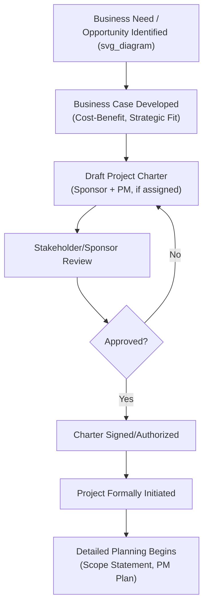

## Developing the Project Charter

### Definition

The **Project Charter** is a formal document that authorizes the existence of a project and grants the project manager authority to apply organizational resources to project activities. It is typically the first formal project management document produced, marking the transition from a business need or opportunity into a formally sanctioned project, and it establishes the foundational partnership between the performing organization and the requesting organization (or customer, in externally initiated projects).

### Purpose and Significance

- **Formal authorization** — without a charter, a project has no formal standing; work performed before charter approval is generally not considered part of an officially authorized project.
- **Grants project manager authority** — explicitly names the project manager and defines the scope of their authority to acquire and apply resources.
- **Links the project to organizational strategy** — establishes the business justification connecting the project to broader organizational objectives, ensuring the project isn't undertaken in a strategic vacuum.
- **Establishes a shared understanding** — creates a single reference point that sponsors, stakeholders, and the project manager can align on regarding the project's purpose, high-level scope, and success criteria before detailed planning begins.
- **Serves as an input to subsequent planning** — the charter provides the boundary conditions and objectives that the project management plan and detailed scope statement will elaborate on.

### Who Develops and Approves the Charter

- **Developed by:** Typically drafted collaboratively between the project sponsor and the project manager (if already assigned), though the sponsor is usually the accountable party for its content and initial drafting responsibility.
- **Approved/signed by:** The project sponsor or an appropriate level of management with the authority to fund the project and commit organizational resources.
- **[Inference]** In many organizations, the project manager is assigned only after (or concurrently with) charter development, meaning the PM's early input into the charter's content may be limited or absent depending on organizational timing — this varies by organization and is not a fixed universal sequence.

### Typical Charter Contents

While formats vary by organization, a comprehensive project charter typically includes the following elements:

| Section | Purpose |
| --- | --- |
| Project purpose/justification | Why the project exists — the business need, opportunity, or problem it addresses |
| Measurable project objectives and success criteria | What defines successful completion, ideally specific and measurable |
| High-level requirements | Broad conditions the deliverable must satisfy |
| High-level project description and boundaries | A general description of scope, including what is explicitly out of scope |
| High-level risks | Known or anticipated risks at the outset, before detailed risk analysis |
| Summary milestone schedule | Key dates or phases, at a high level (not a detailed schedule) |
| Summary budget | A preliminary, high-level budget estimate |
| Stakeholder list | Key stakeholders identified at initiation |
| Project approval requirements | What defines project success and who signs off on it |
| Assigned project manager, responsibility, and authority level | Named PM and the scope of decisions they are authorized to make |
| Name and authority of the sponsor | Who authorized the project and their level of authority |

### The Business Case as a Charter Input

The charter is typically developed using a **business case** (or equivalent business need document) as a primary input, which documents:

- The business need driving the project.
- A cost-benefit analysis justifying the investment.
- Strategic alignment with organizational goals.

**[Inference]** Organizations vary in how formally they separate the business case from the charter itself — some treat the business case as an entirely separate document that precedes charter development, while others integrate business case elements directly into the charter's justification section; both practices are common and neither represents a universally "correct" approach.

### Charter Development Process

### Example: A Simplified Project Charter

**Project Title:** Customer Self-Service Portal Implementation

**Business Justification:** Customer support call volume has increased 30% year-over-year, driving support costs and reducing customer satisfaction scores. A self-service portal is expected to reduce call volume by an estimated 20% within six months of launch.

**Objectives and Success Criteria:**

- Launch a functional self-service portal covering the top 10 most common support inquiries within 4 months.
- Achieve a 20% reduction in support call volume within 6 months of launch.
- Achieve a customer satisfaction score of 80% or higher for portal users within 3 months of launch.

**High-Level Scope:** Includes account management, order tracking, and FAQ self-service features. Excludes live chat and AI-driven chatbot functionality (deferred to a future phase).

**High-Level Risks:** Integration complexity with the legacy order management system; potential low initial user adoption.

**Summary Milestones:** Requirements finalized (Month 1); Design complete (Month 2); Development complete (Month 3); Launch (Month 4).

**Summary Budget:** $180,000.

**Assigned Project Manager:** [Name], authorized to approve budget variances up to $10,000 without additional sponsor approval.

**Sponsor:** VP of Customer Experience, [Name], authorized to approve the project's business case and overall budget.

### Charter vs. Project Management Plan — Key Distinction

| Attribute | Project Charter | Project Management Plan |
| --- | --- | --- |
| Purpose | Authorizes the project's existence | Defines how the project will be executed, monitored, and controlled |
| Level of detail | High-level | Detailed |
| Developed by | Sponsor (with PM input if assigned) | Project manager (with team and stakeholder input) |
| Timing | Produced once, at initiation | Developed during planning, elaborated/updated throughout execution |
| Changes | Rarely revised after approval (major changes may require sponsor re-approval or a new charter) | Regularly updated as the project progresses via change control |

### Common Pitfalls in Charter Development

- **Charter written with excessive detail** — including detailed schedules, task-level plans, or fully elaborated scope statements, which belong in later planning documents rather than the high-level charter.
- **Vague or unmeasurable objectives** — stating objectives like "improve customer experience" without specific, measurable success criteria, making it difficult to determine project success at closure.
- **Skipping charter development altogether** — beginning detailed planning or execution without a formally approved charter, which leaves the project manager without clear authority and the project without formal organizational sanction.
- **Charter developed without sponsor engagement** — a charter drafted solely by the project manager without genuine sponsor involvement risks lacking the executive backing and authority the document is meant to convey.
- **Failure to update the charter (or seek a new one) when fundamental project parameters change** — treating the charter as a static document even when the original business justification, scope, or objectives shift substantially can leave the project running without genuine executive alignment.

### Common Misconceptions

- **The charter is not the same as a detailed project plan** — it authorizes and frames the project at a high level; the detailed "how" is developed separately during planning.
- **The charter is not optional paperwork** — even informal or small projects benefit from at least a lightweight version of charter-level clarity (purpose, objectives, named authority), since ambiguity about authorization and objectives is a common root cause of later project conflict.
- **A charter is not typically written by the project manager alone** — while the PM may draft or contribute to it, the sponsor's accountability for its content and approval is what gives the charter its authorizing weight.

### Related Topics

- Business Case Development and Benefits Realization Planning
- Project Sponsor Roles and Responsibilities
- Project Success Criteria and Constraints
- Stakeholder Identification and Engagement Planning
- Project Management Plan Development
- Integrated Change Control Process
- Project Life Cycle Phases (Initiating Phase in Detail)
- Scope Statement Development and the Work Breakdown Structure (WBS)