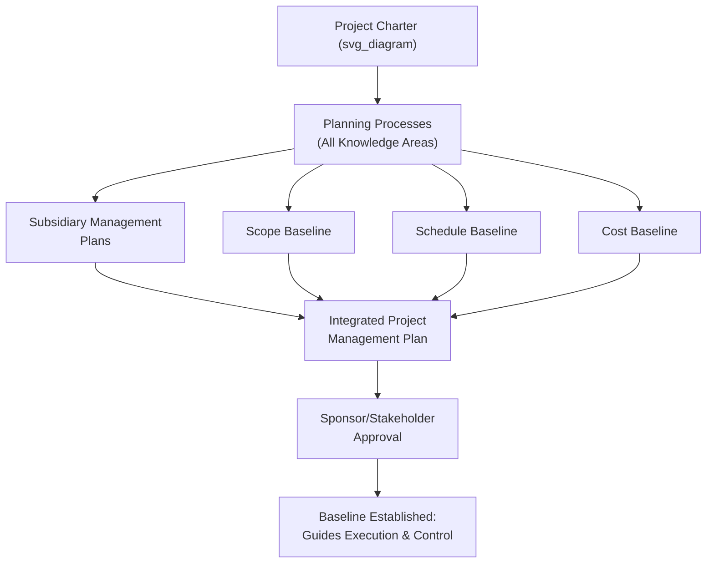
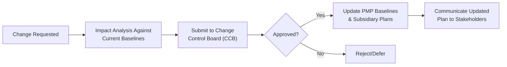

## Developing the Project Management Plan

### Definition

The **Project Management Plan (PMP)** is the comprehensive document that defines how a project will be executed, monitored, controlled, and closed. It integrates and consolidates all subsidiary management plans and baselines produced during planning into a single, coherent, approved document that guides the project team throughout the project's life cycle. Unlike the high-level Project Charter, the PMP is detailed, comprehensive, and serves as the primary reference for how the project will actually be managed.

### Purpose and Significance

- **Integrates subsidiary plans into a coherent whole** — the PMP is not a single standalone document but a collection of subsidiary management plans and baselines, integrated so that decisions in one area (e.g., schedule) are consistent with decisions in another (e.g., cost, risk).
- **Establishes baselines** — defines the approved scope, schedule, and cost baselines against which actual performance is measured throughout execution.
- **Guides execution and control** — provides the reference the project team, project manager, and stakeholders use to determine whether the project is on track and how to respond when it is not.
- **Formalizes stakeholder agreement** — once approved, it represents formal agreement among key stakeholders on how the project will be managed, reducing later disputes about process or approach.
- **Serves as the baseline for change control** — any change to major dependent components (i.e., the baselines) must go through the project's integrated change control process rather than being made informally.

### Charter vs. Project Management Plan — Key Distinction

| Attribute | Project Charter | Project Management Plan |
| --- | --- | --- |
| Purpose | Authorizes the project's existence | Defines how the project will be executed, monitored, and controlled |
| Level of detail | High-level | Detailed and comprehensive |
| Developed by | Sponsor (with PM input if assigned) | Project manager, with team and stakeholder input |
| Timing | Produced once, at initiation | Developed during planning; progressively elaborated and formally updated via change control throughout execution |
| Content | Business justification, objectives, high-level scope/risk/budget | Full set of subsidiary plans, baselines, and management approaches |

### Core Components of the Project Management Plan

The PMP consists of subsidiary management plans and baselines spanning every knowledge area:

#### Subsidiary Management Plans

| Plan | What It Defines |
| --- | --- |
| Scope Management Plan | How scope will be defined, validated, and controlled |
| Requirements Management Plan | How requirements will be analyzed, documented, and managed |
| Schedule Management Plan | How the schedule will be developed, monitored, and controlled |
| Cost Management Plan | How costs will be estimated, budgeted, and controlled |
| Quality Management Plan | Quality standards, assurance, and control approach |
| Resource Management Plan | How resources will be estimated, acquired, managed, and released |
| Communications Management Plan | Stakeholder information needs, methods, and frequency |
| Risk Management Plan | How risk management activities will be structured and performed |
| Procurement Management Plan | How procurement processes will be managed, from make-or-buy through contract closure |
| Stakeholder Engagement Plan | Strategies for effective stakeholder engagement based on their needs and interests |
| Change Management Plan | How changes will be authorized and incorporated |
| Configuration Management Plan | How to identify and manage changes to configurable project items |

#### Baselines

| Baseline | What It Captures |
| --- | --- |
| Scope Baseline | Approved scope statement, WBS, and WBS dictionary |
| Schedule Baseline | Approved version of the project schedule, used for comparison to actual progress |
| Cost Baseline | Approved, time-phased budget used for measuring cost performance |

### The Progressive Elaboration Process

The PMP is not produced in a single pass — it is developed iteratively as planning processes across each knowledge area generate their respective outputs, which are then integrated:

1. **Initial planning based on the charter** — the project manager begins with the high-level scope, objectives, and constraints defined in the charter.
2. **Knowledge-area planning processes executed** — scope, schedule, cost, quality, resource, communications, risk, procurement, and stakeholder planning processes each produce their subsidiary plan and, where applicable, contribute to baselines.
3. **Integration** — the project manager (often supported by the team) consolidates these subsidiary plans and baselines into a single, internally consistent Project Management Plan, resolving any conflicts between them (e.g., ensuring the risk management plan's contingency reserve is reflected in the cost baseline).
4. **Review and approval** — the integrated plan is reviewed and formally approved by the sponsor and/or steering committee, establishing the baseline against which the project will be measured.
5. **Progressive refinement during execution** — as the project progresses (particularly in iterative, incremental, or hybrid life cycles), the plan may be elaborated in further detail through approved updates via the change control process, especially for later phases not fully detailed at initial approval (**rolling wave planning**).

### Example: Building Toward an Integrated PMP

**Scenario:** A company is developing a new physical product (a wearable fitness tracker).

- **Scope Management Plan + Scope Baseline:** Defines the product's features (heart-rate monitoring, step counting, sleep tracking) via a WBS, explicitly excluding GPS tracking (deferred to a future product version).
- **Schedule Management Plan + Schedule Baseline:** Establishes a 9-month schedule from design through manufacturing readiness, with critical path activities identified (e.g., hardware component sourcing lead time).
- **Cost Management Plan + Cost Baseline:** Establishes a $1.2M budget, time-phased across design, prototyping, testing, and initial manufacturing setup, with a 10% contingency reserve informed by the risk management plan.
- **Risk Management Plan:** Identifies component supply chain delays as a top risk, with a documented response strategy (qualifying a secondary supplier) — this response's cost is reflected in the cost baseline's contingency reserve.
- **Quality Management Plan:** Establishes acceptance criteria for battery life (minimum 5 days) and water resistance rating, along with the testing protocol to verify them.
- **Integration:** The project manager consolidates these (and the remaining subsidiary plans) into a single PMP, checks for internal consistency (e.g., does the schedule allow enough time for the quality testing protocol defined in the Quality Management Plan?), and submits it for sponsor approval.

### Change Control and the PMP

Once approved, the PMP's baselines (scope, schedule, cost) become the reference point for measuring performance. Any change that would affect a baseline must go through **Integrated Change Control**:

**[Inference]** Subsidiary plans that are not part of the formal baselines (e.g., the communications management plan) are often treated with somewhat more flexibility for routine updates compared to the scope/schedule/cost baselines, since changes to communication approach typically don't carry the same cost/schedule/scope implications — though the degree of formality applied to updating any given subsidiary plan varies by organizational policy.

### PMP Development in Adaptive/Agile Contexts

In agile and adaptive life cycles, the "Project Management Plan" concept still exists conceptually but is typically far lighter-weight and more emergent:

- Detailed task-level planning happens iteration by iteration rather than comprehensively upfront.
- Formal baselines in the predictive sense (a fixed scope/schedule/cost baseline for the whole project) may be replaced by a prioritized product backlog and release-level forecasts, which are expected to evolve.
- **[Inference]** Hybrid projects often retain a lightweight, high-level PMP-equivalent (defining overall governance, roles, and integration points between predictive and agile workstreams) while delegating detailed execution planning to the agile team's own iteration-level practices — this is a commonly cited pattern in hybrid tailoring guidance rather than a single standardized template.

### Common Pitfalls

- **Treating the PMP as a static, "set and forget" document** — the plan should be a living reference, updated through change control as the project evolves, not a one-time artifact filed away after initial approval.
- **Developing subsidiary plans in isolation without integration** — producing a schedule, budget, and risk plan independently without reconciling them against each other (e.g., a schedule that doesn't reflect the risk plan's contingency time) undermines the PMP's core purpose of providing a coherent, consistent management approach.
- **Excessive upfront detail for later project phases** — particularly in longer or more uncertain projects, over-detailing distant future phases at initial planning can waste effort and require significant rework; **rolling wave planning** (planning near-term work in detail and future work at a higher level, to be elaborated closer to execution) addresses this.
- **Confusing the PMP with the Project Charter** — attempting to use the high-level charter as a substitute for the detailed planning the PMP requires, or conversely, front-loading charter-stage documents with PMP-level detail before the project is even authorized.

### Common Misconceptions

- **The PMP is not a single document type** — it is an integrated set of subsidiary plans and baselines; organizations may present it as one bound document or as a linked set of separate documents, but conceptually it is the *integration* that defines it, not a specific file format.
- **Approving the PMP does not mean the plan can never change** — baselines can be formally revised through change control; "baseline" means the current approved reference point for comparison, not an immutable fixed plan.
- **The PMP is not solely the project manager's individual creation** — while the PM typically leads its development and holds primary responsibility for integration, subsidiary plans are informed by input from the team, functional experts, and relevant stakeholders across each knowledge area.

### Related Topics

- Developing the Project Charter
- Work Breakdown Structure (WBS) Development
- Integrated Change Control Process
- Rolling Wave Planning (Progressive Elaboration)
- Schedule Baseline Development and Critical Path Method
- Cost Baseline Development and Earned Value Management
- Risk Management Planning
- Hybrid Project Management Approaches