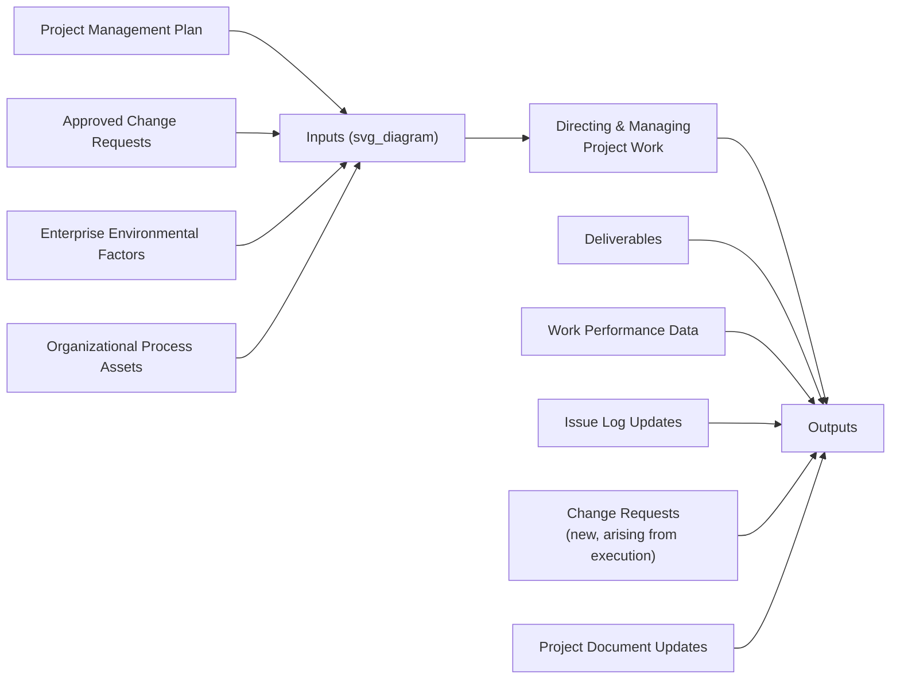
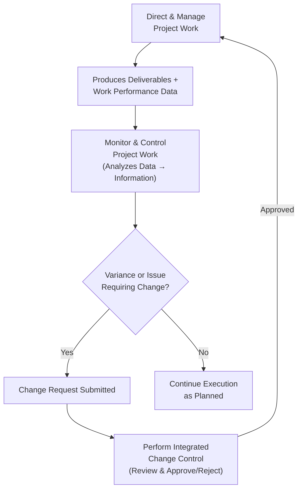

## Directing and Managing Project Work

### Definition

**Directing and Managing Project Work** is the integration management process of leading and performing the work defined in the project management plan, implementing approved changes, and producing the project's deliverables. It represents the core execution activity of the project — the point at which planning transitions into actual production of the product, service, or result the project was chartered to create.

### Purpose and Significance

- **Converts plans into deliverables** — this process is where the subsidiary plans and baselines established in the Project Management Plan are actually carried out to produce tangible outputs.
- **Generates work performance data** — as work is performed, raw observations and measurements (e.g., actual hours worked, actual costs incurred, technical performance measures, defect counts) are captured; this data feeds into monitoring and controlling processes.
- **Implements approved changes** — corrective actions, preventive actions, and defect repairs approved through integrated change control are executed here, not merely documented.
- **Coordinates people and resources** — the project manager directs the performance of planned activities, manages stakeholder engagement, and ensures resources (human, material, equipment) are applied as planned.
- **Maintains and updates project documents** — as work is performed, various project documents (issue log, lessons learned register, requirements traceability matrix, risk register) are actively maintained, not just referenced.

### Core Activities Within This Process

| Activity | Description |
| --- | --- |
| Performing planned activities | Executing the tasks and work packages defined in the schedule and scope baseline |
| Creating deliverables | Producing the actual outputs (product components, documents, services) the project is chartered to deliver |
| Staffing, training, and managing team members | Acquiring, developing, and directing the project team assigned to the work |
| Obtaining, managing, and using resources | Securing and applying materials, tools, equipment, and facilities as planned |
| Implementing planned methods and standards | Applying the quality standards, processes, and procedures defined in the subsidiary management plans |
| Managing communications | Executing the communications management plan — distributing information per the defined cadence and channels |
| Collecting and documenting lessons learned | Capturing lessons in real time as work is performed, rather than only at project closure |
| Monitoring implementation of approved changes | Ensuring approved corrective/preventive actions and defect repairs are actually carried out |
| Managing risks and implementing risk response activities | Executing planned risk responses as risk triggers occur |
| Managing sellers and suppliers | Administering vendor/contractor relationships and deliverables per procurement agreements |
| Managing stakeholder engagement | Actively engaging stakeholders per the stakeholder engagement plan, not merely informing them passively |

### Inputs, Tools, and Outputs (Simplified View)

- **Key inputs:** The approved Project Management Plan (all subsidiary plans and baselines), approved change requests (to be implemented), enterprise environmental factors, and organizational process assets (e.g., standard operating procedures, historical data).
- **Key outputs:**
  - **Deliverables** — the actual products, results, or capabilities produced.
  - **Work performance data** — raw, unanalyzed observations and measurements identified during execution (e.g., "task X is 60% complete," "12 defects found in module Y") — distinct from work performance *information* (analyzed/contextualized data) and work performance *reports* (compiled for stakeholder communication), which are produced in the Monitoring & Controlling process group.
  - **Issue log** — a running record of issues encountered, who owns resolution, and status.
  - **New change requests** — issues encountered during execution frequently surface the need for corrective action, preventive action, or defect repair, which must be routed through integrated change control before implementation.
  - **Project document updates** — updates to documents such as the activity list, assumption log, lessons learned register, requirements documentation, risk register, and stakeholder register as new information emerges.

### Work Performance Data vs. Information vs. Reports

A frequently tested and practically important distinction within this broader process area:

| Term | Definition | Example |
| --- | --- | --- |
| **Work Performance Data** | Raw observations and measurements identified during execution (this process) | "45 hours logged this week; 3 of 10 test cases passed" |
| **Work Performance Information** | Data analyzed and integrated based on relationships across areas (produced during Monitoring & Controlling) | "Schedule is 5% behind baseline; cost variance is within tolerance" |
| **Work Performance Reports** | Physical or electronic compilation of work performance information for decision-making, discussion, or action (also produced during Monitoring & Controlling) | A formatted monthly status dashboard sent to the steering committee |

**[Inference]** This three-tier data-information-report distinction is a structured framework commonly emphasized in PMI's PMBOK-aligned teaching materials to clarify how raw execution data is progressively transformed for different audiences and purposes; in day-to-day practice, project teams often use these terms somewhat more loosely or interchangeably than the formal definitions suggest.

### The Feedback Loop with Monitoring, Controlling, and Change Control

Directing and Managing Project Work does not operate in isolation — it exists in continuous feedback with the Monitor and Control Project Work process and the Perform Integrated Change Control process:

This illustrates that execution (Direct & Manage), oversight (Monitor & Control), and change governance (Integrated Change Control) form a continuous cycle throughout the project — not a one-time, linear sequence.

### Example: Directing and Managing Work on a Software Development Project

**Scenario:** A team is in the execution phase of building a customer analytics dashboard.

- **Performing planned activities:** Developers build dashboard components per the sprint/work package assignments defined in the schedule.
- **Creating deliverables:** Completed and tested dashboard modules are produced and staged for integration.
- **Managing the team:** The project manager conducts regular check-ins, resolves a resource conflict when a key developer is pulled onto an unrelated urgent production issue.
- **Collecting work performance data:** The team logs actual hours spent per task, number of defects found in testing, and percentage of planned features completed this period.
- **Issue log update:** A third-party data API the dashboard depends on is found to have undocumented rate limits, logged as an issue requiring resolution.
- **New change request generated:** Resolving the API rate-limit issue requires additional caching infrastructure not in the original scope — this is submitted as a change request rather than implemented informally, since it affects the cost and schedule baselines.
- **Risk response implementation:** A previously identified risk (vendor API instability) materializes; the pre-planned response (switching to a cached fallback data source) is executed.
- **Lessons learned captured in real time:** The team notes in the lessons-learned register that third-party API documentation should be independently verified earlier in future projects, rather than waiting until project closure to capture this insight.

### Common Pitfalls

- **Implementing changes without going through integrated change control** — informally accommodating scope, schedule, or cost changes during execution undermines the baseline's integrity and can lead to unmanaged scope creep.
- **Failing to capture work performance data consistently** — inconsistent or incomplete data collection during execution weakens the accuracy of later monitoring and controlling analysis (e.g., earned value calculations).
- **Delaying lessons-learned documentation until project closure** — waiting until the end to capture lessons risks losing valuable, timely detail that could have informed the remainder of the project's execution.
- **Treating the issue log as optional or informal** — failing to maintain a structured issue log can result in unresolved issues being forgotten or unaddressed until they escalate into larger problems.

### Common Misconceptions

- **"Directing and Managing Project Work" is not synonymous with "the Executing process group" in its entirety** — while it is the central process within Executing, other processes (e.g., Manage Quality, Acquire Resources, Manage Communications, Conduct Procurements) are also part of Executing and operate alongside it, each with their own specific focus.
- **Work performance data is not the same as a status report** — data is raw and unanalyzed; a status report is a communicated, formatted output produced later, after data has been analyzed into information.
- **Executing approved changes is not optional once change control approves them** — once a change request is formally approved, implementing it is part of this process's core responsibility, not a discretionary follow-up action.

### Related Topics

- Developing the Project Management Plan
- Monitor and Control Project Work
- Integrated Change Control Process
- Work Performance Data, Information, and Reports (Detailed Distinctions)
- Issue Log Management
- Risk Response Implementation
- Lessons Learned Documentation Throughout the Life Cycle
- Managing Project Teams and Resource Direction