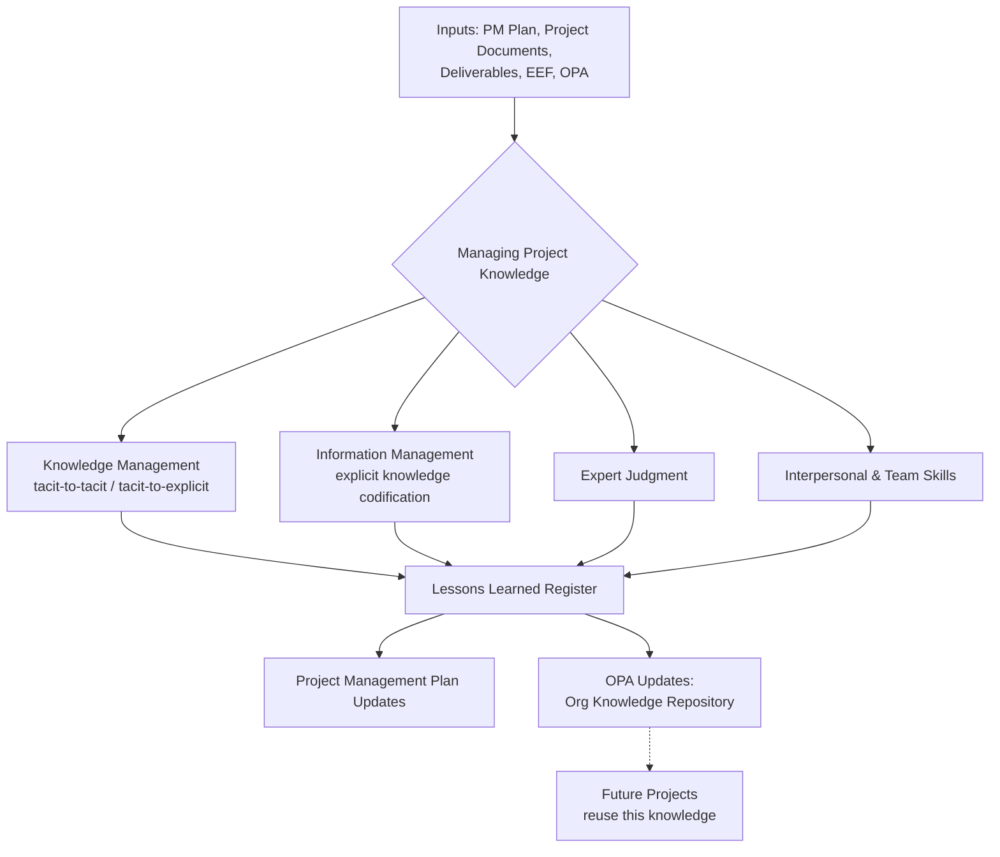

## Managing Project Knowledge

### Overview

Managing Project Knowledge is the process of using existing knowledge and creating new knowledge to achieve project objectives while contributing to organizational learning. It is one of the processes within the Project Integration Management knowledge area (PMBOK Guide, 6th/7th Edition framing) and sits between Direct and Manage Project Work and Monitor and Control Project Work in the process flow.

The process addresses two intertwined objectives:

- Leveraging existing organizational knowledge to improve or achieve project deliverables
- Making project-generated knowledge available to support future organizational operations and projects

### Why This Process Exists

Prior to its formal introduction (PMBOK 6th Edition, 2017), knowledge transfer was often treated as an informal byproduct of lessons learned documentation, usually compiled only at project close — by which point most of the useful tacit knowledge held by team members had already dissipated or the team had disbanded. Managing Project Knowledge formalizes knowledge capture as a **continuous activity throughout the project lifecycle**, not a closeout task.

### Core Concepts: Knowledge Types

**Explicit Knowledge**

Knowledge that can be readily codified using words, pictures, and numbers. Easily communicated and shared.

- Examples: documentation, procedures, technical specifications, process diagrams

**Tacit Knowledge**

Personal knowledge that is difficult to articulate — beliefs, experience, insight, "know-how." Acquired through prolonged practice.

- Examples: a senior engineer's intuition for diagnosing a subsystem failure, a negotiator's sense of when a vendor is bluffing

The critical management challenge is converting tacit knowledge into explicit knowledge before it walks out the door with the person holding it — this is the central risk this process manages.

### Inputs, Tools & Techniques, Outputs (ITTO)

#### Inputs

- **Project management plan** — all subsidiary components
- **Project documents** — lessons learned register, project team assignments, resource breakdown structure, stakeholder register, source selection criteria
- **Deliverables** — the tangible/intangible outputs produced
- **Enterprise environmental factors (EEF)** — organizational culture, geographic distribution of facilities/resources, organizational knowledge experts, legal/regulatory requirements
- **Organizational process assets (OPA)** — policies on knowledge/information/documentation management, templates, prior lessons learned repositories

#### Tools & Techniques

**1. Expert Judgment**

Individuals/groups with specialized knowledge in: knowledge management, information management, organizational learning, knowledge/information management tools, relevant technical/project domain, understanding of the wider organizational context.

**2. Knowledge Management**

Techniques to connect people to share tacit knowledge:

- Networking and communities of practice
- Meetings (including virtual)
- Work shadowing / reverse shadowing
- Discussion forums (e.g., focus groups)
- Knowledge fairs and events
- Workshops
- Storytelling
- Creative techniques for sharing tacit-to-tacit and tacit-to-explicit transfer
- Training that involves interaction between learners

**3. Information Management**

Techniques to codify explicit knowledge for sharing:

- Methods for codifying explicit knowledge (e.g., library services)
- Lessons learned register
- Library services
- Information gathering (e.g., web searches, reading published articles)

**4. Interpersonal and Team Skills**

- **Active listening** — reduces misunderstanding, improves communication and knowledge sharing
- **Facilitation** — guiding a group toward a successful decision, solution, or conclusion (e.g., building consensus)
- **Leadership** — communicating vision, inspiring project team to focus on important knowledge management activities
- **Political awareness** — understanding power relationships within and around the organization; important for facilitating knowledge sharing across organizational boundaries

#### Outputs

- **Lessons learned register** — created early and used throughout, capturing category, description, impact, recommendations, proposed actions
- **Project management plan updates** — any component may require change
- **Organizational process assets updates** — updates to the OPA repository

### Process Flow Diagram

### Knowledge Transfer Model (visual)

<svg xmlns="http://www.w3.org/2000/svg" viewBox="0 0 720 300" font-family="Arial, sans-serif">
<text x="360" y="24" text-anchor="middle" font-size="15" font-weight="bold">Tacit ↔ Explicit Knowledge Conversion (svg_diagram)</text>
<rect x="30" y="60" width="180" height="80" rx="8" fill="#dbeafe" stroke="#2563eb" stroke-width="1.5" />
<text x="120" y="95" text-anchor="middle" font-size="13" font-weight="bold">Tacit</text>
<text x="120" y="115" text-anchor="middle" font-size="11">(Experience, Intuition)</text>
<rect x="510" y="60" width="180" height="80" rx="8" fill="#dcfce7" stroke="#16a34a" stroke-width="1.5" />
<text x="600" y="95" text-anchor="middle" font-size="13" font-weight="bold">Explicit</text>
<text x="600" y="115" text-anchor="middle" font-size="11">(Documents, Procedures)</text>
<line x1="210" y1="80" x2="510" y2="80" stroke="#6b7280" stroke-width="1.5" marker-end="url(#arrow)" />
<text x="360" y="70" text-anchor="middle" font-size="11">Externalization (Codify)</text>
<line x1="510" y1="120" x2="210" y2="120" stroke="#6b7280" stroke-width="1.5" marker-end="url(#arrow)" />
<text x="360" y="145" text-anchor="middle" font-size="11">Internalization (Learn by doing)</text>
<rect x="270" y="200" width="180" height="70" rx="8" fill="#fef3c7" stroke="#d97706" stroke-width="1.5" />
<text x="360" y="230" text-anchor="middle" font-size="13" font-weight="bold">Socialization</text>
<text x="360" y="250" text-anchor="middle" font-size="11">Tacit → Tacit (mentoring, shadowing)</text>
<line x1="120" y1="140" x2="330" y2="200" stroke="#9ca3af" stroke-width="1.2" stroke-dasharray="4,3" />
<line x1="600" y1="140" x2="390" y2="200" stroke="#9ca3af" stroke-width="1.2" stroke-dasharray="4,3" />
</svg>

### Key Points

- Managing Project Knowledge runs **continuously** across the project lifecycle, not just at closure
- Its primary output, the **lessons learned register**, is a *living document* — created early and updated throughout
- The process has a dual benefit: improving the *current* project and enriching the *organization's* knowledge base for future projects
- Success depends heavily on organizational culture — a "trust and blame-free" environment is a prerequisite for people to share tacit knowledge honestly, including failures
- Knowledge management is distinct from **information management**: knowledge management deals with tacit knowledge (people-centric), information management deals with explicit knowledge (systems-centric)

### Example

**Scenario:** A software project team discovers midway through development that a particular third-party API has undocumented rate-limiting behavior that caused two sprint delays.

**Applying the process:**

1. The technical lead documents the discovery immediately in the lessons learned register (not at project end) — category: "Technical/Vendor Risk," impact: "Sprint delay, 2 weeks," recommendation: "Add rate-limit handling to integration checklist for future API vendor evaluations"
2. A brief knowledge-sharing session (communities of practice technique) is held so other teams using the same vendor are alerted before they hit the same issue
3. At project closeout, this lesson is codified into the organization's **vendor evaluation checklist** (an OPA update) — converting the tacit "we got burned by this" experience into explicit, reusable organizational knowledge

### Common Exam/Practice Pitfalls [Inference]

- Confusing this process with **Close Project or Phase**, where lessons learned are finalized/archived rather than actively managed — Managing Project Knowledge is proactive and ongoing; Close Project or Phase is where the register is formally closed out
- Assuming knowledge management tools are purely technological (e.g., wikis, databases) — the PMBOK framework emphasizes **interpersonal techniques** (storytelling, shadowing, networking) as primary, with information systems as secondary support
- Treating the lessons learned register as a single output created once — in practice it accumulates entries throughout, and is referenced as an input to nearly every other Integration Management process

### Related Topics

- Direct and Manage Project Work
- Monitor and Control Project Work
- Close Project or Phase
- Organizational Process Assets (OPA) framework
- Communities of Practice and Knowledge Management systems
- Organizational Culture and Psychological Safety in project environments
- Lessons Learned Register vs. Lessons Learned Repository (project-level vs. organizational-level)