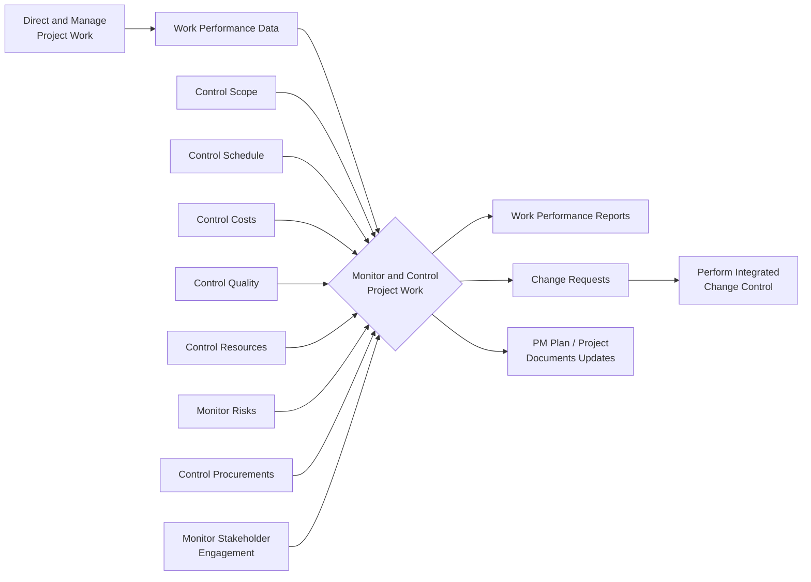

## Monitoring and Controlling Project Work

### Overview

Monitor and Control Project Work is the process of tracking, reviewing, and reporting overall progress to meet the performance objectives defined in the project management plan. It is a Project Integration Management process that runs throughout the entire project lifecycle, providing stakeholders with a current understanding of project status, forecasts, and the work completed to date.

This process is where the project manager compares actual performance against the baseline (scope, schedule, cost) and decides whether corrective action, preventive action, or a formal change request is needed.

### Purpose and Position in the Process Flow

Monitor and Control Project Work is the **integrating** monitoring process — it pulls together data and outputs from every other Monitoring and Controlling process across all knowledge areas (scope, schedule, cost, quality, resources, risk, procurement, stakeholders) into a single, coherent view of project health.

### Inputs, Tools & Techniques, Outputs (ITTO)

#### Inputs

- **Project management plan** — any/all components serve as the baseline for comparison
- **Project documents** — assumption log, basis of estimates, cost forecasts, issue log, lessons learned register, milestone list, quality reports, risk register, risk report, schedule forecasts
- **Work performance information** — from various Control processes (e.g., scope, schedule, cost) — this is *processed* data, distinct from raw work performance data
- **Agreements** — procurement-related terms and conditions
- **Enterprise environmental factors (EEF)** — government/industry standards, stakeholder risk thresholds, organizational information systems (PMIS)
- **Organizational process assets (OPA)** — organizational communication requirements, financial control procedures, monitoring/reporting methods, risk control procedures, issue/defect management procedures

#### Tools & Techniques

**1. Expert Judgment**

Applied for interpreting information from monitoring/controlling processes, determining response actions, forecasting techniques.

**2. Data Analysis**

- **Alternatives analysis** — selecting the best corrective action course
- **Cost-benefit analysis** — determining the most cost-effective corrective action for deviations
- **Earned value analysis (EVA)** — providing an integrated view of scope, schedule, and cost baseline (see below)
- **Root cause analysis** — identifying the underlying source of a variance
- **Trend analysis** — determining if project performance is improving/deteriorating over time
- **Variance analysis** — comparing planned vs. actual results

**3. Decision Making**

- **Voting** — e.g., unanimity, majority, plurality when evaluating alternative responses to variances

**4. Meetings**

Face-to-face, virtual, formal, or informal — to discuss and decide on appropriate responses to variances.

#### Outputs

- **Work performance reports** — the physical/electronic representation of work performance information compiled for decision-making, action, or awareness (e.g., status reports, memos, dashboards, recommendations)
- **Change requests** — for corrective action, preventive action, or defect repair (feeds into Perform Integrated Change Control)
- **Project management plan updates** — any component
- **Project documents updates** — cost forecasts, issue log, lessons learned register, risk register, schedule forecasts

### Core Technique: Earned Value Management (EVM)

EVM is the primary quantitative technique for this process, integrating scope, schedule, and cost.

**Core Values:**

| Term | Symbol | Definition |
| --- | --- | --- |
| Planned Value | PV | Authorized budget for scheduled work |
| Earned Value | EV | Budgeted value of work actually completed |
| Actual Cost | AC | Actual cost incurred for work completed |
| Budget at Completion | BAC | Total planned budget |

**Key Formulas:**

$$SV = EV - PV$$

$$CV = EV - AC$$

$$SPI = \frac{EV}{PV}$$

$$CPI = \frac{EV}{AC}$$

$$EAC = \frac{BAC}{CPI}$$

$$ETC = EAC - AC$$

$$VAC = BAC - EAC$$

**Interpretation:**

- $SV$ or $SPI$ < baseline (0 or 1 respectively) → project is behind schedule
- $CV$ or $CPI$ < baseline (0 or 1 respectively) → project is over budget
- $CPI$ > 1 → cost-efficient performance (under budget for work completed)

### Example

**Scenario:** A construction project has a BAC of $500,000. At the reporting date:

- PV = $200,000 (work scheduled to date)
- EV = $180,000 (value of work actually completed)
- AC = $210,000 (actual cost spent)

**Analysis:**

$$SV = 180{,}000 - 200{,}000 = -20{,}000 \text{ (behind schedule)}$$

$$CV = 180{,}000 - 210{,}000 = -30{,}000 \text{ (over budget)}$$

$$SPI = \frac{180{,}000}{200{,}000} = 0.90$$

$$CPI = \frac{180{,}000}{210{,}000} = 0.857$$

**Forecast at current performance:**

$$EAC = \frac{500{,}000}{0.857} \approx \$583{,}430$$

**Interpretation:** The project is both behind schedule (SPI < 1) and over budget (CPI < 1). If this trend continues, the project will likely cost approximately $83,430 more than planned. The project manager would raise a **change request** — likely a corrective action — to bring performance back toward baseline, which then routes through Perform Integrated Change Control.

### Corrective vs. Preventive Action vs. Defect Repair

- **Corrective action** — intentional activity that realigns the performance of project work with the project management plan (reactive, addresses an existing deviation)
- **Preventive action** — intentional activity that ensures the future performance of project work is aligned with the plan (proactive, addresses a potential future deviation)
- **Defect repair** — intentional activity to modify a nonconforming product or product component

### Key Points

- Monitor and Control Project Work is **continuous** — it happens throughout execution, not at fixed gates only
- It is the process where **work performance data** (raw, from Direct and Manage Project Work) is transformed through analysis into **work performance information** (contextualized, from Control processes) and then packaged into **work performance reports** (formatted for stakeholders) — this three-stage data transformation is a frequently tested distinction
- All change requests generated here must pass through **Perform Integrated Change Control** before implementation
- EVM is the single most heavily weighted quantitative technique in this process for exam and practical purposes

### Data Transformation Flow

<svg viewBox="0 0 700 220" xmlns="http://www.w3.org/2000/svg" font-family="Arial, sans-serif">
<text x="350" y="24" text-anchor="middle" font-size="15" font-weight="bold">Work Performance Data Flow (svg_diagram)</text>
<rect x="20" y="70" width="180" height="70" rx="8" fill="#fee2e2" stroke="#dc2626" stroke-width="1.5"/>
<text x="110" y="100" text-anchor="middle" font-size="12" font-weight="bold">Work Performance</text>
<text x="110" y="116" text-anchor="middle" font-size="12" font-weight="bold">Data</text>
<text x="110" y="132" text-anchor="middle" font-size="10">(raw observations)</text>
<line x1="200" y1="105" x2="260" y2="105" stroke="#6b7280" stroke-width="1.5" marker-end="url(#a2)"/>
<rect x="260" y="70" width="180" height="70" rx="8" fill="#fef9c3" stroke="#ca8a04" stroke-width="1.5"/>
<text x="350" y="100" text-anchor="middle" font-size="12" font-weight="bold">Work Performance</text>
<text x="350" y="116" text-anchor="middle" font-size="12" font-weight="bold">Information</text>
<text x="350" y="132" text-anchor="middle" font-size="10">(analyzed, contextualized)</text>
<line x1="440" y1="105" x2="500" y2="105" stroke="#6b7280" stroke-width="1.5" marker-end="url(#a2)"/>
<rect x="500" y="70" width="180" height="70" rx="8" fill="#dcfce7" stroke="#16a34a" stroke-width="1.5"/>
<text x="590" y="100" text-anchor="middle" font-size="12" font-weight="bold">Work Performance</text>
<text x="590" y="116" text-anchor="middle" font-size="12" font-weight="bold">Reports</text>
<text x="590" y="132" text-anchor="middle" font-size="10">(formatted for stakeholders)</text>

<text x="110" y="165" text-anchor="middle" font-size="10">Direct & Manage</text>

<text x="350" y="165" text-anchor="middle" font-size="10">Control processes</text>

<text x="590" y="165" text-anchor="middle" font-size="10">Monitor & Control</text>

<defs>
<marker id="a2" markerWidth="8" markerHeight="8" refX="6" refY="3" orient="auto">
<path d="M0,0 L6,3 L0,6 Z" fill="#6b7280"/>
</marker>
</defs>
</svg>

### Common Practice Pitfalls [Inference]

- Confusing **work performance data**, **information**, and **reports** — remember the sequence: data (raw) → information (analyzed) → reports (communicated)
- Believing this process itself *implements* changes — it only *identifies the need* for change and generates change requests; implementation happens in Direct and Manage Project Work after approval via Perform Integrated Change Control
- Forgetting that this process also monitors **risk** as an integrated part of overall project health, not just scope/schedule/cost

### Related Topics

- Direct and Manage Project Work
- Perform Integrated Change Control
- Earned Value Management (deep dive: TCPI, forecasting variants)
- Control Schedule / Control Costs / Control Scope
- Work Performance Data vs. Information vs. Reports
- Project Management Information Systems (PMIS)