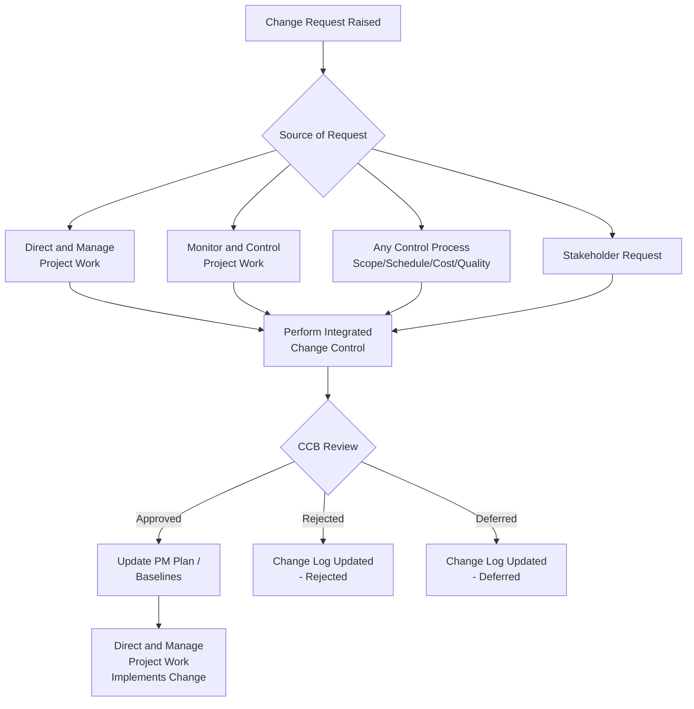

## Performing Integrated Change Control

### Overview

Perform Integrated Change Control (PICC) is the process of reviewing all change requests, approving changes and managing changes to deliverables, project documents, and the project management plan, and communicating the decisions. It is the **gatekeeping process** of Project Integration Management — no approved change reaches implementation without passing through it.

This process runs from project inception through completion and is the mechanism that keeps the project management plan, scope baseline, schedule baseline, and cost baseline synchronized whenever change occurs.

### Purpose and Position in the Process Flow

PICC receives change requests from virtually every other process in the project (any Control process, Direct and Manage Project Work, Monitor and Control Project Work, stakeholders, etc.) and is the **sole authorized channel** through which those requests become approved, deferred, or rejected changes.

### Inputs, Tools & Techniques, Outputs (ITTO)

#### Inputs

- **Project management plan** — change management plan, configuration management plan, scope baseline, schedule baseline, cost baseline
- **Project documents** — basis of estimates, requirements traceability matrix, risk report
- **Work performance reports** — resource availability, schedule/cost data, earned value reports, burnup/burndown charts
- **Change requests** — the primary trigger input
- **Enterprise environmental factors (EEF)** — legal/regulatory requirements, government/industry standards, contractual/legal provisions
- **Organizational process assets (OPA)** — change control procedures, procedures for approving/issuing change authorizations, process measurement database, project documentation repository

#### Tools & Techniques

**1. Expert Judgment**

From stakeholders with specialized knowledge — technical, management, consultants, other subject matter experts.

**2. Change Control Tools**

Manual or automated systems to support **configuration management** and **change management**:

- **Configuration control** — focuses on the specification of both deliverables and processes (identifying, documenting, controlling changes to product/service/result characteristics)
- **Change control** — focuses on identifying, documenting, and controlling changes to the project and baselines

**3. Data Analysis**

- **Alternatives analysis** — evaluating options for handling variances/deviations
- **Cost-benefit analysis** — assessing whether a change is worth its cost

**4. Decision Making**

- **Voting** — unanimity, majority, or plurality decision rules
- **Autocratic decision making** — one individual takes responsibility for the decision on behalf of the group

**5. Meetings**

**Change Control Board (CCB)** meetings — the formal forum for reviewing and dispositioning change requests.

#### Outputs

- **Approved change requests** — feed directly into Direct and Manage Project Work for implementation
- **Project management plan updates** — any component affected by the approved change
- **Project documents updates** — including the **change log**

### Core Concepts

**Change Control Board (CCB)**

A formally chartered group responsible for reviewing, evaluating, approving, delaying, or rejecting changes, and for recording/communicating decisions. CCB composition, roles, and authority levels are documented in the **change management plan** and vary by organization — may include the sponsor, PM, functional managers, and key stakeholders.

**Configuration Management System**

A subsystem of the overall project management system, consisting of the collection of formal documented procedures used to apply technical/administrative direction and surveillance to:

- Identify and document the functional/physical characteristics of a product, result, service, or component
- Control any changes to such characteristics
- Record and report each change and its implementation status
- Support audit of products/components for conformance to requirements

**Baseline Integrity**

Every approved change is integrated back into the relevant baseline(s) — scope, schedule, and/or cost — so that future performance measurement (e.g., EVM in Monitor and Control Project Work) reflects the current authorized plan, not the original one.

### Example

**Scenario:** During execution of a software project, a key stakeholder requests an additional reporting module not in the original scope. The developer estimates it will add 3 weeks and $15,000.

**Applying the process:**

1. The request is formally logged as a **change request** in the change management system (not implemented informally)
2. The PM performs **alternatives analysis** — could the module be phased into a later release instead of the current one?
3. **Cost-benefit analysis** is conducted — the stakeholder argues the module prevents a compliance risk downstream
4. The request goes to the **CCB** for review; supporting data includes updated cost/schedule impact and a risk report entry
5. CCB votes to approve with modification — reduced scope (a lighter version of the module) to cut the schedule impact to 1.5 weeks
6. Output: **approved change request** (modified) → scope baseline, schedule baseline, and cost baseline are all updated → **change log** entry recorded → Direct and Manage Project Work implements the approved (modified) module

### Change Request Disposition Flow

<svg xmlns="http://www.w3.org/2000/svg" viewBox="0 0 700 260" font-family="Arial, sans-serif">
<text x="350" y="24" text-anchor="middle" font-size="15" font-weight="bold">Change Request Disposition (svg_diagram)</text>
<rect x="270" y="50" width="160" height="55" rx="8" fill="#dbeafe" stroke="#2563eb" stroke-width="1.5" />
<text x="350" y="82" text-anchor="middle" font-size="12" font-weight="bold">Change Request</text>
<line x1="350" y1="105" x2="350" y2="140" stroke="#6b7280" stroke-width="1.5" marker-end="url(#a3)" />
<polygon points="350,140 430,175 350,210 270,175" fill="#fef9c3" stroke="#ca8a04" stroke-width="1.5" />
<text x="350" y="180" text-anchor="middle" font-size="11" font-weight="bold">CCB Review</text>
<line x1="270" y1="175" x2="140" y2="175" stroke="#6b7280" stroke-width="1.5" marker-end="url(#a3)" />
<rect x="20" y="150" width="140" height="50" rx="8" fill="#dcfce7" stroke="#16a34a" stroke-width="1.5" />
<text x="90" y="180" text-anchor="middle" font-size="11" font-weight="bold">Approved</text>
<line x1="430" y1="175" x2="560" y2="175" stroke="#6b7280" stroke-width="1.5" marker-end="url(#a3)" />
<rect x="560" y="150" width="140" height="50" rx="8" fill="#fee2e2" stroke="#dc2626" stroke-width="1.5" />
<text x="630" y="180" text-anchor="middle" font-size="11" font-weight="bold">Rejected</text>
<line x1="350" y1="210" x2="350" y2="240" stroke="#6b7280" stroke-width="1.5" marker-end="url(#a3)" />
<rect x="280" y="230" width="140" height="30" rx="8" fill="#f3f4f6" stroke="#6b7280" stroke-width="1.5" />
<text x="350" y="250" text-anchor="middle" font-size="11" font-weight="bold">Deferred</text>
</svg>

### Key Points

- **Every** change request — whether it originates as a corrective action, preventive action, defect repair, or a change to a deliverable/plan/document — must go through PICC. There are no exceptions in the formal framework
- PICC runs from **project start to finish**, not just during execution — even changes proposed before the project formally begins in some frameworks are subject to a review gate
- The **change log** is the authoritative record of all change request dispositions (approved, rejected, deferred) and is a project document updated continuously
- **Configuration management** and **change control** are complementary but distinct: configuration management governs *what* the product/deliverable characteristics are; change control governs *how* changes to the project (and its baselines) are processed

### Common Practice Pitfalls [Inference]

- Assuming small/informal changes can bypass the CCB — in a properly implemented change control system, the *threshold* for CCB review is defined in the change management plan, but the *process* of logging and disposition still applies to all changes
- Confusing **approved change requests** (output of PICC) with **change requests** (input to PICC) — a change request only becomes "approved" after passing through this process
- Believing PICC *implements* the change — it does not; implementation is the responsibility of Direct and Manage Project Work

### Next Steps

- **Related Topics**
  - Direct and Manage Project Work
  - Monitor and Control Project Work
  - Change Management Plan vs. Configuration Management Plan
  - Change Control Board (CCB) charter design and authority levels
  - Baseline management (scope, schedule, cost)
  - Close Project or Phase