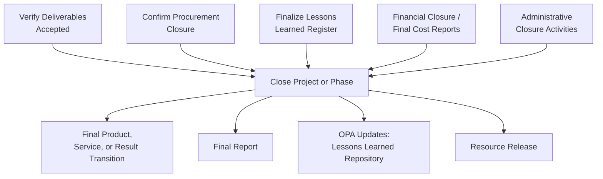

## Closing the Project or Phase

### Overview

Close Project or Phase is the process of finalizing all activities for the project, phase, or contract. It is the last Project Integration Management process and, in a predictive lifecycle, typically executes once per phase and once at overall project completion. This process verifies that defined processes are completed within all Process Groups, and formally establishes that the project or phase is finished.

Closure applies regardless of the reason for ending — successful completion, cancellation, or termination — the process still runs to formally close out the work performed.

### Purpose and Position in the Process Flow

Close Project or Phase is the terminal integration process. It draws on outputs accumulated across the entire project (lessons learned register, all approved changes, final deliverables, procurement documentation) and converts them into final, archived, organizationally reusable records.

### Inputs, Tools & Techniques, Outputs (ITTO)

#### Inputs

- **Project charter** — success criteria against which the project is evaluated
- **Project management plan** — all components
- **Project documents** — assumption log, basis of estimates, change log, issue log, lessons learned register, milestone list, project communications, quality control measurements, quality reports, requirements documentation, risk register, risk report
- **Accepted deliverables** — from Control Quality/Validate Scope
- **Business documents** — business case, benefits management plan
- **Agreements** — for procurement closure requirements
- **Procurement documentation** — collected/indexed for archiving
- **Organizational process assets (OPA)** — project/phase closure guidelines or requirements (audits, evaluations, transition criteria)

#### Tools & Techniques

**1. Expert Judgment**

From individuals/groups with specialized knowledge in administrative closure, legal/procurement, regulatory compliance, other relevant disciplines.

**2. Data Analysis**

- **Document analysis** — assessing project documents for lessons and closure completeness
- **Regression analysis** — analyzing interrelationships between different project variables
- **Trend analysis** — validating models used and assessing whether models need adjustment for future projects
- **Variance analysis** — reviewing planned vs. actual to determine variance/impact for lessons learned

**3. Meetings**

Face-to-face, virtual, formal, or informal — to confirm deliverables have been accepted, validate exit criteria satisfied, formalize completion, evaluate team member satisfaction.

#### Outputs

- **Project documents updates** — lessons learned register (final updates including final lessons)
- **Final product, service, or result transition** — the handoff to operations, another phase, or another team
- **Final report** — provides a summary of project performance, including:
  - Summary description of project/phase scope, quality, cost, schedule
  - Summary of validated deliverables against success criteria and completion/exit criteria
  - Summary of how the project met business needs identified in the business case
  - Summary of any risks/issues encountered and how they were addressed
- **Organizational process assets updates** — closure documents, historical information/lessons learned repository transferred to knowledge base

### Core Activities Performed During Closure

**Administrative Closure**

- Collecting project/phase records
- Auditing project success or failure
- Managing knowledge sharing/transfer
- Identifying lessons learned
- Archiving project information for future use

**Financial Closure**

- Ensuring all costs are charged to the project
- Closing project accounts
- Final cost reporting

**Procurement Closure**

- Confirming formal acceptance of the seller's work
- Verifying that all deliverables/work were acceptable
- Confirming final payments, updating records to reflect final results
- Archiving procurement information for future use

**Resource Release**

- Releasing project team members and physical/material resources for reassignment to other work

### Example

**Scenario:** A civil engineering project constructing a municipal bridge reaches physical completion. All contracted work has been performed by the general contractor.

**Applying the process:**

1. **Validate Scope** has already confirmed all deliverables (bridge structure, safety inspections, documentation) are formally accepted by the client
2. The PM conducts **document analysis** across the risk register, issue log, and change log to extract closure-relevant lessons — e.g., recurring delays tied to a specific material supplier
3. **Procurement closure** activities confirm the general contractor's final invoice matches contracted terms; final payment released; procurement file archived
4. A closure meeting is held with the client and city engineering department to formally accept transition of the bridge into municipal operations (**final product transition**)
5. The **final report** is compiled — summarizing that the bridge was delivered 2 weeks behind the original schedule (with root cause and mitigation documented) but within 1% of the approved cost baseline
6. Lessons learned register is finalized and submitted to the organization's **lessons learned repository** (OPA update) for use by future infrastructure projects
7. Team members are released to their functional departments or reassigned to new projects

### Closure Activities Overview

<svg xmlns="http://www.w3.org/2000/svg" viewBox="0 0 720 260" font-family="Arial, sans-serif">
<text x="360" y="24" text-anchor="middle" font-size="15" font-weight="bold">Close Project or Phase — Activity Clusters (svg_diagram)</text>
<rect x="20" y="50" width="150" height="70" rx="8" fill="#dbeafe" stroke="#2563eb" stroke-width="1.5" />
<text x="95" y="80" text-anchor="middle" font-size="12" font-weight="bold">Administrative</text>
<text x="95" y="96" text-anchor="middle" font-size="12" font-weight="bold">Closure</text>
<text x="95" y="112" text-anchor="middle" font-size="9">records, audits, KM</text>
<rect x="190" y="50" width="150" height="70" rx="8" fill="#dcfce7" stroke="#16a34a" stroke-width="1.5" />
<text x="265" y="80" text-anchor="middle" font-size="12" font-weight="bold">Financial</text>
<text x="265" y="96" text-anchor="middle" font-size="12" font-weight="bold">Closure</text>
<text x="265" y="112" text-anchor="middle" font-size="9">final costs, accounts</text>
<rect x="360" y="50" width="150" height="70" rx="8" fill="#fef9c3" stroke="#ca8a04" stroke-width="1.5" />
<text x="435" y="80" text-anchor="middle" font-size="12" font-weight="bold">Procurement</text>
<text x="435" y="96" text-anchor="middle" font-size="12" font-weight="bold">Closure</text>
<text x="435" y="112" text-anchor="middle" font-size="9">acceptance, payment</text>
<rect x="530" y="50" width="150" height="70" rx="8" fill="#fee2e2" stroke="#dc2626" stroke-width="1.5" />
<text x="605" y="80" text-anchor="middle" font-size="12" font-weight="bold">Resource</text>
<text x="605" y="96" text-anchor="middle" font-size="12" font-weight="bold">Release</text>
<text x="605" y="112" text-anchor="middle" font-size="9">team, materials</text>
<line x1="95" y1="120" x2="360" y2="180" stroke="#9ca3af" stroke-width="1.2" stroke-dasharray="4,3" />
<line x1="265" y1="120" x2="360" y2="180" stroke="#9ca3af" stroke-width="1.2" stroke-dasharray="4,3" />
<line x1="435" y1="120" x2="360" y2="180" stroke="#9ca3af" stroke-width="1.2" stroke-dasharray="4,3" />
<line x1="605" y1="120" x2="360" y2="180" stroke="#9ca3af" stroke-width="1.2" stroke-dasharray="4,3" />
<rect x="270" y="180" width="180" height="55" rx="8" fill="#ede9fe" stroke="#7c3aed" stroke-width="1.5" />
<text x="360" y="205" text-anchor="middle" font-size="12" font-weight="bold">Final Report +</text>
<text x="360" y="222" text-anchor="middle" font-size="12" font-weight="bold">OPA Updates</text>
</svg>

### Key Points

- Close Project or Phase executes **once per phase** (for multi-phase projects) and **once at project end** — phase closure is not optional even if the project continues
- The process applies **regardless of outcome** — projects terminated early or cancelled still require formal closure activities
- The **final report** is a distinct output from the lessons learned register — the final report summarizes overall performance against the charter's success criteria; the lessons learned register captures learnings for future reuse
- Procurement closure is distinct from and typically precedes overall project/phase closure when contracts are involved — confirmed via the **Control Procurements** process, then finalized here

### Common Practice Pitfalls [Inference]

- Assuming Close Project or Phase happens only at the very end of a project — in a multi-phase predictive lifecycle, it recurs at the end of **every phase**
- Confusing **project success** (met business case/benefits) with **process closure** (administrative completion) — a project can be formally closed even if it did not fully achieve its intended benefits (this would be documented in the final report)
- Overlooking **resource release** as a formal output-adjacent activity — team reassignment has real organizational planning implications and is often tracked separately by resource/functional managers

### Related Topics

- Validate Scope (deliverable acceptance prerequisite)
- Control Procurements
- Develop Project Charter (success criteria baseline)
- Manage Project Knowledge (lessons learned continuity)
- Organizational Process Assets and historical information repositories
- Benefits Realization and post-project benefit tracking