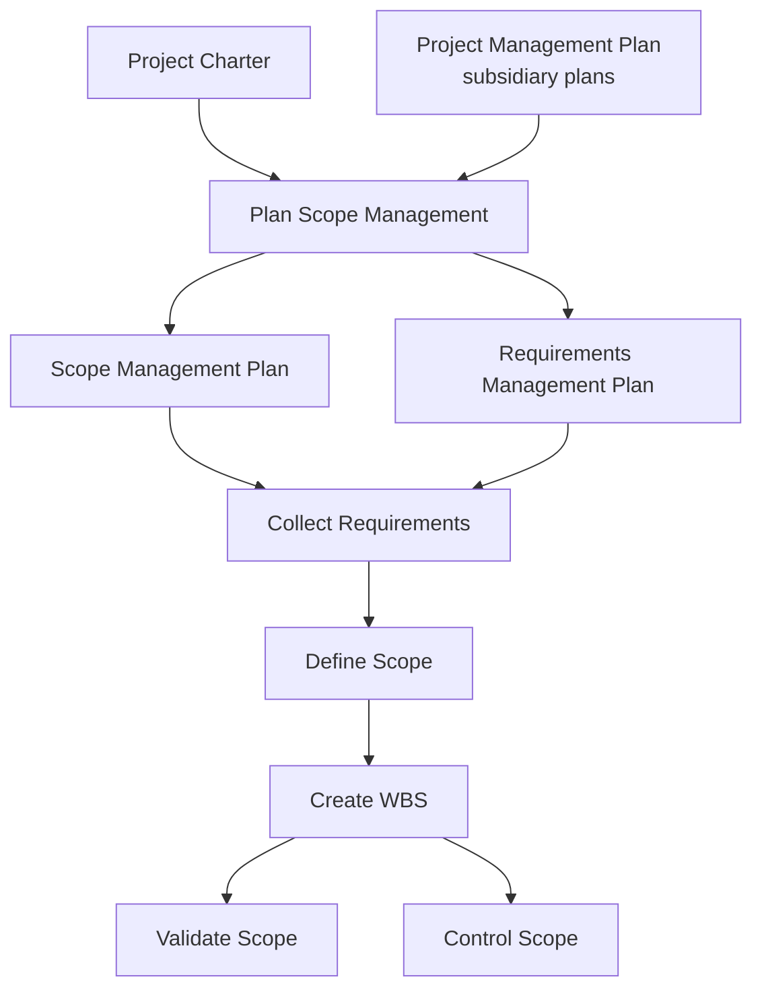

## Planning Scope Management

### Overview

Plan Scope Management is the process of creating a scope management plan that documents how the project and product scope will be defined, validated, and controlled. It is the first process in the Project Scope Management knowledge area and establishes the guidance and direction for how scope will be managed throughout the entire project.

This process is performed once, or at predefined points, in the project — typically during project planning, immediately following (or alongside) integration planning processes such as Develop Project Management Plan.

### Purpose and Position in the Process Flow

Plan Scope Management is a **planning-of-planning** process — its output doesn't define the scope itself, but rather defines *how* scope will be defined, decomposed, validated, and controlled by the subsequent Scope Management processes.

### Inputs, Tools & Techniques, Outputs (ITTO)

#### Inputs

- **Project charter** — provides high-level project description and product characteristics as the starting reference point
- **Project management plan** — quality management plan (approach to scope-quality relationship), project life cycle description, development approach (predictive, iterative, agile, hybrid)
- **Enterprise environmental factors (EEF)** — organizational culture, infrastructure, personnel administration, marketplace conditions
- **Organizational process assets (OPA)** — policies/procedures/templates for scope management plan, historical information/lessons learned repository

#### Tools & Techniques

**1. Expert Judgment**

From individuals/groups with specialized knowledge of similar prior projects.

**2. Data Analysis**

- **Alternatives analysis** — evaluating various ways to collect requirements, elaborate project/product scope, create the product, validate/control scope

**3. Meetings**

Project teams may attend meetings to develop the scope management plan; attendees may include the project manager, sponsor, selected team members, selected stakeholders, and others as needed.

#### Outputs

**1. Scope Management Plan**

A component of the project management plan describing how scope will be defined, developed, monitored, controlled, and verified. Contains:

- Process for preparing a detailed project scope statement
- Process enabling creation of the WBS from the detailed scope statement
- Process establishing how the WBS will be maintained/approved
- Process specifying how formal acceptance of completed deliverables will be obtained
- Process to control how requests for changes to the detailed scope statement will be processed (linked to Perform Integrated Change Control)

**2. Requirements Management Plan**

A component of the project management plan describing how project/product requirements will be analyzed, documented, and managed. Typically includes:

- How requirements activities will be planned, tracked, and reported
- Configuration management activities (how changes to product/requirements will be initiated, analyzed, tracked, reported, authorization levels)
- Requirements prioritization process
- Metrics to be used and the rationale for using them
- Traceability structure (which requirement attributes will be captured on the traceability matrix)

### Core Concepts: Project Scope vs. Product Scope

| Aspect | Project Scope | Product Scope |
| --- | --- | --- |
| Definition | The work performed to deliver a product, service, or result with the specified features and functions | The features and functions that characterize a product, service, or result |
| Measured against | Project management plan | Product requirements |
| Focus | Work packages, activities, effort | Requirements, specifications, features |

This distinction is foundational — the scope management plan must address the process for managing **both**, since they are related but not identical, and confusing the two is a common source of scope creep.

### Example

**Scenario:** An organization is launching a new mobile banking application. Before requirements gathering begins, the project manager needs to establish how scope will be handled throughout the project.

**Applying the process:**

1. The PM reviews the **project charter**, which states the high-level objective: "Deliver a secure mobile banking app supporting account viewing and fund transfers by Q3"
2. Given the organization's **development approach** is agile (from the PM plan), the PM tailors the scope management plan accordingly — noting that scope will be defined iteratively via a **product backlog** rather than a single upfront detailed scope statement
3. **Alternatives analysis** is used to decide between two requirements elicitation approaches — structured stakeholder interviews vs. a series of design-thinking workshops — the team selects workshops given the exploratory nature of the mobile UX
4. The resulting **scope management plan** specifies: requirements will be captured via Collect Requirements using workshops and prototyping; the WBS (or backlog, in agile terms) will be reviewed and reprioritized every sprint; formal acceptance of each feature occurs via sprint review/demo; scope changes route through a lightweight change process aligned with the sprint cadence
5. The **requirements management plan** defines that each requirement will be tagged with priority (MoSCoW method) and traced from business need → user story → test case in a traceability matrix

### Scope Management Plan Content Map

<svg xmlns="http://www.w3.org/2000/svg" viewBox="0 0 700 260" font-family="Arial, sans-serif">
<text x="350" y="24" text-anchor="middle" font-size="15" font-weight="bold">Scope Management Plan — Key Components (svg_diagram)</text>
<rect x="260" y="50" width="180" height="50" rx="8" fill="#ede9fe" stroke="#7c3aed" stroke-width="1.5" />
<text x="350" y="80" text-anchor="middle" font-size="12" font-weight="bold">Scope Management Plan</text>
<line x1="350" y1="100" x2="130" y2="140" stroke="#6b7280" stroke-width="1.2" marker-end="url(#a4)" />
<line x1="350" y1="100" x2="270" y2="140" stroke="#6b7280" stroke-width="1.2" marker-end="url(#a4)" />
<line x1="350" y1="100" x2="430" y2="140" stroke="#6b7280" stroke-width="1.2" marker-end="url(#a4)" />
<line x1="350" y1="100" x2="570" y2="140" stroke="#6b7280" stroke-width="1.2" marker-end="url(#a4)" />
<rect x="40" y="140" width="180" height="60" rx="6" fill="#dbeafe" stroke="#2563eb" />
<text x="130" y="165" text-anchor="middle" font-size="10" font-weight="bold">Prepare Detailed</text>
<text x="130" y="180" text-anchor="middle" font-size="10" font-weight="bold">Scope Statement</text>
<rect x="185" y="140" width="170" height="60" rx="6" fill="#dcfce7" stroke="#16a34a" />
<text x="270" y="165" text-anchor="middle" font-size="10" font-weight="bold">Create WBS</text>
<text x="270" y="180" text-anchor="middle" font-size="10" font-weight="bold">from Scope Statement</text>
<rect x="355" y="140" width="150" height="60" rx="6" fill="#fef9c3" stroke="#ca8a04" />
<text x="430" y="165" text-anchor="middle" font-size="10" font-weight="bold">Maintain &amp;</text>
<text x="430" y="180" text-anchor="middle" font-size="10" font-weight="bold">Approve WBS</text>
<rect x="470" y="140" width="200" height="60" rx="6" fill="#fee2e2" stroke="#dc2626" />
<text x="570" y="160" text-anchor="middle" font-size="10" font-weight="bold">Formal Acceptance +</text>
<text x="570" y="175" text-anchor="middle" font-size="10" font-weight="bold">Change Request</text>
<text x="570" y="190" text-anchor="middle" font-size="10" font-weight="bold">Handling</text>
</svg>

### Key Points

- Plan Scope Management produces **two** distinct outputs — the scope management plan and the requirements management plan — both are subsidiary components of the overall project management plan
- The process itself does **not** define scope — it defines the *methodology* for how scope will be defined downstream in Collect Requirements, Define Scope, and Create WBS
- The **development approach** (predictive vs. adaptive/agile vs. hybrid) heavily influences how the scope management plan is tailored — in adaptive environments, the plan describes an iterative/evolving scope process (e.g., backlog refinement) rather than a fixed detailed scope statement upfront
- This process directly informs the **change control process for scope**, tying it back to Perform Integrated Change Control in Integration Management

### Common Practice Pitfalls [Inference]

- Confusing the **scope management plan** with the **project scope statement** — the former defines the *process*, the latter (from Define Scope) is the actual *content and boundaries* of scope
- Treating this as a one-time document with no bearing on agile projects — in practice the plan still exists in agile contexts, just tailored to describe backlog-driven, iterative scope definition rather than a single fixed baseline
- Overlooking that the **requirements management plan** is a separate deliverable, not a section within the scope management plan — PMBOK treats them as two distinct outputs of the same process

### Related Topics

- Collect Requirements
- Define Scope
- Create WBS
- Validate Scope
- Control Scope
- Requirements Traceability Matrix
- Predictive vs. Adaptive Development Approaches