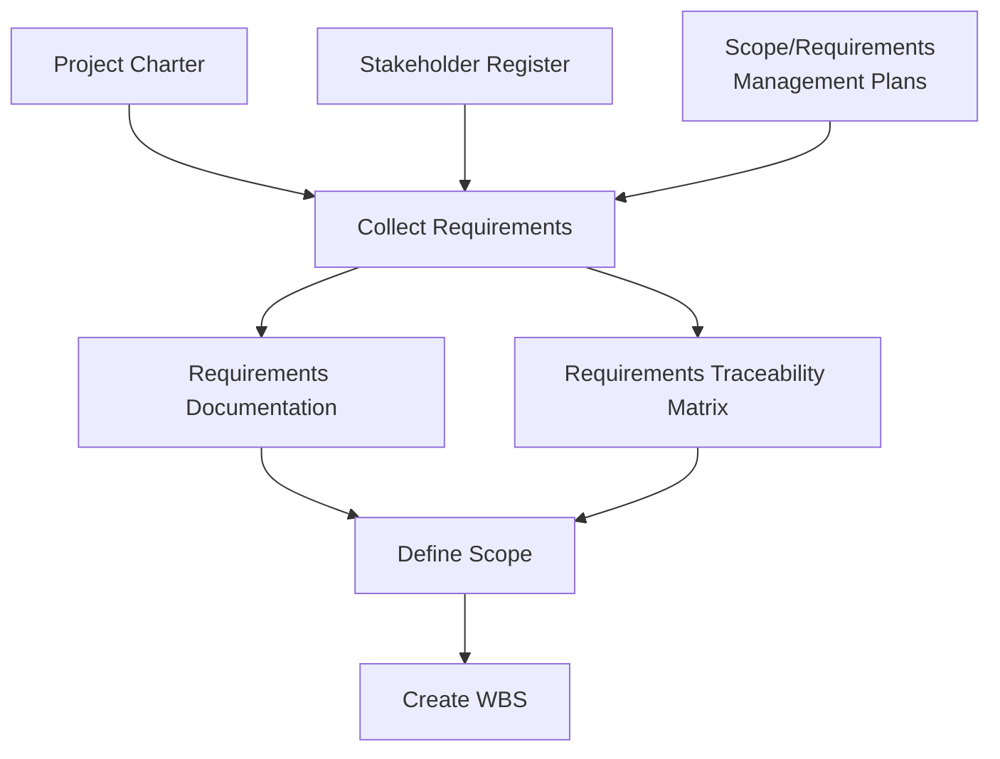

## Collecting Requirements

### Overview

Collect Requirements is the process of determining, documenting, and managing stakeholder needs and requirements to meet objectives. It is the second process in Project Scope Management and provides the basis for defining and managing the project scope, including product scope. The direct traceability of requirements back to business/project objectives, as established here, underpins successful scope management throughout the project.

This process is performed once, or at predefined points, in the project.

### Purpose and Position in the Process Flow

Collect Requirements translates high-level needs from the project charter and stakeholder register into detailed, documented requirements that feed directly into Define Scope and, ultimately, the WBS.

### Inputs, Tools & Techniques, Outputs (ITTO)

#### Inputs

- **Project charter** — high-level project/product description used to develop detailed requirements
- **Project management plan** — scope management plan, requirements management plan, stakeholder engagement plan
- **Project documents** — assumption log, lessons learned register, stakeholder register
- **Business documents** — business case (describes required, desired, optional criteria for project needs)
- **Agreements** — for procurement contexts, contains requirements
- **Enterprise environmental factors (EEF)** — organizational culture, infrastructure, personnel administration, marketplace conditions
- **Organizational process assets (OPA)** — policies/procedures on requirements collection/analysis/categorization, historical information/lessons learned repository

#### Tools & Techniques

**1. Expert Judgment**

From individuals/groups with specialized knowledge of the discipline or application area (business analysis, requirements elicitation, project management).

**2. Data Gathering**

- **Brainstorming** — generating and collecting multiple ideas related to project/product requirements
- **Interviews** — formal or informal approach to elicit information by talking directly to stakeholders
- **Focus groups** — bringing together prequalified stakeholders and subject matter experts to learn expectations/attitudes about a proposed product/service/result
- **Questionnaires and surveys** — written sets of questions for a large number of respondents
- **Benchmarking** — comparing actual/planned practices to those of comparable organizations for identifying best practices, generating improvement ideas, basis for performance measurement

**3. Data Analysis**

- **Document analysis** — analyzing existing documentation to identify relevant information for requirements (business plans, contracts, RFPs, current process flows, marketing literature, problem/issue logs, policies/procedures, regulatory documentation)

**4. Decision Making**

- **Voting** — unanimity, majority, plurality
- **Autocratic decision making** — one individual takes the decision responsibility
- **Multicriteria decision analysis** — decision matrix using a systematic approach to establish criteria (risk levels, uncertainty, valuation) to evaluate/rank ideas

**5. Data Representation**

- **Affinity diagrams** — sorting large numbers of ideas into groups for review/analysis
- **Mind mapping** — consolidating ideas from individual brainstorming sessions into a single map to reflect commonality/differences and generate new ideas

**6. Interpersonal and Team Skills**

- **Nominal group technique** — enhances brainstorming with a voting process to rank the most useful ideas for further brainstorming/prioritization
- **Observation/conversation** — direct way of viewing individuals in their environment to see how they perform jobs/tasks (also called "job shadowing")
- **Facilitation** — used with workshops focused on bringing key cross-functional stakeholders together to define product requirements

**7. Context Diagram**

A visual depiction of the product scope showing a business system (process, equipment, computer system) and how people/other systems interact with it.

**8. Prototypes**

A method of obtaining early feedback on requirements by providing a working model before building it — supports the concept of **progressive elaboration** (storyboards are one prototyping method used for UX flows, wireframes, and software design).

#### Outputs

**1. Requirements Documentation**

Describes how individual requirements meet the business need. May start high-level and progressively elaborate. Categories include:

- Business requirements
- Stakeholder requirements
- Solution requirements (functional and non-functional)
- Transition and readiness requirements
- Project requirements
- Quality requirements

**2. Requirements Traceability Matrix (RTM)**

A grid linking product requirements from origin to the deliverables that satisfy them, helping ensure each requirement adds business value by linking it to business/project objectives. Typically traces requirements to:

- Business needs, opportunities, goals, objectives
- Project objectives
- WBS deliverables
- Product design/development
- Test strategy/test cases
- High-level requirements to more detailed requirements

### Requirements Traceability Matrix — Sample Structure

| Req ID | Description | Business Need | Priority | WBS Deliverable | Test Case | Status |
| --- | --- | --- | --- | --- | --- | --- |
| REQ-001 | User can transfer funds between own accounts | Reduce branch visits | High | Fund Transfer Module | TC-014 | In Progress |
| REQ-002 | User receives SMS alert on transfer > $1,000 | Fraud prevention | High | Notification Service | TC-022 | Not Started |
| REQ-003 | App supports biometric login | Improve UX | Medium | Auth Module | TC-005 | Complete |

### Example

**Scenario:** A retail company is developing an inventory management system. The PM needs to gather requirements from warehouse staff, store managers, and IT operations.

**Applying the process:**

1. **Document analysis** of existing manual inventory logs and current process flows reveals recurring stockout patterns
2. A **facilitated workshop** brings together warehouse staff and store managers to jointly define desired system behavior — surfacing conflicting needs (warehouse wants batch scanning; stores want real-time updates)
3. **Multicriteria decision analysis** is used to prioritize conflicting requirements against criteria like cost, implementation complexity, and business impact
4. A **context diagram** is created showing the inventory system's interactions with POS systems, supplier EDI feeds, and the mobile scanning app
5. A clickable **prototype** of the mobile scanning interface is shown to warehouse staff for early feedback before development begins
6. All gathered requirements are documented in **requirements documentation**, categorized as functional (e.g., "system shall update stock counts in real time") vs. non-functional (e.g., "system shall support 500 concurrent scanner connections")
7. Each requirement is entered into the **requirements traceability matrix**, linked back to the business case objective of reducing stockouts by 30%

### Data Gathering Techniques Comparison

<svg xmlns="http://www.w3.org/2000/svg" viewBox="0 0 700 240" font-family="Arial, sans-serif">
<text x="350" y="24" text-anchor="middle" font-size="15" font-weight="bold">Requirements Elicitation Techniques by Group Size (svg_diagram)</text>
<line x1="60" y1="200" x2="660" y2="200" stroke="#374151" stroke-width="1.5" />
<text x="360" y="225" text-anchor="middle" font-size="11">Stakeholder Group Size →</text>
<rect x="80" y="150" width="90" height="50" fill="#dbeafe" stroke="#2563eb" />
<text x="125" y="175" text-anchor="middle" font-size="10" font-weight="bold">Interview</text>
<text x="125" y="140" text-anchor="middle" font-size="9">1-on-1</text>
<rect x="190" y="120" width="90" height="80" fill="#dcfce7" stroke="#16a34a" />
<text x="235" y="165" text-anchor="middle" font-size="10" font-weight="bold">Focus Group</text>
<text x="235" y="110" text-anchor="middle" font-size="9">Small, prequalified</text>
<rect x="300" y="100" width="120" height="100" fill="#fef9c3" stroke="#ca8a04" />
<text x="360" y="155" text-anchor="middle" font-size="10" font-weight="bold">Facilitated</text>
<text x="360" y="170" text-anchor="middle" font-size="10" font-weight="bold">Workshop</text>
<text x="360" y="90" text-anchor="middle" font-size="9">Cross-functional</text>
<rect x="440" y="60" width="110" height="140" fill="#fee2e2" stroke="#dc2626" />
<text x="495" y="135" text-anchor="middle" font-size="10" font-weight="bold">Survey /</text>
<text x="495" y="150" text-anchor="middle" font-size="10" font-weight="bold">Questionnaire</text>
<text x="495" y="50" text-anchor="middle" font-size="9">Large population</text>
<rect x="570" y="170" width="90" height="30" fill="#ede9fe" stroke="#7c3aed" />
<text x="615" y="190" text-anchor="middle" font-size="10" font-weight="bold">Brainstorm</text>
</svg>

### Key Points

- Requirements Documentation and the **Requirements Traceability Matrix** are the two primary outputs — the RTM is what enables **Validate Scope** later to confirm each requirement was actually delivered
- **Prototypes** support progressive elaboration by giving stakeholders something tangible to react to before significant investment is made — reduces the risk of late-discovered misalignment
- Requirements span multiple categories (business, stakeholder, solution—functional/non-functional, transition, project, quality) — treating "requirements" as only functional software features is a common oversimplification
- **Context diagrams** are specifically useful for defining product scope boundaries — showing what is inside vs. outside the system under development

### Common Practice Pitfalls [Inference]

- Confusing **focus groups** (prequalified stakeholders discussing a proposed product) with **facilitated workshops** (cross-functional stakeholders actively defining requirements together) — both are group techniques but serve different elicitation purposes
- Treating the RTM as a one-time artifact — it should be actively maintained and referenced throughout Define Scope, Create WBS, and especially Validate Scope
- Skipping **document analysis** as "not a real elicitation technique" — reviewing existing artifacts (contracts, current-state process docs, policies) is a legitimate and often underused data gathering technique

### Related Topics

- Plan Scope Management
- Define Scope
- Create WBS
- Validate Scope
- Business Analysis Techniques (BABOK overlap)
- Stakeholder Engagement Planning
- Prototyping and Progressive Elaboration