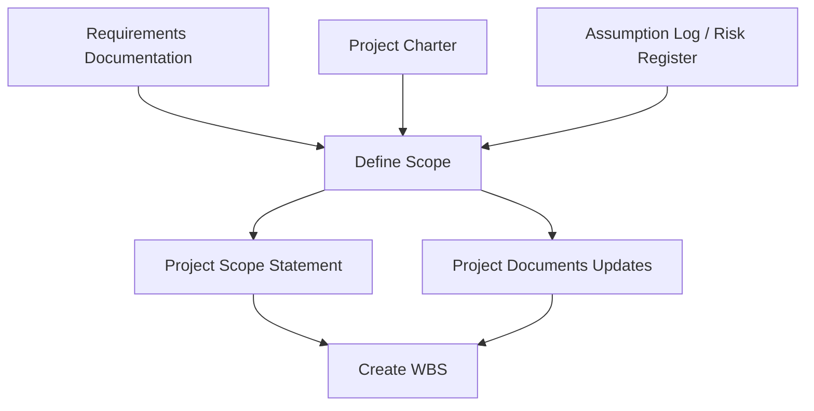

## Defining Project Scope

### Overview

Define Scope is the process of developing a detailed description of the project and product. It is the third process in Project Scope Management and its key benefit is that it describes the product, service, or result boundaries and acceptance criteria by selecting the final project requirements from the requirements documentation gathered in Collect Requirements.

This process is performed once, or at predefined points, in the project.

### Purpose and Position in the Process Flow

Define Scope narrows the full set of collected requirements down to those that will actually be included in the project — establishing explicit boundaries (what is in, what is out) that the WBS will then decompose into manageable work packages.

### Inputs, Tools & Techniques, Outputs (ITTO)

#### Inputs

- **Project charter** — high-level project description, product characteristics, approval requirements
- **Project management plan** — scope management plan
- **Project documents** — assumption log, requirements documentation, risk register
- **Enterprise environmental factors (EEF)** — organizational culture, infrastructure, personnel administration, marketplace conditions
- **Organizational process assets (OPA)** — policies/procedures/templates for project scope statement, prior project files, lessons learned repository

#### Tools & Techniques

**1. Expert Judgment**

From individuals/groups with specialized knowledge of similar prior projects.

**2. Data Analysis**

- **Alternatives analysis** — used to evaluate different ways to meet requirements and objectives (e.g., brainstorming, lateral thinking, pairwise comparisons) — determining the best approach to develop/execute deliverables while minimizing cost/schedule impact

**3. Decision Making**

- **Multicriteria decision analysis** — using a decision matrix to systematically evaluate/rank ideas against established criteria (risk levels, uncertainty, valuation)

**4. Interpersonal and Team Skills**

- **Facilitation** — used at workshops and in interactive sessions bringing key stakeholders together to reach a cross-functional/common understanding of project deliverables and boundaries

**5. Product Analysis**

Used for projects with a product deliverable, as opposed to a service or result — translates the product description and requirements into tangible deliverables. Techniques include:

- Product breakdown
- Systems analysis
- Systems engineering
- Value engineering
- Value analysis
- Requirements analysis

#### Outputs

**1. Project Scope Statement**

The description of the project scope, major deliverables, assumptions, and constraints — documents the entire scope, including project and product scope. Describes in detail the project's deliverables and the work required to create them. Provides a common understanding among stakeholders. Contains:

- **Product scope description** — progressively elaborates the characteristics of the product/service/result described in the charter and requirements documentation
- **Deliverables** — any unique/verifiable product, result, or capability required to complete a process/phase/project
- **Acceptance criteria** — a set of conditions required to be met before deliverables are accepted
- **Project exclusions** — identifies what is explicitly excluded from the project (critical for managing stakeholder expectations and preventing scope creep)

**2. Project Documents Updates**

- **Assumption log** — updated with additional assumptions/constraints identified during this process
- **Requirements documentation** — updated with additional/changed requirements
- **Requirements traceability matrix** — updated to reflect changes
- **Stakeholder register** — updated with additional information

### Scope Statement vs. Project Charter — Key Distinction

| Aspect | Project Charter | Project Scope Statement |
| --- | --- | --- |
| Timing | Created in Initiating | Created in Planning (elaborates the charter) |
| Detail Level | High-level | Detailed |
| Owner | Sponsor (authorizes) | Project team (develops) |
| Purpose | Formally authorizes the project | Defines detailed scope boundaries for planning |

This progressive elaboration relationship — charter → scope statement → WBS — is a frequently tested sequence.

### Example

**Scenario:** Using the mobile banking app project (continuing from Collect Requirements), the PM must now define exactly what is and isn't included in the current release.

**Applying the process:**

1. From the full requirements documentation (which includes items like biometric login, fund transfers, bill pay, budgeting tools, and multi-currency support), the team applies **alternatives analysis** to evaluate which features can realistically be delivered by the Q3 deadline
2. A **multicriteria decision matrix** scores each candidate feature against business value, technical complexity, and regulatory risk — biometric login and fund transfers score highest and are included; multi-currency support scores low on the timeline criterion and is deferred
3. **Product analysis** (requirements analysis) is used to translate "user can transfer funds" into specific tangible sub-deliverables: transfer initiation UI, transaction validation service, confirmation notification
4. The resulting **project scope statement** documents:
   - **Product scope description**: a mobile app supporting account viewing, biometric login, and intra-bank fund transfers
   - **Deliverables**: authentication module, account dashboard, fund transfer module, push notification service
   - **Acceptance criteria**: transfers must complete in under 3 seconds; biometric login must support both fingerprint and face ID
   - **Project exclusions**: bill pay, budgeting tools, and multi-currency support are explicitly excluded from this release (deferred to Phase 2)
5. The **assumption log** is updated to note the assumption that third-party biometric SDKs will be available on both iOS and Android without licensing delays

### Scope Statement Structure

<svg xmlns="http://www.w3.org/2000/svg" viewBox="0 0 700 240" font-family="Arial, sans-serif">
<text x="350" y="24" text-anchor="middle" font-size="15" font-weight="bold">Project Scope Statement — Core Components (svg_diagram)</text>
<rect x="260" y="45" width="180" height="45" rx="8" fill="#ede9fe" stroke="#7c3aed" stroke-width="1.5" />
<text x="350" y="72" text-anchor="middle" font-size="12" font-weight="bold">Project Scope Statement</text>
<line x1="350" y1="90" x2="110" y2="130" stroke="#6b7280" stroke-width="1.2" marker-end="url(#a5)" />
<line x1="350" y1="90" x2="290" y2="130" stroke="#6b7280" stroke-width="1.2" marker-end="url(#a5)" />
<line x1="350" y1="90" x2="470" y2="130" stroke="#6b7280" stroke-width="1.2" marker-end="url(#a5)" />
<line x1="350" y1="90" x2="620" y2="130" stroke="#6b7280" stroke-width="1.2" marker-end="url(#a5)" />
<rect x="20" y="130" width="180" height="70" rx="6" fill="#dbeafe" stroke="#2563eb" />
<text x="110" y="158" text-anchor="middle" font-size="10" font-weight="bold">Product Scope</text>
<text x="110" y="173" text-anchor="middle" font-size="10" font-weight="bold">Description</text>
<rect x="210" y="130" width="170" height="70" rx="6" fill="#dcfce7" stroke="#16a34a" />
<text x="295" y="163" text-anchor="middle" font-size="10" font-weight="bold">Deliverables</text>
<rect x="390" y="130" width="160" height="70" rx="6" fill="#fef9c3" stroke="#ca8a04" />
<text x="470" y="158" text-anchor="middle" font-size="10" font-weight="bold">Acceptance</text>
<text x="470" y="173" text-anchor="middle" font-size="10" font-weight="bold">Criteria</text>
<rect x="560" y="130" width="130" height="70" rx="6" fill="#fee2e2" stroke="#dc2626" />
<text x="625" y="158" text-anchor="middle" font-size="10" font-weight="bold">Project</text>
<text x="625" y="173" text-anchor="middle" font-size="10" font-weight="bold">Exclusions</text>
</svg>

### Key Points

- Define Scope selects the **final** requirements from the broader pool gathered in Collect Requirements — not every collected requirement makes it into scope
- **Project exclusions** are as important as inclusions — explicitly documenting what is *not* in scope is a primary defense against scope creep and stakeholder misalignment
- The project scope statement provides a **common understanding of project scope among stakeholders** — it is the reference document used to resolve scope disputes throughout execution
- **Product analysis** is used specifically when the project deliverable is a product (vs. a service or result) — it is not universally applied to every project

### Common Practice Pitfalls [Inference]

- Treating the project scope statement as identical in content to the project charter — the scope statement is a detailed elaboration, not a duplicate; confusing the two obscures the progressive elaboration principle
- Omitting **project exclusions** from the scope statement — many real-world scope disputes originate specifically because exclusions were not explicitly documented and communicated
- Assuming Define Scope only produces the scope statement — it also generates important **project documents updates** (assumption log, requirements documentation, RTM, stakeholder register) that are easy to overlook

### Related Topics

- Collect Requirements
- Create WBS
- Validate Scope
- Control Scope
- Develop Project Charter
- Scope Creep and Gold Plating