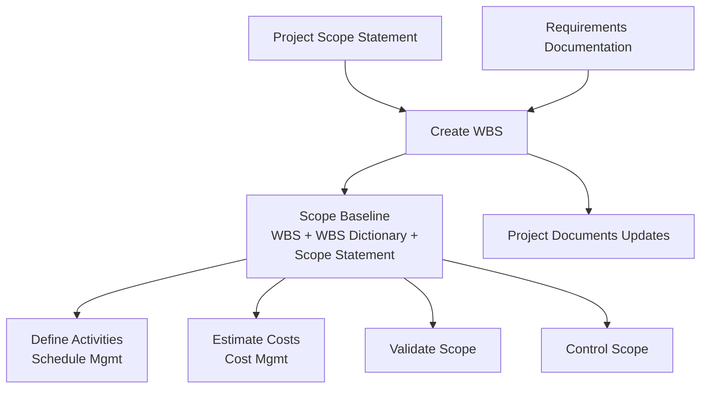

## Creating the Work Breakdown Structure

### Overview

Create WBS is the process of subdividing project deliverables and project work into smaller, more manageable components. It is the fourth process in Project Scope Management, and its key benefit is that it provides a framework of what has to be delivered by decomposing the total scope of work into a hierarchical structure.

This process is performed once, or at predefined points, in the project.

### Purpose and Position in the Process Flow

Create WBS takes the deliverables defined in the project scope statement and breaks them down into work packages — the lowest level of the WBS, at which cost and duration can be estimated and managed. This decomposed structure becomes the foundation for schedule development, cost estimating, and Validate Scope/Control Scope.

### Inputs, Tools & Techniques, Outputs (ITTO)

#### Inputs

- **Project management plan** — scope management plan
- **Project documents** — project scope statement, requirements documentation
- **Enterprise environmental factors (EEF)** — industry-specific WBS standards relevant to the nature of the project
- **Organizational process assets (OPA)** — policies/procedures/templates for the WBS, project files from previous projects, lessons learned repository

#### Tools & Techniques

**1. Expert Judgment**

Used to analyze information needed to decompose the project deliverables into smaller components in order to produce a WBS that is fit for effective project management.

**2. Decomposition**

A technique used for dividing and subdividing the project scope and deliverables into smaller, more manageable parts. Involves:

- Identifying and analyzing the deliverable and related work
- Structuring/organizing the WBS
- Decomposing the upper WBS levels into lower-level detailed components
- Developing/assigning identification codes to WBS components
- Verifying the degree of decomposition is necessary and sufficient

Decomposition continues to the **work package** level — the lowest level of the WBS, where cost/duration can be reliably estimated and managed. Excessive decomposition can lead to **non-productive management effort, inefficient use of resources, and decreased efficiency** in performing the work.

#### Outputs

**1. Scope Baseline**

The approved version of the project scope statement, WBS, and its associated WBS dictionary — can be changed only through formal change control procedures and is used as a basis for comparison. Components:

- **Project scope statement** (carried forward)
- **WBS** — a hierarchical decomposition of the total scope of work
- **Work package** — the lowest level of the WBS, with a unique identifier
- **Planning package** — a WBS component below the control account but above the work package, used when work content is known but detailed schedule activities are not yet available
- **Control account** — a management control point where scope, budget, actual cost, and schedule are integrated and compared to earned value for performance measurement
- **WBS dictionary** — a document providing detailed deliverable, activity, and scheduling information for each WBS component

**2. Project Documents Updates**

- **Assumption log** — updated with additional assumptions/constraints identified
- **Requirements documentation** — updated with approved requirements included in scope

### Core Concepts: WBS Hierarchy

<svg xmlns="http://www.w3.org/2000/svg" viewBox="0 0 700 280" font-family="Arial, sans-serif">
<text x="350" y="24" text-anchor="middle" font-size="15" font-weight="bold">WBS Hierarchical Decomposition (svg_diagram)</text>
<rect x="280" y="45" width="140" height="45" rx="6" fill="#ede9fe" stroke="#7c3aed" stroke-width="1.5" />
<text x="350" y="72" text-anchor="middle" font-size="11" font-weight="bold">Project (Level 0)</text>
<line x1="350" y1="90" x2="150" y2="125" stroke="#6b7280" stroke-width="1.2" />
<line x1="350" y1="90" x2="350" y2="125" stroke="#6b7280" stroke-width="1.2" />
<line x1="350" y1="90" x2="550" y2="125" stroke="#6b7280" stroke-width="1.2" />
<rect x="80" y="125" width="140" height="40" rx="6" fill="#dbeafe" stroke="#2563eb" />
<text x="150" y="150" text-anchor="middle" font-size="10" font-weight="bold">Deliverable A</text>
<rect x="280" y="125" width="140" height="40" rx="6" fill="#dbeafe" stroke="#2563eb" />
<text x="350" y="150" text-anchor="middle" font-size="10" font-weight="bold">Deliverable B</text>
<rect x="480" y="125" width="140" height="40" rx="6" fill="#dbeafe" stroke="#2563eb" />
<text x="550" y="150" text-anchor="middle" font-size="10" font-weight="bold">Deliverable C</text>
<line x1="150" y1="165" x2="90" y2="200" stroke="#6b7280" stroke-width="1.2" />
<line x1="150" y1="165" x2="210" y2="200" stroke="#6b7280" stroke-width="1.2" />
<rect x="30" y="200" width="120" height="40" rx="6" fill="#dcfce7" stroke="#16a34a" />
<text x="90" y="225" text-anchor="middle" font-size="9" font-weight="bold">Control Account</text>
<rect x="160" y="200" width="120" height="40" rx="6" fill="#fef9c3" stroke="#ca8a04" />
<text x="220" y="220" text-anchor="middle" font-size="9" font-weight="bold">Work Package</text>
<text x="220" y="233" text-anchor="middle" font-size="8">(lowest level)</text>
<rect x="300" y="200" width="120" height="40" rx="6" fill="#fee2e2" stroke="#dc2626" />
<text x="360" y="220" text-anchor="middle" font-size="9" font-weight="bold">Planning Package</text>
<text x="360" y="233" text-anchor="middle" font-size="8">(known, not detailed)</text>
</svg>

### 100% Rule

A foundational WBS principle: the WBS includes **100%** of the work defined by the project scope and captures **all** deliverables — internal, external, interim — in terms of the work to be completed, including project management work. The total of the work at the lowest levels must roll up to the higher levels so that nothing is left out and nothing extra is included. [Inference — this is standard WBS practice widely documented across PM literature, though the term "100% rule" itself originates from PMI-adjacent practitioner literature rather than being a verbatim PMBOK term]

### Decomposition Approaches

- **By project phase** — first level reflects lifecycle phases, deliverables repeated at lower levels
- **By major deliverable** — first level reflects major deliverables (most common approach)
- Different **application areas** may develop the WBS using multiple approaches, such as using phases as the first level and deliverables at the second level

### Example

**Scenario:** Continuing the mobile banking app project, the scope statement has defined four major deliverables: Authentication Module, Account Dashboard, Fund Transfer Module, Push Notification Service.

**Applying the process:**

1. The PM applies **decomposition** starting from the four major deliverables (Level 1 below the project)
2. **Authentication Module** is decomposed further: biometric login integration, password recovery flow, session management — each broken down further until reaching **work packages** small enough to estimate reliably (e.g., "Integrate Face ID SDK," "Build password reset UI")
3. A **control account** is established at the "Authentication Module" level, where the cost account manager will track budget, actual cost, and schedule performance in an integrated way (feeding EVM calculations used later in Monitor and Control Project Work)
4. Since the team hasn't yet detailed all fund-transfer sub-activities (dependent on a pending vendor API decision), that portion is captured as a **planning package** — known in general terms but not yet decomposed to work packages
5. A **WBS dictionary** entry is created for each work package, e.g., for "Integrate Face ID SDK": description, responsible team, acceptance criteria, estimated effort, dependencies
6. The finalized **WBS**, **WBS dictionary**, and **project scope statement** together form the **scope baseline** — from this point, any change to scope must go through formal Perform Integrated Change Control

### WBS Dictionary — Sample Entry Structure

| Field | Example Value |
| --- | --- |
| WBS Code | 1.1.2 |
| Work Package Name | Integrate Face ID SDK |
| Description | Integrate third-party biometric SDK for iOS Face ID authentication |
| Responsible Organization | Mobile Engineering Team |
| Acceptance Criteria | Login success rate ≥ 98% in QA testing |
| Dependencies | Vendor SDK license approval (predecessor) |
| Estimated Effort | 40 hours |

### Key Points

- The **scope baseline** (scope statement + WBS + WBS dictionary) — not the WBS alone — is the formal output used as the basis for measuring and controlling scope going forward
- **Decomposition** stops at the **work package** level — going further risks excessive management overhead; not going far enough leaves work too large to estimate/manage reliably
- A **control account** is a management control point that integrates scope, schedule, and cost for earned value performance measurement — this is the direct link between Create WBS and later EVM-based monitoring (Monitor and Control Project Work)
- The WBS is **not** a schedule — it has no sequencing or timing information; that is added later in Schedule Management (Define Activities, Sequence Activities)

### Common Practice Pitfalls [Inference]

- Confusing the **WBS** with a simple to-do list or org chart — the WBS is a deliverable-oriented hierarchical decomposition of scope, not a flat task list or a representation of reporting relationships
- Decomposing too far, creating work packages so granular that management overhead exceeds the value of the added detail
- Forgetting that **project management work itself** (e.g., status reporting, risk management activities) is typically represented in the WBS as its own deliverable/branch — the 100% rule includes project management effort, not just product-related deliverables
- Treating the WBS as fixed once created — it can be updated via formal change control, but casual, unauthorized edits break baseline integrity

### Related Topics

- Define Scope
- Validate Scope
- Control Scope
- Define Activities (Schedule Management)
- Estimate Costs (Cost Management)
- Control Accounts and Earned Value Management
- WBS Dictionary detailed structure