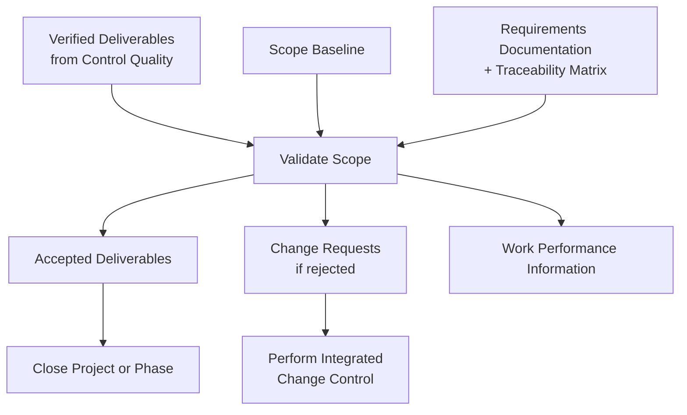

## Validating Scope

### Overview

Validate Scope is the process of formalizing acceptance of the completed project deliverables. It is the fifth process in Project Scope Management, and its key benefit is that it brings objectivity to the acceptance process and increases the probability of final product, service, or result acceptance by validating each deliverable.

This process is performed periodically throughout the project, as needed.

### Purpose and Position in the Process Flow

Validate Scope is a **Monitoring and Controlling** process (unlike Define Scope and Create WBS, which are Planning processes). It takes verified deliverables — those already checked for correctness by Control Quality — and obtains **formal stakeholder/customer acceptance**. This is a critical, frequently tested distinction.

### Inputs, Tools & Techniques, Outputs (ITTO)

#### Inputs

- **Project management plan** — scope management plan, requirements management plan, scope baseline
- **Project documents** — lessons learned register, quality reports, requirements documentation, requirements traceability matrix
- **Verified deliverables** — project deliverables that are completed and checked for correctness through the **Control Quality** process
- **Work performance data** — degree of compliance with requirements, number of nonconformities, severity of nonconformities, number of validation cycles performed in a period of time

#### Tools & Techniques

**1. Inspection**

Includes activities such as measuring, examining, and validating to determine whether work and deliverables meet requirements and product acceptance criteria. Inspections are sometimes called reviews, product reviews, audits, or walkthroughs — in some application areas these terms have narrow, specific meanings.

**2. Decision Making**

- **Voting** — used to reach a conclusion when validation is performed by the project team along with other stakeholders

#### Outputs

**1. Accepted Deliverables**

Deliverables that meet acceptance criteria are formally signed off and approved by the customer or sponsor. Formal documentation received from the customer/sponsor confirming stakeholder formal acceptance is forwarded to Close Project or Phase.

**2. Work Performance Information**

Includes information about project progress, such as which deliverables have started, their progress, which deliverables have finished, or which have been accepted — feeds into Monitor and Control Project Work.

**3. Change Requests**

Completed deliverables that have not been formally accepted are documented, along with the reasons. Those change requests are processed through **Perform Integrated Change Control**.

**4. Project Documents Updates**

- **Lessons learned register** — updated with any challenges encountered and how they could have been avoided, as well as approaches used for successful acceptance of deliverables
- **Requirements documentation** — updated with actual results of validation
- **Requirements traceability matrix** — updated with results including method used and outcome

### Core Distinction: Validate Scope vs. Control Quality

This is the single most heavily tested distinction in Project Scope Management.

| Aspect | Control Quality | Validate Scope |
| --- | --- | --- |
| Knowledge Area | Project Quality Management | Project Scope Management |
| Question Answered | Is the deliverable **correct**? (meets quality standards/specifications) | Is the deliverable **accepted**? (meets scope/acceptance criteria) |
| Primary Concern | Correctness of the work | Acceptance of the work by the customer/sponsor |
| Typical Sequence | Performed **first** | Performed **after** Control Quality, using its verified output |
| Output | Verified deliverables | Accepted deliverables |

**Key sequencing rule:** Control Quality generally precedes Validate Scope, although the two processes can be performed in parallel in practice.

### Example

**Scenario:** In the mobile banking app project, the Fund Transfer Module has completed development and testing.

**Applying the process:**

1. **Control Quality** (Quality Management process, performed first) verifies the module meets technical specifications — transfers process correctly, error handling works, transaction validation passes automated test suites. The module becomes a **verified deliverable**
2. The PM schedules a formal **inspection** (walkthrough) with the client's business stakeholders to demonstrate the Fund Transfer Module against the **acceptance criteria** documented in the project scope statement (e.g., "transfers must complete in under 3 seconds")
3. During the walkthrough, stakeholders note the transfer confirmation screen doesn't match an accessibility requirement documented in the requirements traceability matrix (larger font for confirmation amounts)
4. Because this specific requirement is not met, the deliverable is **not formally accepted** in its current form — a **change request** is raised documenting the gap and its cause (accessibility requirement overlooked during dev, not part of the original acceptance checklist review)
5. Once revised and re-inspected, the module passes and is signed off — becoming a formally **accepted deliverable**, with sign-off documentation forwarded toward eventual **Close Project or Phase**
6. The **requirements traceability matrix** is updated to reflect the outcome: validation method (inspection), result (accepted after rework), and reference to the resolved change request

### Validate Scope Process Flow

<svg xmlns="http://www.w3.org/2000/svg" viewBox="0 0 700 240" font-family="Arial, sans-serif">
<text x="350" y="24" text-anchor="middle" font-size="15" font-weight="bold">Deliverable Acceptance Flow (svg_diagram)</text>
<rect x="20" y="60" width="160" height="55" rx="8" fill="#dbeafe" stroke="#2563eb" stroke-width="1.5" />
<text x="100" y="82" text-anchor="middle" font-size="10" font-weight="bold">Control Quality</text>
<text x="100" y="98" text-anchor="middle" font-size="9">(is it correct?)</text>
<line x1="180" y1="88" x2="240" y2="88" stroke="#6b7280" stroke-width="1.5" marker-end="url(#a6)" />
<rect x="240" y="60" width="160" height="55" rx="8" fill="#fef9c3" stroke="#ca8a04" stroke-width="1.5" />
<text x="320" y="82" text-anchor="middle" font-size="10" font-weight="bold">Validate Scope</text>
<text x="320" y="98" text-anchor="middle" font-size="9">(is it accepted?)</text>
<line x1="400" y1="80" x2="460" y2="55" stroke="#6b7280" stroke-width="1.2" marker-end="url(#a6)" />
<line x1="400" y1="95" x2="460" y2="120" stroke="#6b7280" stroke-width="1.2" marker-end="url(#a6)" />
<rect x="460" y="30" width="180" height="50" rx="8" fill="#dcfce7" stroke="#16a34a" stroke-width="1.5" />
<text x="550" y="60" text-anchor="middle" font-size="10" font-weight="bold">Accepted Deliverable</text>
<rect x="460" y="100" width="180" height="50" rx="8" fill="#fee2e2" stroke="#dc2626" stroke-width="1.5" />
<text x="550" y="122" text-anchor="middle" font-size="10" font-weight="bold">Change Request</text>
<text x="550" y="138" text-anchor="middle" font-size="9">(not accepted)</text>
</svg>

### Key Points

- Validate Scope is a **Monitoring and Controlling** process, not a Planning process — this places it alongside Control Scope rather than with Define Scope/Create WBS
- It formalizes **stakeholder/customer acceptance**, which is a distinct concept from technical correctness (handled in Control Quality)
- When a deliverable fails validation, the output is a **change request**, which routes through Perform Integrated Change Control — Validate Scope itself does not resolve or rework the deliverable
- The **inspection** technique (walkthrough, review, audit) is the primary tool — it is deliberately customer/stakeholder-facing, unlike quality inspections which may be purely technical/internal

### Common Practice Pitfalls [Inference]

- Confusing Validate Scope with Control Quality on exam-style questions — the trigger words are "correctness/specifications" (Control Quality) vs. "acceptance/sign-off/formalized approval" (Validate Scope)
- Assuming Validate Scope happens only once at project end — it is performed **periodically throughout the project** as deliverables are completed, especially in phased or iterative projects
- Believing rejected deliverables are immediately reworked within this process — the correct output is a documented **change request**, which must be formally processed before rework begins

### Related Topics

- Control Quality (Project Quality Management)
- Control Scope
- Create WBS
- Close Project or Phase
- Perform Integrated Change Control
- Requirements Traceability Matrix maintenance