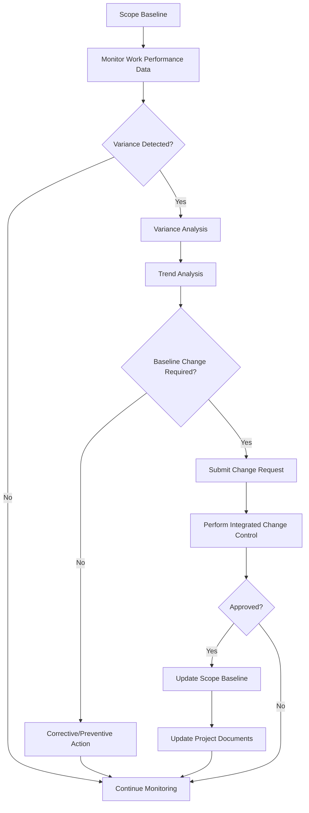

## Controlling Scope

### Definition

Controlling Scope is the process of monitoring the status of the project and product scope, and managing changes to the scope baseline. It is a monitoring and controlling process group activity within the Project Scope Management knowledge area, performed throughout the project lifecycle rather than at a single point in time.

The process ensures that all requested changes, corrective actions, and preventive actions are processed through the organization's Perform Integrated Change Control process, and that scope creep is detected and addressed before it undermines project objectives.

### Purpose and Objectives

Controlling Scope exists to:

- Maintain the integrity of the scope baseline (scope statement, WBS, WBS dictionary) throughout project execution
- Provide a mechanism to detect variance between planned and actual scope
- Ensure any scope change flows through a formal change control process rather than being absorbed informally
- Link scope variance to schedule and cost impacts so decisions are made with full visibility
- Prevent uncontrolled expansion of scope without corresponding adjustments to time, cost, or resources

### Inputs

**Project Management Plan**

- Scope management plan — describes how scope will be controlled
- Scope baseline — used as the comparison point for measuring variance
- Change management plan — describes how changes are processed
- Configuration management plan — describes how deliverable versions are controlled
- Requirements management plan — describes how requirements are tracked

**Project Documents**

- Lessons learned register
- Requirements documentation
- Requirements traceability matrix

**Work Performance Data**

- Raw observations: number of change requests, degree of nonconformity, deliverable completion status

**Organizational Process Assets**

- Existing formal/informal scope control policies
- Monitoring and reporting methods and templates

### Tools and Techniques

**Data Analysis**

- **Variance Analysis** — compares the scope baseline to actual results to determine the direction and magnitude of variance and whether corrective or preventive action is required
- **Trend Analysis** — examines project performance over time to determine whether performance is improving or deteriorating, supporting forecasting

### Outputs

**Work Performance Information**

- Correlated and contextualized information on how project scope is performing against the baseline (e.g., categories of change requests, root causes of variances, lessons on scope creep)

**Change Requests**

- Analysis of scope performance may generate change requests to the scope baseline or other components of the project management plan. These are processed through Perform Integrated Change Control.

**Project Management Plan Updates**

- Scope management plan
- Scope baseline (scope statement, WBS, WBS dictionary)
- Cost baseline
- Schedule baseline
- Performance measurement baseline

**Project Documents Updates**

- Requirements documentation
- Requirements traceability matrix
- Lessons learned register

### Key Concepts

**Scope Creep vs. Gold Plating**

| Concept | Description | Control Mechanism |
| --- | --- | --- |
| Scope Creep | Uncontrolled expansion of scope without adjustments to time, cost, resources | Formal change control, baseline comparison |
| Gold Plating | Team adds extra features/quality beyond requirements without authorization | Requirements traceability, quality audits |
| Scope Validation vs. Scope Control | Validate Scope = formal acceptance of deliverables (customer-facing); Control Scope = managing changes to baseline (internal process) | N/A |

**Relationship to Integrated Change Control**

Controlling Scope does not unilaterally approve scope changes. Any variance requiring a baseline adjustment generates a change request that must pass through the Change Control Board (CCB) or equivalent authority as defined in the Perform Integrated Change Control process.

### Process Flow

### Worked Example

A software project has a scope baseline defining 20 features for a v1.0 release. At the mid-project review:

1. **Work Performance Data** shows 3 unplanned features were added by the development team at a client's informal request, without documented change requests.
2. **Variance Analysis** compares planned scope (20 features, defined WBS) to actual scope (23 features delivered/in-progress) — identifying a 15% scope variance.
3. **Trend Analysis** of the last three sprints shows an increasing rate of informal feature requests being absorbed by the team (scope creep pattern).
4. The Project Manager issues a **Change Request** to formally document the 3 features, assess their schedule/cost impact ($12,000 and 2 weeks, in this case), and submit to the CCB.
5. The CCB approves 2 of the 3 features with an extended deadline; the third is deferred to v1.1.
6. **Scope Baseline**, **Schedule Baseline**, and **Cost Baseline** are updated to reflect the 2 approved features.
7. **Requirements Traceability Matrix** is updated to link the new features to their originating stakeholder requests.

### Metrics Commonly Used

- **Scope Variance (SV)** — planned value minus earned value, indicating whether the project is ahead or behind planned scope in terms of work performed
- **Scope Performance Index (SPI)** — earned value divided by planned value, indicating scope delivery efficiency
- **Number of unauthorized change requests** per reporting period
- **Requirements volatility** — percentage of requirements changed after baseline approval

$$SV = EV - PV$$

$$SPI = \frac{EV}{PV}$$

Where $EV$ is Earned Value and $PV$ is Planned Value. [Inference: while SV/SPI are formally Schedule Performance metrics in EVM, many practitioners informally apply the same formula structure to scope-linked deliverable completion; strict PMBOK usage ties SV/SPI to schedule, not scope, so this application should be understood as a practical extension rather than a standard PMI-defined "scope" metric.]

### Common Pitfalls

- Treating verbal or informal stakeholder requests as approved scope changes
- Failing to update the WBS dictionary after a baseline change, leaving documentation inconsistent
- Confusing Control Scope (internal, ongoing monitoring) with Validate Scope (formal, deliverable-specific acceptance)
- Not tracing scope changes back through the requirements traceability matrix, losing accountability for why a change was made
- Allowing "small" changes to bypass the CCB, which compounds into significant uncontrolled scope growth over the project lifecycle

### Related Topics

- Validate Scope
- Perform Integrated Change Control
- Requirements Traceability Matrix
- Work Breakdown Structure (WBS) maintenance
- Earned Value Management (EVM)
- Configuration Management Plan
- Change Control Board (CCB) governance