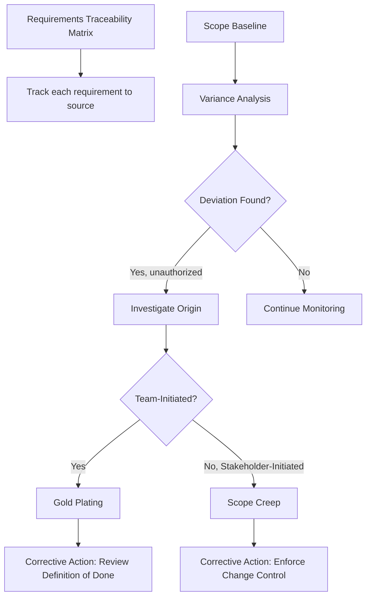

## Managing Scope Creep and Gold Plating

### Definitions

**Scope Creep**

Uncontrolled expansion of product or project scope without adjustments to time, cost, and resources. Scope creep typically occurs incrementally through small, informally approved additions rather than a single large unauthorized change.

**Gold Plating**

The practice of exceeding the agreed scope by adding extra features, functionality, or quality beyond what was specified or requested — typically initiated by the project team (often developers or designers) believing they are adding value, without stakeholder request or authorization.

**Key Distinction**

| Attribute | Scope Creep | Gold Plating |
| --- | --- | --- |
| Initiator | Stakeholders, clients, sometimes PM | Project team members |
| Motivation | External pressure, evolving requirements, poor change control | Perceived value-add, perfectionism, technical interest |
| Formality | Often informally approved, undocumented | Rarely approved at all |
| Typical Cause | Weak scope control process | Lack of clear requirements boundaries, unchecked team autonomy |
| Impact | Budget/schedule overrun, diluted focus | Wasted effort, unbudgeted risk, potential scope conflicts |

### Root Causes

**Scope Creep**

- Ambiguous or incomplete requirements at baseline
- Absence of a formal, enforced change control process
- Stakeholders bypassing the CCB with informal requests to team members
- Poor requirements traceability, making it hard to detect unauthorized additions
- Weak project manager authority or reluctance to say no
- Fixed-price contracts creating pressure to "just add it" to preserve the relationship

**Gold Plating**

- Team members conflating "quality" with "more features"
- Lack of clarity on the Definition of Done or acceptance criteria
- Insufficient oversight or code/design review discipline
- Misplaced belief that exceeding scope pleases the customer
- Absence of a cost-conscious culture — team unaware of the hidden cost of extra work

### Detection Mechanisms

**Detection tools:**

- Requirements Traceability Matrix (RTM) — every deliverable feature must trace back to an approved requirement; untraceable items signal creep or gold plating
- Variance Analysis in Control Scope — comparing planned vs. actual scope
- Code/design reviews and QA audits — surfacing unrequested functionality before release
- Burn-down/burn-up chart anomalies — unexplained increases in remaining work
- Retrospectives — team self-reporting of "extra" work added informally

### Prevention Strategies

**For Scope Creep**

- Establish and enforce a strict Perform Integrated Change Control process; no verbal or email-only approvals
- Maintain a detailed, unambiguous Scope Statement and WBS Dictionary
- Educate stakeholders early on the cost/schedule implications of change requests
- Use a Change Control Board (CCB) with clear authority and turnaround SLAs
- Apply the Requirements Traceability Matrix rigorously from Collect Requirements onward
- Define and communicate a change request threshold (e.g., changes under X hours may use lightweight approval; above it requires full CCB review)

**For Gold Plating**

- Define clear, measurable acceptance criteria and a Definition of Done for every deliverable
- Set team expectations that "extra" work must go through the same change control process as any other scope addition
- Conduct regular scope reviews comparing actual deliverables to the WBS dictionary
- Foster a culture where team members raise potential enhancements as formal change requests or backlog items, not silent additions
- Track effort against budget per feature so unplanned work is visible in cost reporting

### Corrective Actions When Detected

1. Document the deviation (source, scope, effort/cost impact)
2. Classify as scope creep or gold plating using origin analysis
3. Submit as a formal Change Request through Perform Integrated Change Control
4. If retroactively rejected: remove/roll back the item, and update the scope baseline and RTM to reflect the decision
5. If retroactively approved: update Scope Baseline, Schedule Baseline, Cost Baseline, and WBS Dictionary
6. Capture as a lessons-learned entry to reduce recurrence

### Worked Example

A UX designer on a mobile app project adds a dark mode toggle and custom animation transitions that were not part of the approved scope, believing it improves the product ("gold plating"). Separately, the client has been sending the developer informal Slack messages requesting minor feature tweaks that get implemented without documentation ("scope creep").

**Investigation:**

- RTM review shows dark mode and animations have no linked requirement ID → confirmed gold plating
- Slack-requested tweaks have no associated change request → confirmed scope creep

**Resolution:**

- Dark mode and animations are logged as a formal change request; CCB evaluates cost/schedule impact ($4,000, 1 week) and defers to Phase 2 backlog
- Slack-based changes are retroactively documented; two are approved with schedule adjustment, one is rejected and rolled back
- Team agrees on a policy: all client requests, regardless of channel, must be logged as change requests before implementation

### Metrics for Monitoring

- **Requirements Volatility Index** — percentage of requirements changed post-baseline
- **Unauthorized Change Rate** — number of undocumented additions detected per reporting period
- **Rework Cost Ratio** — cost of rework/removal due to unauthorized scope, divided by total project cost
- **CCB Approval Turnaround Time** — indicates whether slow formal processes are pushing stakeholders toward informal requests

### Common Pitfalls

- Treating gold plating as harmless because it appears to add value — it consumes unbudgeted time and introduces untested risk
- Punishing team members for raising scope concerns, which discourages transparency and drives creep underground
- Over-relying on the PM to catch every deviation instead of embedding traceability and review checkpoints into the process
- Allowing "small" exceptions to the change control process, which normalizes bypassing it entirely
- Conflating customer satisfaction with scope expansion — satisfaction should come from meeting agreed requirements well, not exceeding them unpredictably

### Related Topics

- Control Scope
- Validate Scope
- Requirements Traceability Matrix
- Perform Integrated Change Control
- Change Control Board (CCB) governance
- Definition of Done and Acceptance Criteria
- Earned Value Management (EVM)