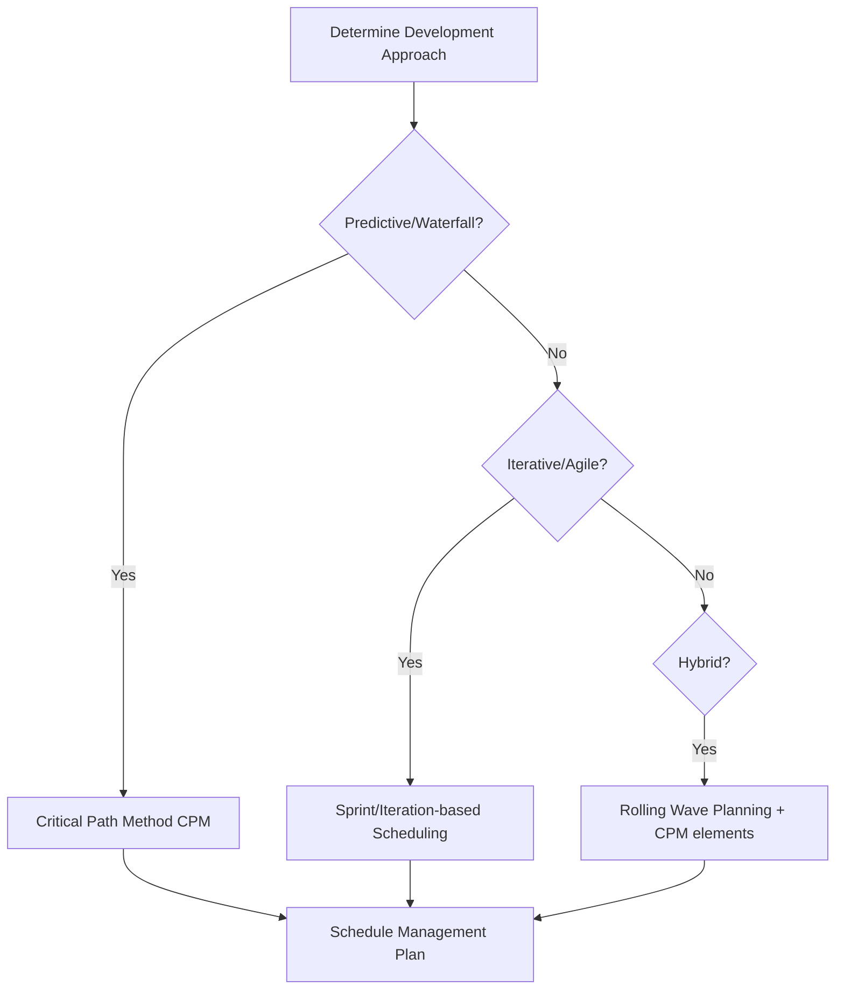
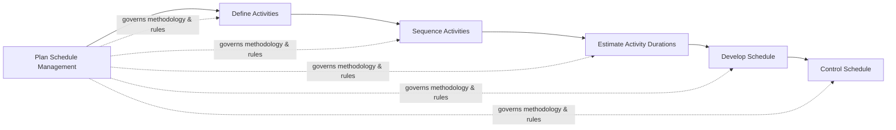

## Planning Schedule Management

### Definition

Plan Schedule Management is the process of establishing the policies, procedures, and documentation for planning, developing, managing, executing, and controlling the project schedule. It is the first process within the Project Schedule Management knowledge area and produces the Schedule Management Plan, a subsidiary component of the overall Project Management Plan.

This process is performed once, or at predefined points, early in the project (typically during planning) and provides guidance and direction on how the project schedule will be managed throughout the project lifecycle.

### Purpose and Objectives

- Define the scheduling methodology and scheduling tool(s) to be used
- Establish rules for how the schedule will be developed, maintained, and controlled
- Set the level of precision, units of measure, and control thresholds for schedule variance
- Provide a consistent framework so schedule data across the project is comparable and auditable
- Reduce ambiguity in how schedule changes are proposed, evaluated, and approved

### Inputs

**Project Charter**

- Provides the summary milestone schedule and project approval requirements that constrain scheduling approach

**Project Management Plan**

- Scope management plan — describes how scope will be defined, informing activity definition
- Development approach — predictive, iterative, adaptive, or hybrid, which fundamentally shapes scheduling methodology

**Enterprise Environmental Factors (EEFs)**

- Organizational culture and structure
- Resource availability and skills
- Project management software/scheduling tools
- Guidelines on resource capability and availability

**Organizational Process Assets (OPAs)**

- Historical information and lessons learned repositories
- Existing scheduling methodology and templates
- Monitoring and reporting tools already standardized in the organization

### Tools and Techniques

**Expert Judgment**

- Individuals or groups with specialized scheduling expertise (e.g., prior similar projects, scheduling software expertise)

**Data Analysis**

- Alternatives analysis — evaluating scheduling methodologies (e.g., critical path vs. agile iteration-based) and tool options

**Meetings**

- Planning meetings with project team, sponsor, selected stakeholders, and anyone with schedule development or execution responsibility

### Outputs

**Schedule Management Plan** — the primary output, typically addressing:

| Component | Description |
| --- | --- |
| Scheduling methodology | Critical Path Method (CPM), Critical Chain, agile/rolling wave, or hybrid approach |
| Scheduling tool | Software to be used (e.g., MS Project, Primavera P6, Jira for agile sprints) |
| Level of accuracy | Acceptable range for activity duration estimates (e.g., ±10%) |
| Units of measure | Hours, days, weeks for time; units for resource quantities |
| Organizational procedures links | How the WBS ties into schedule development |
| Project schedule model maintenance | How the model will be updated during execution |
| Control thresholds | Agreed variance thresholds (e.g., ±5% of baseline) that trigger action before escalation |
| Rules of performance measurement | Earned Value Management (EVM) rules, percent-complete rules |
| Reporting formats | Frequency and format of schedule status reports |

### Key Concepts

**Scheduling Methodology Selection**

The choice of methodology depends heavily on the project's development approach:

**Control Thresholds**

Defined in the Schedule Management Plan, these thresholds determine when a variance is significant enough to warrant corrective action versus being within acceptable tolerance. For example: "Any activity or milestone variance exceeding 10% of planned duration or 5 working days, whichever is smaller, triggers a formal variance review."

**Rolling Wave Planning**

A common technique referenced within the Schedule Management Plan for progressive elaboration — near-term work is planned in detail, while future work is planned at a higher level until more information becomes available.

### Worked Example

A mid-sized construction project charter specifies predictive delivery with fixed milestones for regulatory inspections. During Plan Schedule Management:

1. **Development approach** is confirmed as predictive (regulatory inspection gates require fixed dates)
2. **Scheduling methodology** selected: Critical Path Method with float analysis
3. **Scheduling tool**: Primavera P6, per organizational standard (OPA)
4. **Units of measure**: Working days, 8-hour workday
5. **Level of accuracy**: ±5% for activities under 2 weeks; ±10% for longer activities
6. **Control thresholds**: Any critical path activity slipping more than 3 working days triggers a variance report to the sponsor
7. **Reporting format**: Weekly schedule status report using earned value S-curves, distributed every Friday

This becomes the documented Schedule Management Plan, referenced throughout Define Activities, Sequence Activities, Estimate Activity Durations, and Develop Schedule.

### Relationship to Other Processes

Plan Schedule Management sets the rules that all five downstream schedule processes operate under; it does not itself produce the schedule.

### Common Pitfalls

- Treating the Schedule Management Plan as a formality rather than an operational document teams actually reference
- Failing to align scheduling methodology with the project's actual development approach (e.g., applying rigid CPM to a highly adaptive agile project)
- Omitting control thresholds, leaving no clear trigger point for corrective action later in Control Schedule
- Not revisiting the plan when the development approach changes mid-project (e.g., pivoting from waterfall to hybrid)
- Selecting a scheduling tool without considering team familiarity or organizational standardization, causing adoption friction

### Related Topics

- Define Activities
- Sequence Activities
- Estimate Activity Durations
- Develop Schedule
- Control Schedule
- Critical Path Method (CPM)
- Rolling Wave Planning
- Earned Value Management (EVM)