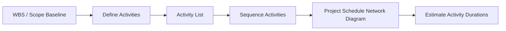
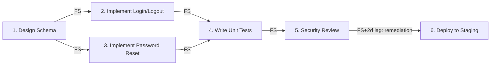

## Defining and Sequencing Activities

### Overview

This topic covers two sequential processes within Project Schedule Management: **Define Activities** and **Sequence Activities**. Together they transform the Work Breakdown Structure (WBS) into an ordered set of schedule activities ready for duration estimation and schedule development.

---

### Part 1: Define Activities

**Definition**

Define Activities is the process of identifying and documenting the specific actions to be performed to produce the project deliverables. It decomposes work packages (the lowest level of the WBS) into schedule activities — the smallest unit of work that can be scheduled, cost-estimated, monitored, and controlled.

**Inputs**

- Schedule management plan — methodology, level of detail required
- Scope baseline — WBS, WBS dictionary, scope statement
- Enterprise environmental factors — PMIS, organizational culture
- Organizational process assets — historical activity lists, lessons learned, standardized processes

**Tools and Techniques**

| Technique | Description |
| --- | --- |
| Decomposition | Subdividing work packages into smaller, manageable schedule activities |
| Rolling Wave Planning | Progressive elaboration — near-term work planned in detail, future work at summary level |
| Expert Judgment | Team members experienced in similar work provide input on activity breakdown |
| Meetings | Planning sessions with team members to define activities collaboratively |

**Outputs**

- **Activity List** — comprehensive list of all schedule activities, including activity identifier and scope of work description in enough detail for team members to understand what work is required
- **Activity Attributes** — extends activity descriptions: predecessor/successor activities, logical relationships, leads/lags, resource requirements, constraints, assumptions, geographic location, activity type
- **Milestone List** — significant points or events; milestones have zero duration and mark completion of major deliverables or phase gates

---

### Part 2: Sequence Activities

**Definition**

Sequence Activities is the process of identifying and documenting relationships among project activities, establishing the logical order of work while accounting for constraints, to produce a project schedule network diagram.

**Inputs**

- Schedule management plan
- Activity list and activity attributes (from Define Activities)
- Milestone list
- Assumption log and other project documents
- EEFs and OPAs (including project calendars, scheduling methodology, tool)

**Tools and Techniques**

**Precedence Diagramming Method (PDM)**

The dominant technique in modern schedule network diagrams. Activities are represented as nodes, connected by arrows showing logical relationships.

Four types of dependencies (logical relationships):

| Relationship | Description | Notation |
| --- | --- | --- |
| Finish-to-Start (FS) | Successor cannot start until predecessor finishes | Most common |
| Finish-to-Finish (FF) | Successor cannot finish until predecessor finishes |  |
| Start-to-Start (SS) | Successor cannot start until predecessor starts |  |
| Start-to-Finish (SF) | Successor cannot finish until predecessor starts | Rare |

**Dependency Determination and Integration**

| Type | Description |
| --- | --- |
| Mandatory (hard logic) | Inherent in the nature of the work (e.g., foundation before walls) |
| Discretionary (soft/preferred logic) | Based on best practice or preference, should be fully documented since they create float constraints |
| External | Relationship between project and non-project activities (e.g., regulatory approval, vendor delivery) |
| Internal | Relationship within the project team's control, generally involving precedence relationship |

**Leads and Lags**

- **Lead** — acceleration of successor activity; overlaps with predecessor (expressed as negative time, e.g., FS-3 days)
- **Lag** — delay inserted between predecessor and successor (expressed as positive time, e.g., FS+5 days for concrete curing)

**Outputs**

- **Project Schedule Network Diagram** — graphical representation of logical relationships (predecessor/successor) among schedule activities
- Project documents updates (activity list, activity attributes, milestone list, assumption log)

### Worked Example

A software project has the following work package: "Build User Authentication Module."

**Define Activities decomposes this into:**

1. Design authentication schema
2. Implement login/logout endpoints
3. Implement password reset flow
4. Write unit tests
5. Conduct security review
6. Deploy to staging

**Sequence Activities establishes relationships:**

- Activities 2 and 3 both depend on Activity 1 (mandatory dependency — cannot code endpoints without a schema)
- Activity 4 depends on both 2 and 3 finishing (FF/FS combination depending on test strategy)
- Activity 5 to 6 includes a 2-day lag to account for remediation of any findings (discretionary buffer, documented as soft logic)
- If a third-party penetration testing vendor is required for Activity 5, that introduces an **external dependency**

### Precedence Diagramming Method (svg_diagram)

<svg xmlns="http://www.w3.org/2000/svg" viewBox="0 0 700 220">
<text x="350" y="20" font-size="14" font-weight="bold" text-anchor="middle" fill="#222">Precedence Diagramming Method - Dependency Types (svg_diagram)</text>
<rect x="20" y="50" width="90" height="40" rx="5" fill="#dbeafe" stroke="#2563eb" />
<text x="65" y="75" font-size="11" text-anchor="middle" fill="#1e3a8a">Activity A</text>
<rect x="180" y="50" width="90" height="40" rx="5" fill="#dbeafe" stroke="#2563eb" />
<text x="225" y="75" font-size="11" text-anchor="middle" fill="#1e3a8a">Activity B</text>
<line x1="110" y1="70" x2="178" y2="70" stroke="#333" stroke-width="1.5" marker-end="url(#arrow)" />
<text x="144" y="62" font-size="10" text-anchor="middle" fill="#333">FS</text>
<rect x="20" y="110" width="90" height="40" rx="5" fill="#dcfce7" stroke="#16a34a" />
<text x="65" y="135" font-size="11" text-anchor="middle" fill="#14532d">Activity C</text>
<rect x="180" y="110" width="90" height="40" rx="5" fill="#dcfce7" stroke="#16a34a" />
<text x="225" y="135" font-size="11" text-anchor="middle" fill="#14532d">Activity D</text>
<line x1="65" y1="150" x2="225" y2="150" stroke="#333" stroke-width="1.5" marker-end="url(#arrow)" />
<text x="144" y="165" font-size="10" text-anchor="middle" fill="#333">SS</text>
<rect x="380" y="50" width="90" height="40" rx="5" fill="#fef3c7" stroke="#d97706" />
<text x="425" y="75" font-size="11" text-anchor="middle" fill="#78350f">Activity E</text>
<rect x="540" y="50" width="90" height="40" rx="5" fill="#fef3c7" stroke="#d97706" />
<text x="585" y="75" font-size="11" text-anchor="middle" fill="#78350f">Activity F</text>
<line x1="470" y1="90" x2="630" y2="90" stroke="#333" stroke-width="1.5" marker-end="url(#arrow)" />
<text x="550" y="103" font-size="10" text-anchor="middle" fill="#333">FF</text>
<rect x="380" y="110" width="90" height="40" rx="5" fill="#fee2e2" stroke="#dc2626" />
<text x="425" y="135" font-size="11" text-anchor="middle" fill="#7f1d1d">Activity G</text>
<rect x="540" y="110" width="90" height="40" rx="5" fill="#fee2e2" stroke="#dc2626" />
<text x="585" y="135" font-size="11" text-anchor="middle" fill="#7f1d1d">Activity H</text>
<line x1="425" y1="110" x2="585" y2="152" stroke="#333" stroke-width="1.5" marker-end="url(#arrow)" />
<text x="505" y="165" font-size="10" text-anchor="middle" fill="#333">SF (rare)</text>
<text x="65" y="205" font-size="10" fill="#555">FS: Finish-to-Start (most common)</text>

<text x="380" y="205" font-size="10" fill="#555">FF/SF: Less common relationships</text>

</svg>

### Common Pitfalls

- Defining activities at too coarse a level, making duration estimation and progress tracking imprecise
- Defining activities at too granular a level, creating excessive administrative overhead
- Overusing discretionary dependencies without documenting rationale, unnecessarily constraining schedule flexibility (reducing float)
- Confusing lag with a separate activity — lag is a time delay attribute of a relationship, not a schedule activity itself
- Ignoring external dependencies (vendor, regulatory) during sequencing, leading to unrealistic critical path assumptions
- Failing to update activity attributes when relationships change, causing network diagram drift from actual plan

### Related Topics

- Plan Schedule Management
- Estimate Activity Durations
- Develop Schedule
- Critical Path Method (CPM)
- Work Breakdown Structure (WBS)
- Precedence Diagramming Method (PDM)
- Schedule Network Analysis