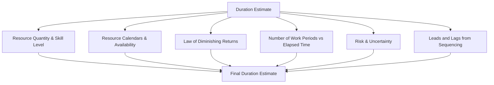

## Estimating Activity Durations

### Definition

Estimate Activity Durations is the process of estimating the number of work periods needed to complete individual activities with the resources estimated. It uses information from the scope of work, required resource types/quantities, and resource calendars to produce duration estimates for each schedule activity, informing the Develop Schedule process.

Duration is distinct from effort: duration is the total elapsed time (including non-work time such as weekends or waiting periods), while effort (work) is the number of labor hours required.

### Inputs

**Project Management Plan**

- Schedule management plan — methodology, level of accuracy
- Scope baseline — WBS, WBS dictionary, activity scope descriptions

**Project Documents**

- Activity list and activity attributes
- Assumption log — assumptions and constraints affecting durations
- Lessons learned register
- Milestone list
- Project team assignments
- Resource breakdown structure
- Resource calendars — availability of specific resources by date
- Resource requirements — estimated resource needs per activity
- Risk register — risks that may affect duration estimates

**Enterprise Environmental Factors**

- Duration estimating databases and productivity metrics
- Published commercial information (e.g., industry production rates)

**Organizational Process Assets**

- Historical duration information
- Project calendars
- Estimating policies
- Lessons learned repositories

### Tools and Techniques

| Technique | Description | Use Case |
| --- | --- | --- |
| Expert Judgment | Input from individuals/groups with specialized knowledge | When historical data is unavailable or unreliable |
| Analogous Estimating | Uses duration from a similar past activity/project, scaled by known differences | Early phases, limited detail available; fast but less accurate |
| Parametric Estimating | Uses a statistical relationship between historical data and other variables (e.g., hours per unit) to calculate duration | Repetitive or quantifiable work (e.g., meters of cable installed per hour) |
| Three-Point Estimating | Uses optimistic, pessimistic, and most likely estimates to account for uncertainty | Higher accuracy needs, accounts for risk |
| Bottom-Up Estimating | Estimates each component of the work in detail, then aggregates | Most accurate; used when detailed WBS decomposition exists |
| Data Analysis (Alternatives Analysis) | Comparing options such as make-vs-buy, resource skill level trade-offs, crashing/fast-tracking | Evaluating trade-offs affecting duration |
| Decision Making (Voting) | Team consensus-based techniques for estimate agreement | Agile/collaborative estimating (e.g., Planning Poker) |
| Meetings | Sprint planning, estimation workshops | Iterative/agile environments |

### Three-Point Estimating (PERT)

Three-point estimating produces a weighted duration estimate that accounts for estimation uncertainty and risk, using three estimates per activity:

- $O$ = Optimistic duration (best-case scenario)
- $M$ = Most likely duration (realistic scenario)
- $P$ = Pessimistic duration (worst-case scenario)

**Triangular Distribution**

$$t_E = \frac{O + M + P}{3}$$

**Beta Distribution (PERT weighting)**

$$t_E = \frac{O + 4M + P}{6}$$

The PERT weighted formula gives more weight to the most likely estimate, producing a smoother, generally more defensible estimate for activities with meaningful uncertainty.

**Standard Deviation and Variance**

$$\sigma = \frac{P - O}{6}$$

$$\sigma^2 = \left(\frac{P - O}{6}\right)^2$$

Standard deviation quantifies the range of uncertainty around the estimate and is used later in schedule risk analysis (e.g., Monte Carlo simulation) to model overall project duration confidence intervals.

### Worked Example

Activity: "Develop payment gateway integration"

- Optimistic ($O$): 8 days
- Most Likely ($M$): 12 days
- Pessimistic ($P$): 20 days

**Triangular estimate:**

$$t_E = \frac{8 + 12 + 20}{3} = \frac{40}{3} \approx 13.33 \text{ days}$$

**PERT (Beta) weighted estimate:**

$$t_E = \frac{8 + 4(12) + 20}{6} = \frac{8 + 48 + 20}{6} = \frac{76}{6} \approx 12.67 \text{ days}$$

**Standard deviation:**

$$\sigma = \frac{20 - 8}{6} = 2 \text{ days}$$

This means there is approximately a 68% confidence interval that the actual duration falls within $12.67 \pm 2$ days (i.e., 10.67 to 14.67 days), assuming a beta distribution and one standard deviation. [Inference: the 68% confidence figure follows from standard normal/beta distribution properties applied to PERT estimates; actual confidence depends on how closely the real duration distribution matches the assumed beta shape, which is a modeling assumption rather than a guaranteed outcome.]

### Factors Influencing Duration Estimates

- **Law of Diminishing Returns** — adding more resources to an activity does not always proportionally reduce duration (e.g., doubling staff on a task does not always halve the time; communication overhead increases)
- **Resource Calendars** — an activity requiring a specialist available only 2 days/week extends elapsed duration even if total effort is small
- **Student Syndrome / Parkinson's Law** — behavioral tendencies (procrastination until deadline pressure, work expanding to fill available time) that estimators should account for, particularly relevant in critical chain scheduling approaches

### Outputs

- **Duration Estimates** — quantitative assessments of the likely number of work periods required, typically expressed as a range (e.g., "2 weeks ± 2 days") to convey the level of uncertainty
- **Basis of Estimates** — supporting detail: assumptions, constraints, range of estimates used, confidence level, documented risks
- **Project Documents Updates** — activity attributes, assumption log, lessons learned register

### Common Pitfalls

- Confusing effort (labor-hours) with duration (elapsed time), producing schedules that ignore resource availability constraints
- Providing single-point estimates without documenting the basis, hiding the actual uncertainty from stakeholders
- Failing to account for resource calendars (holidays, part-time availability, multi-project allocation)
- Applying analogous estimating without adjusting for meaningful differences between the historical and current activity
- Ignoring the psychological effects (Parkinson's Law, Student Syndrome) that inflate or distort estimates in practice
- Not revisiting duration estimates as more information becomes available (violates progressive elaboration principle)

### Related Topics

- Define Activities
- Sequence Activities
- Develop Schedule
- Critical Path Method (CPM)
- Resource Management planning
- Schedule Risk Analysis (Monte Carlo simulation)
- Critical Chain Method