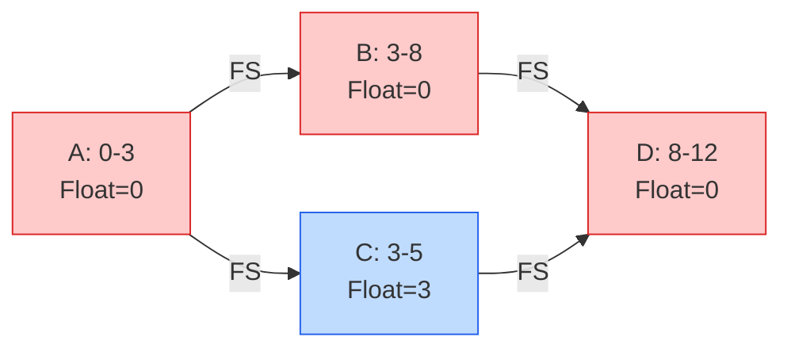
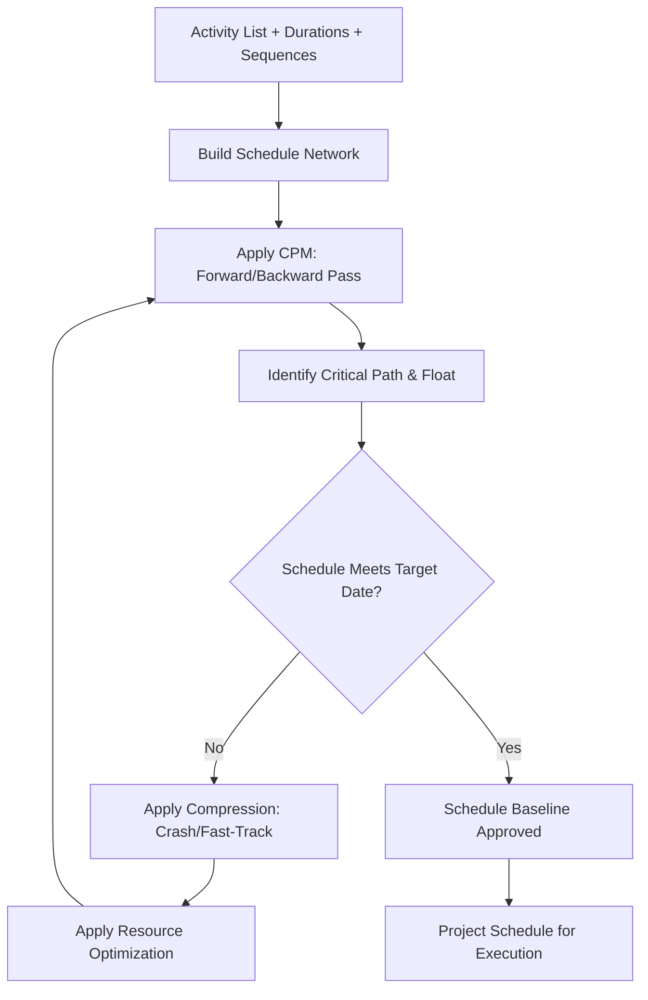

## Developing the Project Schedule

### Definition

Develop Schedule is the process of analyzing activity sequences, durations, resource requirements, and schedule constraints to create a schedule model for project execution, monitoring, and controlling. This is the culminating process of Project Schedule Management's planning processes, integrating outputs from Plan Schedule Management, Define Activities, Sequence Activities, and Estimate Activity Durations into a single, approved schedule baseline.

### Inputs

**Project Management Plan**

- Schedule management plan
- Scope baseline

**Project Documents**

- Activity list, activity attributes
- Assumption log
- Basis of estimates
- Duration estimates
- Lessons learned register
- Milestone list
- Project schedule network diagrams
- Project team assignments
- Resource calendars
- Resource requirements
- Risk register

**Agreements** — vendor/contractor delivery dates affecting schedule

**Enterprise Environmental Factors / Organizational Process Assets**

### Tools and Techniques

| Technique | Description |
| --- | --- |
| Schedule Network Analysis | Umbrella technique generating the schedule model using CPM, resource optimization, modeling techniques |
| Critical Path Method (CPM) | Estimates minimum project duration and determines schedule flexibility (float) on logical network paths |
| Resource Optimization | Adjusts schedule based on resource supply/demand (resource leveling, resource smoothing) |
| Data Analysis | What-if scenario analysis, simulation (Monte Carlo) |
| Leads and Lags | Adjusts timing between dependent activities |
| Schedule Compression | Crashing and fast-tracking to shorten schedule without changing scope |
| Project Management Information System (PMIS) | Scheduling software to build, calculate, and visualize the schedule model |
| Agile Release Planning | For adaptive projects, creates high-level timeline for release, based on product roadmap, iterations/sprints |

### Critical Path Method (CPM)

CPM identifies the longest path of dependent activities through the network, which determines the minimum possible project duration. Any delay on the critical path directly delays the project finish date.

**Forward Pass** — calculates Early Start (ES) and Early Finish (EF) for each activity, moving from project start to end.

$$EF = ES + Duration$$

**Backward Pass** — calculates Late Finish (LF) and Late Start (LS), moving from project end to start.

$$LS = LF - Duration$$

**Total Float (Slack)** — amount of time an activity can be delayed without delaying the project finish date.

$$\text{Total Float} = LS - ES = LF - EF$$

Activities with **zero total float** lie on the critical path.

**Free Float** — amount of time an activity can be delayed without delaying the early start of its successor activity.

### Worked CPM Example

Network: A → B → D (path 1), A → C → D (path 2)

| Activity | Duration | Predecessor |
| --- | --- | --- |
| A | 3 days | — |
| B | 5 days | A |
| C | 2 days | A |
| D | 4 days | B, C |

**Forward Pass:**

- A: ES=0, EF=3
- B: ES=3, EF=8
- C: ES=3, EF=5
- D: ES=max(8,5)=8, EF=12

**Backward Pass (Project finish = 12):**

- D: LF=12, LS=8
- B: LF=8, LS=3
- C: LF=8, LS=6
- A: LF=3, LS=0

**Total Float:**

- A: LS-ES = 0-0 = 0 → critical
- B: LS-ES = 3-3 = 0 → critical
- C: LS-ES = 6-3 = 3 days → non-critical
- D: LS-ES = 8-8 = 0 → critical

**Critical Path: A → B → D = 12 days** (Path A → C → D = 9 days, with 3 days of float on C)

Red nodes indicate the critical path; blue indicates float available.

### Schedule Compression Techniques

| Technique | Method | Trade-off |
| --- | --- | --- |
| **Crashing** | Adding resources to critical path activities to shorten duration | Increases cost; effectiveness limited by diminishing returns |
| **Fast-Tracking** | Performing activities in parallel that were originally sequential | Increases risk of rework; requires activities to be divisible |

Crashing analysis typically evaluates cost-per-day-saved across critical path activities to select the most cost-efficient combination to shorten the schedule.

### Resource Optimization Techniques

- **Resource Leveling** — adjusts start/finish dates based on resource constraints, aiming for a more even resource usage; may extend the critical path
- **Resource Smoothing** — adjusts activities only within their available float, so the project end date does not change, but may not fully resolve over-allocation

### Schedule Model Development

### Outputs

**Schedule Baseline** — the approved version of the schedule model, used as the basis for comparison to actual results; changed only through formal change control

**Project Schedule** — output of the schedule model, includes start/finish dates for activities and milestones, typically presented as:

- **Bar Charts (Gantt Charts)** — activity durations shown as horizontal bars against a timeline; easy to read, widely used for status reporting
- **Milestone Charts** — identify scheduled start/finish of major deliverables and key external interfaces
- **Project Schedule Network Diagrams** — show logic and critical path, typically with date information

**Schedule Data** — supporting detail: milestones, activities, attributes, assumptions, constraints, resource requirements by time period, alternative schedules, schedule contingency reserves

**Project Calendars** — identifies working days/shifts available for scheduled activities

**Change Requests, Project Management Plan Updates, Project Documents Updates**

### Common Pitfalls

- Treating the schedule baseline as static and failing to protect it via formal change control
- Applying crashing without analyzing cost-efficiency, adding resources to non-critical activities with no schedule benefit
- Fast-tracking activities that have mandatory (hard logic) dependencies, introducing significant rework risk
- Ignoring resource leveling effects on the critical path, causing published schedules to be practically infeasible
- Failing to build in schedule contingency/reserve for identified risks, leading to persistently optimistic schedules
- Confusing float on the schedule with slack available for management reserve — total float belongs to the project, not to individual activity owners to consume unilaterally

### Related Topics

- Plan Schedule Management
- Estimate Activity Durations
- Control Schedule
- Critical Chain Method
- Schedule Risk Analysis (Monte Carlo simulation)
- Resource Management (Estimate Activity Resources)
- Earned Value Management (EVM)