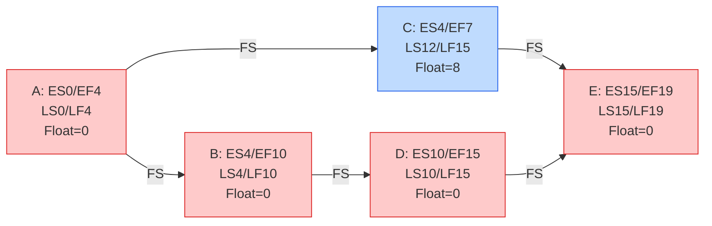

## Critical Path Method

### Definition

The Critical Path Method (CPM) is a schedule network analysis technique used to estimate the minimum project duration and determine the amount of scheduling flexibility on the logical network paths within the schedule model. It identifies the sequence of dependent activities — the **critical path** — that represents the longest duration through the project, thereby determining the earliest possible completion date.

CPM operates on a deterministic model: it uses single-point duration estimates for each activity, without directly incorporating probabilistic variation (contrast with PERT/three-point estimating, which can feed durations into CPM, or Monte Carlo simulation, which models uncertainty around the CPM baseline).

### Core Concepts

**Critical Path** — the longest path (by duration) through the project schedule network diagram from start to finish. Any delay to an activity on the critical path delays the entire project finish date by the same amount, assuming no compression or re-sequencing is applied.

**Float (Slack)** — the amount of time an activity can be delayed without impacting the schedule.

- **Total Float** — the amount of time an activity can be delayed without delaying the project finish date
- **Free Float** — the amount of time an activity can be delayed without delaying the early start of any successor activity
- **Project Float** — the amount of time a project can be delayed without delaying an externally imposed completion date required by the customer or sponsor

Activities on the critical path have **zero total float** (in a single-critical-path network). A project can have more than one critical path if multiple paths tie for the longest duration.

### Calculation Method

**Step 1: Forward Pass** (Early Start / Early Finish)

Moves through the network from the first activity to the last, calculating the earliest an activity can start and finish.

$$ES_{successor} = EF_{predecessor}$$

$$EF = ES + Duration$$

When an activity has multiple predecessors, its ES equals the **maximum** EF among all predecessors (for FS relationships).

**Step 2: Backward Pass** (Late Start / Late Finish)

Moves through the network from the last activity to the first, calculating the latest an activity can start/finish without delaying the project.

$$LF_{predecessor} = LS_{successor}$$

$$LS = LF - Duration$$

When an activity has multiple successors, its LF equals the **minimum** LS among all successors.

**Step 3: Calculate Float**

$$\text{Total Float} = LS - ES \quad (\text{equivalently } LF - EF)$$

Activities with Total Float = 0 lie on the critical path.

### Worked Example

Network with five activities:

| Activity | Duration (days) | Predecessor(s) |
| --- | --- | --- |
| A | 4 | — |
| B | 6 | A |
| C | 3 | A |
| D | 5 | B |
| E | 4 | C, D |

**Forward Pass:**

- A: ES=0, EF=4
- B: ES=4, EF=10
- C: ES=4, EF=7
- D: ES=10 (from B), EF=15
- E: ES=max(7,15)=15, EF=19

**Backward Pass** (Project Finish = 19):

- E: LF=19, LS=15
- D: LF=15, LS=10
- C: LF=15, LS=12
- B: LF=10, LS=4
- A: LF=4, LS=0

**Total Float:**

- A: 0-0=0 → critical
- B: 4-4=0 → critical
- C: 12-4=8 → non-critical (8 days float)
- D: 10-10=0 → critical
- E: 15-15=0 → critical

**Critical Path: A → B → D → E = 19 days**

### Critical Path Diagram (svg_diagram)

<svg xmlns="http://www.w3.org/2000/svg" viewBox="0 0 720 260">
<text x="360" y="20" font-size="14" font-weight="bold" text-anchor="middle" fill="#222">Critical Path Method - Forward/Backward Pass (svg_diagram)</text>
<rect x="30" y="60" width="110" height="60" rx="5" fill="#fecaca" stroke="#dc2626" stroke-width="2" />
<text x="85" y="80" font-size="11" font-weight="bold" text-anchor="middle" fill="#7f1d1d">A (4d)</text>
<text x="85" y="95" font-size="9" text-anchor="middle" fill="#7f1d1d">ES 0 / EF 4</text>
<text x="85" y="107" font-size="9" text-anchor="middle" fill="#7f1d1d">LS 0 / LF 4</text>
<rect x="200" y="60" width="110" height="60" rx="5" fill="#fecaca" stroke="#dc2626" stroke-width="2" />
<text x="255" y="80" font-size="11" font-weight="bold" text-anchor="middle" fill="#7f1d1d">B (6d)</text>
<text x="255" y="95" font-size="9" text-anchor="middle" fill="#7f1d1d">ES 4 / EF 10</text>
<text x="255" y="107" font-size="9" text-anchor="middle" fill="#7f1d1d">LS 4 / LF 10</text>
<rect x="200" y="150" width="110" height="60" rx="5" fill="#bfdbfe" stroke="#2563eb" stroke-width="2" />
<text x="255" y="170" font-size="11" font-weight="bold" text-anchor="middle" fill="#1e3a8a">C (3d)</text>
<text x="255" y="185" font-size="9" text-anchor="middle" fill="#1e3a8a">ES 4 / EF 7</text>
<text x="255" y="197" font-size="9" text-anchor="middle" fill="#1e3a8a">LS 12 / LF 15 (Float=8)</text>
<rect x="370" y="60" width="110" height="60" rx="5" fill="#fecaca" stroke="#dc2626" stroke-width="2" />
<text x="425" y="80" font-size="11" font-weight="bold" text-anchor="middle" fill="#7f1d1d">D (5d)</text>
<text x="425" y="95" font-size="9" text-anchor="middle" fill="#7f1d1d">ES 10 / EF 15</text>
<text x="425" y="107" font-size="9" text-anchor="middle" fill="#7f1d1d">LS 10 / LF 15</text>
<rect x="540" y="105" width="110" height="60" rx="5" fill="#fecaca" stroke="#dc2626" stroke-width="2" />
<text x="595" y="125" font-size="11" font-weight="bold" text-anchor="middle" fill="#7f1d1d">E (4d)</text>
<text x="595" y="140" font-size="9" text-anchor="middle" fill="#7f1d1d">ES 15 / EF 19</text>
<text x="595" y="152" font-size="9" text-anchor="middle" fill="#7f1d1d">LS 15 / LF 19</text>
<line x1="140" y1="90" x2="198" y2="90" stroke="#dc2626" stroke-width="2" marker-end="url(#arrowr)" />
<line x1="140" y1="90" x2="200" y2="175" stroke="#333" stroke-width="1.5" marker-end="url(#arrowb)" />
<line x1="310" y1="90" x2="368" y2="90" stroke="#dc2626" stroke-width="2" marker-end="url(#arrowr)" />
<line x1="480" y1="90" x2="595" y2="107" stroke="#dc2626" stroke-width="2" marker-end="url(#arrowr)" />
<line x1="310" y1="180" x2="540" y2="140" stroke="#333" stroke-width="1.5" marker-end="url(#arrowb)" />
<text x="360" y="240" font-size="10" text-anchor="middle" fill="#555">Red path = Critical Path (A-B-D-E, 19 days) | Blue = Non-critical (C, 8 days float)</text>

</svg>

### Multiple Critical Paths

A network can have more than one critical path when two or more paths share the same longest duration. This increases schedule risk, since a delay on *any* of the tied paths delays the project — there is no float buffer to absorb variance on either path.

### Applications Beyond Basic Scheduling

| Use | Description |
| --- | --- |
| Schedule Compression | Crashing/fast-tracking specifically targets critical path activities, since shortening non-critical activities has no effect on project duration |
| Resource Prioritization | Critical path activities typically receive priority for resource allocation and management attention |
| Risk Focus | Risk management efforts often concentrate on critical path activities, since their variability directly threatens the project end date |
| Near-Critical Path Monitoring | Paths with small positive float (e.g., 1-3 days) should be monitored closely, as they can become critical with minor slippage |

### Common Pitfalls

- Assuming there is always exactly one critical path — multiple critical (or near-critical) paths are common and increase risk
- Focusing compression efforts on non-critical activities, which does not shorten the project duration
- Treating float as "free" time belonging to the activity owner rather than a shared project resource
- Failing to recalculate the critical path after schedule updates — the critical path can shift to a different path as the project progresses and activities are completed ahead of or behind schedule
- Ignoring resource constraints in a pure CPM calculation — CPM alone does not account for resource availability, which is why resource leveling is applied afterward and may extend the critical path
- Using CPM's deterministic single-point durations without any uncertainty analysis, understating schedule risk on tightly constrained projects

### Related Topics

- Develop Schedule
- Estimate Activity Durations
- Schedule Compression (Crashing, Fast-Tracking)
- Critical Chain Method
- Resource Leveling and Resource Smoothing
- Schedule Risk Analysis (Monte Carlo simulation)
- Control Schedule