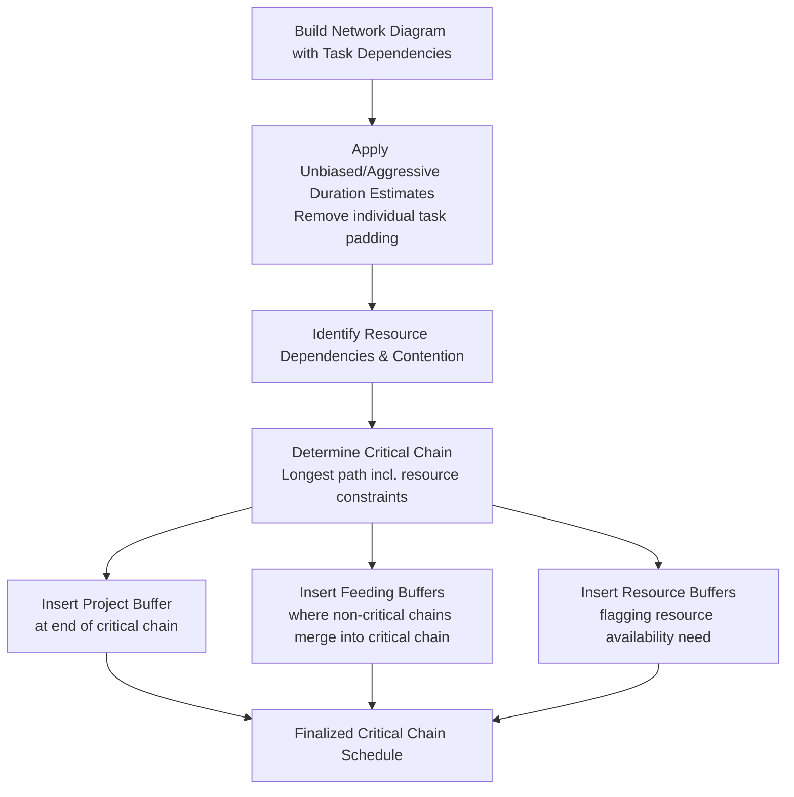
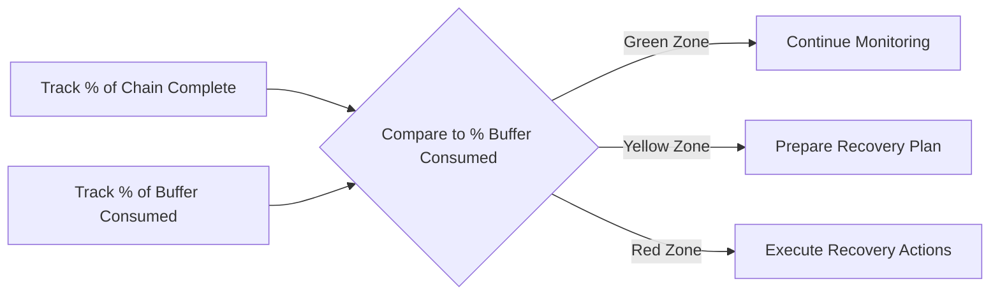
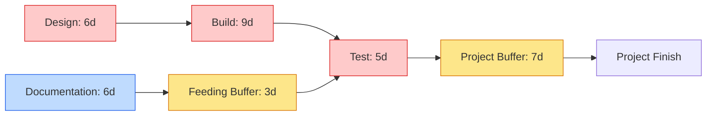

## Critical Chain Method

### Definition

The Critical Chain Method (CCM) is a schedule network analysis technique that modifies the project schedule to account for limited resources by adding duration buffers that are non-work schedule activities to maintain focus on planned activity durations. Developed by Eliyahu Goldratt (based on his Theory of Constraints), CCM shifts the scheduling paradigm from activity-level padding and individual due dates toward resource-constrained, buffer-managed aggregate protection.

Unlike the Critical Path Method (CPM), which identifies the longest sequence of dependent activities based purely on logical dependencies, CCM builds the **critical chain** — the longest sequence of dependent tasks that accounts for both task dependencies **and** resource dependencies (i.e., resource contention/availability).

### Core Philosophy: Theory of Constraints Applied to Scheduling

CCM addresses two behavioral phenomena commonly observed in traditional scheduling:

| Phenomenon | Description |
| --- | --- |
| **Student Syndrome** | Work on an activity is delayed until close to the deadline, consuming built-in safety margin unproductively |
| **Parkinson's Law** | Work expands to fill the time available, so padded estimates get fully consumed regardless of actual effort required |
| **Multitasking Penalty** | Resources working across multiple tasks simultaneously experience switching costs, extending actual completion time for all tasks involved |

CCM's response: remove individual task-level safety margins (padding) and instead pool that safety into shared, strategically placed **buffers** that protect the overall project, not individual activities.

### Process Steps

### Buffer Types

| Buffer | Placement | Purpose |
| --- | --- | --- |
| **Project Buffer** | End of the critical chain, before the project finish milestone | Protects the overall project completion date from variation across the critical chain |
| **Feeding Buffer** | Where a non-critical chain (feeding chain) merges into the critical chain | Protects the critical chain from delays originating in feeding paths |
| **Resource Buffer** | Placed before critical chain tasks requiring a specific resource | Not a duration buffer — a signal/alert to ensure the resource is available and ready when needed |

### Buffer Sizing

Common approaches to buffer sizing include:

- **Cut-and-Paste Method (50% Rule)** — sum the "safety" removed from each task's original padded estimate (typically the difference between a pessimistic/50%-confidence estimate and an aggressive/median estimate), then insert roughly half of that aggregate as the buffer
- **Root Sum Square (RSS) Method** — statistically combines individual task variances (similar in spirit to PERT variance aggregation) to size the buffer based on cumulative uncertainty rather than a flat percentage

$$\text{Project Buffer} \approx \sqrt{\sum_{i=1}^{n} \sigma_i^2}$$

Where $\sigma_i$ is the standard deviation of each critical chain task's duration estimate. [Inference: the RSS approach mirrors standard statistical variance aggregation for independent variables; its accuracy depends on task duration variances being reasonably independent, which may not hold when tasks share common risk drivers.]

### Buffer Management (Execution Monitoring)

During execution, buffer consumption is tracked (rather than tracking individual task start/finish variance against a baseline) using a **buffer burn rate**, often visualized with a fever chart divided into zones:

| Zone | Buffer Consumption | Action |
| --- | --- | --- |
| Green | Buffer consumption proportional to or less than chain progress | No action needed |
| Yellow | Buffer consumption exceeding chain progress at a moderate rate | Develop a recovery/contingency plan |
| Red | Buffer consumption significantly outpacing chain progress | Execute recovery actions immediately |

### Worked Example

A product development critical chain consists of three sequential tasks with original padded (high-confidence) estimates and reduced aggressive (50% confidence) estimates:

| Task | Padded Estimate | Aggressive Estimate | Safety Removed |
| --- | --- | --- | --- |
| Design | 10 days | 6 days | 4 days |
| Build | 15 days | 9 days | 6 days |
| Test | 8 days | 5 days | 3 days |
| **Total** | 33 days | 20 days | 13 days |

Using the 50% Cut-and-Paste rule:

$$\text{Project Buffer} = 0.5 \times 13 = 6.5 \text{ days} \approx 7 \text{ days}$$

**Resulting schedule:** Critical chain length = 20 days (aggressive estimates) + 7-day project buffer = **27 days total**, compared to the original padded schedule of 33 days — a reduction achieved by consolidating safety margin rather than removing it.

A parallel feeding chain ("Documentation," 6 days aggressive estimate) merges into "Test." A feeding buffer (e.g., 3 days, sized via the same method) is inserted between the Documentation chain and its merge point to protect the critical chain from Documentation delays.

### CCM vs. CPM Comparison

| Aspect | Critical Path Method (CPM) | Critical Chain Method (CCM) |
| --- | --- | --- |
| Basis | Logical task dependencies only | Task dependencies + resource dependencies |
| Estimate approach | Often includes individual task safety margin | Removes individual padding; pools safety into buffers |
| Protection mechanism | Float/slack per activity | Aggregated buffers (project, feeding, resource) |
| Monitoring focus | Activity-level start/finish variance vs. baseline | Buffer consumption rate (fever chart) |
| Resource contention | Not inherently addressed (requires separate resource leveling) | Explicitly built into critical chain identification |
| Behavioral assumptions | Not addressed | Directly targets Student Syndrome, Parkinson's Law, multitasking penalty |

### Common Pitfalls

- Applying CCM without genuinely reducing individual task padding — if padding is not removed at the task level, buffers become additive rather than a true reallocation of existing safety margin, inflating the total schedule
- Ignoring resource contention when identifying the critical chain, effectively reducing CCM to standard CPM
- Failing to actively manage buffer consumption (fever chart) during execution, losing the primary control benefit of the method
- Resistance from team members and stakeholders accustomed to individual task deadlines, since CCM deliberately removes those in favor of relay-race style task execution ("roadrunner behavior" — start immediately when predecessor finishes, work with full focus, hand off as soon as done)
- Underestimating the organizational and cultural change required to shift from task-based accountability to buffer-based project protection

### Related Topics

- Critical Path Method (CPM)
- Estimate Activity Durations
- Develop Schedule
- Resource Leveling and Resource Smoothing
- Theory of Constraints
- Schedule Risk Analysis (Monte Carlo simulation)
- Control Schedule