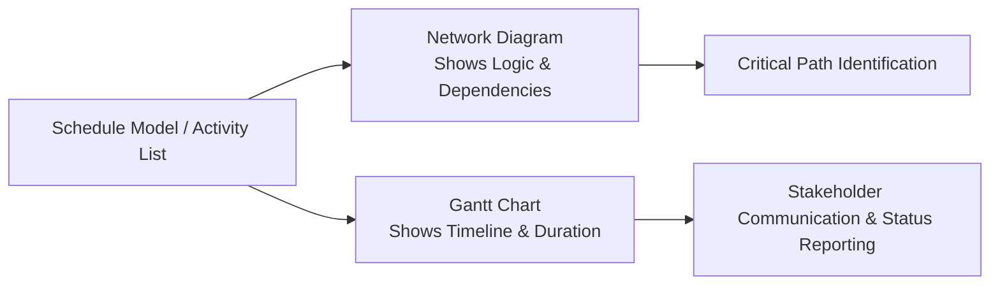
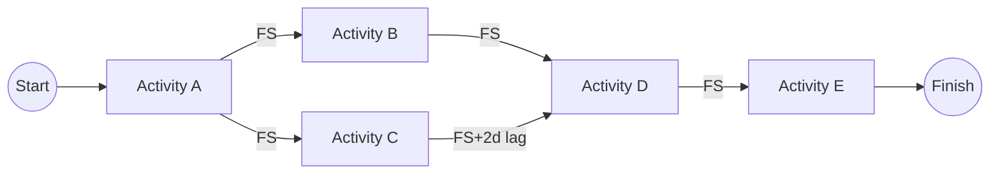

## Gantt Charts and Network Diagrams

### Overview

Gantt Charts and Network Diagrams are the two primary visual representations of a project schedule, each serving distinct purposes. Both are outputs derived from the Develop Schedule process but present schedule information differently — Gantt charts emphasize timing and duration on a calendar timeline, while network diagrams emphasize logical relationships and dependency structure.

---

### Part 1: Gantt Charts (Bar Charts)

**Definition**

A Gantt chart is a bar chart representation of schedule information where activities are listed on the vertical axis, dates are shown on the horizontal axis, and activity durations are shown as horizontal bars positioned according to start and finish dates. Named after Henry Gantt, who popularized the format in the early 20th century.

**Key Elements**

| Element | Description |
| --- | --- |
| Task bars | Horizontal bars representing activity duration, positioned along the timeline |
| Milestones | Typically shown as diamond markers with zero duration |
| Dependencies | Often shown as connecting arrows between bars (linked Gantt) |
| Percent complete | Shading or fill within the bar showing progress |
| Critical path highlighting | Critical activities often shown in a distinct color (e.g., red) |
| Summary bars | Aggregate bars representing WBS summary levels (rolled-up subtasks) |
| Baseline comparison | Secondary bars showing planned vs. actual dates |
| Today marker | Vertical line indicating the current date for status reference |

**Strengths**

- Intuitive for stakeholders unfamiliar with scheduling terminology
- Excellent for status reporting and executive communication
- Clearly shows overall project timeline and phase overlaps
- Widely supported by scheduling tools (MS Project, Primavera P6, Smartsheet, Jira/Advanced Roadmaps)

**Limitations**

- Can obscure complex dependency logic, especially in large projects with many linked tasks
- Becomes visually cluttered with hundreds of activities
- Less effective than network diagrams for critical path analysis in complex networks
- Static representation may not clearly convey resource contention

**Example Gantt Chart Structure (svg_diagram)**

<svg xmlns="http://www.w3.org/2000/svg" viewBox="0 0 700 260">
<text x="350" y="20" font-size="14" font-weight="bold" text-anchor="middle" fill="#222">Gantt Chart Example (svg_diagram)</text>
<line x1="150" y1="40" x2="150" y2="230" stroke="#ccc" stroke-width="1" />
<line x1="250" y1="40" x2="250" y2="230" stroke="#ccc" stroke-width="1" />
<line x1="350" y1="40" x2="350" y2="230" stroke="#ccc" stroke-width="1" />
<line x1="450" y1="40" x2="450" y2="230" stroke="#ccc" stroke-width="1" />
<line x1="550" y1="40" x2="550" y2="230" stroke="#ccc" stroke-width="1" />
<text x="150" y="35" font-size="9" text-anchor="middle" fill="#666">Wk1</text>
<text x="250" y="35" font-size="9" text-anchor="middle" fill="#666">Wk2</text>
<text x="350" y="35" font-size="9" text-anchor="middle" fill="#666">Wk3</text>
<text x="450" y="35" font-size="9" text-anchor="middle" fill="#666">Wk4</text>
<text x="550" y="35" font-size="9" text-anchor="middle" fill="#666">Wk5</text>

<text x="10" y="65" font-size="10" fill="#333">Design</text>

<rect x="150" y="52" width="100" height="18" rx="3" fill="`#fecaca`" stroke="`#dc2626`" />

<rect x="150" y="52" width="100" height="18" rx="3" fill="`#dc2626`" opacity="0.6" />

<text x="10" y="100" font-size="10" fill="#333">Build</text>

<rect x="250" y="87" width="150" height="18" rx="3" fill="`#fecaca`" stroke="`#dc2626`" />

<rect x="250" y="87" width="90" height="18" rx="3" fill="`#dc2626`" opacity="0.6" />

<text x="10" y="135" font-size="10" fill="#333">Test</text>

<rect x="400" y="122" width="80" height="18" rx="3" fill="`#bfdbfe`" stroke="`#2563eb`" />

<text x="10" y="170" font-size="10" fill="#333">Docs (feeding)</text>

<rect x="250" y="157" width="120" height="18" rx="3" fill="`#bfdbfe`" stroke="`#2563eb`" />

<polygon points="480,192 490,202 480,212 470,202" fill="#16a34a" stroke="#166534" />
<text x="500" y="207" font-size="10" fill="#333">Milestone: Release Ready</text>
<line x1="380" y1="45" x2="380" y2="225" stroke="#000" stroke-width="1" stroke-dasharray="3,2" />
<text x="385" y="45" font-size="9" fill="#000">Today</text>
<rect x="10" y="235" width="10" height="10" fill="#dc2626" opacity="0.6" />
<text x="25" y="244" font-size="9" fill="#555">Critical path (% complete shaded)</text>
<rect x="230" y="235" width="10" height="10" fill="#bfdbfe" stroke="#2563eb" />
<text x="245" y="244" font-size="9" fill="#555">Non-critical</text>
</svg>

---

### Part 2: Project Schedule Network Diagrams

**Definition**

A project schedule network diagram is a graphical representation of the logical relationships (dependencies) among project schedule activities. It is the primary output of the Sequence Activities process and forms the structural basis for Critical Path Method calculations in Develop Schedule.

**Precedence Diagramming Method (PDM)**

The standard modern technique: activities are represented as nodes (boxes), connected by arrows indicating logical relationships (FS, FF, SS, SF — see Sequence Activities). This has effectively replaced the older Arrow Diagramming Method (ADM), where activities were represented by arrows and nodes represented events (start/end points).

| Feature | Precedence Diagramming Method (PDM) | Arrow Diagramming Method (ADM, legacy) |
| --- | --- | --- |
| Activity representation | Nodes (boxes) | Arrows |
| Dependency types supported | FS, FF, SS, SF | Primarily FS only |
| Dummy activities required | No | Yes, to represent certain dependencies |
| Current usage | Standard in modern PM software | Largely historical/legacy |

**Key Uses**

- Visualizing all four dependency types and their logical structure
- Serving as the input to CPM forward/backward pass calculations
- Identifying parallel paths, convergence/divergence points, and potential risk concentration points
- Communicating scheduling logic to technical stakeholders (schedulers, PMO)

**Network Diagram Structure Example**

### Comparative Use Cases

| Scenario | Preferred Tool | Rationale |
| --- | --- | --- |
| Executive status report | Gantt chart | Timeline and progress intuitive at a glance |
| Critical path/float analysis | Network diagram | Logic and dependency structure explicit |
| Resource allocation review | Gantt chart (resource view) | Timeline overlay shows contention periods |
| Schedule risk workshop | Network diagram | Highlights convergence points and dependency chains prone to delay propagation |
| Team daily/weekly planning | Gantt chart | Clear near-term task visibility |
| Schedule model validation/audit | Network diagram | Verifies logic integrity, missing dependencies, dangling activities |

### Common Pitfalls

- Relying solely on a Gantt chart without an underlying network diagram/logic model, leading to a schedule with implicit or missing dependencies ("hard-coded dates" not tied to logical relationships)
- Overloading a Gantt chart with excessive detail, reducing its communication value for executive audiences
- Failing to visually distinguish critical path activities on the Gantt chart, obscuring which delays actually threaten the finish date
- Using dummy activities incorrectly (legacy ADM issue) or misrepresenting lag/lead visually, causing stakeholder misinterpretation of true float
- Not updating both representations consistently — a network diagram and Gantt chart derived from the same schedule model should always reconcile after schedule changes

### Related Topics

- Sequence Activities
- Develop Schedule
- Critical Path Method (CPM)
- Precedence Diagramming Method (PDM)
- Control Schedule
- Project Management Information System (PMIS)