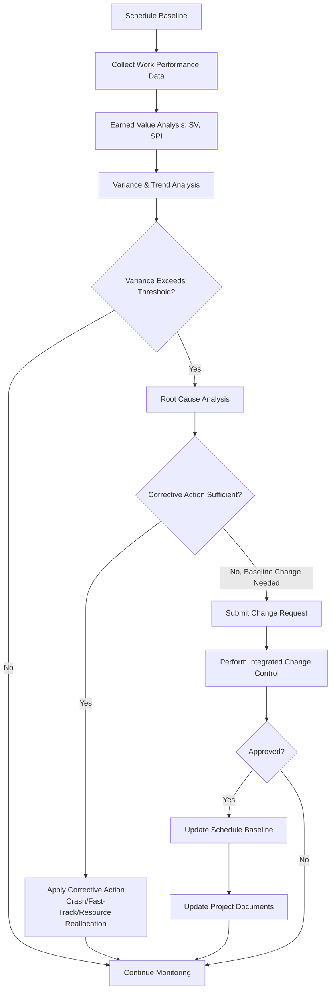

## Controlling the Schedule

### Definition

Control Schedule is the process of monitoring the status of project activities to update project progress and manage changes to the schedule baseline to achieve the plan. It is a monitoring and controlling process group activity, performed throughout the project, that ensures the project schedule remains realistic and that deviations are identified and addressed before they threaten project objectives.

### Inputs

**Project Management Plan**

- Schedule management plan — defines how the schedule will be managed and controlled
- Schedule baseline — comparison point for measuring performance
- Scope baseline — for validating that schedule changes align with approved scope
- Performance measurement baseline — used for earned value calculations

**Project Documents**

- Lessons learned register
- Project calendars
- Project schedule
- Resource calendars
- Schedule data

**Work Performance Data** — raw observations on which activities have started/finished, percent complete, actual durations

**Organizational Process Assets** — existing schedule control-related policies, monitoring tools, reporting templates

### Tools and Techniques

**Data Analysis**

| Technique | Description |
| --- | --- |
| Earned Value Analysis (EVA) | Measures schedule performance using Schedule Variance (SV) and Schedule Performance Index (SPI) |
| Iteration Burndown Chart | Tracks remaining work in an iteration/sprint; used in agile/adaptive environments |
| Performance Reviews | Compares schedule performance over time (activity start/finish, percent complete, remaining duration) |
| Trend Analysis | Examines project performance over time to determine whether performance is improving or deteriorating |
| Variance Analysis | Evaluates the magnitude of variation from the schedule baseline, determining root cause and impact, and deciding whether corrective/preventive action is needed |
| What-If Scenario Analysis | Evaluates various scenarios to align the schedule model with the project management plan |

**Critical Path Method** — comparing progress along the critical path helps determine schedule status

**Project Management Information System (PMIS)** — scheduling software tracks planned dates, compares with actual dates, and forecasts variances

**Resource Optimization** — resource leveling/smoothing to reconcile schedule with resource constraints identified during execution

**Leads and Lags** — adjusting during execution to bring activities back into alignment

**Schedule Compression** — crashing/fast-tracking applied reactively to recover from delays already discovered

### Earned Value Formulas for Schedule Control

$$SV = EV - PV$$

$$SPI = \frac{EV}{PV}$$

Where:

- $EV$ (Earned Value) = budgeted cost of work actually performed
- $PV$ (Planned Value) = budgeted cost of work scheduled to be performed

**Interpretation:**

| Result | Meaning |
| --- | --- |
| $SV > 0$ / $SPI > 1$ | Ahead of schedule |
| $SV = 0$ / $SPI = 1$ | On schedule |
| $SV < 0$ / $SPI < 1$ | Behind schedule |

**To-Complete Schedule Performance Index (TSPI)** — the projected SPI required for the remaining work to meet a schedule target:

$$TSPI = \frac{BAC - EV}{\text{Schedule Target} - PV}$$

[Inference: TSPI as applied to schedule targets is a less commonly standardized formula than its cost-based counterpart; some practitioners substitute planned remaining duration for the denominator instead of PV, so implementations may vary by organization.]

### Worked Example

A project has a $100,000 total planned value (PV) budget, and at the current status date:

- Planned Value (PV) to date: $60,000
- Earned Value (EV) to date: $48,000

$$SV = 48{,}000 - 60{,}000 = -\$12{,}000 \quad (\text{behind schedule})$$

$$SPI = \frac{48{,}000}{60{,}000} = 0.80$$

An SPI of 0.80 indicates the project is progressing at 80% of the planned rate — for every planned dollar/hour of work, only 80 cents/minutes of value is being earned. This triggers variance analysis:

1. **Root cause investigation** reveals a key resource was reassigned to another project for two weeks (resource-driven delay)
2. **Trend analysis** of the last three reporting periods shows SPI declining from 0.95 to 0.87 to 0.80 — a worsening trend, not a one-time anomaly
3. **Corrective action options evaluated**: crash the critical path by adding a contractor ($8,000 cost) vs. fast-track two discretionary-dependency activities (schedule risk, no added cost)
4. **Change Request** submitted recommending fast-tracking, given budget constraints, pending CCB approval
5. Schedule baseline is not changed unless the CCB approves a formal re-baseline; corrective actions are executed within the existing baseline where possible

### Control Schedule Process Flow

### Outputs

**Work Performance Information** — schedule performance information, correlated and contextualized across the schedule and calculated against the schedule baseline

**Schedule Forecasts** — estimates or predictions of future project schedule conditions and events, based on current performance trends (e.g., Estimate at Completion for schedule)

**Change Requests** — recommended corrective/preventive actions or requests to modify the schedule baseline, processed through Perform Integrated Change Control

**Project Management Plan Updates**

- Schedule management plan
- Schedule baseline
- Cost baseline
- Performance measurement baseline

**Project Documents Updates**

- Assumption log
- Basis of estimates
- Lessons learned register
- Project schedule
- Resource calendars
- Risk register
- Schedule data

### Agile/Adaptive Context

In adaptive environments, schedule control shifts from EVM-based baseline comparison toward:

- **Iteration Burndown Charts** — tracking remaining story points/hours against time within a sprint
- **Velocity Tracking** — measuring completed work per iteration to forecast future capacity and release timing
- **Release Burnup Charts** — tracking cumulative completed scope against total scope across multiple iterations, useful for forecasting release dates

### Common Pitfalls

- Reacting to a single period's variance without checking the trend — a one-time anomaly may not warrant corrective action, while a worsening trend does
- Applying crashing/fast-tracking to activities not on the critical path, which does not improve overall schedule performance
- Failing to route schedule baseline changes through formal change control, undermining the integrity of the baseline for future variance comparisons
- Confusing schedule variance (SV/SPI, measured in value/cost terms) with simple date slippage — a project can have activities behind their individual planned dates yet still show acceptable overall SPI, or vice versa
- Ignoring resource calendar changes (e.g., reassignments, leave) as a root cause of variance, focusing only on activity-level duration issues
- Not updating the risk register when schedule variance reveals previously unidentified risks (e.g., a resource dependency risk newly exposed by a delay)

### Related Topics

- Develop Schedule
- Critical Path Method (CPM)
- Earned Value Management (EVM)
- Perform Integrated Change Control
- Schedule Compression (Crashing, Fast-Tracking)
- Risk Register maintenance
- Agile Burndown/Burnup Charts