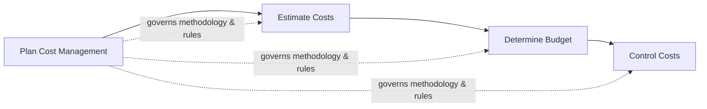

## Planning Cost Management

### Definition

Plan Cost Management is the process of defining how the project costs will be estimated, budgeted, managed, monitored, and controlled. It is the first process within the Project Cost Management knowledge area and produces the Cost Management Plan, a subsidiary component of the overall Project Management Plan. This process provides guidance and direction on how project costs will be managed throughout the project.

### Purpose and Objectives

- Establish the policies, procedures, and documentation for planning, structuring, and controlling project costs
- Define units of measure, precision levels, and organizational procedure links for cost estimation
- Set control thresholds that determine when cost variance triggers action
- Define the rules of performance measurement (e.g., EVM methodology) used throughout the project
- Provide a consistent framework so cost data is comparable, auditable, and traceable to the WBS

### Inputs

**Project Charter**

- Provides the preapproved financial resources and summary budget, which constrain the level of detail and approach for cost planning

**Project Management Plan**

- Schedule management plan — cost estimates often depend on activity durations and resource timing
- Risk management plan — informs cost contingency and reserve analysis approaches
- Development approach — predictive, iterative, adaptive, or hybrid, which shapes cost estimating and budgeting methodology

**Enterprise Environmental Factors**

- Organizational culture and structure
- Market conditions
- Currency exchange rates (for multi-currency projects)
- Published commercial information (cost databases, benchmarks)
- Project management information system (PMIS)

**Organizational Process Assets**

- Financial controls procedures
- Historical cost information and lessons learned repositories
- Financial databases
- Existing formal/informal cost estimating and budgeting policies

### Tools and Techniques

**Expert Judgment** — individuals or groups with specialized knowledge of cost estimating, budgeting, and financial forecasting from prior similar projects

**Data Analysis** — alternatives analysis to evaluate financing options (e.g., self-funding, financing with debt/equity, lease vs. buy) that affect how project costs will be managed

**Meetings** — planning sessions with project team, sponsor, selected stakeholders, and anyone with cost estimating or budgeting responsibility

### Outputs

**Cost Management Plan** — the primary output, typically addressing:

| Component | Description |
| --- | --- |
| Units of measure | Currency, staff hours, staff days, or lump sum for each resource type |
| Level of precision | Degree to which cost estimates are rounded (e.g., to nearest $100 or $1,000) |
| Level of accuracy | Acceptable range for cost estimates (e.g., ±10%), which may include contingency amounts |
| Organizational procedures links | How the WBS control account ties into cost estimation and budgeting |
| Control thresholds | Agreed variance thresholds (e.g., ±10% of baseline or a specified dollar amount) before action is required |
| Rules of performance measurement | EVM rules: how EV will be measured (e.g., fixed-formula, percent complete, weighted milestones); formulas for CV, CPI, EAC |
| Reporting formats | Frequency, format, and content of cost performance reports |
| Additional details | Strategic funding choices, procedures for accounting for exchange rate fluctuations, procedures for recording project costs |

### Key Concepts

**Cost Estimating vs. Cost Budgeting**

Plan Cost Management establishes the rules that govern both downstream processes:

Plan Cost Management does not itself produce cost estimates or a budget — it defines the framework, precision, and rules that the subsequent processes will follow.

**EVM Rules of Performance Measurement**

A critical component of the Cost Management Plan is specifying how earned value will be calculated for work in progress, since this directly affects the reliability of cost and schedule performance reporting:

| Method | Description | Best For |
| --- | --- | --- |
| Fixed-Formula (e.g., 50/50, 20/80) | Fixed percentage credited at start, remainder at completion | Short-duration activities |
| Percent Complete | Subjective or measured estimate of progress | Activities with clear measurable progress indicators |
| Weighted Milestones | Credit assigned only at predefined milestone completion | Long-duration activities with clear intermediate deliverables |
| Level of Effort (LOE) | Credit accrues over time regardless of output (e.g., management support) | Support/administrative activities without discrete deliverables |

**Control Thresholds**

Defined thresholds determine when cost variance is significant enough to warrant corrective action. For example: "Any control account exceeding ±10% cost variance or $50,000, whichever is smaller, triggers a formal variance review and corrective action plan."

### Worked Example

A manufacturing equipment installation project has a project charter specifying a preapproved budget of $2,000,000. During Plan Cost Management:

1. **Units of measure**: US dollars, rounded to the nearest $1,000
2. **Level of accuracy**: ±15% for early estimates (Rough Order of Magnitude), narrowing to ±5% at budget baseline (Definitive estimate)
3. **Control thresholds**: Any control account variance exceeding 10% or $25,000 (whichever is smaller) requires a formal variance report to the sponsor
4. **EVM rules**: 20/80 fixed-formula for procurement activities; percent-complete (engineer-assessed) for installation activities; weighted milestones for commissioning phases
5. **Reporting format**: Monthly cost performance report including CV, CPI, and EAC, distributed to the steering committee
6. **Funding strategy**: Capital expenditure funded via internal reserves; no external financing required, so no exchange rate risk procedures needed (single-currency project)

This becomes the documented Cost Management Plan, referenced throughout Estimate Costs, Determine Budget, and Control Costs.

### Common Pitfalls

- Treating the Cost Management Plan as boilerplate rather than tailoring it to the project's actual funding structure and organizational financial controls
- Failing to define EVM rules of performance measurement clearly, leading to inconsistent or subjective percent-complete reporting across control accounts
- Omitting control thresholds, leaving no clear trigger point for corrective action later in Control Costs
- Not aligning the level of precision/accuracy with the project's phase — applying definitive-estimate precision too early wastes effort, while carrying rough estimates too late understates true cost risk
- Ignoring currency and market condition factors on multi-national or long-duration projects, exposing the project to unmanaged financial risk
- Failing to link cost management procedures to the WBS control account structure, making cost traceability difficult during execution

### Related Topics

- Estimate Costs
- Determine Budget
- Control Costs
- Earned Value Management (EVM)
- Work Breakdown Structure (WBS) control accounts
- Plan Schedule Management
- Reserve Analysis (contingency and management reserves)