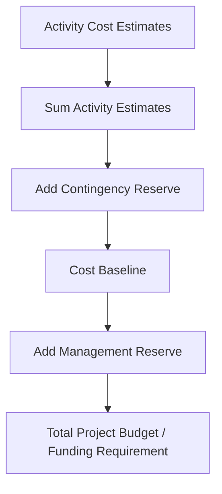

## Estimating Costs

### Definition

Estimate Costs is the process of developing an approximation of the monetary resources needed to complete project work. It produces cost estimates for activities, work packages, or the project as a whole, along with supporting documentation, and is performed periodically throughout the project as more information becomes available (progressive elaboration).

Cost estimates include consideration of all resources required: labor, materials, equipment, services, facilities, information technology, and specifically identified categories such as inflation allowance or cost contingency reserves.

### Inputs

**Project Management Plan**

- Cost management plan — methodology, level of accuracy, units of measure
- Quality management plan — quality requirements that affect cost (e.g., testing, compliance)
- Scope baseline — scope statement, WBS, WBS dictionary

**Project Documents**

- Lessons learned register
- Project schedule — activity durations and resource timing affect cost
- Resource requirements
- Risk register — identified risks affecting cost estimates

**Enterprise Environmental Factors**

- Market conditions
- Published commercial information (cost databases, benchmarks)
- Currency exchange rates

**Organizational Process Assets**

- Cost estimating policies and templates
- Historical information and lessons learned repositories

### Tools and Techniques

| Technique | Description | Use Case |
| --- | --- | --- |
| Expert Judgment | Input from individuals/groups with specialized cost estimating knowledge | When historical data limited or specialized domain knowledge needed |
| Analogous Estimating | Uses cost from a similar past project/activity, scaled by known differences | Early phases, limited detail; fast but less accurate |
| Parametric Estimating | Statistical relationship between historical data and other variables (e.g., cost per square meter) | Repetitive or quantifiable work |
| Bottom-Up Estimating | Estimates each component in detail, then aggregates | Most accurate; requires detailed WBS decomposition |
| Three-Point Estimating | Uses optimistic, pessimistic, most likely estimates to account for uncertainty | Higher accuracy needs, accounts for risk |
| Data Analysis | Alternatives analysis, reserve analysis, cost of quality | Evaluating trade-offs, contingency sizing |
| PMIS | Spreadsheets, simulation software, statistical tools | Automating calculations, scenario modeling |
| Decision Making (Voting) | Team consensus techniques | Agile/collaborative estimating |

### Three-Point Cost Estimating

Analogous to schedule duration estimating, applied to cost:

$$c_E = \frac{c_O + 4c_M + c_P}{6} \quad \text{(PERT/Beta weighted)}$$

$$c_E = \frac{c_O + c_M + c_P}{3} \quad \text{(Triangular)}$$

Where $c_O$, $c_M$, $c_P$ are optimistic, most likely, and pessimistic cost estimates respectively.

### Cost of Quality

Cost estimates must incorporate the **Cost of Quality (COQ)** — the total cost of conformance and nonconformance investments:

| Category | Type | Examples |
| --- | --- | --- |
| Prevention Costs | Cost of Conformance | Training, documenting processes, equipment selection |
| Appraisal Costs | Cost of Conformance | Testing, destructive testing loss, inspections |
| Internal Failure Costs | Cost of Nonconformance | Rework, scrap |
| External Failure Costs | Cost of Nonconformance | Liabilities, warranty work, lost business |

### Types of Cost Estimates by Project Phase

| Estimate Type | Timing | Typical Accuracy Range |
| --- | --- | --- |
| Rough Order of Magnitude (ROM) | Initiation, early planning | -25% to +75% |
| Preliminary/Budget Estimate | Planning | -10% to +25% |
| Definitive Estimate | Detailed planning, near execution | -5% to +10% |

[Inference: these accuracy ranges are commonly cited industry conventions rather than a single universally fixed standard; specific ranges vary by industry, organization, and estimating methodology.]

### Reserve Analysis

**Contingency Reserves** — funds allocated for identified risks that are accepted ("known-unknowns"); included in the cost baseline

**Management Reserves** — funds allocated for unforeseen work within scope ("unknown-unknowns"); not included in the cost baseline, but part of the total project budget/funding requirement

### Worked Example

Activity: "Install industrial HVAC unit"

- Optimistic ($c_O$): $18,000
- Most Likely ($c_M$): $22,000
- Pessimistic ($c_P$): $32,000

**PERT weighted estimate:**

$$c_E = \frac{18{,}000 + 4(22{,}000) + 32{,}000}{6} = \frac{18{,}000 + 88{,}000 + 32{,}000}{6} = \frac{138{,}000}{6} = \$23{,}000$$

**Standard deviation:**

$$\sigma = \frac{32{,}000 - 18{,}000}{6} = \$2{,}333$$

This yields an activity cost estimate of $23,000 ± $2,333 (approximately one standard deviation), documented in the basis of estimates along with the assumptions used (e.g., current market pricing for the HVAC unit, labor rates as of the estimate date, and the risk of supply chain delay driving the pessimistic scenario).

For the full work package, this activity is combined with related activities (ductwork, electrical tie-in, commissioning) via bottom-up estimating, and Cost of Quality inspection/testing costs are added, before contingency reserve is applied based on the project's risk register assessment.

### Outputs

**Cost Estimates** — quantitative assessments of probable costs required to complete project work, typically expressed with an indication of precision, range, and confidence level

**Basis of Estimates** — supporting detail: documentation of how the estimate was developed, assumptions made, known constraints, range of estimates, confidence level, and documented risks affecting the estimate

**Project Documents Updates** — assumption log, lessons learned register, risk register

### Common Pitfalls

- Providing single-point estimates without documenting the basis, hiding uncertainty from stakeholders and decision-makers
- Confusing contingency reserves (known-unknowns, part of baseline) with management reserves (unknown-unknowns, outside baseline, requiring different approval authority to use)
- Ignoring Cost of Quality — particularly failure costs — leading to systematically underestimated project costs
- Applying analogous estimating without adjusting for scale, complexity, or market differences between the historical and current project
- Failing to account for currency fluctuation or market volatility on long-duration or multi-national projects
- Estimating costs in isolation from the schedule, missing time-dependent cost factors (e.g., escalation, rental durations, overtime premiums)

### Related Topics

- Plan Cost Management
- Determine Budget
- Control Costs
- Cost of Quality
- Reserve Analysis (contingency and management reserves)
- Estimate Activity Durations
- Earned Value Management (EVM)