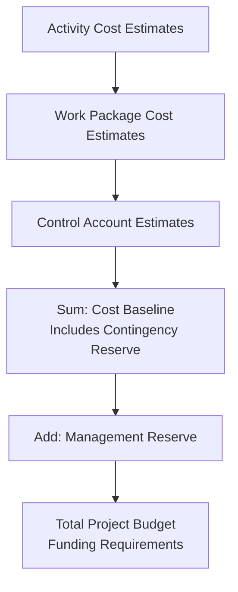
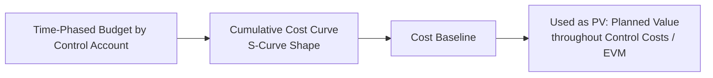

## Determining the Budget

### Definition

Determine Budget is the process of aggregating the estimated costs of individual activities or work packages to establish an authorized cost baseline. This baseline includes all authorized budgets but excludes management reserves. The process provides the basis against which project cost performance can be monitored and controlled throughout execution.

### Inputs

**Project Management Plan**

- Cost management plan — methodology, level of accuracy, rules of performance measurement
- Resource management plan — rates and quantities for resources feeding cost aggregation
- Scope baseline — scope statement, WBS, WBS dictionary, which defines control accounts for cost aggregation

**Project Documents**

- Basis of estimates
- Cost estimates
- Project schedule — determines timing/phasing of budget expenditures
- Risk register — informs contingency reserve sizing

**Business Documents** — business case, benefits management plan (constrain overall budget authorization)

**Agreements** — contract costs feeding into the overall budget

**Enterprise Environmental Factors / Organizational Process Assets** — existing budgeting tools, historical databases, financial controls procedures

### Tools and Techniques

| Technique | Description |
| --- | --- |
| Expert Judgment | Input from specialists in budgeting, financial analysis, and historical project data |
| Cost Aggregation | Summing activity cost estimates up through the WBS to control accounts, then to the total project |
| Data Analysis (Reserve Analysis) | Establishing contingency reserves (known-unknowns) and management reserves (unknown-unknowns) |
| Historical Information Review | Using past project data to validate funding requirements and reserve percentages |
| Funding Limit Reconciliation | Reconciling the expenditure of funds against any funding limits set by the organization or customer (e.g., fiscal year constraints) |
| Financing | Acquiring funding for the project via external sources (loans, equity, grants) when applicable |

### Cost Aggregation Structure

### Budget Components

| Component | Included in Cost Baseline? | Description |
| --- | --- | --- |
| Activity Cost Estimates | Yes | Base costs for each schedule activity |
| Contingency Reserve | Yes | Funds for identified risks (known-unknowns), accepted within the risk response strategy |
| **Cost Baseline** | — | Sum of activity estimates + contingency reserve; authorized time-phased budget |
| Management Reserve | No | Funds for unforeseen work within project scope (unknown-unknowns) |
| **Total Project Budget** | — | Cost Baseline + Management Reserve |
| Funding Requirements | — | May exceed total budget to account for timing/cash-flow needs, often in incremental steps or as a maximum funding limit |

### The Cost Baseline S-Curve

The cost baseline is typically presented as a time-phased budget, plotted cumulatively over the project timeline — producing the characteristic **S-curve**, since spending is typically slower at project start and end, and higher during peak execution.

The S-curve becomes the **Planned Value (PV)** curve used throughout Control Costs for earned value calculations.

### Funding Limit Reconciliation

Organizations often impose funding limits per period (e.g., quarterly or annual budget cycles) that may not match the natural spending curve dictated by the schedule. Funding Limit Reconciliation resolves this mismatch by:

- Rescheduling work to smooth expenditures within funding periods
- Applying imposed delays to work to align with available funding
- Coordinating with finance/accounting on disbursement schedules

This can require intentionally rescheduling non-critical path activities (using available float) to shift spending into a later funding period without delaying the project finish date.

### Worked Example

A construction project has the following control account cost estimates:

| Control Account | Cost Estimate |
| --- | --- |
| Site Preparation | $150,000 |
| Foundation | $300,000 |
| Structural | $500,000 |
| MEP (Mechanical/Electrical/Plumbing) | $400,000 |
| Finishing | $250,000 |
| **Subtotal** | **$1,600,000** |

**Reserve Analysis:**

- Contingency Reserve (based on quantified risk exposure from the risk register, e.g., 8% of subtotal): $128,000
- **Cost Baseline** = $1,600,000 + $128,000 = **$1,728,000**
- Management Reserve (organizational policy, e.g., 5% of cost baseline): $86,400
- **Total Project Budget** = $1,728,000 + $86,400 = **$1,814,400**

**Funding Limit Reconciliation:**

The customer's fiscal year funding limit is $900,000 for Year 1. The natural schedule-driven spending curve projects $1,050,000 of work in Year 1. The project team reschedules $150,000 of Finishing work (which has sufficient float) into early Year 2, reconciling the time-phased budget with the funding limit without delaying the overall project finish date.

### Time-Phased Budget Example (svg_diagram)

<svg xmlns="http://www.w3.org/2000/svg" viewBox="0 0 680 260">
<text x="340" y="20" font-size="14" font-weight="bold" text-anchor="middle" fill="#222">Cost Baseline S-Curve (svg_diagram)</text>
<line x1="60" y1="220" x2="620" y2="220" stroke="#333" stroke-width="1.5" />
<line x1="60" y1="40" x2="60" y2="220" stroke="#333" stroke-width="1.5" />
<text x="340" y="245" font-size="10" text-anchor="middle" fill="#555">Project Timeline</text>
<text x="25" y="130" font-size="10" text-anchor="middle" fill="#555" transform="rotate(-90 25 130)">Cumulative Cost</text>

<path d="M60,220 C150,215 200,180 280,120 C360,70 450,45 550,40 L620,38" fill="none" stroke="`#2563eb`" stroke-width="2.5" />

<text x="560" y="55" font-size="9" fill="`#2563eb`">Cost Baseline (PV)</text>

<line x1="60" y1="200" x2="620" y2="200" stroke="#ccc" stroke-dasharray="2,2" />
<text x="625" y="204" font-size="8" fill="#666">Mgmt Reserve line</text>

<text x="80" y="235" font-size="8" fill="#666">Start</text>

<text x="580" y="235" font-size="8" fill="#666">Finish</text>

</svg>

### Outputs

**Cost Baseline** — approved, time-phased budget used to measure, monitor, and control cost performance; changed only through formal change control

**Project Funding Requirements** — total funding requirements and periodic funding requirements derived from the cost baseline, often presented incrementally or as a maximum, and may exceed the cost baseline by including management reserve

**Project Documents Updates** — cost estimates, project schedule, risk register

### Common Pitfalls

- Confusing the cost baseline with the total project budget — the baseline excludes management reserve, which is a critical distinction for change control authority (management reserve typically requires sponsor/executive approval to access, not just CCB)
- Failing to time-phase the budget, producing only a total figure without the S-curve needed for meaningful EVM comparison later
- Underestimating contingency reserves due to an incomplete or under-quantified risk register
- Ignoring funding limit constraints until execution, forcing reactive and disruptive rescheduling
- Applying reserves as a flat percentage without linking them to actual identified/quantified risk exposure, reducing stakeholder confidence in the figures
- Not reconciling the budget with resource calendars and availability, producing a financially sound but practically infeasible spending plan

### Related Topics

- Plan Cost Management
- Estimate Costs
- Control Costs
- Earned Value Management (EVM)
- Reserve Analysis (contingency and management reserves)
- Develop Schedule
- Risk Register and Quantitative Risk Analysis