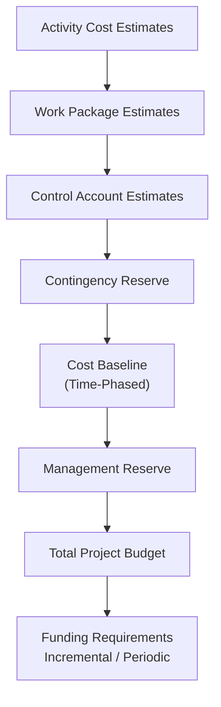
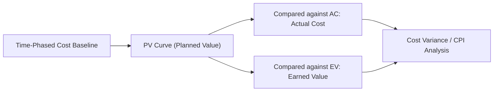
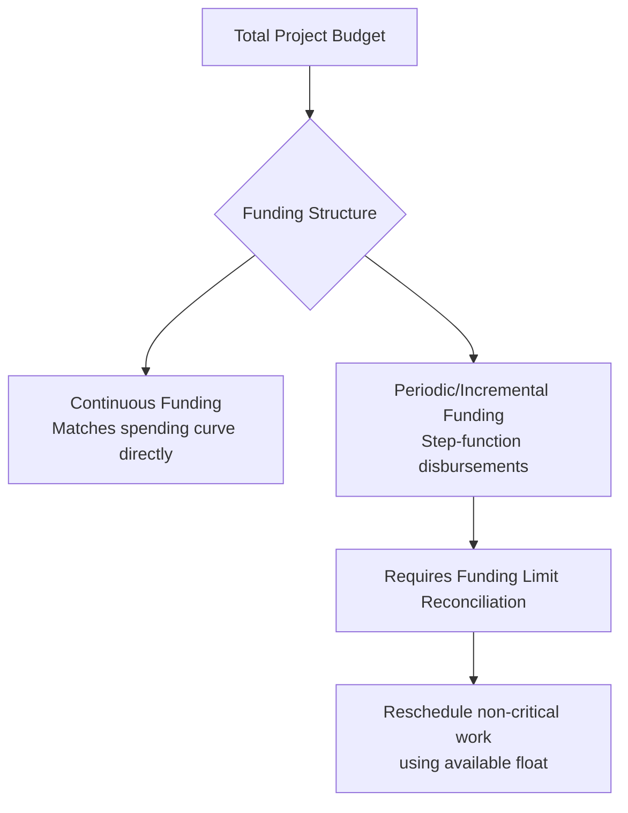

## Cost Baseline and Funding Requirements

### Definition

The **Cost Baseline** is the approved, time-phased budget used as the basis against which actual project cost performance is measured, monitored, and controlled. It is a primary output of the Determine Budget process and represents the aggregation of all authorized budgets across the project's control accounts, including contingency reserve, but excluding management reserve.

**Project Funding Requirements** are derived from the cost baseline and describe the total and periodic (e.g., quarterly, annual) funds needed to execute the project, potentially exceeding the cost baseline by the amount of management reserve, and often structured to accommodate organizational or customer disbursement cycles.

### Cost Baseline Structure

### Key Distinctions

| Term | Includes Contingency Reserve? | Includes Management Reserve? | Approval Authority for Access |
| --- | --- | --- | --- |
| Cost Baseline | Yes | No | Project Manager, within formal change control |
| Total Project Budget | Yes | Yes | Sponsor/executive approval typically required to access management reserve |
| Funding Requirements | Yes (via baseline) | Yes (may include) | Organizational finance/treasury function |

This distinction matters operationally: cost variance within the baseline is managed by the project manager through Control Costs and the standard change control process, while accessing management reserve typically requires escalation beyond the project manager's authority, since it represents funds held against unknown-unknowns rather than accepted, quantified risks.

### Time-Phasing and the S-Curve

The cost baseline is displayed as a **time-phased budget**, typically presented as an S-curve when plotted cumulatively:

- Early project phases (initiation, mobilization) show slower cumulative spend
- Mid-project execution phases show the steepest slope (peak resource/activity intensity)
- Late phases (closeout, demobilization) show a flattening curve again

This S-curve becomes the **Planned Value (PV)** curve used throughout Control Costs for earned value calculations, plotted against actual cost (AC) and earned value (EV) curves to assess performance.

### Funding Requirements: Structure and Patterns

Funding requirements are often presented as **step functions** rather than smooth curves, reflecting periodic disbursements (e.g., quarterly capital releases) rather than continuous funding availability.

**Funding Limit Reconciliation** is the process of reconciling the planned expenditure of project funds against any funding limits imposed by the organization or customer (e.g., annual capital budget caps, phased contract disbursements). When the schedule-driven spending curve exceeds available funding in a given period, options include:

- Rescheduling activities with available float into a later funding period
- Renegotiating funding limits with the sponsor/customer
- Applying management reserve (with appropriate approval) to bridge a temporary shortfall
- Accepting a schedule delay if reconciliation is not otherwise possible

### Worked Example: Cost Baseline vs. Funding Requirements

A technology infrastructure project has the following aggregated figures:

| Component | Amount |
| --- | --- |
| Activity Cost Estimates (subtotal) | $4,200,000 |
| Contingency Reserve (12%, risk-based) | $504,000 |
| **Cost Baseline** | **$4,704,000** |
| Management Reserve (6% of baseline) | $282,240 |
| **Total Project Budget** | **$4,986,240** |

**Time-phasing** across a 12-month schedule shows the cost baseline distributed as an S-curve, with 15% spent in Q1, 45% in Q2-Q3 (peak execution), and the remaining 40% in Q4 (tapering toward closeout).

**Funding constraint**: The organization releases capital in quarterly tranches capped at $1,200,000 per quarter. Q2-Q3 peak spending (45% of $4,704,000 ≈ $2,117,000) would require roughly $1,058,500 per quarter if spread evenly — within the $1,200,000 cap, so no reconciliation is needed in this case. However, if peak spend were compressed into a single quarter exceeding $1,200,000, the project team would need to reschedule discretionary work (e.g., non-critical testing or documentation activities with float) into the following quarter.

### Cost Baseline Change Control

The cost baseline can only be changed through formal change control (Perform Integrated Change Control). Common triggers for a cost baseline change include:

- Approved scope changes that add or remove work
- Approved corrective actions requiring additional budget beyond available contingency reserve
- Risk events occurring that exceed the contingency reserve allocated for that risk category
- Re-estimation due to significant assumption changes (e.g., major market price shifts)

Simple use of contingency reserve for an already-identified, accepted risk does **not** require a baseline change, since the reserve was already incorporated into the approved baseline — using it is a planned response, not scope creep.

### Common Pitfalls

- Treating the cost baseline and total project budget as interchangeable terms, causing confusion about approval authority when reserves need to be accessed
- Failing to time-phase the baseline, leaving no meaningful basis for period-by-period EVM comparison
- Ignoring funding limit reconciliation until a cash-flow crisis occurs during execution, forcing reactive and disruptive rescheduling
- Drawing on management reserve without following the organization's approval process, blurring the line between planned contingency use and uncontrolled budget growth
- Setting contingency reserve as an arbitrary flat percentage disconnected from the actual quantified risk exposure in the risk register
- Not updating funding requirement forecasts as the project progresses, leaving finance/treasury functions unprepared for actual cash-flow needs

### Related Topics

- Determine Budget
- Estimate Costs
- Control Costs
- Earned Value Management (EVM)
- Reserve Analysis (contingency and management reserves)
- Perform Integrated Change Control
- Risk Register and Quantitative Risk Analysis