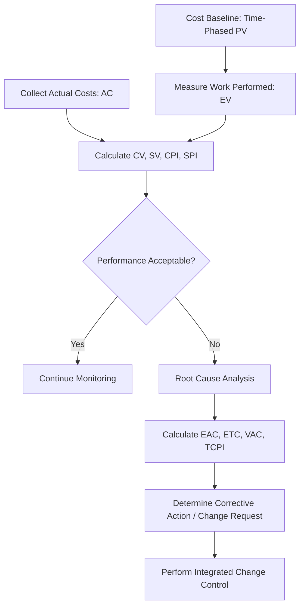

## Earned Value Management

### Definition

Earned Value Management (EVM) is a methodology that combines scope, schedule, and cost measures to assess project performance and progress. It provides an integrated view of project health by comparing the value of work actually completed against both the planned value of work and the actual cost incurred, allowing objective, quantifiable performance measurement rather than subjective status reporting.

EVM is applied primarily within predictive/waterfall project environments, though adapted forms exist for hybrid approaches.

### Core Measures

| Measure | Symbol | Definition |
| --- | --- | --- |
| Planned Value | $PV$ | The authorized budget assigned to scheduled work; the budgeted cost of work scheduled |
| Earned Value | $EV$ | The measure of work performed expressed in terms of the budget authorized for that work; the budgeted cost of work performed |
| Actual Cost | $AC$ | The realized cost incurred for the work performed on an activity during a specific time period |
| Budget at Completion | $BAC$ | The total planned value of the project (sum of all PV at project completion) |

### Variance Formulas

**Cost Variance (CV)** — difference between earned value and actual cost

$$CV = EV - AC$$

**Schedule Variance (SV)** — difference between earned value and planned value

$$SV = EV - PV$$

| Result | Interpretation |
| --- | --- |
| $CV > 0$ | Under budget |
| $CV = 0$ | On budget |
| $CV < 0$ | Over budget |
| $SV > 0$ | Ahead of schedule |
| $SV = 0$ | On schedule |
| $SV < 0$ | Behind schedule |

### Performance Index Formulas

**Cost Performance Index (CPI)** — cost efficiency ratio

$$CPI = \frac{EV}{AC}$$

**Schedule Performance Index (SPI)** — schedule efficiency ratio

$$SPI = \frac{EV}{PV}$$

A CPI/SPI of 1.0 indicates performance exactly as planned; values above 1.0 indicate favorable performance (under budget / ahead of schedule); values below 1.0 indicate unfavorable performance.

### Forecasting Formulas

**Estimate at Completion (EAC)** — projected total cost of the project based on current performance, with several calculation variants depending on the assumed cause of variance:

| Scenario | Formula | When to Use |
| --- | --- | --- |
| Current variances atypical | $EAC = AC + (BAC - EV)$ | Original estimate remains valid; variance was a one-time anomaly |
| Current CPI expected to continue | $EAC = \dfrac{BAC}{CPI}$ | Current cost performance trend expected to continue for remaining work |
| Both cost and schedule factors affect remaining work | $EAC = AC + \dfrac{(BAC - EV)}{(CPI \times SPI)}$ | Both cost and schedule performance are expected to influence remaining work |
| New estimate required | $EAC = AC + \text{Bottom-Up ETC}$ | Original estimating assumptions are no longer valid |

**Estimate to Complete (ETC)** — expected cost needed to complete remaining work

$$ETC = EAC - AC$$

**Variance at Completion (VAC)** — projected variance between budget and actual final cost

$$VAC = BAC - EAC$$

**To-Complete Performance Index (TCPI)** — the required cost efficiency for remaining work to meet a target:

$$TCPI = \frac{BAC - EV}{BAC - AC} \quad \text{(to meet original BAC)}$$

$$TCPI = \frac{BAC - EV}{EAC - AC} \quad \text{(to meet revised EAC)}$$

### Worked Example

A project has: $BAC = \$500{,}000$. At the current status date:

- $PV = \$300{,}000$
- $EV = \$270{,}000$
- $AC = \$320{,}000$

**Variances:**

$$CV = 270{,}000 - 320{,}000 = -\$50{,}000 \quad (\text{over budget})$$

$$SV = 270{,}000 - 300{,}000 = -\$30{,}000 \quad (\text{behind schedule})$$

**Performance Indices:**

$$CPI = \frac{270{,}000}{320{,}000} = 0.844$$

$$SPI = \frac{270{,}000}{300{,}000} = 0.90$$

Both indices below 1.0 indicate the project is simultaneously over budget and behind schedule.

**Forecast (assuming current CPI trend continues):**

$$EAC = \frac{500{,}000}{0.844} = \$592{,}417$$

$$ETC = 592{,}417 - 320{,}000 = \$272{,}417$$

$$VAC = 500{,}000 - 592{,}417 = -\$92{,}417 \quad (\text{projected overrun})$$

**TCPI (to meet original BAC):**

$$TCPI = \frac{500{,}000 - 270{,}000}{500{,}000 - 320{,}000} = \frac{230{,}000}{180{,}000} = 1.278$$

A TCPI of 1.278 means the remaining work must be performed at 127.8% efficiency to meet the original budget — typically a signal that the original BAC is no longer realistic and re-baselining or EAC revision should be discussed with the sponsor.

### EVM Dashboard Visualization (svg_diagram)

<svg xmlns="http://www.w3.org/2000/svg" viewBox="0 0 680 280">
<text x="340" y="20" font-size="14" font-weight="bold" text-anchor="middle" fill="#222">EVM Performance Curves (svg_diagram)</text>
<line x1="60" y1="240" x2="620" y2="240" stroke="#333" stroke-width="1.5" />
<line x1="60" y1="40" x2="60" y2="240" stroke="#333" stroke-width="1.5" />
<text x="340" y="265" font-size="10" text-anchor="middle" fill="#555">Time</text>
<text x="25" y="140" font-size="10" text-anchor="middle" fill="#555" transform="rotate(-90 25 140)">Cumulative Cost</text>
<path d="M60,240 C150,220 250,150 380,90 C480,60 560,50 620,45" fill="none" stroke="#2563eb" stroke-width="2.5" />
<text x="560" y="60" font-size="9" fill="#2563eb">PV (Planned Value)</text>
<path d="M60,240 C140,225 220,175 320,130 C400,100 460,90 500,85" fill="none" stroke="#16a34a" stroke-width="2.5" />
<text x="440" y="100" font-size="9" fill="#16a34a">EV (Earned Value)</text>
<path d="M60,240 C140,222 220,165 320,110 C400,75 460,65 500,60" fill="none" stroke="#dc2626" stroke-width="2.5" />
<text x="440" y="75" font-size="9" fill="#dc2626">AC (Actual Cost)</text>
<line x1="500" y1="85" x2="500" y2="60" stroke="#666" stroke-width="1" stroke-dasharray="2,2" />
<text x="510" y="72" font-size="8" fill="#666">CV</text>
<line x1="500" y1="85" x2="380" y2="90" stroke="#666" stroke-width="1" stroke-dasharray="2,2" />
<text x="440" y="110" font-size="8" fill="#666">SV (time-shifted)</text>

<text x="500" y="255" font-size="9" fill="#555">Status Date</text>

</svg>

### EVM Process Flow

### Common Pitfalls

- Miscalculating EV due to inconsistent or subjective percent-complete reporting across control accounts (addressed by clearly defined EVM rules of performance measurement in the Cost Management Plan)
- Confusing CV/SV (dollar-value variances) with simple date or budget slippage in absolute terms
- Selecting the wrong EAC formula for the situation — e.g., using the "atypical variance" formula when poor cost performance is actually a persistent trend, understating the true forecasted overrun
- Ignoring SPI/schedule dimension and focusing only on cost performance, missing the integrated picture EVM is designed to provide
- Failing to re-baseline when TCPI indicates the original BAC is no longer achievable, leading to persistently misleading status reports
- Applying EVM formulas to agile/adaptive projects without adaptation, since traditional PV/EV/AC measurement assumes a fixed, decomposed scope baseline that adaptive environments may not maintain in the same form

### Related Topics

- Control Costs
- Control Schedule
- Determine Budget
- Reserve Analysis (contingency and management reserves)
- Perform Integrated Change Control
- Agile Burndown/Burnup Charts and Velocity