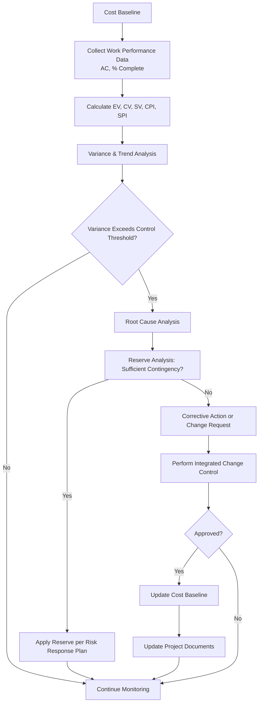
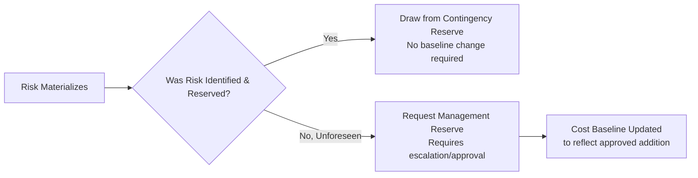

## Controlling Costs

### Definition

Control Costs is the process of monitoring the status of the project to update project costs and manage changes to the cost baseline. It is a monitoring and controlling process group activity performed throughout the project, ensuring that cost performance is tracked against the baseline, variances are analyzed, and any necessary corrective actions or baseline changes are processed through formal change control.

### Inputs

**Project Management Plan**

- Cost management plan — methodology, control thresholds, rules of performance measurement
- Cost baseline — comparison point for measuring cost performance
- Performance measurement baseline — integrated scope-schedule-cost baseline for EVM

**Project Documents**

- Lessons learned register
- Project funding requirements

**Work Performance Data** — raw observations on costs incurred, invoices paid, activities started/completed

**Organizational Process Assets** — existing cost control policies, monitoring tools, reporting templates, financial controls procedures

### Tools and Techniques

**Expert Judgment** — specialists in EVM, financial analysis, forecasting, and estimating provide input on interpreting cost performance data

**Data Analysis**

| Technique | Description |
| --- | --- |
| Earned Value Analysis (EVA) | Core technique — measures performance using CV, SV, CPI, SPI |
| Variance Analysis | Explains the cause, impact, and magnitude of variances relative to the cost baseline |
| Trend Analysis | Examines performance over time to determine if it is improving, stable, or deteriorating; supports forecasting |
| Reserve Analysis | Monitors the status of contingency and management reserves to determine if remaining reserves are adequate |

**To-Complete Performance Index (TCPI)** — calculates the cost performance required for remaining work to meet either the original BAC or a revised EAC

**Project Management Information System (PMIS)** — tracks planned vs. actual costs, calculates EVM metrics, and generates forecasts automatically

### Cost Control Workflow

### Reserve Monitoring

Control Costs includes actively tracking reserve consumption:

- **Contingency Reserve Usage** — as identified risks materialize and are addressed per their planned risk response, contingency reserve is consumed; this is a normal, planned use and does not require a baseline change, since the reserve was pre-approved within the baseline
- **Management Reserve Usage** — accessing management reserve for unforeseen, in-scope work typically requires escalation beyond the project manager and, once approved, results in a formal cost baseline update to incorporate the additional funds

### Worked Example

A project has $BAC = \$800{,}000$, with a contingency reserve of $60,000 included in the baseline. At the current status date:

- $PV = \$450{,}000$
- $EV = \$400{,}000$
- $AC = \$470{,}000$

**Calculations:**

$$CV = 400{,}000 - 470{,}000 = -\$70{,}000$$

$$CPI = \frac{400{,}000}{470{,}000} = 0.851$$

$$SV = 400{,}000 - 450{,}000 = -\$50{,}000$$

$$SPI = \frac{400{,}000}{450{,}000} = 0.889$$

**Variance Analysis Investigation:**

1. Root cause: a supplier increased material pricing mid-project (identified risk, contingency-covered) plus an unplanned equipment failure requiring emergency repair (unforeseen, not in the risk register)
2. **Contingency Reserve check**: $35,000 of the $60,000 contingency reserve was already allocated to the supplier pricing risk and has been drawn down accordingly — no baseline change needed for this portion
3. **Management Reserve request**: the $18,000 equipment repair is unforeseen and outside the identified risk register; the PM submits a request to access management reserve
4. Sponsor approves; **Cost Baseline is formally updated** to incorporate the additional $18,000, since management reserve use requires baseline adjustment once approved
5. **Trend Analysis** of the last three periods shows CPI declining (0.92 → 0.88 → 0.85), indicating a worsening trend requiring closer monitoring going forward, not just a one-time event

**TCPI check (to meet original BAC):**

$$TCPI = \frac{800{,}000 - 400{,}000}{800{,}000 - 470{,}000} = \frac{400{,}000}{330{,}000} = 1.212$$

A TCPI of 1.212 signals the remaining work must be performed noticeably more efficiently than planned to hit the original budget — informing the sponsor conversation about whether to accept a revised EAC.

### Outputs

**Work Performance Information** — cost performance information (CV, SV, CPI, SPI, trends) correlated and contextualized across control accounts and the overall project

**Cost Forecasts** — either a calculated EAC or a bottom-up EAC, with supporting documentation and rationale for the forecasting method used

**Change Requests** — recommended corrective/preventive actions, or requests to modify the cost baseline, processed through Perform Integrated Change Control

**Project Management Plan Updates**

- Cost management plan
- Cost baseline
- Performance measurement baseline

**Project Documents Updates**

- Assumption log
- Basis of estimates
- Lessons learned register
- Risk register

### Common Pitfalls

- Reacting to a single reporting period's variance without trend analysis, either overreacting to a one-time anomaly or underreacting to a genuinely worsening pattern
- Drawing on management reserve without following organizational approval procedures, blurring accountability for budget growth
- Failing to distinguish planned contingency reserve consumption (normal, no baseline change) from scope-driven cost growth (requires formal change control)
- Selecting an inappropriate EAC formula for the situation, producing forecasts that mislead stakeholders about the likely final cost
- Not updating the risk register when cost variance reveals previously unidentified risk categories
- Allowing informal or verbal authorization of cost-impacting changes to bypass Perform Integrated Change Control, eroding the integrity of the cost baseline over time

### Related Topics

- Determine Budget
- Earned Value Management (EVM)
- Reserve Analysis (contingency and management reserves)
- Perform Integrated Change Control
- Control Schedule
- Cost of Quality