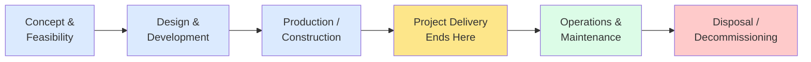
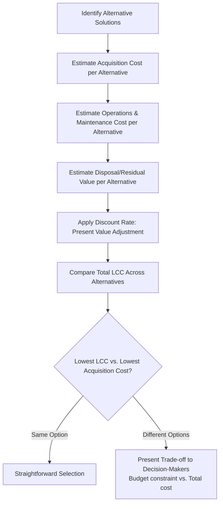

## Life Cycle Costing

### Definition

Life Cycle Costing (LCC) is an economic analysis technique that considers the total cost of a product, system, or asset across its entire life cycle — from initial concept and development through operation, maintenance, and ultimately disposal or decommissioning. Unlike project cost estimating, which typically focuses on costs within the project's own boundaries (initiation through closeout), life cycle costing extends the cost horizon into the post-project operational phase, providing a fuller picture of the total ownership cost associated with project decisions.

### Purpose and Strategic Importance

Life cycle costing exists to prevent a common project management failure mode: optimizing for low project delivery cost while creating disproportionately higher downstream operational or maintenance costs. A project manager focused solely on staying under the project budget may select a cheaper deliverable option that turns out to be far more expensive to operate, maintain, or eventually dispose of.

- Supports better-informed decision-making during design and procurement phases
- Aligns project decisions with organizational strategic and financial objectives beyond project closeout
- Provides a basis for comparing alternative solutions on total cost, not just acquisition cost
- Often required in public sector, infrastructure, defense, and capital asset procurement, where operational costs vastly exceed initial acquisition cost over the asset's lifespan

### Life Cycle Phases and Cost Categories

| Phase | Typical Cost Categories | Within Project Scope? |
| --- | --- | --- |
| Concept & Feasibility | Studies, requirements analysis | Yes |
| Design & Development | Engineering, prototyping, testing | Yes |
| Production/Construction | Materials, labor, equipment, commissioning | Yes |
| Operations & Maintenance | Energy, staffing, spare parts, routine maintenance, repairs | Typically No (post-handover) |
| Disposal/Decommissioning | Demolition, environmental remediation, recycling, residual value recovery | Typically No (long-term) |

### Life Cycle Cost Formula (Simplified)

$$LCC = C_{acquisition} + C_{operations} + C_{maintenance} + C_{disposal} - V_{residual}$$

Where:

- $C_{acquisition}$ = initial development and procurement costs (roughly equivalent to project cost)
- $C_{operations}$ = ongoing operational costs over the asset's useful life
- $C_{maintenance}$ = scheduled and unscheduled maintenance costs
- $C_{disposal}$ = end-of-life decommissioning/disposal costs
- $V_{residual}$ = residual/salvage value recovered at disposal (subtracted)

**Present Value Adjustment**

Because life cycle costs span many years, LCC analysis typically discounts future costs to present value for comparability:

$$PV = \frac{FV}{(1+r)^n}$$

Where $FV$ is the future cost, $r$ is the discount rate, and $n$ is the number of years until the cost is incurred. Total LCC is then the sum of the present values of all cost categories across the asset's life.

[Inference: the specific discount rate and whether inflation is applied separately or embedded in a "real" discount rate depends on organizational financial policy; there is no single universal standard rate.]

### Worked Example

An organization is choosing between two HVAC systems for a new facility, each with a 15-year expected useful life:

| Cost Category | System A (Standard) | System B (High-Efficiency) |
| --- | --- | --- |
| Acquisition Cost | $80,000 | $120,000 |
| Annual Energy Cost | $12,000/yr | $7,500/yr |
| Annual Maintenance Cost | $2,500/yr | $1,800/yr |
| Disposal Cost (Year 15) | $3,000 | $2,500 |
| Residual/Salvage Value | $0 | $4,000 |

**Undiscounted Simplified LCC (15-year horizon):**

System A:

$$LCC_A = 80{,}000 + (12{,}000 \times 15) + (2{,}500 \times 15) + 3{,}000 - 0$$

$$LCC_A = 80{,}000 + 180{,}000 + 37{,}500 + 3{,}000 = \$300{,}500$$

System B:

$$LCC_B = 120{,}000 + (7{,}500 \times 15) + (1{,}800 \times 15) + 2{,}500 - 4{,}000$$

$$LCC_B = 120{,}000 + 112{,}500 + 27{,}000 + 2{,}500 - 4{,}000 = \$258{,}000$$

Despite System B costing $40,000 more to acquire, its total life cycle cost is **$42,500 lower** than System A over 15 years, due to significantly reduced operational and maintenance costs. A project manager focused only on project acquisition budget (staying under the $100,000 threshold, for instance) might select System A and inadvertently commit the organization to substantially higher total cost of ownership. [Note: this simplified calculation excludes time-value-of-money discounting for illustrative clarity; a rigorous LCC analysis would discount each year's operating/maintenance cost to present value, which could narrow or widen the gap between options depending on the discount rate applied.]

### LCC Decision Framework

### Relationship to Cost of Quality

Life Cycle Costing is conceptually related to Cost of Quality (COQ): both recognize that lower upfront investment (in acquisition or in conformance activities) can produce higher downstream costs (in operations/maintenance or in failure costs, respectively). A project that under-invests in quality assurance during development may reduce project cost but increase life cycle maintenance and failure costs substantially.

### Common Pitfalls

- Evaluating alternatives solely on acquisition/project cost without considering the full life cycle, leading to organizationally suboptimal decisions
- Failing to discount future costs to present value, distorting comparisons between alternatives with different cost timing profiles
- Underestimating maintenance costs, particularly for complex or novel systems with limited historical maintenance data
- Treating LCC as solely a financial exercise and ignoring non-financial life cycle factors (environmental impact, safety, regulatory compliance) that may also warrant consideration alongside cost
- Not revisiting LCC assumptions periodically — energy prices, maintenance costs, and regulatory disposal requirements can shift meaningfully over a 10-20+ year asset life
- Conflating LCC with simple payback period analysis — payback period only measures time to recoup initial investment and does not capture full life cycle cost trade-offs

### Related Topics

- Estimate Costs
- Cost of Quality
- Determine Budget
- Benefit-Cost Analysis
- Value Engineering
- Reserve Analysis (contingency and management reserves)