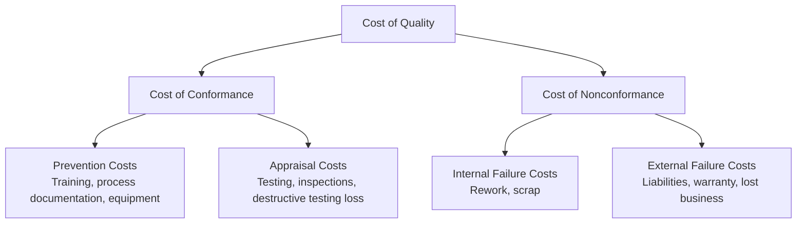

## Planning Quality Management

### Definition

Plan Quality Management is the process of identifying quality requirements and/or standards for the project and its deliverables, and documenting how the project will demonstrate compliance with those requirements and/or standards. It is the first process within the Project Quality Management knowledge area and produces the Quality Management Plan, a subsidiary component of the overall Project Management Plan.

This process is critical among planning processes because it establishes what quality means for this specific project and how it will be measured, rather than assuming a generic or universal quality standard.

### Purpose and Objectives

- Translate stakeholder quality expectations into measurable, verifiable quality requirements
- Identify applicable quality standards, regulations, and organizational policies relevant to the project and its deliverables
- Define quality metrics and the acceptance criteria against which deliverables will be evaluated
- Establish the approach for quality assurance (process-focused, preventive) and quality control (product-focused, detective) activities
- Balance quality investment against cost, schedule, scope, and risk constraints

### Inputs

**Project Charter** — high-level project description, product characteristics, and approval requirements that inform quality expectations

**Project Management Plan**

- Requirements management plan — how quality requirements will be identified and traced
- Risk management plan — quality risks and their treatment
- Stakeholder engagement plan — stakeholder quality expectations and tolerances
- Scope baseline — scope statement, WBS, WBS dictionary defining deliverables to which quality standards apply

**Project Documents**

- Assumption log
- Requirements documentation
- Requirements traceability matrix
- Risk register
- Stakeholder register

**Enterprise Environmental Factors** — governmental regulations, rules/standards specific to the application area, geographic distribution, organizational structure, marketplace conditions

**Organizational Process Assets** — quality policies, procedures, historical databases, lessons learned

### Tools and Techniques

| Technique | Description |
| --- | --- |
| Expert Judgment | Input from quality management, regulatory compliance, and statistical specialists |
| Data Gathering | Benchmarking (comparing to other projects/organizations), brainstorming, interviews |
| Data Analysis | Cost-benefit analysis, Cost of Quality analysis |
| Decision Making | Multicriteria decision analysis to weigh quality factors against other constraints |
| Data Representation | Flowcharts, logical data models, matrix diagrams, mind mapping |
| Test and Inspection Planning | Determining how testing/inspection will verify requirements are met, including test types, industry standards, and customer expectations |
| Meetings | Planning sessions with team, sponsor, and quality stakeholders |

### Cost of Quality (COQ)

A central analytical framework applied during Plan Quality Management to balance investment in prevention/appraisal against the risk of failure costs:

The optimal quality investment level typically minimizes total COQ — under-investing in prevention/appraisal increases failure costs, while over-investing in prevention/appraisal beyond the point of diminishing returns wastes resources without proportional failure-cost reduction.

### Quality Management Plan Components

| Component | Description |
| --- | --- |
| Quality standards to be used | Applicable industry, regulatory, or organizational standards (e.g., ISO 9001) |
| Quality objectives | Specific, measurable quality goals for the project |
| Quality roles and responsibilities | Who is accountable for QA, QC, and quality reporting |
| Deliverables and processes subject to quality review | Which work products require formal quality control |
| Quality control and quality management activities | Planned inspections, audits, reviews |
| Quality tools to be used | Checklists, control charts, statistical sampling methods |
| Relevant procedures for addressing nonconformance | Root cause analysis, corrective action procedures |

### Key Quality Concepts

**Quality vs. Grade** — Quality is the degree to which a set of inherent characteristics fulfills requirements; grade is a category assigned to deliverables having the same functional use but different technical characteristics. Low grade is not necessarily a problem (e.g., a basic-grade software product with limited features can still have high quality if it performs its limited functions reliably); low quality is always a problem (defects, unreliability).

**Precision vs. Accuracy** — Precision is the consistency of repeated measurements clustering closely together; accuracy is the closeness of a measurement to the true value. A measurement can be precise without being accurate (consistently wrong) or accurate without being precise (correct on average but widely scattered).

**Prevention over Inspection** — Modern quality management philosophy emphasizes building quality into processes (prevention) rather than relying primarily on inspecting finished deliverables to catch defects (detection), since prevention is generally less costly than correction.

**Marginal Analysis** — Optimal quality level is reached where the incremental revenue/benefit from quality improvement equals the incremental cost of achieving that improvement.

**Continuous Improvement** — Iterative improvement of processes (e.g., Plan-Do-Check-Act cycle, Kaizen) is often referenced in the Quality Management Plan as an ongoing approach rather than a one-time activity.

### Worked Example

A medical device manufacturing project must comply with FDA regulations and ISO 13485. During Plan Quality Management:

1. **Applicable standards identified**: ISO 13485 (medical device quality management systems), FDA 21 CFR Part 820
2. **Quality objectives defined**: Zero critical defects at final inspection; 99.5% first-pass yield on production line
3. **Cost of Quality analysis**: Investment in automated inspection equipment ($150,000 prevention/appraisal cost) is compared against estimated failure cost exposure (potential recall cost estimated at $2M+ based on industry benchmarks) — investment approved given the asymmetry
4. **Test and inspection planning**: 100% inspection for critical safety components; statistical sampling (AQL-based) for non-critical components
5. **Roles defined**: Quality Assurance Manager owns process audits; Quality Control Inspectors own final product inspection; Regulatory Affairs owns compliance documentation
6. **Quality tools specified**: Control charts for production line variance monitoring; checklists for regulatory documentation completeness

This becomes the documented Quality Management Plan, referenced throughout Manage Quality (QA) and Control Quality (QC) processes.

### Outputs

**Quality Management Plan** — the primary output, describing how policies, procedures, and guidelines will be implemented

**Quality Metrics** — specific descriptions of a project or product attribute and how the Control Quality process will measure it (e.g., "on-time delivery rate," "defect density per 1,000 lines of code")

**Project Management Plan Updates** — risk management plan, scope baseline

**Project Documents Updates** — lessons learned register, requirements traceability matrix, risk register, stakeholder register

### Common Pitfalls

- Treating the Quality Management Plan as a compliance formality rather than an operational document that genuinely shapes how work is verified
- Failing to define measurable quality metrics, leaving Control Quality without clear acceptance criteria
- Conflating quality with grade, leading to unnecessary gold plating (over-delivering features/grade under the mistaken belief this improves quality)
- Underinvesting in prevention/appraisal costs relative to the organization's actual failure cost exposure, particularly in regulated industries
- Not aligning quality standards with actual regulatory and contractual requirements, creating compliance risk
- Assuming quality planning is a one-time activity rather than revisiting it as scope, risk, or regulatory context evolves

### Related Topics

- Managing Quality (Quality Assurance)
- Controlling Quality
- Cost of Quality
- Quality Metrics and Acceptance Criteria
- Requirements Traceability Matrix
- Plan-Do-Check-Act (PDCA) and Continuous Improvement